# First Part

## What is a digital platform?

It is a collection of **digital hardware** (with embedded firmware) that
can be used to bring a solution for a given class (or classes) of
applications.

So typically some general purpose board like an Arduino is an example.

We have a sort of sensory swarm at the edge of the cloud that is
composed of trillions of connected devices listening and sending data to
each other. Often this flow of data goes back to the cloud.

## What matters when I design a digital platform?

We have various constraint that limits the design of digital platform :

- Power and energy

- Throughput and latency (time)

- Cost (NRE and Area)

- Flexibility

### Power and Energy

We know that $P = V \times I$ which is instantaneous. It's an important
metric when designing a cooling solution. On the other hand
$Energy = P \times t$ so how long this device is on at what power rate.
So we can have devices that consume a lot of power in small bursts that
will ultimately use less power.

We care the most about the energy since most of the SWARM is running on
battery so limited source of energy. For cloud energy is less important
but having a large amount of power and so energy can quickly scale up to
enormous means of electricity production.

### Throughput and latency

- ***Throughput :*** It is the amount of data processed per *time unit*.
  So we can link this to the sampling frequency. A sample can be an
  amount of Giga bytes or Pixels per second.

- ***Latency :*** It is the delay between input and output. Really
  matters for system with feedback ! Above $100$ ms it is noticeable.

- ***Critical Path :*** associated with the implementation which is the
  longest path between two clocked elements. So it defines the **max
  clock frequency**.

- ***Sample frequency***: it is not equal to the clock frequency it
  indicates how many time a certain process need to be done and so
  sampled.

Usually embedded systems have real time constraint which are HARD
constraints.

### Cost

1.  Recurring costs : so costs linked to the production of a chip and
    proportionate to the size of produced chips.

2.  Non-Recurrent Engineering cost : the pay of the engineers.

So it is typical to have higher NRE for smaller quantities chips than
Recurring costs.

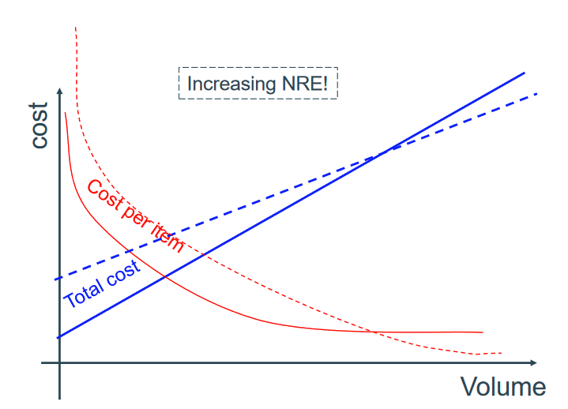{#fig:nre-label
width="50%"}

### Flexibility

{#fig:platform-label width="75%"}

We need to find a balance between software and hardware programming to
find the best performance balance.

::: center
  type                        Description                                                                                                                                                                      HW/SW
  --------------------------- -------------------------------------------------------------------------------------------------------------------------------------------------------------------------------- -------
  General Purpose Processor   They are the basics CPU in computer composed of an instruction sets that is standardized.                                                                                        SW
  ASIC                        Or Application Specific Integrated Circuit. It uses **hardwired logic** and we program it using some HDL such as Verilog to synthesize in gates and to drive to layout           HW
  Reconfigurable logic        We can program on it after fabrication using FPGA (Field Programmable Gate Away).                                                                                                HW-SW
  ASIP                        they are Application/Domain specific instruction set processor. They are often processors with new and customs instruction set (DSP, crypto, \...) and need a datapath update.   HW-SW
  Mix                         We can cobine the GP and SP continuum to keep flexibility and yet be efficient. Processor + FPGA                                                                                 HW-SW
:::

## Design methodology of a digital platform?

- Methodology is a set of **practices** that, when applied in the right
  sequence, allow engineers to design the right system correctly within
  a given cost and time budget

- Design flow is a systematic **sequence** of well defined design
  activities that, in a time and cost effective way, leads to a
  production plan

It's a top to bottom approach where we first design in software and then
in hardware.

### Y-Chart (Gajski-Kuhn)

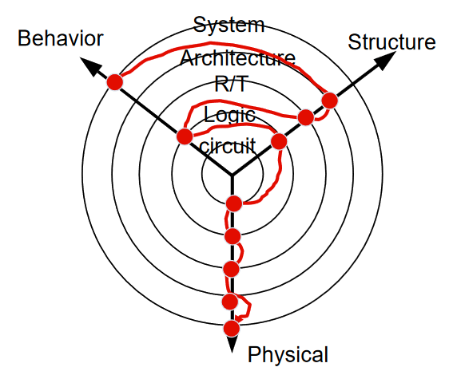{#fig:y-chart-label width="50%"}

So we alternate between behavior and structure to finally implement the
physical. We do some **horizontal exploration** at each layer to be able
to better implement. To do \"what\" (IO behavior) $\rightarrow$ \"how\"
(composition) $\rightarrow$ \"implement\" (realization).

::: center
  Layer                                      Description                                                                                                                                         tools
  ------------------------------------------ --------------------------------------------------------------------------------------------------------------------------------------------------- ---------------------------------------------
  1\. System Level                           We start with informal specs, use of abstract Data types. Check if we are doing the right system                                                    Python, C, Matlab, \...
  2\. Architecture Level                     Optimize the process (algorithm), Architectural Mapping (HW/SW), chip floorplan (chip building). Stage where we are making the biggest gain (70%)   mix of HW and SW
  3\. Register Transfer Level                We create some Finite State Machine with Datapath and introduce time and signal.                                                                    Synchronous design with FSM and DP actions.
  4\. Logic Level Design for ASIC back-end   We now use boolean expressions, FSM, \... We introduce *delay*                                                                                      FSM, Clocked VHDL, bits, Gates, \...
  5\. Circuit Level                          Transistor schematic, layout strategy, logic cell layout, transistor dimension, voltages, \...                                                      Transistors
:::

When going through those steps there is a lot of back and forth to find
the right implementation since it is a non trivial problem.

#### Design activites at Register Transfer

To increase sampling frequency we can do some **time multiplexing**
which will help to execute something let's say in one clock cycle by
doubling the hardware compared to a 1 hardware 2 clock cyle. To do the
**3.** level we need to clearly indicate all **flip-flop** with a $>$
and all the IO size of wires. It is also a good thing to highlight the
critical path in a design.

We have 3 main tasks here that are :

1.  ***Scheduling :*** Decide the clock cycle for each **operation**. We
    can either look for minimum execution time, minimum hardware.

2.  ***Allocating :*** How many **operators** of each time are required
    (addition, multiplication, \...)

3.  ***Assigning :*** Deciding which **operations** goes with each
    **operators**. We also need to assess the issue and possible design
    problem with our choices.

We will often usee Data Flow Graph representation (more on that at
[1.4](#DFG){reference-type="ref" reference="DFG"}). We also need to take
into account the reality of hardware at this step.

#### Logic Design Activities

We use again some logic and FSM synthesis. We are now going to map this
on a chip with cells having an actual purpose and limited operations. We
look for the critical logic path and delay issues. P& R C extraction
from wiring.

We will first validate the design by checking syntax, connections, for
synthesizable components ! We may get some warning or errors. Then it
will generate us a *net-list* which is similar to a binary executable
and can converts logic expressions into gate level expressions. So we
have now an idea about the area and the time.

Then the map will synthesize net-list into FPGA specific components
(LUTS, Flip Flops) which will then generate a map net list containing
all FPGA-specific components used here. Better area result but no
timing.

The last step will find optimized interconnections of logic blocks. It
will optimize the critical path and analyze timing constraints. It will
generate a net-list with optimized logic and routing and provide final
area and timing results.

### Design Methodology

We want to avoid design iterations to cut time and cost. We need to
balance the time-to-market. For that we can do :

1.  Spend most of the time at the top and document. Right design right
    at the start

2.  Use interactive CAD tools with exploration capabilities.

3.  Keep It Simple Stupid :

    - Split function and interface. Communication needs to be simple and
      local

    - Use encapsulation or wrappers

    - reuse and plug-and-play

    - Standardize interface

    - Use structured interconnect

    - Locally synchronous, Globally asynchronous

    - Localize heavy computation and traffic

## Data Flow Model {#DFG}

The main issue when designing in C, it is the fact that C is sequential
! So it doesn't really simulate well how hardware works. To better
represent concurrent execution we will prioritize **block diagrams** and
**data flow models**.

If we get the specification in C we can derive the *control flow graph*
or the *data flow graph* from it.

{#fig:hardware-impl-label width="50%"}

Moreover, sometimes C will consume more cycle than actually necessary
and the way to accelerate the code may be obfuscated by the C code. To
do so we have 2 concepts we can use :

- ***Concurrency :*** ability to execute *simultaneous* operations
  because they are *independent from each other*. **Property of the
  application**

- ***Parallelism :*** ability to execute *simultaneous* operations
  because we can run them *on different circuit elements*. **Property of
  the implementation**

### Data Flow modeling

Thanks to the DF we can show and expose **max concurrency**. It is
**concurrent**, **distributed**, **modular** and **easy to analyze**.

::: center
  Terminology   Meaning
  ------------- --------------------------------------------
  Actor         Operation
  Token         Carries information
  Queues        Transport tokens from one actor to another
  Fire          execution
:::

In the basic DF, we don't have any notion of time. We are using directed
graph and each nodes represents a computation and each edges are a path
over which the tokens travel. We just see what computations to perform
not the order or sequence of them.

Later we will see **control edge** that has a relation between two
operations to force a certain order of execution while a **data edge**
is just a consumer and producer with data flowing on it.

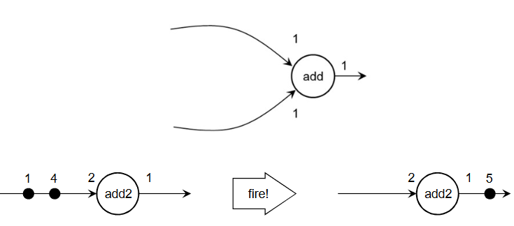{#fig:FR-FR-label
width="50%"}

The firing rule shows what are the conditions that needs to be met to
execute the operation and the rate how much is consumed and produced.

### Synchronous Data Flow

The number of tokens produced and consumed is known beforehand. We can
then plan the amount and the firing order. We have relative sample rates
and that doesn't depend on the data.

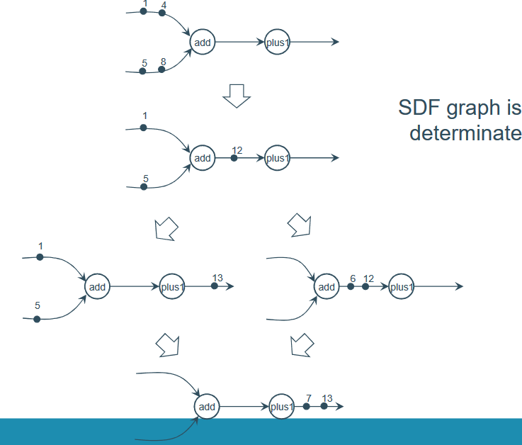{#fig:SDF-label width="50%"}

When analyzing a SDF we can run into an admissible schedule (so no
deadlock and overflowing) or non admissible schedule. We also need
*consistent solution* that will not lead to a deadlock and will be
periodic. To do periodic schedule for SDF we need to assume infinite
stream of input data so an unbound execution. It needs to be **Periodic
Admissible Sequential Schedule** (unbound execution with bounded
memory).

#### PASS Formal Approach

We first need to construct a **topology matrix** where each column is a
node and each arc is a row. We can see the production and consumption at
each value.

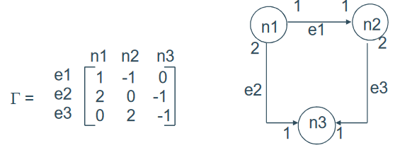{#fig:top-mat-label width="50%"}

We then have a vector $b$ indicating the size of the queues on each arc
and $v$ indicating which nodes fire at a specific point in time :

$$b(n+1) = b(n) + \Gamma v(n)$$

A necessary condition is that $\Gamma$ needs to have a rank that is
equal to the amount of nodes $-1$.

#### Modeling control flow aspects

We want to add the control-related aspects and we can by simulating
control flow on top of it which will create an overhead. We can add the
boolean data flow. It will make it harder to properly analyze the SDF.

#### Adding time & delay

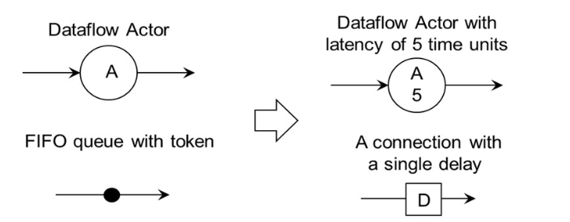{#fig:enter-label
width="50%"}

We now have the possibility to do some feedback and control loop. We can
also add some delay on the arc.

The PASS methodology creates a topology matrix G of the SDF and verify
its rank. It will determine a firing vector and try firing at each node
(round robin style) until it reaches the firing vector. A good tool for
this is **Ptolemy**.

### From Data flow to HW implementation

We can first try to do some 1-to-1 mapping from dataflow to HW
implementation. This will only work if we are doing some single-rate
dataflow graph (so firing every 1s) and if actors are implemented in
combinatorial logic. Important to use CAD tools that will find for us
better structure.

For software it's way easier many implementation possible. For hardware
we need to be on the look out for some possible pipelining.

## Transformations

- **Data Edge :** is a relation between two operations such that data
  produced by one operation is consumed by another.

- **Control Edge :** is a relation between two operations such that one
  operation has to be executed after the other.

So changing a data edge will result into a different algorithm while
changing a control edge will just result into another hardware
realization.

We work with unit delay so each operation have unit delay and all of the
queues are FIFO we need some delay for Data Flow Graph (just a block
diagram) with feedback. We have the [Synchronous]{.underline} Data Flow
Graph where we can analyze them at **design time**.

### Iteration bound

We want to see how long it would take for one pass, amount of production
etc and the storage needed for.

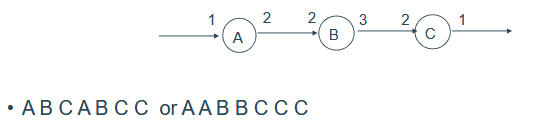{#fig:enter-pass width="50%"}

We will go deeper with the concept of time. First we assume an ideal
queue with unit delay for every actors and operations. Then we can go to
the *data dependency graph* where actors have relative delays now. Later
we will see the actual Hardware behind it and issues with
synchronization.

The iteration period is *the time required for the execution of one
iteration of the algorithm*. It also indicates the max sample frequency
(since we can't produce any faster).

We call a loop a path that starts and ends at the same node in a
directed graph. The formula for **loop bound** is $T/W$ where T is the
loop computation time and $W$ the amount of delay (since a delay could
help us feeding more sample and not waiting a full loop time).

The iteration bound is the loop with the maximum loop bound and if it
has no delay we have an infinity time loop (not executable).

By moving registers (delays) around we can keep the same iteration bound
but lowering the critical path, the critical path can't be smaller than
the iteration bound.

### Pipelining and parallelism

- **Pipelining :** reduce effective critical path by introducing
  pipelining latches along critical path.

- **Parallelism :** increases the sampling rate by replicating hardware
  so the several inputs can be processed in parallel and several outputs
  can be produced at the same time.

To add those registers we need to find **cuts** in the DFG where all the
arrows point in the same directions and we can introduce some registers.
It will increase the latency and the number of registers but will
provide a lower critical path. This will have an impact on the power :

$$P = \alpha f C V_{DD}^2$$

### Retiming

The goal is to move some of the delays to change the critical path but
keeping the latency as is. We use the **cutset retiming** technique
which we make a cut in the DFG, add delay in one direction and remove
the same amount in the other one.

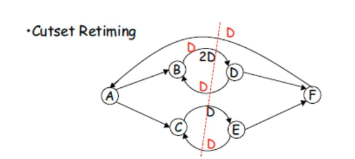{#fig:cutset width="50%"}

Retiming is a generalization of pipelining. General pipelining is
equivalent to introducing delays at the input followed by retiming.

### Folding and unfolding

The idea is to move from a sequential implementation towards a HW
implementation that will make sure that the maximum amount of hardware
is used. It's just like parallel processing.

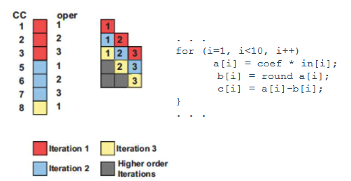{#fig:unfolding width="50%"}

We need a program with more than 1 iteration and by applying this
technique we get closer to the loop iteration bound.

### Speed-up and slow-down

We will always have a larger clock frequency than sample frequency in
most cases. Our goal is to maximize the usage. It's always a trade off
between area and sample frequency, \...

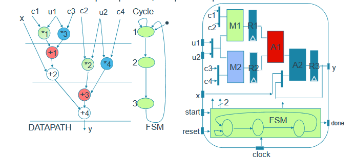{#fig:parallel-label
width="50%"}

We will reuse the same hardware but will take 3 clock cycle to produce
something.

## From C to Control Flow and Data Flow

In this part we will try to transform algorithm to speed up the
processes and find independent data, it's like using associativity,
distributivity, \... and other properties to speed up everything.

``` {.objectivec language="C" caption="Code Example"}
int max(int a, b){
    int r;
    if (a>b){
        r = a;
    }else{
        r = b;
    }
    return r;
}
```

We first need to find all the nodes which are all the operations
(function entry, variable assignation, flag creation, loops, \...).
Control edges indicate all the operations and shows the order of
execution. They can stay or change depending on the implementation. The
data edges shows all the creation or consumption of data and the data
dependencies. It shows the **flow of information** and if we change them
it will fundamentally alter the algorithm.

<figure id="fig:control-data-label">
<p>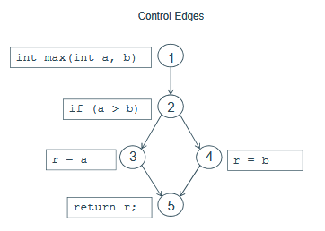 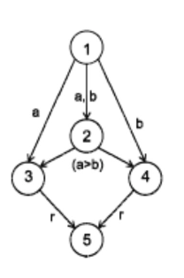</p>
<figcaption>Control and Data Edges</figcaption>
</figure>

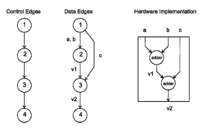{#fig:enter-label
width="50%"}

### Systematic Derivation of Control Flow Graph

We know that each nodes represent a single operation and their order the
order of execution.

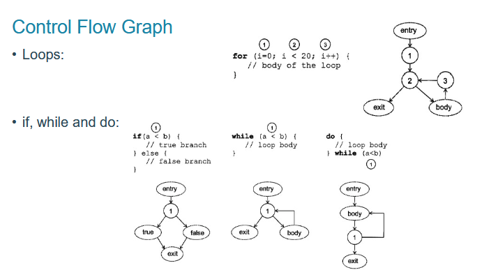{#fig:loop-cfg-label width="75%"}

### Systematic Derivation of Data Flow Graph

It is a bit harder to do so but we need to keep in mind that they all
showcases the production and consumption of data. Each node represents
one single operation. We have the same nodes as a CFG but not the same
edges ! The edges always start from a read node to a production node. In
conditions, we produce a flag watch out !

#### Pointers and Arrays ?

We need to consider each elements as a distinctive variable according to
their indices. But harder for complex indices and values unknown at
compile time. So we will merge all indexed variables in *one single read
or write*. Works well when loops are bounded at compile time.

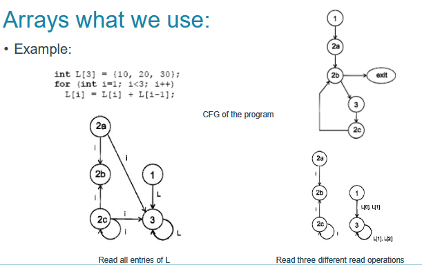{#fig:array-index-label
width="75%"}

### Single-Assignment Programs

It makes the data dependency more clear and makes the life of a Hardware
designer much more easy. We only assign once each variable. There is
some algorithm that can do that for us.

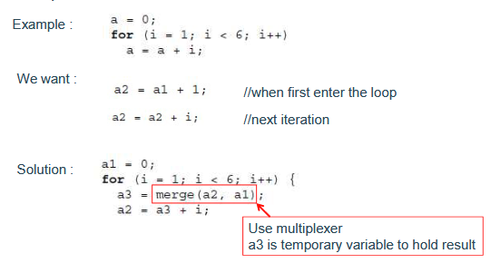{#fig:enter-label width="75%"}

``` {.objectivec language="C" caption="Sequential only one storage location"}
int FOO(int c[4], u[4], x){
    unsigned i;
    sum = x;
    for (i=1, i<5, i++)
        sum = sum + c[i]*u[i];
    y = sum;
}
```

``` {.objectivec language="C" caption="Modified single assignment"}
int FOO(int c[4], u[4], x){
    unsigned i;
    sum[0] = x;
    for (i=1, i<5, i++)
        sum[i] = sum[i-1] + c[i]*u[i];
    y = sum[4];
}
```

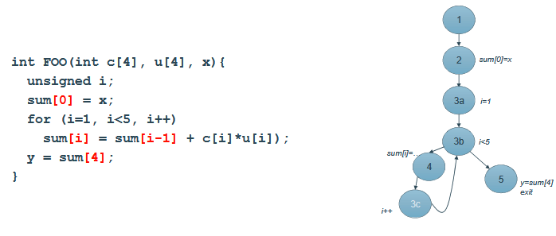{#fig:enter-label
width="75%"}

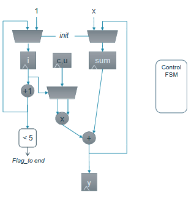{#fig:HW-label width="50%"}

We can always find ways to optimize and parallelize code ! We need to
measure how many **operators** there is in our hardware and how many
**operations** are in `FOO`. What is the sample frequency and the clock
frequency. In this example we got :

- Area : 1 mul + 1 add + 11 reg + 4 mux

- CP (Critical Path) : 1 mul + 1 add + 2 mux

- Clock freq : 4 \* sample freq (derived from the delay)

- Latency : 4 cycles

- Throughput : 1/(4\*CP)

The biggest optimization between software and hardware is the fact that
in *software* everything is *sequential* and so by doing some *loop
unrolling, independent operations, \...* we can optimize all of this.
The key is to **bring as much parallelism as possible** by unrolling
everything. From there we can Redraw the CFG and DFG :

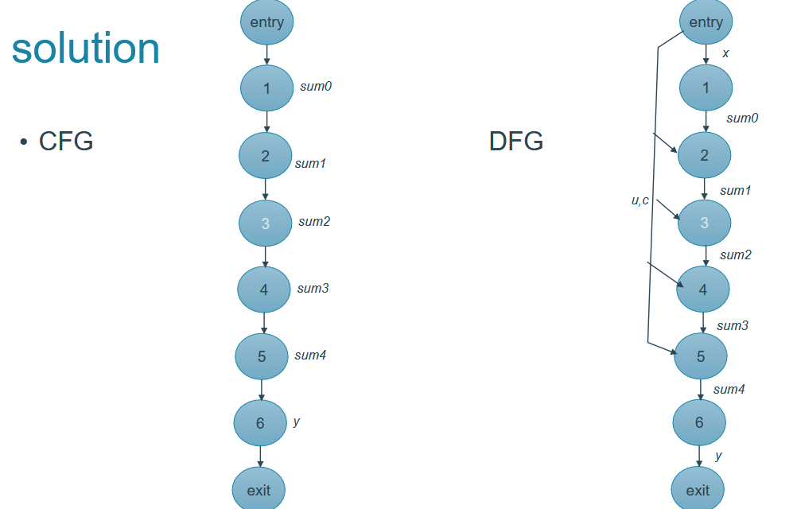{#fig:enter-label width="75%"}

After this DFG, we can redraw the HW implementation but we can also
decide to run in parallel because as it is, we will use a lot of adder
but we want to maximize their utilization :

- Area : 4 mul + 4 add + 10 reg

- CP : 1 mul + 3 add + 1 reg

- Clock freq : sample freq (derived from the delay)

- Latency : cycle

- Throughput : 1/(CP)

<figure id="fig:enter-label">
<p>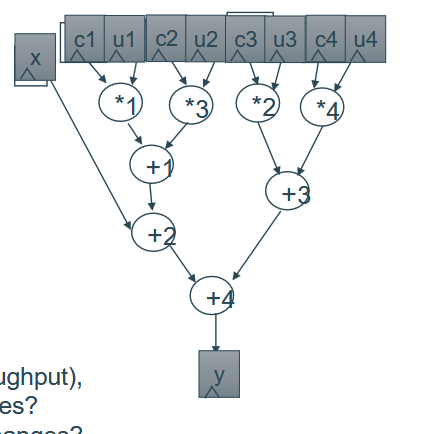
<span id="fig:enter-label" data-label="fig:enter-label"></span></p>
</figure>

So to speed-up things we can use **pipeline** and **parallelize**. To
slow down things we can use **time multiplexing** and reuse some
hardware etc to reduce the area.

<figure id="fig:enter-label">
<p>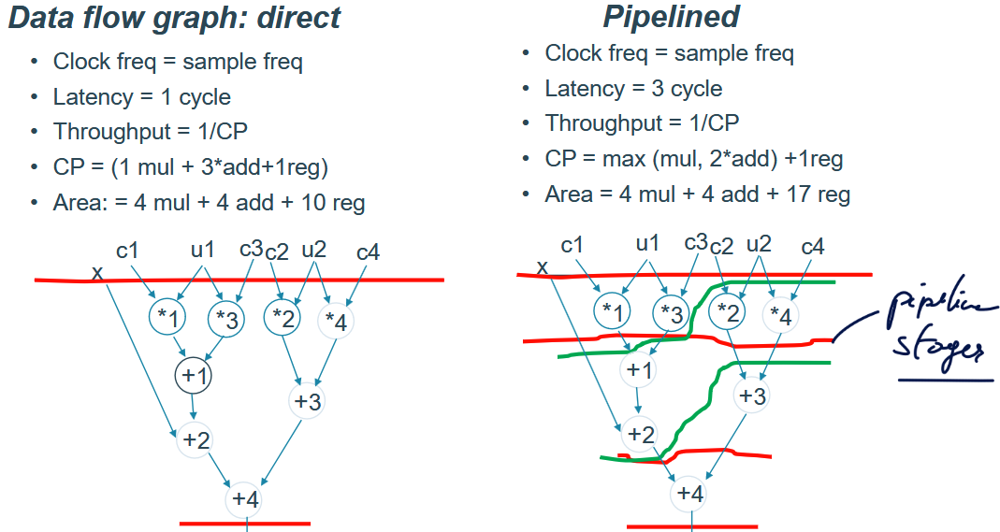 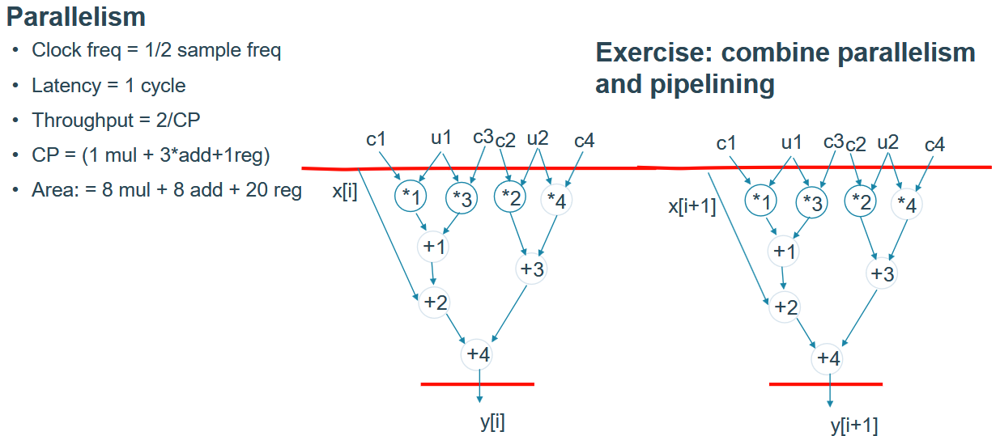</p>
<figcaption>Pipeline induce less timing constraints so higher Clock
Frequency, Parallelism more TP</figcaption>
</figure>

<figure id="fig:enter-label">
<p>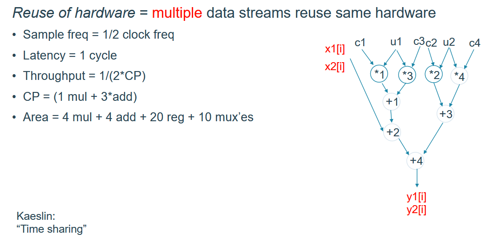 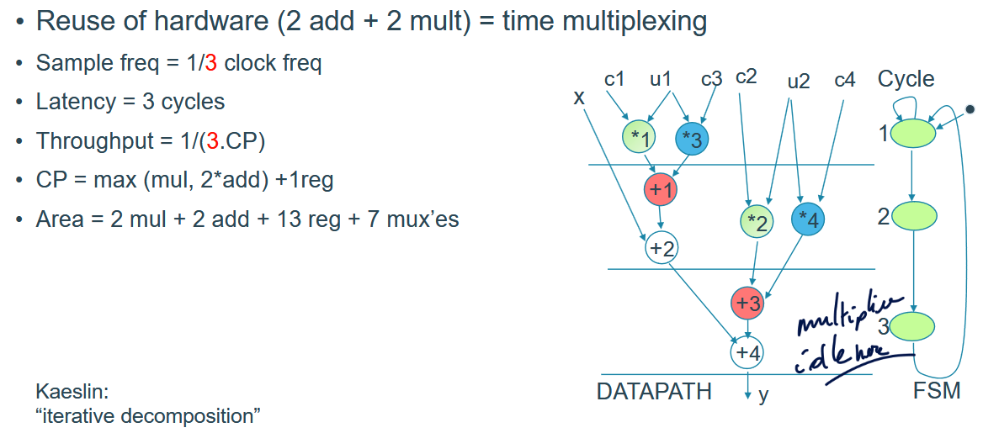</p>
<figcaption>Slowing down : multiple datastream or reuse the same
hardware</figcaption>
</figure>

Also something we can do is add a bit of pipelining to have a better
hardware utilization, this can be done easily if we do some loop
unrolling and we check at each step how we could use more of the
hardware without modifying the algorithm.

# Second Part

This is the part of Wim Dehaene which covers the physical gap triangle
and works its way to the top.

## Throughput

We have many strategies to have a bigger throughput. The worst
throughput is through CPU since they run in **sequential** mode and so
can only produce data one by one after X cycles. We can use some tricks
of **pipelining, parallelism** to have more area usage but more
throughput. On the other hand **time multiplexing** will have the
opposite effect. We have 5 main concerns in DDP :

1.  Throughput : measured in amount of data produce per cycle

2.  Latency/delay : measured in time

3.  Energy (or power) : measured in Joule or Watts

4.  Flexibility : hard to quantify :((

5.  Area : measured in amount of LUTs, REGs, \...

A basic relation with throughput is :

$$Throughput = \frac{1}{T_{crit. path}}$$

The critical path has delay coming from :

1.  $T_{logic}$ : due to imperfection and propagation

    - $t_{pd}$ : logic propagation delay : responsible for the maximum
      limit

    - $t_{cd}$ : logic contamination delay : is the minimal delay in
      logic

2.  $T_{ff}$ : due to the flipflop, added overhead.

### Sequential, synchronous design

#### Sequential

The current output depends on actual and previous inputs (*tokens*). It
uses FSM and pipelines. We use FF and latches to remember pervious
values.

#### Synchronous

All operation and state transition are only allowed at a specific moment
that we can **clock**. All inputs must be synchronous to the same clock.

So computing is easier and we are working with stable inputs, we can
clearly know when a result is valid ! It makes everything more
manageable. It is *deterministic* and allows us to make abstraction of
the physical details.

But we are always drawn back by the critical path or the worst case
delay. We have big Power consumption at each clock signal since all at
once everything is running. If we want to interconnect clock domain it
is hard.

The only **asynchronous signal** are *reset, IO's*. So the idea is to be
*locally synchronous, globally asynchronous*. We need everything besides
*clock dividers* to have a reset signal to bring everything to a known
state. Why ?

- To make sure everything resets no matter how long the pulse of RST was

- Avoid extra delay

#### Clock domain

Each *system* of synchronous domain are working with the same clock. But
it is possible to connect multiple systems with each having their own
clock domain together.

### Latch and FF

- Latch : stores data when clock is low, transparent when high (positive
  latch)

- D-FF : stores the data when clock rises

In all of this, there will some setup and hold time to make sure
everything behaves as expected:

<figure id="fig:enter-label">
<p>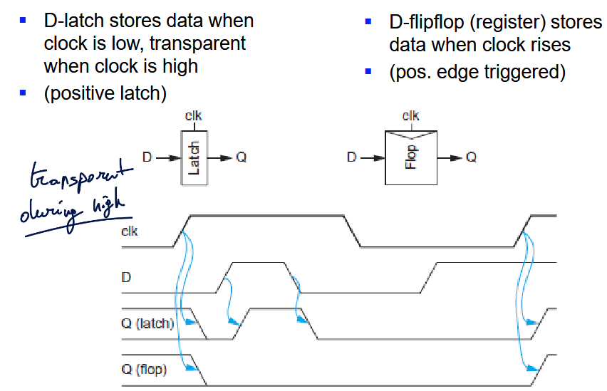 <span
id="fig:enter-label" data-label="fig:enter-label"></span></p>
</figure>

- $t_{pcq}$ : Worst case propagation delay (so with the logic)

- $t_{ccq}$ : Contamination delay (min propagation delay)

- $t_{setup}$ : setup time, data must be valid before clock edge

- $t_{hold}$ : hold time, data must be valid after clock edge

But for **latches** we need to take into account :

- $t_{pdq}$ : worst case propagation delay D to Q

- $t_{cdq}$ : contamination delay : minimum propagation delay D to Q

Because a latch is like a MUX, routed on itself !
$Q = \overline{CLK} \cdot Q + CLK \cdot D$. The setup time needs to be
$t_{setup} = 3 t_{pdf\_inv} + t_{pd\_x}$. For the hold time it is
$t_{hold} = t_{pd\_invc} - t_{pd\_inv1}$.

<figure id="fig:enter-label">
<p>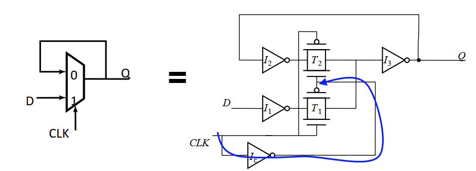 <span
id="fig:enter-label" data-label="fig:enter-label"></span></p>
</figure>

#### Metastable

One issue that can appears is **metastability**. This can be due to a
changing input that isn't properly set and so will create for a certain
duration a metastability that will often get stable due to noise or
other imperfection.

<figure id="fig:enter-label">
<p>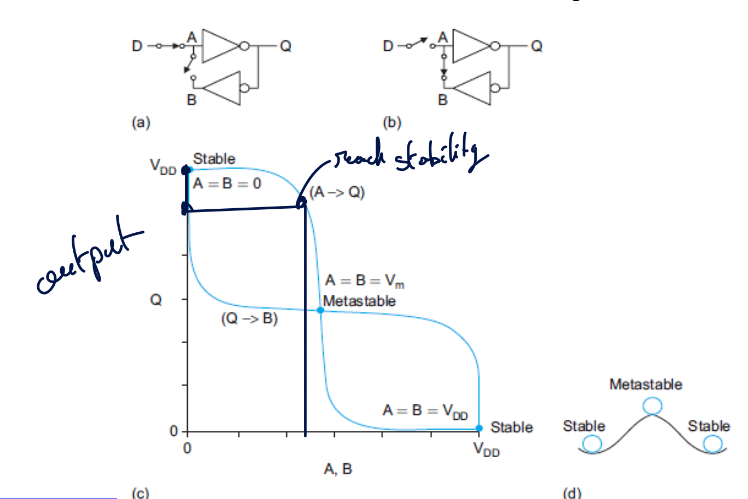
<span id="fig:enter-label" data-label="fig:enter-label"></span></p>
</figure>

We use a model with a feedback with gain $G$ and with some resistance
and capacitance. Which gives us the diff equation :

$$\begin{aligned}
    \frac{G a(t) - a(t)}{R} &= C \frac{da}{dt}\\
    a(t) &= a(0) e^{\frac{t}{\tau}} \qquad \tau = \frac{RC}{G-1}\\
    t_{meta} &= \tau \left[ ln(\Delta V) = ln(a(0)) \right]
\end{aligned}$$

<figure id="fig:enter-label">
<p>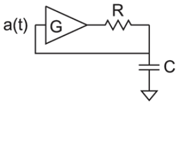
<span id="fig:enter-label" data-label="fig:enter-label"></span></p>
</figure>

So it is forever stable if $a(0) = 0$ but it is not feasible since there
will always be some noise. With the second equation we can see that by
having high gains we reduce the meta stability time.

#### FF

In practice, a ff is just 2 back-to-back latches. It works by using a
master-slave architecture. So it creates a setup time of
$t_{setup} = 3 t_{pd\_inv} + t_{pd\_x}$. And the hold time is
$t_{hold} = t_{pd\_invc} - t_{pd\_inv1}$. For this implementation of the
FF we have a propagation delay of $t_{cq} = t_{pd\_inv}+t_{pd\_tx}$.

<figure id="fig:enter-label">
<p>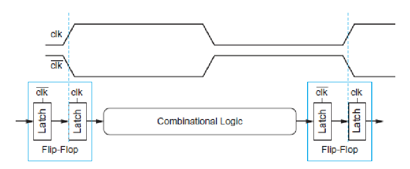 <span
id="fig:enter-label" data-label="fig:enter-label"></span></p>
</figure>

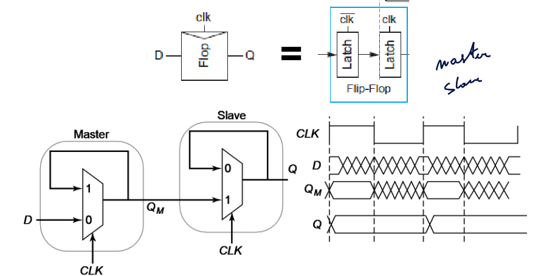{#fig:enter-label
width="75%"}

### Synchronization (I/O)

#### Synchronization needs

Not all inputs are synchronized with the clock (user input, not time
reference in network inputs, change of phase, mismatch, \...). This will
cause some metastability issues ! So we need to add a synchronizer to
make sure those asynchronous inputs cause any metastability. But those
synchronizers are just flip flops !

#### Metastability

But as we saw previously, the metastability is pretty unstable and will
lead to one of the two state either high or low. Less setup time is
better and longer waiting is also better. So to synchronize we can just
chain FF and just hope this stochastic process will not fail.

#### Synchronization Mechanisms

It would be naive to think that it is easy to synchronize registers.
Even in the same registers, different data lines don't have the same
delay and even worse for physically different FF.

To solve this we use **FIFO's and Handshaking**. Handshaking is like in
network, we use ACK bits to communicate data between different systems.
The simplest only use one handshaking lines but we can think of smarter
and more resilient systems.

<figure id="fig:enter-label">
<p>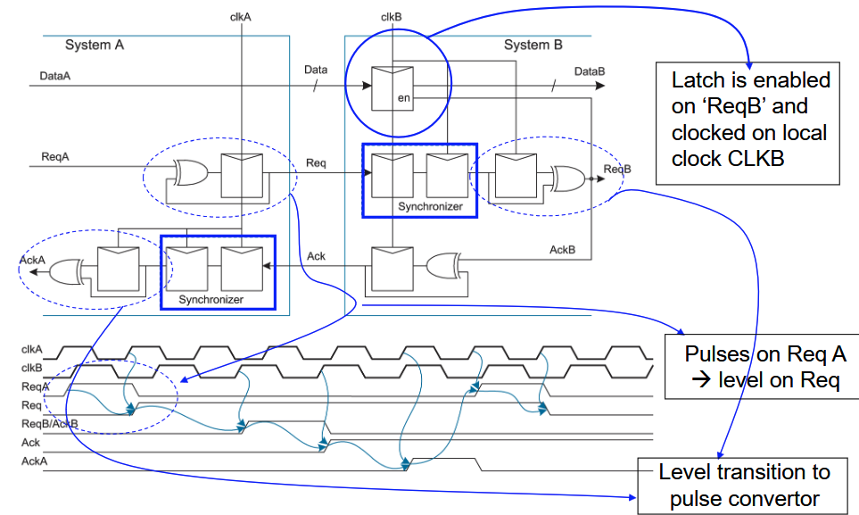 <span
id="fig:enter-label" data-label="fig:enter-label"></span></p>
</figure>

When we use FIFO register, we write in one clock domain and read from
the other. We also use some full and empty signals to indicate when the
queue is full or not.

So we need to synchronize all data that enters from another clock
domain. Handshaking is required when we send more than 1 bit (to make
sure the stream of bits is correctly interpreted). To build a
synchronizer FF we need at least 2 FF to get rid of the metastability so
it adds some delay too.

### Pipelining with real FF

Why pipelining ? Because when we have a set of operation, each part of
this set of operation is only useful for a brief moment and the data has
to go through many many operators before outputing something valid which
make timing constraints tougher. By pipeling (i.e. adding some registers
between the operation) we are making the timing constraints easier.

- \+ Better throughput since smaller critical path

- \+ More efficient hardware usage

- \- More cycles so more latency not suitable for realtime

- \- Not so interesting when we use real flipflops since it requires a
  lot of energy

Latency can also be a problem for feedback loop which will decrease the
throughput. Also when we pipeline, we may try to predict or start
operations that will not be useful or incorrect due to feedback (X86 4
cycles fetch decode execute store issues).

#### Setup and Hold time

When pipeling it is important to keep this equation correct.

$$T_c > t_{pd} + \underbrace{t_{pcq} + t_{setup}}_{\text{sequencing overhead}}$$

#### Skew and Jitter

Skew is the fact that all clock signals won't be fired at the same time
due to difference between the routing, the load etc so we talk about
clock skew and is deterministic difference. Clock jitter is a
statistical difference and is usualy seen as the worst case of
$N \sigma$ skew. We need some good PLL to avoid any jitter. This class
will focus more about skew. To avoid any setup violation

$$\begin{aligned}
    t_{pd} &\leqslant T_c - (t_{pcq} + t_{setup} + t_{skew}) & t_{cd} &\geqslant t_{hold} - t_{ccq} + t_{skew}
\end{aligned}$$

Cause of the skew, we could have the issues where some data may just
pass through the register without being clocked and move on. Often in
shift register since we clock on itself and execute a bit shift.

The sequencing overhead puts a limit to the amount of pipelining we can
do. Skew has 2 effects

1.  Decreases available useful time, adds up to sequencing overhead
    (more setup time)

2.  Worsens hold time problem

## Delay and Latency

We want to measure and quantify the values of $t_{pd},t_{cd}$ where we
mostly need to do back-of-the-envelope estimation. For
$t_{pcq},t_{setup}$ we also need to do the same.

### INV

#### RC gate delay model

We characterize an inverter as a circuit in two possible state, either a
swithc open and a R to ground or vice versa if we have a negative input.
In both cases, we need to add a load capacitance $C_L$ which creates a
time constant for both of $\tau = RC$.

<figure id="fig:enter-label">
<p>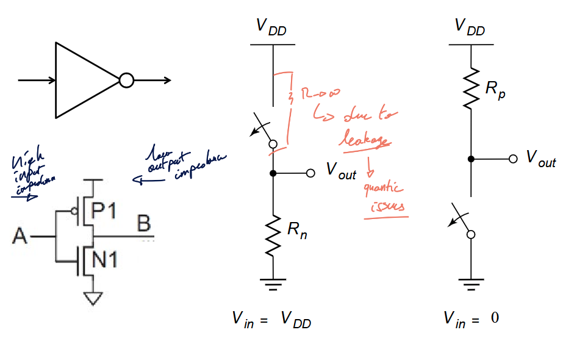
<span id="fig:enter-label" data-label="fig:enter-label"></span></p>
</figure>

$$\begin{aligned}
    I &= C_L \frac{dV_{out}}{dt} & I &= -\frac{V_{out}}{R}\\
    V_{out}(t) &= V_{DD} e^{-t / \tau} & t_{pd} &= RC_L ln(2) 
\end{aligned}$$

This $ln(2)$ is really important for us because it indicates the exact
moment in time where $V_{out}/V_{DD} = 0.5$.

We need to make the difference between intrinsic load and extrinsic
load. Intrinsic is linked with the Device Under Test. Here, we can
simplify a NMOS transistor as a simple switch with a R to its drain and
capacitance to all of its nodes. For a PMOS, to be more accurate we are
using 2R to represent holes mobility. We can size all of transistors by
a factor $k$ where it will do $kC$ and $R/k$.

When we analyze the network, we will only take into account the
**Switching capacitance** since they are the one where the load will
change. So here, we see that we have a $t_{pd} = 6RC ln(2) \approx 4RC$.
So we can see that the transition delay $t_{pd}$ is proportional to the
Resistance and capacitance. So to make a gate faster we need to make its
capacitance and resistance smaller which can be done simultaneously with
scaling.

From now on, we will refer the classic INV gate as the standard **delay
of size 1** without load $\approx 2RC$ and with an INV load
$\approx 4RC$. The reference for the cap is $C_{in\_inv} = 3C$.

#### Linear gate delay model

We need to distinguish the *intrinsic delay* $p$ and the *extrinsic
delay* $f$ or effort delay.

$$\begin{aligned}
    t_p &= ln(2) \cdot R(C_{int} + C_{ext})\\
    &= \underbrace{ln(2) \cdot R_{inv1} C_{in\_inv1}}_{t_{p0}} \left( \underbrace{\frac{C_{int} R}{C_{in\_inv1} R_{inv1}}}_{p} +  \underbrace{\frac{C_{ext} R}{C_{in\_inv1} R_{inv1}}}_{f}\right)\\
    t_p &= t_{p0} d\\
    &= t_{p0} (p+f)
\end{aligned}$$

The delay is independent of the sizing since resistance go down with the
size but capacitance goes up.

For the effort delay, it is dependant to the next stages that it needs
to drive. It is dependant of :

- The fanout of the gate $C_{ext}$

- The size of the gate $C_{in}$ and $R$

$$\begin{aligned}
    f&= \frac{C_{ext} R}{C_{in\_inv1} R_{inv1}} = \frac{C_{ext}}{C_{in\_inv1}S} = \frac{C_{ext}}{C_{in}}\\
    INV : t_p &= t_{p0}\left( 1 + \frac{C_{ext}}{C_{in}} \right)
\end{aligned}$$

<figure id="fig:enter-label">
<p>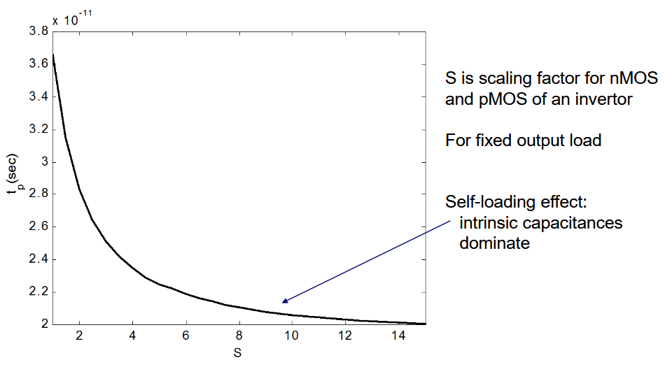
<span id="fig:enter-label" data-label="fig:enter-label"></span></p>
</figure>

If we have a fanout of 3 INV, we will have $f = 3$ and $p=1$ if we keep
normal size transistor.

#### Inverter chain optimizations at circuit level

When we chain inverter gates which may have different size, we can
simplify our RC model by having this :

$$\begin{aligned}
    t &= t_{p0}\left( 1 + \frac{C_{in2}}{C_{in1}} + 1 + \frac{C_{in3}}{C_{in2}} + ... + 1 + \frac{C_{L}}{C_{inN}} \right)
\end{aligned}$$

And thus, we can also minimize the delay by carefully picking our sizing
:

$$min\left( \frac{S_{2}}{S_{1}} + \frac{S_{3}}{S_{2}} + ... + \frac{F}{S_{N}} \right) \qquad F = \frac{C_L}{C_{in,inv1}}$$

To minimize this delay we must have :

$$S_j = \sqrt{S_{j-1}S_{j+1}}$$

This make sure every stages have the same effort $f$ and so have the
same delay ! $t_{p0}(1+f)$

If we know the input and load capacitance we can also do the same
procedure to find the optimal sizing where $F = f^N$ and
$N = log_f F = \frac{ln(F)}{ln(f)}$. Which gives us:

$$\begin{aligned}
    t_p &= Nt_{p0}(1+f) = t_{p0} ln(F)\left( \frac{f}{ln(f)} + \frac{1}{ln(f)} \right)\\
    \frac{\partial t_p}{\partial f} &= t_{p0} ln(F) \frac{ln(f) - 1 - \frac{1}{f}}{ln^2(f)} = 0\\
    f &= exp(1 + 1/f) \quad f_{opt} \approx 3.6
\end{aligned}$$

Since we found the optimal effort, we can find an optimal amount of
stage that will satisfy as close as possible the speed.

$$f_{opt}^{N_{opt}} = F \quad N_{opt} = \frac{ln(F)}{ln(f_{opt})} \quad t_p = Nt_{p0} (1+\sqrt[N]{F})$$

If we deviate from the actual number of stages it is not that sensitive
so it's okay to go one more or one less. But mis-sizing is a bit more
impactful.

### Other Gates

We can simplify all of the other gates as a Pull-Up network and a
Pull-Down network. The easiest thing to do for designing is having an
inverted logic expression and then start with the pull down. After this
we can to the same for the pull up and inverse everything. The PUN needs
to be of size $2$ and PDN of size $1$. In series we do $1/(1/S_1+1/S_2)$
and in parallel $(S_1+S_2)/2$

#### Linear gate delay model

We can reuse the linear gate model but this time with a twist :

$$\begin{aligned}
    t_p &= ln(2) \cdot R(C_{int} + C_{ext})\\
    &= \underbrace{ln(2) \cdot R_{inv1} C_{in\_inv1}}_{t_{p0}} \left( \underbrace{\frac{C_{int} R}{C_{in\_inv1} R_{inv1}}}_{p} +  \underbrace{\frac{C_{ext} R}{C_{in\_inv1} R_{inv1}}}_{f=g.h}\right)
\end{aligned}$$

Where $g$ is the **logical effort** due to the sizing difference with an
INV and $h$ is the **electrical effort** ($C_{out}/C_{in}$).

The *parasitic delay* $p$ of a gate is the delay of the gate when it
drives zero load normalized to an inverter that drives equal current
(same R). To find $C_{int\_S1}$ we just look at the output node and the
amount of capacitance connected to it.

$$p = \frac{C_{int\_S1}}{C_{in\_inv\_S1}} =  \frac{C_{int\_S1}}{3}$$

The *logical effort* $g$ of a gate is the ratio of its *input
capacitance* to that of an inverter that has equal R. This value doesn't
scale up over the sizing.

$$g =  \frac{C_{in\_S1}}{C_{in\_inv\_S1}}$$

The *electrical effort* $h$ is simply $C_{ext}/C_{in}$ where we can
express all of the capacitance as the normal size $C_{in,inv}$ times a
certain factor $g$. Example, with a 3 NAND followed with a NOR we see
that $C_{in} = g_{nand3}C_{in,inv}$ and $C_{ext} = g_{or} C_{in,inv}$.
$h = g_{or} / g_{nand3}$. If we size the NAND and NOR by a and b then
$h = b g_{xor} / a g_{nand3}$ :

$$\begin{aligned}
    C_{in} &= size\_current \cdot g\_current & C_{ext} &= size\_next \cdot g\_next
\end{aligned}$$

#### Multi-gate chain optimizations at circuit level

To have the optimal delay, we need that each stages do the **same
effort** not the same delay !

$$g_1h_1 = g_2h_2 = ... = g_Nh_N = f$$

The effective fanout of each stage is $h_i = f/g_i$ to have the same
extrinsic delay per stage. so.

<figure id="fig:enter-label">
<p>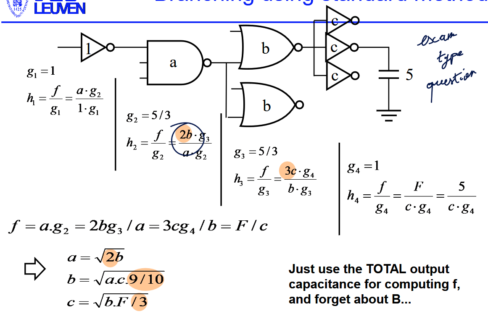 <span
id="fig:enter-label" data-label="fig:enter-label"></span></p>
</figure>

## Power and Energy Consumption

### Power and Energy

- We need to remember that power is an amount of energy of a time
  duration and it determines that battery life in hours $Watts$.

- Energy efficiency is in $Joules$ and so we can find $E = P \cdot t$.
  So a lower energy number means less power to perform a computation at
  the same frequency (otherwise not comparable).

So we can have high peak power at fraction of the time and it won't use
too many energy.

### Designing for Energy

#### Dynamic energy

It is the power needed to flip the gates, to charge and discharge the
capacitance load.

$$P = fE = \alpha f CV_{DD}^2$$

We have the $\alpha$ or **activity factor**. We need to keep in mind $C$
is not the same for all possible states, we need to count only the one
that switches. We also need to remember that this formula is calculating
the energy needed to **charge or discharge** not the energy stored ! The
energy stored in a cap is $CV_{DD}^2 / 2$ but the source needs to
provide $CV_{DD}^2$ for it to charge it !

<figure id="fig:enter-label">
<p>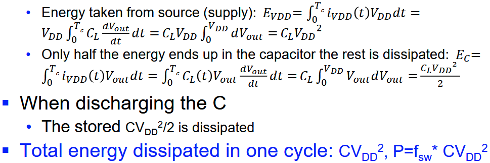 <span
id="fig:enter-label" data-label="fig:enter-label"></span></p>
</figure>

For a simple INV + load cap, we have $E_{inv1} \approx V_{dd}^2C_{eff}$
with $C_{eff} = C_{int} + C_{in\_load} = C_{in}(f+F)$ with $f$ being the
sizing factor. It is also important to take into account the cap of the
wire.

<figure id="fig:enter-label">
<p>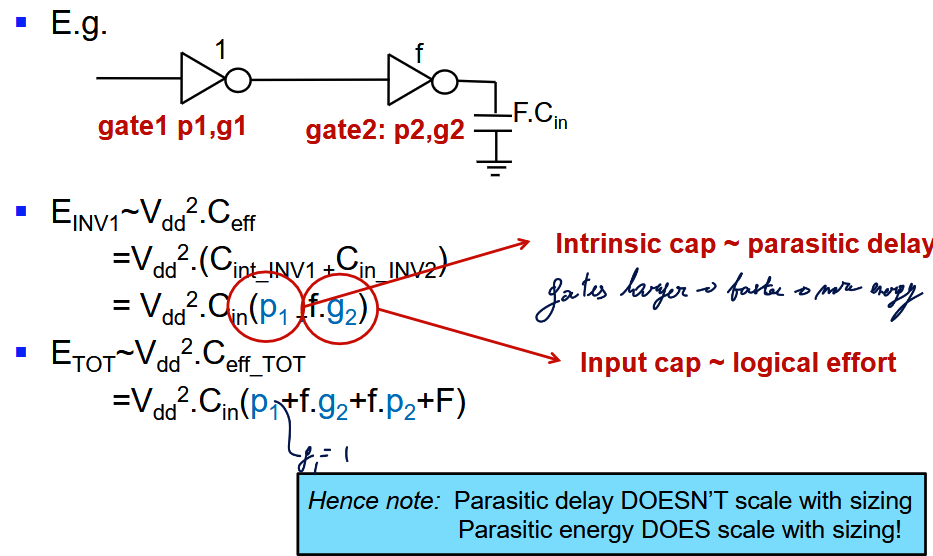
<span id="fig:enter-label" data-label="fig:enter-label"></span></p>
</figure>

The minimal delay is not the most energy efficient. We can find
trade-off between the delay $D_{min}$ and the energy. We know the energy
is proportional to the $f$, so we can choose what is the best for us.
Some important FOM are :


- **PDP** : power-delay product : $P_{av} \cdot t_p$ which is the energy
  it takes to switch in time $t_p$.

- **EDP** : energy-delay product : $PDP \cdot t_p$ energy for delay. It
  shows the energy for performance. It is a really interesting FOM for
  embedded systems and low energy design.

<figure id="fig:enter-label">
<p>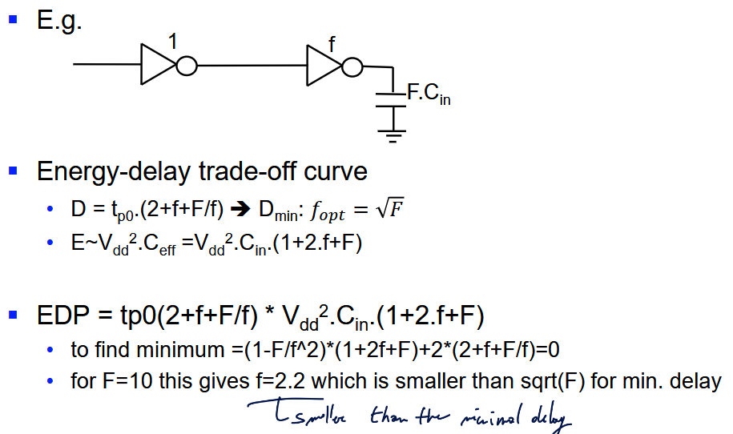 <span
id="fig:enter-label" data-label="fig:enter-label"></span></p>
</figure>

$V_{dd}$ can be also scaled down to reduce the energy. So the energy
goes down by a factor $V_{DD}^2$. But this also impact the speed since
we need to charge a capacitance and we are working with transistor in
saturation so $I ~ (V_{DD}-V_{th})^\alpha$. Following *Sakurai's* model
we can say that for long channel $\alpha = 2$ and for short we have
$\alpha \approx 1.3$. So the delay is around
$V_{DD}/(V_{DD} - V_{th})^{\alpha}$.

<figure id="fig:enter-label">
<p>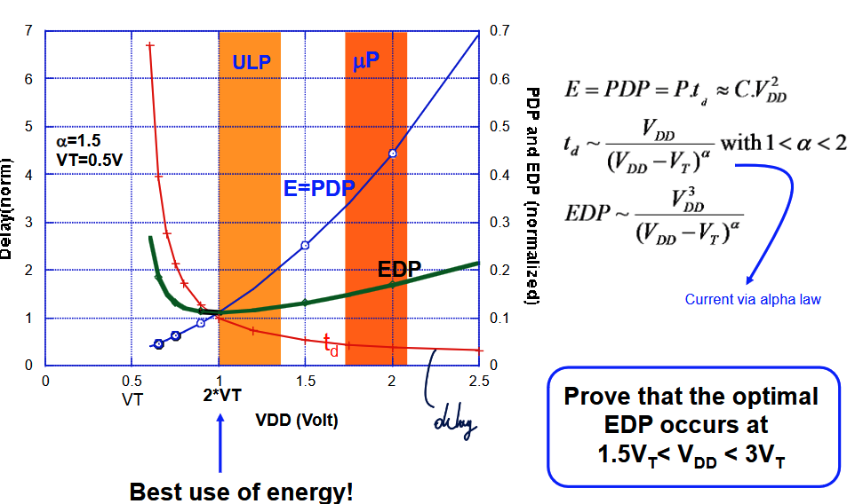
<span id="fig:enter-label" data-label="fig:enter-label"></span></p>
</figure>

So we can do both Voltage and size scaling which allow us to go even
smaller.

We can also modify the architecture to have a better impact. We can use
some pipelining, etc.

<figure id="fig:enter-label">
<p>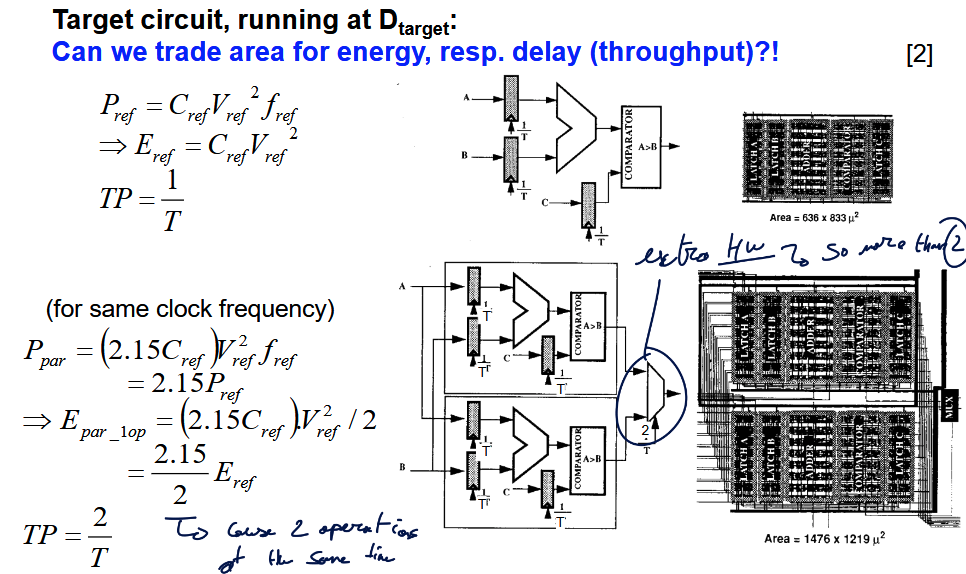
<span id="fig:enter-label" data-label="fig:enter-label"></span></p>
</figure>

- Parallelize : we can add more hardware to parallelize operation and by
  having a higher throughput. But this will consume more energy so we
  need to slow down the operation by using a smaller $V_{DD}$ which will
  add more delay. But seeing how things scale with the voltage, we will
  use less energy for the same throughput.

- Pipe : we add some registers, if we keep the same $V_{DD}$ it won't
  help since we will flip for transistors and so higher power usage. But
  if we reduce this voltage to make it slower because adding a register
  relax timing constraint, we can make some block behaves a bit slower.

{#fig:enter-label width="75%"}

We can't reduce the $V_{DD}$ forever because leakage will become
predominant. Moreover, the more hardware the bigger is the leakage
current on the overall board and so one strategy is to disable portion
of hardware but it is not really feasible. So dynamic energy and leakage
comes into **contradiction**.

#### Static energy

$$I_{leak} = I_0 e^{\frac{-V_T}{nkT/q}}$$

It is associated with the leakage and so is a form of stochastic process
that we average out to the mean value of this **leakage current**. But
the $V_{dd}$ is exponentially dependent on the $- V_T$ so we need to be
careful.

$$\begin{aligned}
    P_{stat} &= V_{dd} \cdot I_{leak} & E_{stat} &= V_{dd} \cdot I_{leak} \cdot t_d\\
    I_{leak} &= \cdot 12 \text{ per 100 mV } V_T \text{ decrease} & I_{leak} &= \cdot 2 \text{ per } 10^\circ \text{ C}
\end{aligned}$$

<figure id="fig:enter-label">
<p>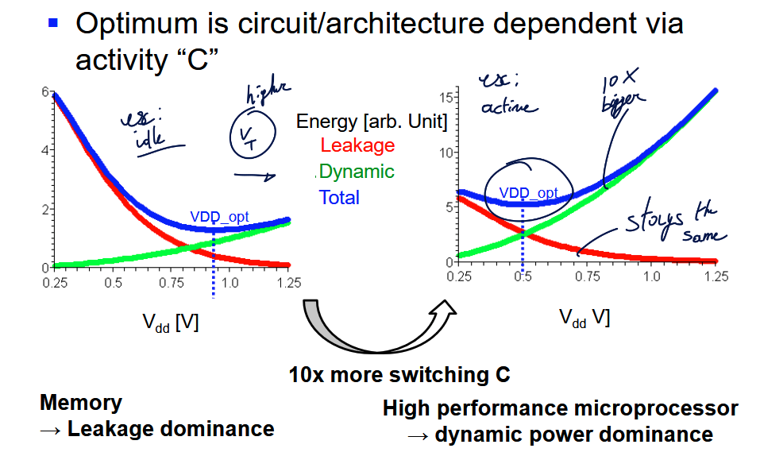 <span id="fig:enter-label"
data-label="fig:enter-label"></span></p>
</figure>

### Low-power run-time techniques

We will always try to get rid of *unnecessary* activity, reduce supply
voltage or run the clock slower. But we can do this up to a certain
extent.

#### (Dynamic) Voltage Scaling

The optimal $V_{DD}$ is **dynamic** and depend on the minimum point of
energy according to the energy per cycle targeted, how much leakage we
allow, \... We can change the frequency with a *VCO* but this only helps
the power not the energy. A **DVFS** saves both since it touches at the
$V_{DD}$.

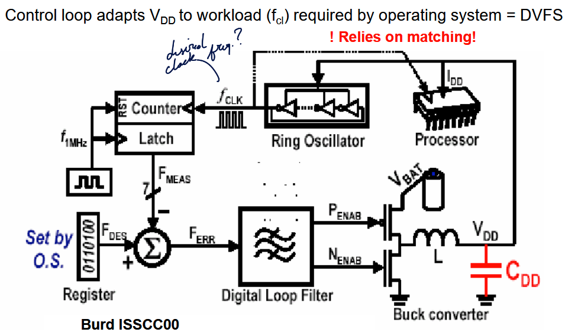{#fig:enter-label
width="75%"}

This really helps by wasting less energy and often we use a power supply
with a set of distinct voltages rather than something continuous because
it is too expensive.

#### Signal and Clock gating

We try to reduce the activity of the flipping $\alpha$ by stopping the
propagation of the signal to unnecessary logic. But again, we may need
more circuitry and so more power. We need to have a control signal that
has a frequency that is **much lower** than the source signal (like
don't switch all the time the control logic or it's stupid). Try to
share this control signal across multiple block. We can reuse some
control signal like BUS, clock, ACK, \...

We can gate input signal from a block by using a latch that is either on
or off and so propagate to another block.

<figure id="fig:enter-label">
<p>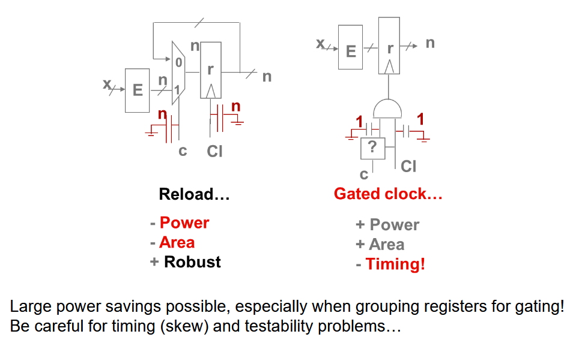 <span
id="fig:enter-label" data-label="fig:enter-label"></span></p>
</figure>

#### Power gating & System level power management

We know that the higher the leakage, the higher is the minimum energy
point. So this is annoying for memory for example and we need to
recharge the nodes all the time almost. We will try to put some part of
the circuit into hibernating state but we may loose some states and time
to wake up the circuit.

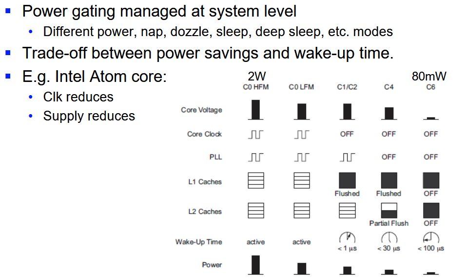{#fig:enter-label width="50%"}

## Flexibility & Scaling

It is hard to quantify the flexibility but often, as a platform is more
dedicated and so less flexible the more efficient it is.

### What platform?

#### Control flow mapping: from FSM to processor

Control flow graph can be messy and complex due to conditional loop,
resource sharing, exception handling,\... Which can make hardware
development much much harder ! So sometimes it is better to have a more
flexible hardware and control it through software which helps debugging
and adapting the hardware on the go. So instead of using a FSM where we
check conditions and do some logic to determine next stage, we let the
software indicate what state it is now through a command register.

By using command register and building a specific CSR, we can use the
hardware with an encoder / decoder that will decrypt the CSR and
translates it to actual control signal on the board. But, this will
induce more muxes so bigger critical path, \... This idea is the birth
of instructions sets and modern X86, ARM, RISC-V, \... It is more
flexible but less efficient than ASIC.

<figure id="fig:enter-label">
<p>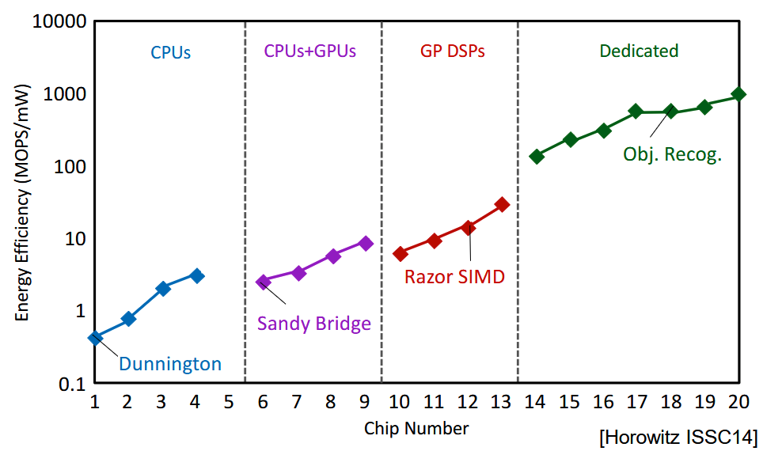
<span id="fig:enter-label" data-label="fig:enter-label"></span></p>
</figure>

#### Heterogeneous HW/SW systems-on-chip

In dataflow, we can have :

- Regular, loop intensive, high throughput:

  - Dedicated Data Paths (co-processors)

  - SIMD arrays (= parallel datapath: single instruction, multiple data)

- Irregular, low throughput, complex, programmable:

  - DSP (digital signal processor),

  - ASIP (application specific integrated processor)

Control flow can be low power, low area or high performance with FSMD
synthesis but not flexible or low performance but using flexible
algorithms so micro-controller (MCU). Often, the best decision is to
balance this and have a co-design approach to design some small SOC that
will run specific algorithms.

The most simple way to communicate between HW and SW is using the memory
BUS but this can lead to bottle neck quickly and synchronization issues
if they come from 2 different clock domain. To synchronize we can either
use a mailbox approach with req, ack (like in Erlang).

We can transfer $v$ bits after $B$ cycles for a transfer and we can have
a result of $w$ bits every $H$ cycles.

- Computation constraint : $\frac{v}{B} > \frac{w}{H}$

- Communication constraint : $\frac{v}{B} \leqslant \frac{w}{H}$

If we are limited cause of the on-chip BUS we can also have a dedicated
data transfer line between the software and hardware. It makes things a
bit more complicated but we can send more data and go much faster (less
RC). One of the best way is by using some FIFO queues with some
monitoring signal like *exists, full*. We often send big chunks like
this than in a mailbox approach it's smaller frames. But fast and big
memory is energy and power hungry.

### In what silicon technology?

First it was a free lunch, smaller = faster = less power/energy = less
area = cheaper.

#### Device scaling ("front-end")

Front-end is everything related to the device so the size of the
transistor. Here we will refer to the geometry scaling with $1/S$ and
voltage scaling with $1/U$ for quickly understanding its impact.

1.  **Fixed Voltage scaling** : $S>1, U=1$ : so everything is using the
    same $V_{DD}$ better compatibility between technology. But we will
    create more heat, \...

2.  **Full scaling** or Dennard Scaling: $S=U>1$ : the idea is to keep
    the electric field constant $V/L$. But not everything scales like
    $V_T$.

3.  **General scaling** : $S>U>1$ : We can scale the voltage up until a
    certain point and we can't always follow $S$.

<figure id="fig:enter-label">
<p>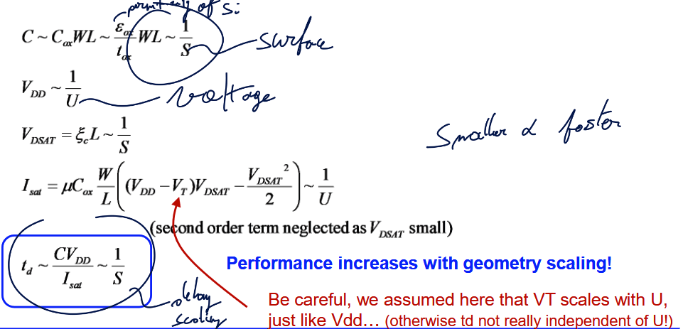
<span id="fig:enter-label" data-label="fig:enter-label"></span></p>
</figure>

<figure id="fig:enter-label">
<p>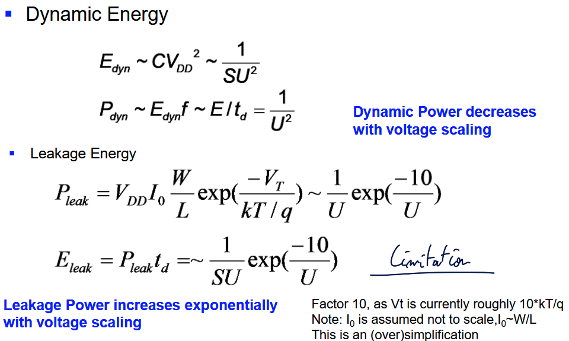
<span id="fig:enter-label" data-label="fig:enter-label"></span></p>
</figure>

::: {#tab:my_label}
     Parameter     General Scaling $S>U>1$   Fixed Voltage $S>1, U=1$   Constant E field $S=U>1$
  --------------- ------------------------- -------------------------- --------------------------
       $t_d$                $1/S$                     $1/S$                      $1/S$
     $E_{dyn}$            $1/SU^2$                    $1/S$                     $1/S^3$
     $P_{dyn}$             $1/U^2$                     $1$                      $1/S^2$
       Area                $1/S^2$                   $1/S^2$                    $1/S^2$
   $P_{density}$         $S^2 /U^2$                   $S^2$                       $1$

  : Scenario and impact
:::

The heat increases quadratically for *fixed voltage scaling* but the
increase is less dramatic for *general scaling*. The optimal idea is to
use constant electric field scaling but not everything scales and the
leakage can get too big.

**DDSM scaling**, the main drawbacks are *leakage* (gets too big if VT
scaling is maintained), *interconnect* (wires delay is bigger than the
logic) and *variability* (needs to add too much buffer so we lose the
gain).

<figure id="fig:enter-label">
<p>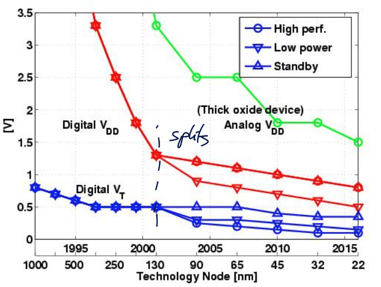 <span
id="fig:enter-label" data-label="fig:enter-label"></span></p>
</figure>

#### Interconnect scaling ("back-end")

Back-end is everything related to the wiring of all the devices together
so wires,\... We have wires that are next to each other but also form a
sort of capacitance with a potential ground plane or other wires. The
timing for a wire is :

$$t_{wire} = \frac{RC}{2} = \frac{rcL^2}{2} \sim \rho \epsilon \frac{L^2}{\lambda^2} \sim \rho \epsilon L^2 S_I^2$$

Where $\lambda$ is the size and spacing of the wires approximately and
$\lambda \sim 1/S_l$, $c\sim 1$, $r \sim 1/\lambda^2$. In general, the
local connection between the gates scales down so $L \sim 1/S_l$ but
since we are making more complex modules they tend to take the same
amount of space so $L = cst$ for global interconnection.

$$\begin{aligned}
    T_{wire,local} &\sim L^2 S_l^2 & T_{wire,global} &\sim S_l^2
\end{aligned}$$

But the energy also varies with the sizing. Again with the same idea
that local wiring scales down but not global. But the energy goes by a 3
order for local with constant electric field and quadratically for
global wires.

$$E_{wire} = C_{wire} V_{DD}^2 \sim \epsilon \frac{\lambda L}{\lambda} V_{DD}^2 \sim \frac{L}{U^2}$$

#### Variability

By going smaller and smaller, when doping one region, $\pm$ 1 ion make a
much much bigger difference in the doping ! So, $V_T$ can vary a lot and
we have some *inter-die* and *intra-die* effects. We can use some good
matching practices.

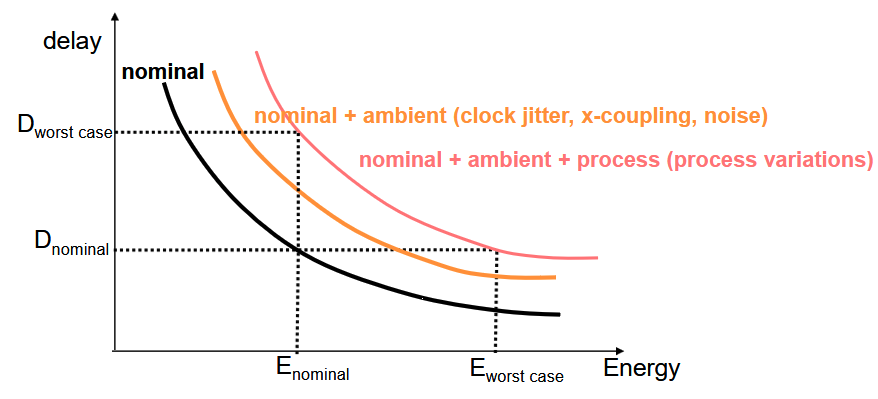{#fig:enter-label
width="75%"}

**Systematic variations** are the same for all TORs on the die but
different for different die (inter-die), we can do some delay monitoring
and tuning. **Random variations** vary from one transistor to the other
(intra-die), we can add some margin.

We really are aiming at low energy for more functionality. We need to
deal more and more with variability and leakage, the free lunch era is
over. Need of good engineers and creative one especially !
