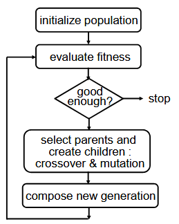
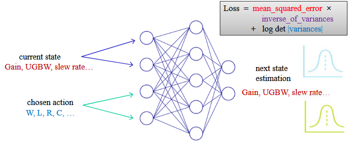
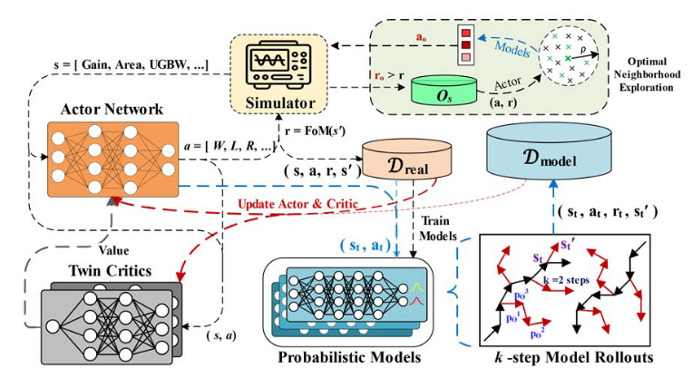
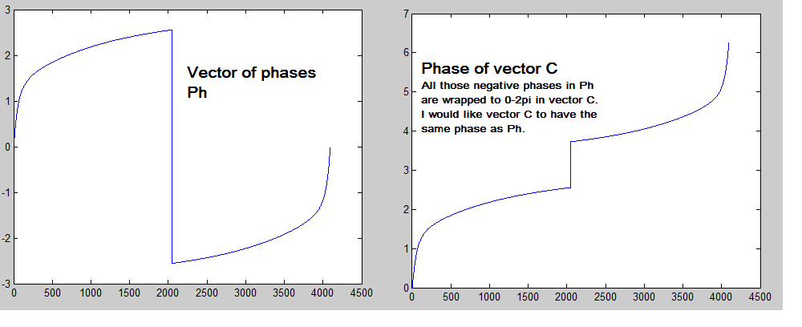
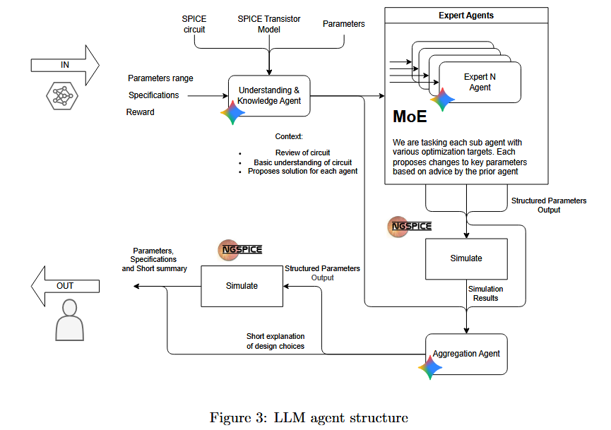

# Numerical simulation of analog circuits

## Analog circuit simulation

> **Definition**
> 
> A simulation is a numerical calculation of the response of a circuit to an input stimulus

It requires 3 basic inputs:

1. **Netlist**: how are the devices interconnected together
2. **Device models**: the actual device information used in the circuit. Usually provided by the foundry, related to a certain node process. Comes in a set of files named **PDK** (Process Development Kit)
3. **Controls**: the stimuli and environmental settings (temperature, ...)

Using those 3 basic ingredients, we can simulate various things such as:

- DC sweep: find the operating point `.OP` and try various DC values
- Time domain: transient analysis to check the behavior in time
- Frequency domain: after doing transient analysis apply FFT to check frequency behavior.
- PSS: small-signal analysis around a DC point

A crucial point is to swipe various **operating conditions**. Devices are not perfect and their parameters will vary from one to another. We usually realize Monte-Carlo (**MC**) parameter variations. We can also check various temperatures.

### Transient simulations

Usually, a circuit can be represented as a system of non linear differential equations. 

\begin{align}
    V &= RI & V &= L\frac{dI}{dt} & I &= C \frac{dV}{dt}
    \label{eq:kcl-eq}
\end{align}

We know that the circuit should follow KCL, KVL and the device specific equation. On paper, this rather looks easy as we only need to ensure that the sum of current entering a node is null and the sum of voltage in a loop is also null.

**But**, 2 components makes the task harder. We don't have a direct $I(\alpha,\beta, ...)$ for them:

1. *Voltage source*: if assumed ideal, it can deliver any current. We must add an equation an variable to ensure that it can be appropriately solved.
2. *Inductors*: the fundamental equation \ref{eq:kcl-eq} shows us that we know the voltage directly but not the current. So, we must transform it into an integral equation with $I=1/L \int \Delta V dt$.  We have this extra $\Delta V$ and we can use $\Delta V = L di/dt$

This brings the total amount of equations to $N-1 + V_s + L$ with $N-1$ being the amount of components, $V_s$ the amount of voltage sources and $L$ being the number of inductor.

We can safely assume that on average, this number can be simplified to $\approx N-1$.

This technique is called the **Modified Nodal Analysis** MNA and is quite memory efficient. This is what was used in the first open-source program made at UC Berkeley, **SPICE**.

### Numerical techniques

We can summarize the process of solving such system numerically as 3 nested loops:

- **time discretization (numerical integration) :** transforms system of nonlinear differential equations into a sequence of purely algebraic systems of nonlinear equations, to be solved at each discrete time point
  - **nonlinear equation solution (Newton-Raphson) :** iteratively solves the system of nonlinear equations at a given time point by solving a sequence of linearizations of the system
    - **linear equation solution (LU factorization) :** solves the system of linearized algebraic equations during each iteration at each discrete time point

#### 1. Time discretization

First thing is to discretize the derivative by replacing them with a finite difference approximation.


| Characteristics |        Backward Euler (BE)        |                         Trapezoidal                         |                       Gear-Shichman                        |
| :-------------- | :-------------------------------: | :---------------------------------------------------------: | :--------------------------------------------------------: |
| Next value      |    $x_{t+h} = x_t + hx_{t+h}'$    |           $x_{t+h} = x_t + h/2 (x_{t+h}'+ x_t')$            |      $x_{t+h} = 4/3 x_t - 1/3 x_{t-h}+ 2h/3 x_{t+h}'$      |
| Next derivative | $x_{t+h}' = 1/h(x_{t+h} - x_{t})$ |          $x_{t+h}' = 2/h(x_{t+h} - x_{t})- x_{t}'$          |    $x_{t+h}' = -2/h x_t + 1/2h x_{t-h}- 2/3h x_{t+h}'$     |
| LTE             |                 /                 | $- h^3/12 x_{t+h}''' + \mathcal{O}(h^4) = \mathcal{O}(h^3)$ | $2 h^3/9 x_{t+h}''' + \mathcal{O}(h^4) = \mathcal{O}(h^3)$ |
| A-stable        |               **V**               |                            **V**                            |             **V** if $h_n/h_{n-1} \leqslant 1$             |
:Various integration techniques

If the Local Truncation Error (LTE) is too large, we can implement some simple feedback pattern that will adjust the timestep to obtain an error below a certain threshold.

Stability is also crucial and we use a classic *test equation* $x' = \lambda x$. We call a system A-stable if it is stable any physically stable circuit (pole laying ini the left-hand side of the plane).

For G-S if we must increase the timestep, we can switch to BE temporarily and then use G-S  which is more flexible.

#### 2. Non-linear equation solutions

We now solve the system of nonlinear equations using an iterative algorithm. It will linearize locally the equations using an initial guess that we refine.

$$
    F(x) = 0 \Rightarrow x_{(k+1)} = x_{(k)} - \frac{F(x_{(k)})}{F'(x_{(k)})} \qquad \text{Newton-Raphson algorithm}  
$$

It will converge in a certain neighborhood, if it doesn't we could also reduce the timestep and do again the first step then N-R. We can also have the multi-dimensional algorithm based on the jacobian:

\begin{align}
    J_F(x_{(k)} (t+h)) (x_{(k+1)}(t+h) - x_{(k)}(t+h)) &= -F(x_{(k)}(t+h))\\
    J_F(x_{(k)} (t+h)) &= \frac{\partial q(x_{(k)}(t+h))}{\partial x} + \frac{h}{2} \frac{\partial f(x_{(k)}(t+h))}{\partial x}
\end{align}

The convergence is quadratic and we can base ourselves on previous results. But for the first iteration, we have no guess besides the `.OP` value. The circuit is at rest, caps are open circuit and inductance short circuit. This leaves a lot of node floating which can be tricky for `.OP` simulation. One solution is **conductance ramping** (GMIN). The idea is to put a conductance between the floating node and possible well-defined nets (GND, Vss, ...). We then reduce slowly the conductance to reach the open circuit condition.

#### 3. Linear equation solution

The system looks like $Ax=B$ and since it will be sparse we can use some LU-factorization algorithm in sparse Gaussian elimination $\mathcal{O}(n^3/3)$. Followed by forward $L$ and backward $U$ substitution.

If the magnitude of the pivot is too small, near-singularity of the coefficient matrix results in non-convergence.

## RF simulation techniques

Sadly, we cannot use transient analysis for RF circuit. This would take too much time due to the small timestep needed until it reaches the steady-state. But, we  often are just interested in the steady-state of the circuit. If we use classic `.TRAN` analysis and we want to check the frequency response, we must use the proper FFT.

$$
N_{FFT}= 2^n \geqslant \frac{2f_{max}}{\Delta f} \qquad h = \frac{n_{periods}}{N_{FFT} \cdot F_{osc}}
$$

So to perform relevant analysis we must know in advance some characteristics on the circuit. Which is not always possible  if they get more and more complex.

So instead of simulating the transient behavior, let's focus on the steady-state behavior.

### Direct steady-state solution

> **Definition**
>
> solution that is asymptotically approached when the effect of the initial condition dies out.
>
> may not exist or there may be several; can be periodic - quasi-periodic

| Method           | Type      |                                                                                              Description                                                                                              |                                                  Use case                                                  |
| :--------------- | :-------- | :---------------------------------------------------------------------------------------------------------------------------------------------------------------------------------------------------: | :--------------------------------------------------------------------------------------------------------: |
| Shooting methods | Temporal  |                                                                   From the initial condition, tries to find $T$ where $x(T) = X(0)$                                                                   |                                   good for non-linear circuits, uses N-R                                   |
| Harmonic balance | Frequency | Based on the fact that any signal can be seen as a **truncated Fourier series** like $x(t)=\sum_{k=-K}^{k=K} X[k] e^{j2\pi f_k t}$ So for each node,  we will have $2K +  1$ coefficients to balance. | Good for (quasi-)periodic and linear circuits. There are pre-conditioner  for  such sparse matrix problem. |
:Comparing the two main methods in RF simulation


### Periodic small-signal analysis (PAC)

We **linearize** around the periodic operating point and compute the PAC response. It will have  different  tone for one excitation. It is a **time varying linear** analysis.  This doesn't reflect harmonic or non-linear effects.

#### PNOISE

From this type of analysis, we can  do some noise analysis where the noise sources get modulated  by the operating point. The transfer function (TF) is also time-varying. 

This is the reason we have pink, $1/f$ noise.

### Envelope calculation

Sometimes, we are only interested in the enveloppe to quickly analyse start up behavior. We also refer to this as the *slow dynamic*. We compute this with the slow time-varying integration of DAE:

$$
x(t) = \sum_{k=-K}^{k=K} X_k (t) e^{j2\pi f_k t}
$$

### Recap

| Method       |                                                                                  Use case |
| :----------- | ----------------------------------------------------------------------------------------: |
| TRAN         |                                      to see the startup behavior  and exact signal, slow. |
| Steady-State | Steady-state analysis with shooting or harmonic balance methods  according to the circuit |
| PAC          |                                         Analysis of multiple time varying operating point |
:Recap table of RF analysis techniques

A last note about RF simulation is the need for RF models. Those are different than the classic SPICE models and higher order parasitic elements could interfer more than the "regular" one in classic analog design.

## Multi-level analog modeling

Some circuits work only at higher frequencies. Typically pll, $\Sigma-\Delta$, ... run at higher frequency than their output result. Moreover, modern circuits are quite complex and mixed-signal is common.

This all leads to really poor performance in term of simulation. We must add layer of abstraction and simplification if we want to keep simulation time acceptable. It is a performance-error tradeoff. It is even more important knowing that we cannot simulate faster due to mathematical constraints.

This is why we must use **higher-level models**. By using this approach we can do some **top-down** design where we refine at each step the details and characteristics.

- System concept:
- System: mixed-signal architectural design 
- Circuit: analog cell synthesis
- Cells: analog cell layout
- Layout: mixed-signal system layout

### IP

This also opens the door for **IP-reuse** where specialized company can produce circuits and send "*compiled*" version to the customer thanks to the **Virtual Socket Interface (VSI)**.

Moreover, the company also provides some more accurate modelling and informations about the placement, isolation and tests.

The model is the **extracted ADHL** model that was produced after the design phase.

Finally, we can verify all of this with a bottom-up verification phase.

### Abstraction levels

| Level      | Accuracy |   Speed-up |
| :--------- | -------: | ---------: |
| System     |       -- | 10.000.000 |
| Behavioral |       -- |  1.000.000 |
| RTL        |        - |    100.000 |
| Gate       |        ~ |     10.000 |
| Switch     |        + |      1.000 |
| Circuit    |       ++ |          1 |
:Digital abstraction levels


| LEVEL      |                                                              MODELING PRIMITIVES |                                                                        IMPLICATIONS |
| :--------- | -------------------------------------------------------------------------------: | ----------------------------------------------------------------------------------: |
| functional | mathematical signal flow description per block; connected in signal flow diagram |        no internal block structure; conservation laws need not be satisfied on pins |
| behavioral |                       mathematical description (equations, procedures) per block |             no internal block structure;conservation laws must be satisfied on pins |
| macromodel |                                       simplified circuit with controlled sources |          spatially unrelated to actual circuit; conservation laws must be satisfied |
| circuit    |                                                   connection of SPICE primitives | spatially one-to-one related to actual circuit; conservation laws must be satisfied |
:Analog abstraction levels

- **Macromodel**: we try to replace everything with a much simpler electrical component (cap, resistor, ...) but it can be quite tricky to model each and every components
- **Behavorial**: it is a *mathematical description*. It models the DAE. Models the first-order behavior and also major nonidealities.

#### Behavorial modeling

We can even include some statistical variations using normal distribution. For this, we can accelerate by doing some singular value decomposition. This is quite an effective method if the errors are highly correlated which makes the rank lower and thus the space simpler to decompose.

It is also possible to model dynamic error such as settling error, ... by using the appropriate functions.

We can even go further by using a neural network approach to train the model on a training dataset and a testset to validate the results.


## Analog behavioral description language


**TODO the rest I didn't do between the two lectures lol**

## Optimization

We are operating in hyperspace where the set of parameters  are $x \in \mathbb{R}^n$ and we must satisfy all the constraints. This means that the optimal solution (according to the function we defined) may not be part of the solution due to constraint.

Finding a solution isn't always straightforward and we often must use some non-linear, stochastic, etc. programming techniques. On top of this we can use some **Probilistic heuristic methods**.Those techniques can be proven to have superior results especially they can avoid local optima and  find the absolute best solution.

### Simulated annealing

The idea is like in metallurgy where we will warm up and cool down cyclically a metal to allow the atoms to take a nice crystal lattice.

$$
P(\Delta f) = e^{- \Delta f/T} > c \in [0;1] \qquad \text{Metropolis criterion}
$$

The idea here is to randomly do jumps in the solution space. We then evaluate the results and 2 things can happen. If the difference state $\Delta f = \phi_2 - \phi_1$:

1. **Negative**: this means the new state is accepted as it  is better than the previous one
2. **Positive**: the new state is worse than the previous. But according to the metropolis criterion it can be accepted. If $c$, the random variable, is inferior to the $P(\delta f)$ then the new *worse* state is accepted 

This process is repeated multiple time each time with another $c$ and also with a lower temperature $T$ which will make it less likely to jump to worse state.

**Add graph with better quality**

One major setback with this algorithm is the fact that the next state is based on the current one. This make parallelism  hardly possible.

### Genetic algorithm

This is based on biology and how a population evolves.  A child will get part of the dad's and mom's genetics but also extra twist randomly. We will then evaluate and only the fittest will survive and produce the next generation. We can easily parallelize this since we have a "large" population independent from each other.

{width=35%}

The evaluation of the fitness is done with the optimization function. We can use some tournament or roulette wheel method for "breeding" of the parents. We repeat the process until reaching the stop criterion.

This type of algorithm is really good for **multi-objective optimization**, it handles quite well the conflicting performances and easily find the Pareto-optimal front[^1].

[^1]: Pareto-optimal is a state where, if we want to gain something (gain, bandwidth), we have to loose in other values. 

#### Age-Layered Population Structure

We can also propose some multi-layer process where each will evaluate different corners or statistics about the circuit. And little by little, the population will progress through the layers.

____

Overall, such optimization methods are quite interesting and useful. We can also do *equation-based* or *simulation-based* optimization. Equation will require more "handcrafting" than the simulation based one. 

It is quite easy to add extra objectives like noise, distortion, ... AMGIE is an interesting as well.

#### Simulation-based

Here we have an optimization engine then we will evaluate the circuit inside a numerical simulator, results will then be processed by the optimization engine. So we get better feedback and do not need equations. But will take more time to run/simulate.

But, for example ANACODA, has been proven to produce better results than hand design baselines. For a design that would take a human designer around 2 weeks. It only takes roughly $20\cdot 10$  hours on old computer.

Higher level simulator like DAISY also exists. They can determine the optimal modulator topology, minimum building block requirements. It will use GA and behavioral simulator to produce fast and compelling results.


## RF circuit

It is trickier to simulate as the layout will impact the design and must be taken into account. This takes much more time as we need to do some FEM simulations

## Design complete systems

A common pitfall with optimization is that it will do exactly what the engineer tasked it with. So if no one explicitly told the software to take into account margin for errors, it may produce an unstable results.

To design complete systems, we must simplify and use a vertical approach. One approach is based on the Pareto-boundary. Each sub-block will optimize for its own goals and give back the Pareto front back. Then all those fronts will be re-combine together to form the complete Pareto front. This method is also a good way to explore multiple topology all at once.

## AI/ML-based approaches

The idea is to use a NN model for the circuit to replace simulations. Then we use some reinforcement learning where we want it to optimize a reward function. The challenge is in the quality of the data but also the explainability so an engineer can still control it.

### Examples

- AutoCkt/BAG: use deep reinforcement learning which will subsample to better gain knowledge. This is often more **sample-efficient** than GA, ... algorithms
- TD3: model-based RL

### Actor-critic RL

This time we have not just one but 2 networks. The first one is the **actor** and will suggest values, simulation will be done and the second network, the **critic**, will grade and estimate the next values of the reward. We keep in memory past experiences at each step.

TD3 will use a mix of real simulated values and synthetic one. This will result in smaller simulation time. Multi-agent versions also exist.

{width=50%}

#### Short rollouts

Take the model with least loss and randomly choose a past states to repeat for the following $k$ steps. We use the actor to suggest an action. Then we evaluate and see if we should adapt the search. This methods allow for deeper space exploration and can give sort of "quick boosts" to the algorithm. Instead of being bottlenecked by the feedback loop it will run a bit faster.

#### Full MBTD3 architecture

$$
z_y = \frac{y - y^*}{y + y^*} \rightarrow 
r_y = 
\begin{cases}
\min(z_y, 0), & y \in Y_L \\
-\max(z_y, 0), & y \in Y_U
\end{cases}
\rightarrow 
r_H = \sum_{y \in Y} r_y
$$

$$
o_t = \frac{t - t^*}{t + t^*} \rightarrow 
r_t = o_t \rightarrow 
r_T = \sum_{t \in T} r_t
$$

$$
\mathrm{FoM} =
\begin{cases}
r_H - \alpha \times r_T, & \text{if } r_H < 0 \\
0.3 - \beta \times r_T, & \text{if } r_H = 0
\end{cases}
$$

The $y^*$ is the simulated target, in the first equations with the $\min$ and $\max$, the use of those functions are to cap the reward. If the values are better than targeted, then we won't deduct points.

{width=50%}

This has been proven to produce better and faster results (less iteration) than state of the art GA algorithms.

\newpage

\part{Previous Exam Questions}

# January 2026
## TD3 project

### How do you calculate phase margin? How do you deal with phase warp around?

For phase margin, you need to find the UGBW, that is where you can evaluate the phase. To find the UGBW you need to run this function:

```py
def find_ugbw(...):
    crossing, found = self._get_best_crossing(freq, np.abs(vout), 1)
```

It will interpolate the frequency and absolute value of vout to find the approximate crossing with 1. After this you can call phase margin:

```py
def find_phm(self, freq=None, vout=None):
    UGBW = self.find_ugbw(freq, vout)

    phase = np.angle(self.vout_complex)*180/np.pi
    phase_interp = interp.interp1d(freq, phase, kind='quadratic', fill_value="extrapolate")
    phase_at_ugbw = phase_interp(UGBW)
    phm = 180 + phase_at_ugbw
    return phm
```

We get the frequency where we have the UGBW then interpolate again frequency and phase this time based on the complex value of vout ($\angle$). Finally you add $180^\circ$ to have a positive value.

{width=50%}

Phase warp around is the problem where the `np.angle` returns a value between $[-\pi, \pi]$. You can unroll this value using `np.unwrap`. We didn't use it as we didn't test for this edge case sadly, but even if the phase may be wrong due to unstable circuit, other metrics will also be strongly penalized avoiding keeping the current design.

### How do you calculate slew rate?

For slew rate you need a `tran` simulation with a signal centered around 0 and clock it between $[-V_{ss}, V_{ss}]$

```py
def find_slew_rate(self, time=None, signal=None, threshold_low=0.1, threshold_high=0.9, time_unit='us'):
    # 1. Normalize the signal to find thresholds relative to min/max
    v_min = np.min(signal[start_time_index:])
    v_max = np.max(signal[start_time_index:])
    v_swing = v_max - v_min

    # Absolute voltage thresholds
    v_low = v_min + threshold_low * v_swing
    v_high = v_min + threshold_high * v_swing
    
    # Find indices where signal crosses V_low (going up)
    low_crossings_idx = np.where(
        (signal[:-1] < v_low) & (signal[1:] >= v_low)
    )[0] + 1
    
    # Find indices where signal crosses V_high (going up)
    high_crossings_idx = np.where(
        (signal[:-1] < v_high) & (signal[1:] >= v_high)
    )[0] + 1

    slew_rates = []
    edge_details = []

    for t_low_idx in low_crossings_idx:
        valid_t_high_indices = high_crossings_idx[high_crossings_idx > t_low_idx]
        
        if len(valid_t_high_indices) > 0:
            t_high_idx = valid_t_high_indices[0]

            t_low = time[t_low_idx]
            t_high = time[t_high_idx]
            
            delta_t = t_high - t_low
            delta_v = v_high - v_low 

            if delta_t > 0:
                slope = delta_v / delta_t
                
                slew_rates.append(slope)
                edge_details.append((slope, t_low, t_high))
    
    avg_slew_rate = np.mean(slew_rates)

    return avg_slew_rate
```

Basically, we highlight everywhere that crosses the $10\%$ and $90\%$ relative swing mark. We have a list of the crossing the lower and upper limit. We are only interested in the crossing up ! We do the delta of voltage over time: $SR = \frac{\Delta V}{\Delta T}$. We append it to a list and take the average. 

This method is correct but resulted in a few discrepancies with the golden metrics. We tried to interpolate to have the exact time crossing the lower and upper limit but without gaining much better results. We also tried to take the slew rate going down without any improvements over the reference values.

Overall, our method seems correct.
 
### Which hyperparameters are there and how did you tune them?

- **noise sigma**: fixed noise sigma added to the deterministic action: When evaluating each state we had some noise to not overfit around 1 state. It avoids to be deterministic and take the same actions over and over.
- **gamma**: discount factor for reward: trade-off between current reward and possible future reward. It also tries to seek potential future gain.
- **tau**: smoothing coefficient: It controls how slowly the target networks track the online networks to maintain stability.
- **batch size**: It’s the number of experience transitions sampled from the Replay Buffer to calculate one gradient update.
- **warmup steps**: How many steps we take without evaluating, we let the agent run to have a sense of inertia of the agent. Avoid early bias.
- **Total training steps**: How many steps we take in the optimizer until we finish.
- **lr**: Learning rate: based on gradient descent $w_{i+1} = w_i - \alpha \frac{\partial}{\partial w_i} \text{loss}(w)$. This is the $\alpha$ factor and determines how fast we descent. The higher the faster it converges but can oscillate around a minima or quickly move around.
  - **pi_lr**: Agent RL: agent learns slower to converge to a better overall value.
  - **q_lr**: critic RL: learn faster to correct the agent, more noise sensitive. Needs to provide a stable "surface" for the actor to climb. If it's too slow, the actor learns from outdated info.

### Explain the TD3 algorithm. What are the basic components (actor, critic, environment)? What does each one do? How are they trained/updated? What are the cost functions? -> need to explain in detail. Why do we use target systems? How are they updated (Poliak averaging). Why are there 2 critics?

Actor and critic are both RL, neural networks using hyperparameters defined above. The environment is the given action possible. The environment is the gymnasium environment herited class. We normalize the actions between $[-1, 1]$ and the environment can convert those into actual parameters. The model will select the action with the best reward with discount and added noise for non-deterministic actions.

The cost function is made of 2 parts:

1. hard constraints that must be met
2. Soft constraints that are optimized if hard met

$$h_{norm} = \frac{h-h^*}{h+h^*} \qquad   op_{norm} = \frac{op-op^*}{op+op^*} \qquad r_H = 
- \sum_{\substack{h = \text{noise}}} 
    \max(h_{\text{norm}}, 0)
\;+\;
\sum_{\substack{h \neq \text{noise}}} 
    \min(h_{\text{norm}}, 0) $$  
$$
r_T = -\sum_{op} op_{\text{norm}} \qquad
r = 
\begin{cases}
r_H + 0.05\,r_T, & \text{if } r_H < 0 \\[0.5em]
0.3 + r_T, & \text{otherwise}
\end{cases}
$$

We use targets as the AI doesn't know what is a good value and we should normalize it as GBW could grow drastically.

The target networks are here to stabilize the search. 
[https://spinningup.openai.com/en/latest/algorithms/td3.html](https://spinningup.openai.com/en/latest/algorithms/td3.html)


DDPG (before TD3) limitations:

- Overestimation of the error
- Sensitive to hyperparameter
- Too frequent parameter update --> Instability

TD3 adds noise to the target action, to make it harder for the policy to exploit Q-function errors by smoothing out Q along changes in action.

- TD3 is an off-policy algorithm.
- TD3 can only be used for environments with continuous action spaces.
- The Spinning Up implementation of TD3 does not support parallelization.


In standard Reinforcement Learning, critics often overestimate the value of actions. Because the agent always picks the maximum Q-value, it tends to favor actions that have a noisy, high estimate rather than actions that are actually good. This solves the overestimation bias that can snowball in DDPG based workflow better estimation making for the critic. We also update less than in DDPG. Noise smooths out the search and avoid high Q peak.

TD3 uses two critics to combat this:
  
  - Both critics estimate the value of the next state.
  - The algorithm takes the minimum of the two estimates: $y=r+\gamma \cdot \min(Q_{target1},Q_{target2})$.
  - By always using the more "pessimistic" estimate, TD3 prevents the actor from overexploiting high-value errors.

### Why do we use episodes? What happens after each episode? Why do we use the done signal?

Episodes is important so we don't just learn infinitely. We start from one point, explore and then stop. Then we restart from another point (new episode) and we can use what we have learn previously. This ensures we can explore more of the space we have (circuit parameters). After an episode, the state reset and so the agent selection will be based on a random state. 

The done signal indicates when we finished an episode.

### Explain you llm workflow. Do you use less simulations than in the normal RL?

Yes, we used less simulations. We based ourself on only one design.

{width=70%}

## Course

- Spice: How do spice simulations work? What errors does it make? What error in discretization, nonlinear solver, linear solver. What other types of errors outside of this technique?

> &nbsp;
>
> &nbsp;
> 
> &nbsp;
> 
> &nbsp;
>
> &nbsp;
> 
> &nbsp;
>
> &nbsp;
>
> &nbsp;
> 
> &nbsp;


- Explain EM interference and noise coupling. Explain self healing chips (example with Ron).

> &nbsp;
>
> &nbsp;
> 
> &nbsp;
> 
> &nbsp;
>
> &nbsp;
> 
> &nbsp;
>
> &nbsp;
>
> &nbsp;
> 
> &nbsp;

- What types of defects can occur on an analog chip? How can a designer take these into account? How can we test chips for these errors/defects? What is the FoM of the tests? In practice, how can you determine how good your tests are?

> &nbsp;
>
> &nbsp;
> 
> &nbsp;
> 
> &nbsp;
>
> &nbsp;
> 
> &nbsp;
>
> &nbsp;
>
> &nbsp;
> 
> &nbsp;

- RF: Can you do RF simulations with spice? Why do you need small time steps? What is the problem? (SS) What methods can be used to calculate this? How does noise simulation work on RF signals? What happens with the noise? To which frequency will it be upconverted? What happens if we make the transistors smaller? (pink noise -> 1/WL). So pink noise becomes larger, but how much?

> &nbsp;
>
> &nbsp;
> 
> &nbsp;
> 
> &nbsp;
>
> &nbsp;
> 
> &nbsp;
>
> &nbsp;
>
> &nbsp;
> 
> &nbsp;

- Layout: How can we do this automatically? What is in the cost function? Which optimization technique could you use (simulated annealing or genetic algorithms). How would you integrate this place and route in the TD3 -> you can't just do the whole optimization each step.

> &nbsp;
>
> &nbsp;
> 
> &nbsp;
> 
> &nbsp;
>
> &nbsp;
> 
> &nbsp;
>
> &nbsp;
>
> &nbsp;
> 
> &nbsp;