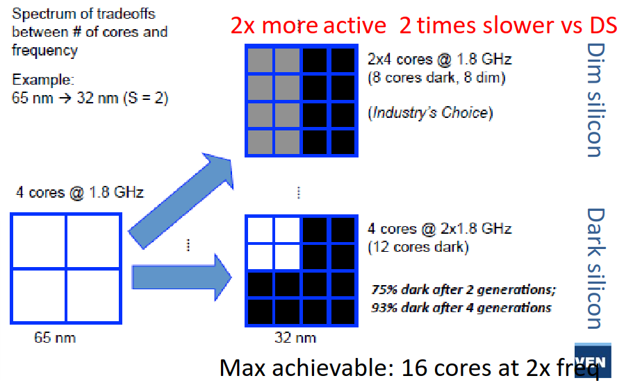

# Lecture 1: Towards heterogeneous many-core processors

> **Paper to read further**
> 
> *Paper1*: A New Golden Age for Computer Architecture J. Hennessy AND D. Patterson
> 
> *Paper2*: Apple M1: Ditching x86 A. Frumusanu
>
> *Paper3*: Paper2: Apple M1 deep dive: Micro-architecture (pg2) Anandtech, Andrei Frumusanu; [*link related to the article*](https://www.tomshardware.com/news/apple-a14-cpu-details)

## Scaling

In IC and chip design, there is two fondamental laws:

- **Denard's law:** as transistors get smaller, the power density remains constant, which leads to lower and lower supply voltage to avoid to break down the oxide due to a strong $\vec{E}$.
- **Moore's law:** every generation can fit twice as many transistors on a certain area. 

### Denard broke down

Denard's law is based on the fact that the width, length, oxide thickness and voltage is reduced by a factor $\alpha$ each time. This factor also influences:

- Density: $\alpha^2$
- Capacitance: $1/\alpha$
- Delay: $1/\alpha$

Thus, Power = $CV_{DD}^2 f \propto 1/\alpha \cdot cst \cdot 1/\alpha = 1/\alpha^2$. Finally the power density is a constant.

On paper, this is valid but we can't infinitely scale down $V$ or we will have lower speed the closer we come to $V_{th}$ which is not feasible. Moreover, the wire cannot scale down as desired or we will have a bad resistance in the wire. This will make the wires a bit more "capacitive" and so the $\alpha$ factors will no longer cross out as Denard predicted. The power is constant and the power density is $\alpha^2$ which is quite problematic.

### Dark and Dim Silicon

The end of the Denard's scaling lead to a plateau in the power consumption of chips. We have to buy this energy efficiency. We know that the power density scales with $\alpha^2$ at maximum clock frequency. So we will introduce:

- **Dim silicon:** silicon running at below max $f_\phi/\alpha^2$
- **Dark silicon:** $1/\alpha^2$ blocks that totally shut down when not used

In practice, if we scale with a factor $S=2$ we can put $2^2$ more silicon and the speed should increase by a factor $2$. In *dark silicon*, we will still speedup the clock frequency but all the newly added cores will be shutdown. This is quite unsustainable as more cores (due to Adhalm's law) won't leverage from parallelism. The better idea is to not clock faster and use this extra factor $2$ to produce dim silicon and then the rest with dark silicon.

{ width=50% }

Recently, we are using more and more dark silicon as accelerators that get turned on for specific task -- accelerators.

## Area for energy in single-core

To make a processor faster, we can use either:

- *Instruction-level parallelism*: VLIW, OOO super-scalar
- *Data-level parallelism*: SIMD, GPU

> Won't re-explain what those are, check the computer architecture lecture: [*link*](https://github.com/Tfloow/ESATSummary/raw/main/PDF/M1S2_Computer_Architecture.pdf)

Those are prime examples of dim silicon with lower clock speed for same throughput thanks to parallelism.

There is also the vector extension that can be seen as a sort of *temporal* data parallelism. SIMD, VLIW and other processing is often found in DSP chip since such processing is often data intensive.

### Super-scalar

In this version, it is out of order and the processor can schedule instructions when it wants. It uses the Tomasulo's algorithm but must commit in order to avoid data dependency issues.

The advantage of such processor is the flexibility of the operations. Typically, some execution stage can take more time than others. We must use a reorder buffer (ROB) to commit in order. This is a prime example of spending extra transistors instead of clocking faster. There is a certain overhead for controlling such processors but the gains are far superior.

### Memory area

Memory access time is the usual bottleneck in computing, a lot of time, the thread is blocked because it waits for data to arrive. Latency of cache and memory is quite important and to hide it we use multi-threading with some level of granularity to keep all cores as busy as possible.

We can't use too much of simultaneous multithreading SMT because the overhead is quite important. Need each time a program counter, register file and a reorder per thread. On top of that, the commit and scoreboard is more complex.

This is why we use various cache level and we exchange latency with transistors count. A recent trend is using large reorder buffer to see well in advance and to re-order online the instructions. This will increase parallelism and reduce off-chip memory accesses.

## Area for energy through multi-core

Sadly, this is not enough and *Amdahl's law* explain that parallelism will not always lead to a speedup and lots of applications are not easily parallelizable.

### Homogenous

We first started by doing `ctrl+c` and `ctrl+v` on the cores to realize a speedup. On top of that, we would some p-state (dim silicon) or shut it down completely (dark silicon) if not used.

### Heterogeneous

Here, we will have dedicated low-power cores that can realize operations if low performance is needed. Depending on the workload, we can switch to efficiency core or performance core. This is present in the **big.LITTLE** ARM architecture. We must use the same instruction set to seamlessly transfer from one core to the other.

This idea is heavily used in embedded devices like smartphone and is starting to make its way through in personal computer, typically Apple's computer.

## Area for energy through domain specific accelerators (DSA)

We are now facing the utilization wall. More and more silicon must be dim or dark, we must use the extra transistors for something. Here comes accelerators which are custom ASIC blocks for specific function.

# Questions

## Lecture 1

1. *What is Dennard’s law and how is it linked to the evolution of computer architectures over the last 30 years? Describe the different phases we see in this evolution, and the architectural consequences. Illustrate this with examples from processors discussed in class and the papers to be read.*
2. *Why do Henessey and Patterson say it is a New Golden Age for computer architectures, and which opportunities should be exploited in this Golden Age, according to them? (See L1_Turing.pdf)*
3. *Discuss the different types of processors present in a modern embedded system (like iPhone’s, smart glasses, Tesla cars, or...). In what sense do they differ? Why are they all there? How do they exploit area for efficiency? (after L8: How would they exchange data and processing jobs?)*
4. *Apply the different concepts from this class to the Apple M1 processor. Which “area for efficiency” techniques do they exploit and why? What is unique about the FireStorm cores. (See also paper L1_Apple.pdf)*
5. *What are the reasons for the going to multi-core CPU’s, first homogeneous and later heterogeneous? How are the micro-architectures of the CPU’s different/similar, and how are they exploited? Does this offer energy efficiency and/or carbon footprint benefits?*