\newpage

# Lecture 1: Towards heterogeneous many-core processors

## Scaling

In IC and chip design, there is two fondamental laws:

- **Denard's law:** as transistors get smaller, the power density remains constant, which leads to lower and lower supply voltage to avoid to break down the oxide due to a strong $\vec{E}$.
- **Moore's law:** every generation can fit twice as many transistors on a certain area. 

### Denard broke down

Denard's law is based on the fact that the width, length, oxide thickness and voltage is reduced by a factor $\alpha$ each time. This factor also influences:

- Density: $\alpha^2$
- Capacitance: $1/\alpha$
- Delay: $1/\alpha$

Thus, Power = $CV_{DD}^2 f \propto 1/\alpha \cdot cst \cdot 1/\alpha = 1/\alpha^2$. Finally the power density is a constant.

On paper, this is valid but we can't infinitely scale down $V$ or we will have lower speed the closer we come to $V_{th}$ which is not feasible. Moreover, the wire cannot scale down as desired or we will have a bad resistance in the wire. This will make the wires a bit more "capacitive" and so the $\alpha$ factors will no longer cross out as Denard predicted. The power is constant and the power density is $\alpha^2$ which is quite problematic.

### Dark and Dim Silicon

The end of the Denard's scaling lead to a plateau in the power consumption of chips. We have to buy this energy efficiency. We know that the power density scales with $\alpha^2$ at maximum clock frequency. So we will introduce:

- **Dim silicon:** silicon running at below max $f_\phi/\alpha^2$
- **Dark silicon:** $1/\alpha^2$ blocks that totally shut down when not used

In practice, if we scale with a factor $S=2$ we can put $2^2$ more silicon and the speed should increase by a factor $2$. In *dark silicon*, we will still speedup the clock frequency but all the newly added cores will be shutdown. This is quite unsustainable as more cores (due to Adhalm's law) won't leverage from parallelism. The better idea is to not clock faster and use this extra factor $2$ to produce dim silicon and then the rest with dark silicon.

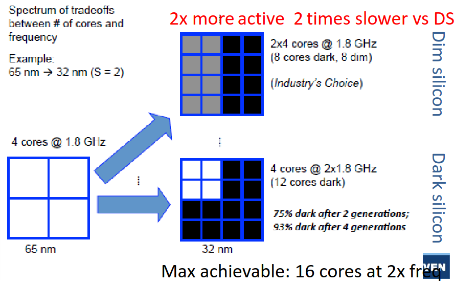{ width=50% }

Recently, we are using more and more dark silicon as accelerators that get turned on for specific task -- accelerators.

## Area for energy in single-core

To make a processor faster, we can use either:

- *Instruction-level parallelism*: VLIW, OOO super-scalar
- *Data-level parallelism*: SIMD, GPU

> Won't re-explain what those are, check the computer architecture lecture: [*link*](https://github.com/Tfloow/ESATSummary/raw/main/PDF/M1S2_Computer_Architecture.pdf)

Those are prime examples of dim silicon with lower clock speed for same throughput thanks to parallelism.

There is also the vector extension that can be seen as a sort of *temporal* data parallelism. SIMD, VLIW and other processing is often found in DSP chip since such processing is often data intensive.

### Super-scalar

In this version, it is out of order and the processor can schedule instructions when it wants. It uses the Tomasulo's algorithm but must commit in order to avoid data dependency issues.

The advantage of such processor is the flexibility of the operations. Typically, some execution stage can take more time than others. We must use a reorder buffer (ROB) to commit in order. This is a prime example of spending extra transistors instead of clocking faster. There is a certain overhead for controlling such processors but the gains are far superior.

### Memory area

Memory access time is the usual bottleneck in computing, a lot of time, the thread is blocked because it waits for data to arrive. Latency of cache and memory is quite important and to hide it we use multi-threading with some level of granularity to keep all cores as busy as possible.

We can't use too much of simultaneous multithreading SMT because the overhead is quite important. Need each time a program counter, register file and a reorder per thread. On top of that, the commit and scoreboard is more complex.

This is why we use various cache level and we exchange latency with transistors count. A recent trend is using large reorder buffer to see well in advance and to re-order online the instructions. This will increase parallelism and reduce off-chip memory accesses.

## Area for energy through multi-core

Sadly, this is not enough and *Amdahl's law* explain that parallelism will not always lead to a speedup and lots of applications are not easily parallelizable.

### Homogenous

We first started by doing `ctrl+c` and `ctrl+v` on the cores to realize a speedup. On top of that, we would some p-state (dim silicon) or shut it down completely (dark silicon) if not used.

### Heterogeneous

Here, we will have dedicated low-power cores that can realize operations if low performance is needed. Depending on the workload, we can switch to efficiency core or performance core. This is present in the **big.LITTLE** ARM architecture. We must use the same instruction set to seamlessly transfer from one core to the other.

This idea is heavily used in embedded devices like smartphone and is starting to make its way through in personal computer, typically Apple's computer.

## Area for energy through domain specific accelerators (DSA)

We are now facing the utilization wall. More and more silicon must be dim or dark, we must use the extra transistors for something. Here comes accelerators which are custom ASIC blocks for specific function.

# Lecture 2: ISP's, GPU's and AI Workloads

## ISP’s & GPU’s for graphics/images

### ISP applications, architecture and operation

To take a picture, many steps are required: calibration, RGB conversion, encoding, post-processing, ... Image Signal Processor is one of the earliest example of ASIC. The operations are fixed and easily paralleziable. 

Initially, it was mostly hardwired but more recently introduction of more flexibility. It gained popularity in commercially available ISP as people demanded more from their smartphones and cameras.

#### IPU

This is becoming more and more like an Image Processing Unit where we want the best of both world:

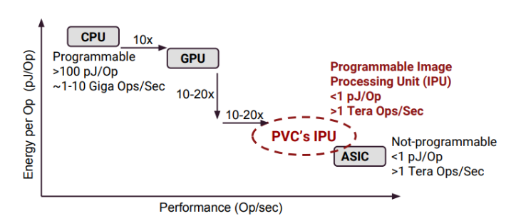{ width=50% }

This is the idea introduced in the google pixel family with their Pixel Visual Core that allows data processing alongside the CPU. They use multiple small ASIP and use their locality on the die to exchange information between each other. It is a fast paced processing where data is consumed and sent to the next processor.

They arange multiple Processing Elements (PE) next to each other and hardwired them all together. They are composed of ALU's and MAC units and can be programmed and sent to the next PE. The dawn of NPU...

In short, the goal is to exploit **parallelism** and functional pipelining. We try to provide more programmability without losing in efficiency.

### GPU applications, architecture and operation

> Repeat of Computer Architecture, [Summary here](https://github.com/Tfloow/ESATSummary/raw/main/PDF/M1S2_Computer_Architecture.pdf).

#### Mobile

Here we will try to maximize throughput under power and area limitation. We will also use extensively lower precision data types that can relieve stress and increase throughput while minimizing its impact on the output quality.

We will more and more see tight integration with the CPU and GPU with shared coherent memory space. More and more programmability with CUDA or openCL. Anything that can be parallelized is interesting to run on a GPU.

## Deep learning algorithms

> **Definition of AI**
>
> Any program that mimics human intelligence. A program that can sense, reason, act and adapt

### What is deep learning?

- **Machine learning**: is a subset of AI and it is an *algorithm that is able to learn from data*.
  - **Deep learning**: a representational machine-learning using multi-layered neural networks (NN)

The idea of a deep-learning network is one that has many layers and the computer truly learns on its own without much human interaction or tuning. It learns its own representation of the world or task he must accomplish.

### From neural nets to deep neural nets

A basic neural network is composed of many **nodes** which forms a **layer**. They are often *fully-connected* to the next layer. The NN will adjust its weight based on algorithm during the training phase. Weight represents how much the information of one node will be forwarded to the next one. The AI can also tweak the **bias** to adjust its performance. Finally, to reduce the "*fuzziness*" we use some **activation functions**.

$$o_n^l = \sigma \left( \sum_{m} w_{m,n}^l \cdot o_m^{l-1} + b_n^l\right)$$

| Name       | Function                              | Good in math | Easy in HW |
| :--------- | :------------------------------------ | -----------: | ---------: |
| Sigmoid    | $\frac{1}{1+e^{-x}}$                  |        **V** |      **X** |
| Tanh       | $tanh(x)$                             |        **V** |      **X** |
| ReLU       | $max(0,x)$                            |        **X** |      **V** |
| Leaky ReLU | $max(0.1x,x)$                         |        **X** |      **V** |
| Maxout     | $max(w_1^T x + b_1, w_2^Tx+b_2)$      |        **X** |      **V** |
| ELU        | $x\geqslant0;x$ else $\alpha (e^x-1)$ |        **X** |      **V** |
:Various $\sigma$ activation function

By using labeled data, we can train the AI to accomplish a task. Using the AI to do for example pattern recognition is called *inference*.

### Classes of deep neural networks:

#### DNN

In the simple example of NN, we had a vector as an input. But, we can also have an image (matrix) as the input which we can apply the same pattern. This time, we will use a matrix notation to realize 2D-2D operations; a fully connected layer looks like:

$$o_{nx,ny}^l = \sigma \left( \sum_{mx,my}^{M,M} w_{mx,my,nx,ny}^l \cdot o_{mx,my}^{l-1} + b_n^l\right)$$

The matrices are quite large and this can be detrimental sometimes as one result is based on the full image.

#### CNN

We are no longer fully connected, it is a sparse matrix. It has better convergence and faster training.

$$o_{nx,ny}^l = \sigma \left( \sum_{fx,fy}^{FX,FY} w_{kx,ky}^l \cdot o_{xn+kx,ny+ky}^{l-1} + b_n^l\right)$$

This will avoid to have a $M$ matrix but rather a small kernel that is sliding over the matrix and of size $Fx \cdot Fy$. We can go further and perform some tensor kernel to apply the same or different kernel on multiple inputs. Each inputs can influence the same output. A kernel is of size $Fx\cdot Fy\cdot C$.

$$o_{nx,ny,k}^l = \sigma \left( \sum_{fx,fy,c}^{FX,FY,C} w_{kx,ky,c}^l \cdot o_{xn+kx,ny+ky,c}^{l-1} + b_n^l\right)$$

This operation requires 7 nested for loops. Bad news for software engineer, good news for hardware engineer has it opens the door for massive parallelism.

To avoid the size to get too big, we often finish by a **Pool and normalization** layer to "compress" the info. Finally we inject it in a classic fully connected NN to output a scalar result.

There are many architectures and flavor of CNN, each with their pros and cons, trying to solve different problems.

**DO THE DEPTHWISE POINTWISE CONV EXPLANATION**

#### Transformer and LLM

The secret sauce of current LLM's is the use of the **attention** mechanism. It is an algorithmic representation of linguistic property of words and sentences. It will connect words between each other regarding the context which allows to not only process one word but also its context surrounding it. The maximum path length is only $\mathcal{O}(n)$ as the information is already embedded in the word after the attention process.

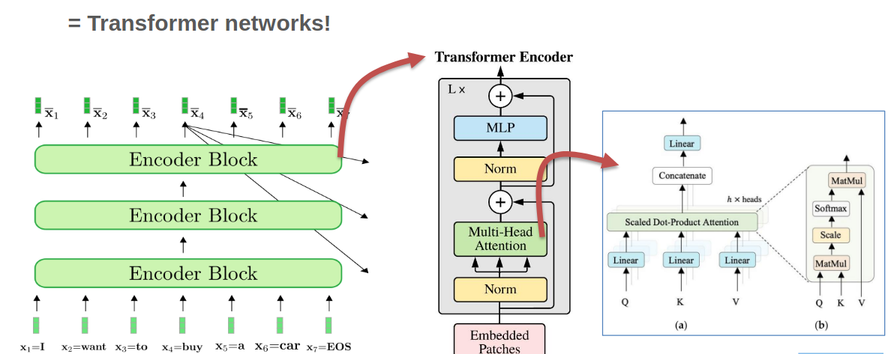{ width=75% }

The query is for one word we want to inspect, the keys are the result of the query. This form a linear transformation which will tweak the high-dimensional embedding space to "distort" and bring words that are alike closer together. Finally we use the value matrix that will realize a linear transformation to help and find the next most probable word.

$$
softmax(\frac{\underbar{x} Q_w * XK_w^T}{\sqrt{100}}) * XV_w
$$

Multiplication can be quite annoying but with efficient hardware, it can be accelerated. The real bummer here is the $softmax$ function:

$$
softmax = \frac{e^{x_i}}{\sum_{j=1}^K e^{x_i}}
$$

Where $x_i$ are values. The issue is that it can only be computed after processing all of the data. It is also a non-linear function that cannot be realized in one single pass. This means that we must re-access value from the cache which is slow and **not** energy efficient. Same story for the $norm = \frac{value_{original} - \mu}{\sigma}$.

After doing this pre-fill and encoding, we want to generate some new tokens. This is handled by the decoder block.

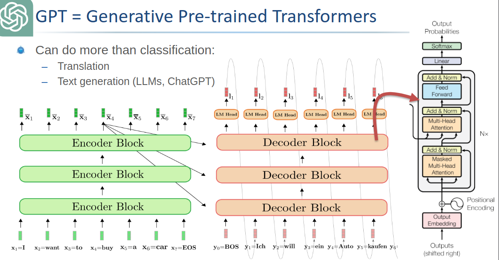{ width=75% }

Those matrix multiplications are quite repetitive, we can thus save the result in what we call **KV cache**. We only append the new token and perform some vector matrix computation instead of the full matrix matrix computation. 

- Prefill: compute limited
- Decode: memory limited

On a side note, most LLM's are now *decoder-only* but we still have this prefill stage.

# Lecture 3: Efficient Deep Inference: Hardware Bottlenecks & Parallelization

## Baseline and hardware challenges

The two main efficiency metrics are:

- Latency: time per inference, time to get the first token
- Throughput: inferences per second

We often represent operations per second as TOPs - $10^{12}$ operations per second. When batching (running multiple queries at once) we gain in efficiency and it provides better throughput as we can reuse the weight of layers loaded in RAM for other users at the same time.

We also look at the energy and power. Where, TOPs/W (or TOP/J) matters  depending of the scenario (cooling, embedded, infrastructure, ... constrained)

With Moore's law, we should get twice the efficiency roughly every 2 years. The issue is that AI's complexity is getting more and more complex at a higher rate leading to a massive gap between computation abilities and needs. 

We can fight at multiple font:

- TP/Latency: $time/op \cdot 1/utilization \cdot ops/inf$
- Energy: $energy/op \cdot 1/utilization \cdot ops/inf$

### Metrics for execution efficiency

Matrix multiplications are needed in prefill stage. We call this operation a General Matrix Multiplication or GeMM. This type of optimized operations are implemented in the BLAS library that ensure fast and smart computation. A CPU has small **Processing Element (PE)** with specific datapath to accelerate such calculations.

The main drawback is the recurrent movements of data from on-chip to off-chip. A typical NPU will try to optimize those steps. Sadly, we will hit the memory wall which will lead to unavoidable latency and energy constraints. 

One solution is to use lower precision operations to reduce the energy cost. Thankfully, energy savings is linear with the precision but the quality of the LLM isn't, especially if we use smart algorithm.

### A tale of two rooflines

The roofline diagram we are familiar with is the $AI-TOPs$ one. Where we plot the Arithmetic Intensity as Operations per bytes of memory access. We have one horizontal line where there is the maximum compute in TOPs $N_{op}$ and a diagonal line that is $AI\cdot BW$ depicting the bottleneck of the memory access. The ideal operating point is where those two line crosses as we are using the maximum of memory and compute. Otherwise the maximum attainable performance is $min(AI\cdot BW, N_{op})$.

But we can also have the **energy roofline**. We wil have the horizontal line being the minimum for an operation (without the transfer and other operations) and the the energy per DRAM access that is $AI/E_{DRAM}$ access. We have the attainable efficiency as

$$
\text{Attainable efficiency} = \frac{1}{E_{comp} + E_{mem}/AI}
$$

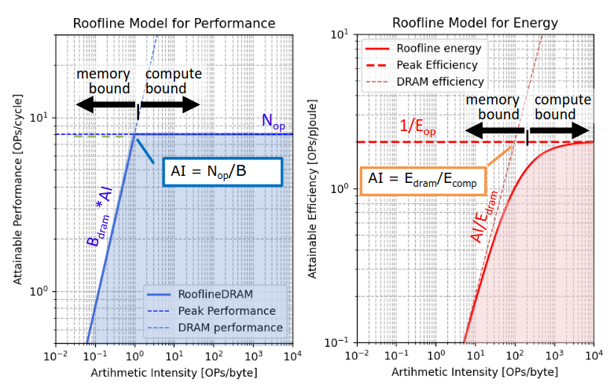{ width=70% }

We can see that the optimal performance point may not be the most energy efficient one! It all depends on our goals and seeing the large scale AI infrastructure we prefer to be slightly compute bound to avoid excess energy overhead.

## xPU processor enhancements for AI

As explained earlier, the extra transistors we are gaining thanks to Moore's law need to be used to something. That's why we choose to do specific ASICS block or xPU. They all rely on one of the 5 tricks explained in the coming subsections.

Every trick here will try to push some limits (AI, BW, ...) to further improve the performances.

### Parallelization (spatial unrolling optimization)

#### Parallelization in CPU and GPU cores

Sadly, simply parallelizing work won't reduce the AI or increase it. We need to also push the peak performance or else no gain.

This is why we are interested in SIMD (parallel MAC in FP), Super-scalar (parallel load/store and compute) and also multi-core parallelism.

A good solution that is often employed is **fused multiply add** to avoid the extra load/store. Multiple inputs for one output, we almost divide memory access by 2.

Basic GPU's do not have this fused MAC in the classic CUDA cores, only massive parallelized MAC.

#### Advanced spatial data reuse in NPU's & Tensor Cores

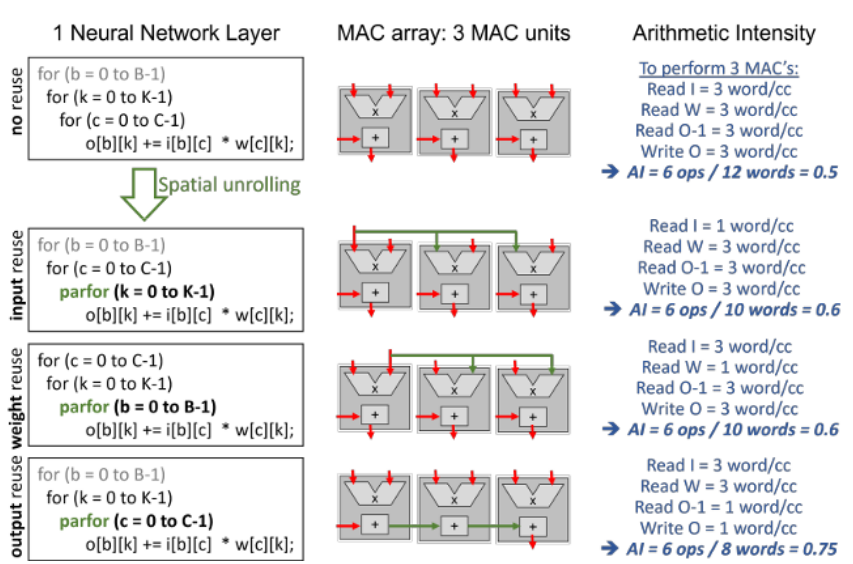{ width=70% }

Of course, if we could unroll and reuse everything it would be ideal but the values are getting quickly out of hand. For example, with $B=9;C=4;K=8$ where $B \times C$ and $C \times K$ are the inputs and weights dimensions respectfully. We thus need $B \cdot C \cdot K = 288$ MAC to do all the computations all at once. For the amount of access we have $K\cdot C + B \cdot C + B \cdot K= 8\cdot 4 + 9\cdot 4 + 9\cdot 8=$.

But we can't have such high number of mac even for those simple architectures. We often have only $100-1000$'s MAC in an accelerator. We will smartly fold convolutions on multiplier array. The main optimization criterion will be to optimize towards minimal memory access.

A good way is to mix spatial and temporal unrolling. For example do sub-vector sub-vector multiplication. The compiler can also optimize the loops and re-organize (tiling, ...), this is **dataflow optimization**.

```c
for (b = 0 to B-1); // for each image in the batch
  for (k = 0 to K-1); // for each output channel
    for (c = 0 to C-1); // for each input channel
      o[b][k] += i[b][c] * w[c][k];

// Compiler optimization - tiling + spatial optimization
for (b2 = 0 to B/S-1); // for each image in the batch
  for (k = 0 to K-1); // for each output channel
    for (c = 0 to C-1); // for each input channel
      parfor (b1 = 0 to S-1); // for each image in the batch
        o[b2*S+b1][k] += i[b2*S+b1][c] * w[c][k];
```

In this code example, we are dong *weight reuse* as we the weight are reused (the indices are not impacted by a parfor loop so only 1 will be loaded at a time). If we insert the parfor in any other lines we will do some input or output reuse.


| &nbsp;    | Weight reuse | Input reuse | Output reuse $\rightarrow$ FMA |
| :-------- | :----------: | :---------: | :----------------------------: |
| Weight BW |     $1$      |     $S$     |              $S$               |
| Input BW  |     $S$      |     $1$     |              $S$               |
| Output BW |    $S+S$     |    $S+S$    |             $1+1$              |
| AI        | $2S/(3S+1)$  | $2S/(3S+1)$ |          $2S/(2S+2)$           |
:Comparison of techniques, $S=$ spatial reuse factor 

#### State of the Art examples

The real magic sauce of NVIDIA is their tensor cores. The major speed up comes from complex instructions such as HMMA and IMMA (Matrix Multiply Accumulate). It allows us to work with tensor and realize such operation efficiently. According to NVIDIA, such operation only has a $16-22$% of overheard compared with scalar or vector mac which can have up to $2000$% of overhead.

Most of tensor cores in a NVIDIA chip are quite "small" they realize operation on 4x4 tiles to increase utilization.

For a 4x4 we have 128 operations and 16 input, weight access and 16 output read and access totaling at 64 memory access. The arithmetic intensity is $128/64 = 2$. Of course, we have to do tiling for bigger matrices, the code can look like:

```c
for (b2 = 0 to B/PB-1);
  for (k2 = 0 to K/PK-1);
    for (c2 = 0 to C/PC-1);
      parfor (c1 = 0 to PC-1);
      parfor (k1 = 0 to PK-1);
      parfor (b1 = 0 to PB-1);
        o[b2*PB+b1][k2*PK+k1] += i[b2*P+b1][c]*w[c][k2*PK+k1];
```

Tensor cores give a 10x boost to operations. Other improvements are such as larger kernel, support for other data type. Flexibility and shared architecture for FP16 and INT4.

#### Tesla NPU

Instead of a 3D approach, they do a classic GeMM operation:

```c
for (c = 0 to C-1);
  parfor (k = 0 to 95);
  parfor (b = 0 to 95);
    o[b][k] += i[b][c] * w[c] [k];
```

We must have a large bandwidth to process all of this together. This is quite large and only a vertical company can choose this solution. Since NVIDIA must support multiple form of workload, they cannot bet that everyone will use 96x96 matrix multiplication but Tesla can make this and reduce underutilization.

#### Huawei DaVinci

```c
for (b1 = 0 to B/16-1); //for each image/pixel in the batch
  for (k1 = 0 to K/16-1); //for each output channel
    for (c1 = 0 to C/16-1); //for each input channel
      parfor (b2 = 0 to 15); //for each image in the batch
      parfor (k2 = 0 to 15); //for each output channel
      parfor (c2 = 0 to 15); //for each input channel
        o[b][k]+= i[b][c] * w[k][c];
```

But which is better for 1024 MAC's ? 2D or 3D ?

- 2D: we will have to re-access 32x32 output making the total access cost $32+32+2*32*32$ For $2*1024$ which results in a total AI of $2048/(2*32+2*1024) \approx 1$.
- 3D: we will have 8x8x16 MACs with $2(8*16)+2*(8*8)$ memory access for the same amount of operations leading to $2048/(2*128 + 2*64) \approx 5.4$.

In this case 3D is much better, but is it always ?

#### Multi-core parallelism

Use the `parfor` loops at a higher level not just the datapath! We must communicate between core and split data among core until gathering all the results. It is **sharding**.

```c
parfor (b = 0 to B-1); // Unrolling at the multi-core level
  for (k = 0 to K-1);
    parfor (c = 0 to C-1);
    o[b][k] += i[b][c] * w[c][k]; // Spatial unrolling at the core level
```

| Options              |               Input                |          Weight           |                Output                 |                                                               Comment                                                               |
| :------------------- | :--------------------------------: | :-----------------------: | :-----------------------------------: | :---------------------------------------------------------------------------------------------------------------------------------: |
| Data parallelism     | User data split on different GPU's |        Replicated         |          No gathering needed          |                                   Everything is working in parallel no need to gather at the end                                    |
| Tensor parallelism   |     Replicate the input across     |  Distributed (row-wise)   |               Gathering               |                          We slice the tensor and each GPU's realize part of the MMA and then recombine all                          |
| Tensor parallelism   |     Replicate the input across     | Distributed (column-wise) |               Gathering               |                                         Like tensor parallelism but in the other dimension                                          |
| Pipeline parallelism |   All input go to the same GPU's   |  Set of weight per GPU's  | Output are grouped together (unicast) | We distribute the weights across GPU's, can lead to underutilization as not every layer needs this much operation compared to other |
:Distributing and parallelizing 

There is not just one perfect technique, most of the time, we must combine different techniques depending on our need, architecture, FoM, ...

SambaNova startup is also believing in parallelism with intelligent on chip data routing for efficient distribution of computations.

At the end, we all try to raise the roof and tend to higher arithmetic intensity to gain in computing power.

# Lecture 5: Efficient Deep Inference: Quantization

Using quantization will result into better roof as we can push the throughput further with low-accuracy operation using the same hardware. Instead of using full precision `FP32`, we can use lower bit precision as 4-bit, 1-bit, ... Lower order precision is often computed in `int`

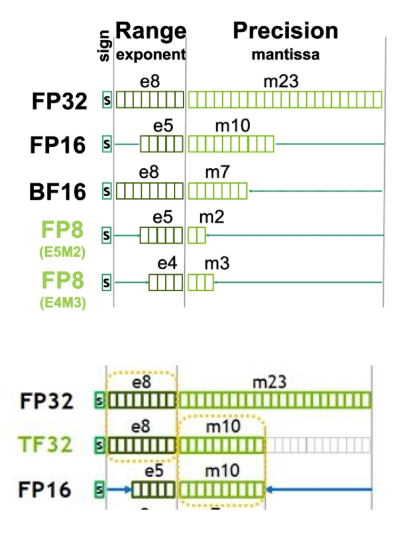{width=40%}

The `TF32` format is used inside Nvidia's card in memory. It is not a real 32 bit float. They use this format as doing fp32 fp32 operation will unavoidably lead to trimming and rounding errors.

## Block quantization 

We can group exponent together and then use the mantissa for the operation. It is a form of **dynamic** fixed point arithmetic. The exponent is fixed and the mantissa can still vary. This allow for smart operation that can re-use previously computed results.

We can push this idea further by trying to group more than just the same components together. We can group multiple numbers under the same scale. This is the basic idea behind int quantization:

$$
w_{quant} = quant(S_q \cdot (w-O_q))
$$

We must add an offset $O_q$ in the case the distribution is not symmetric.


| Format Name | Block Size | Scale Data | Scale bits | Element data format | Element bit-width |
| :---------- | :--------: | :--------: | :--------: | :-----------------: | :---------------: |
| MXFP8       |     32     |    E8MO    |     8      |  FP8 (E4M3 / E5M2)  |         8         |
| MXFP        |     32     |    E8MO    |     8      |  FP (E2M3 / E3M2)   |         6         |
| MXFP4       |     32     |    E8MO    |     8      |     FP4 (E2M1)      |         4         |
| MXINT       |     32     |    E8MO    |     8      |        INT8         |         8         |
:The MX-compliant data types

### PQT and QAT

The cheapest way to implement quantization is to do some **Post-training quantization**. After training, an expensive and time consuming step, we apply the quantization on the weights. We need some calibration data to make sure the quantization will not impact negatively the model.

On the other hand, **Quantization aware training** is ran at training. We quantize on the fly and and finetune with the training data. This is often better but more costly especially with LLM's.

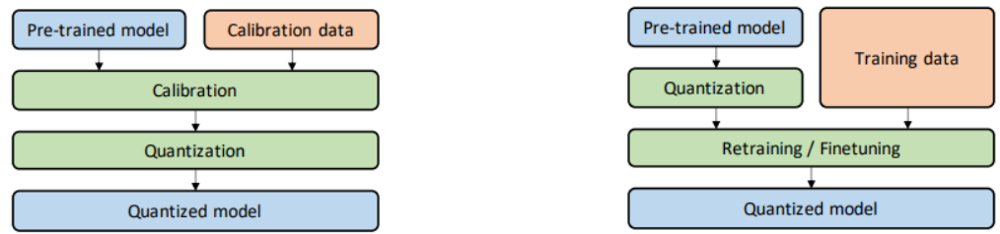{width=60%}

### Mixed precision NN

In the same idea as quantization per group, we can apply different quantization order in the neural network. During the training, all possibilities exist and then model will adapt the $\pi$ transfer function. Finally certain layers will prefer different quantization order than other.

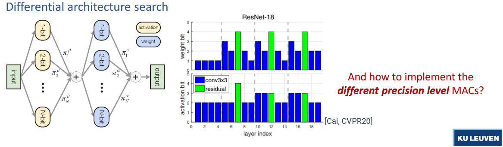{width=50%}

## Variable precision `int` MAC's

All of this is cool and interesting but if we can't reuse hardware or do something a bit smarter, we cannot leverage from those algorithmic technique in real life. This is where versatile MAC arrays come into play.

### Data gating

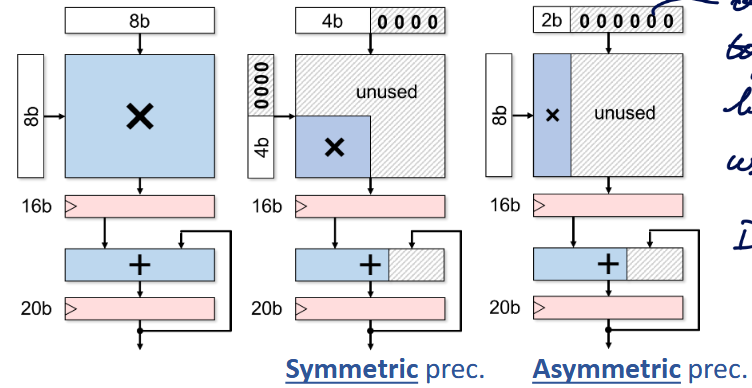{width=50%}

It is a relatively naive idea and will let lots of space unused ! We gate the LSB's to avoid unnecessary toggling and reduce energy consumption.

### Multi-gating

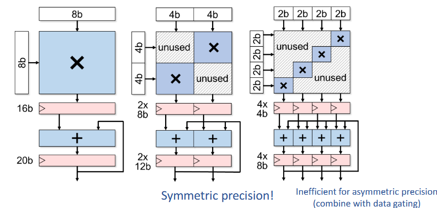{width=50%}

This can only be done for **symmetric** operations as asymmetric is quite inefficient. Interestingly, the more sub-word we have, the larger are the registers getting. It is not depicted in the figures, but we must also ensure some gating of the signal to avoid carry propagation between each sub word.

### Add/shift-gating

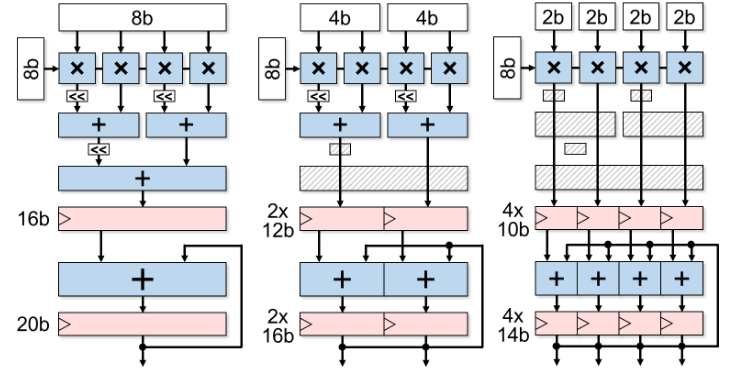{width=50%}

This method is suitable for asymmetric operations. We operate on sub-unit and combine the results as required. This method presents a finite granularity and the more range we want to support the more adder need to be chained hurting the critical path.

### Bit-serial way

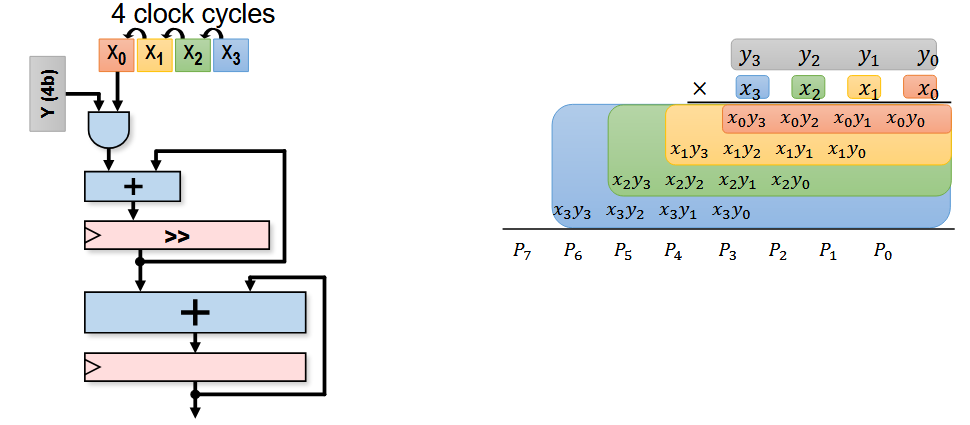{width=50%}

We chain operations depending on the width and adjust the clock cycle.

### Comparing

At full precision, data-gating is the best as there is little to no extra hardware or register toggling. But if we look at a reduced precision bit-serial and add-shift have the best energy usage and the best hardware usage.

### From MAC to array level

For fair comparaison, we should compare at the MAC array as it presents many data sharing opportunities.

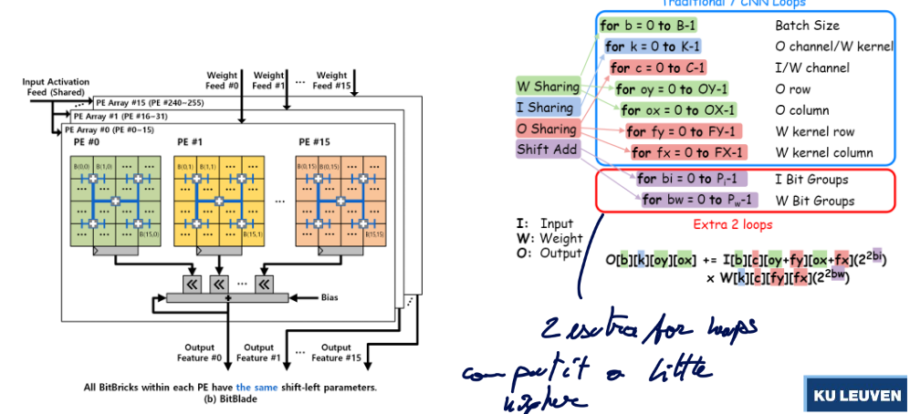{width=50%}

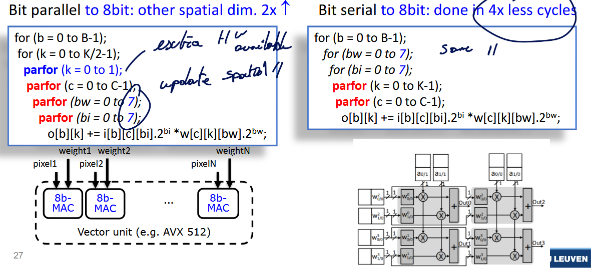{width=50%}

## SoTA example of Quantization

### Envision (KU Leuven)

It is a mult-gating approach with precision scalability. There are 256 MACS in a 16 by 16 array.

```c
for (c = 0 to C-1);
  parfor (k = 0 to 15);
    parfor (b = 0 to 15);
      o[b][k] = i[b][c]*w[c][k]

// Can also be acting 512 MAC units and so on...
for (c = 0 to C-1);
  parfor (k = 0 to 15);
    parfor (b = 0 to 31);
      parfor (bw = 0 to 7);
        parfor (bi = 0 to 7);
```

This was successfully taped out and tested. They managed to adapt the supply voltage to gain even more in power efficiency.

### Tensor Cores (Nvidia)

Same ideas occurs here where we can sort of extend the tensor in multiple dimensions if operating different datatype.

### Hybrid training / inference chip in 7nm (IBM)

IBM has been pushing for lower and lower order of quantization. Proposing special structure for LLM inferences. They have some multi-precision compute array MPE with 16-way hybrid FP8 and 8-way FP16 engine in it. They do the same for int4 and int2 but they separate fp and int as they witnessed a significant energy saving and slight area reduction.

### Binareye - digital and MS (KU Leuven & Stanford)

This extreme 1-bit quantization where we can use XOR gate to compute the multiplication. This is highly efficient in area and energy. The main drawback is the gathering of all those results which constitute the main bottleneck of this architecture. 

The results were quite impressive for such low-order operations. This opens the possibility to run lightweight model on very efficient hardware.

We have really good weight stationary and we keep feeding input in parallel. We break down the input into Fx*Fy and repeat the feeding process for x*y cycles.

```c
for (k2 = 0 to K/64-1); //for each output channel
  for (x = 0 to X-1); //for each in/output column
    for (y = 0 to Y-1); //for each in/output row
      parfor (c = 0 to 255); //for each input channel
      parfor (fx = 0 to 2) ; //for each kernel row
      parfor (fy = 0 to 2) ; //for each kernel column
      parfor (k1 = 0 to 63); //for each output channel
      o[b][k1+64.k2][x][y]+= i[b][c][x+fx][y+fy]
      * w[k1+64.k2][c][fx][fy];
```

#### Reducing the gathering bottleneck

We can replace those large neurons array by a Mixed Signal approach that is composed of a switched-cap adder (sorts of ADC).

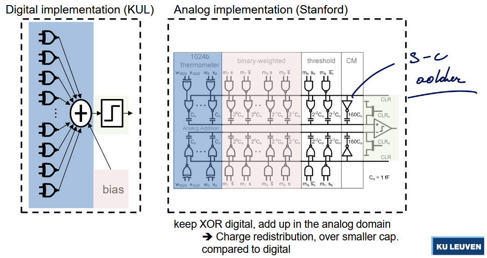{width=50%}

This presented multiple issues:

- Variations of cap: using cap is better than a resistor ladder, ... but high variation could make accuracy plummet
- Noise: again sufficient margin must be taken and extra technique should be employed to reduce impact of the noise
- Comparator offset: this can be quite detrimental but at least we can calibrate this effect reducing its impact

Even with this, the results are still stochastic around the perfect digital model. The energy used by the neuron array is reduced by a factor 12.

## In memory compute

### Concept

Instead of transferring all the time the data from memory, bring the computation in memory. The idea is to use the bitcell and use the selection line as the input and the weight are saved in the bitcell (weight stationary). So the data lines are actually the output lines. 

By measuring the amount of discharge, we could be able to compute the result and digitize it.

### Analog IMC

This seems like a good idea on paper but the amount of extra hardware around is important. We need to use DAC to convert the inputs in analog domain, sum up the current and digitize it with ADC. Finally some post process can be applied (ReLu, ...)

Typically spatially unroll C*FX*FY in vertical direction. Unroll K in horizontal direction, B,X,Y temporal

#### Input pulse width

Use bit width pulses to discharge a certain amount each time.

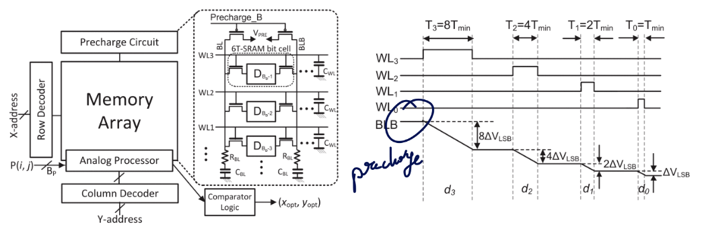{width=50%}

We have superposition of binary weighted bitline discharges across multiple rows. Essentially a MAC operation with digital inputs and analog output. The inputs are now digital.

Quite nonlinear & random, difficult to manage large mismatches between SRAM cells

#### Input pulse count

Here, all the pulses are the same, the only difference is the amount of pulse. Current-based addition still present large bitline non-linearity. This can be adapted using some non-linear modeling to counter-act it.

Both techniques use memory element as *current-source like* and the summation is realized with precharge-discharge cycle.

#### Voltage

We use a regular resistance with ReRAM (or Flash) cell. We make resistive weighted sum.

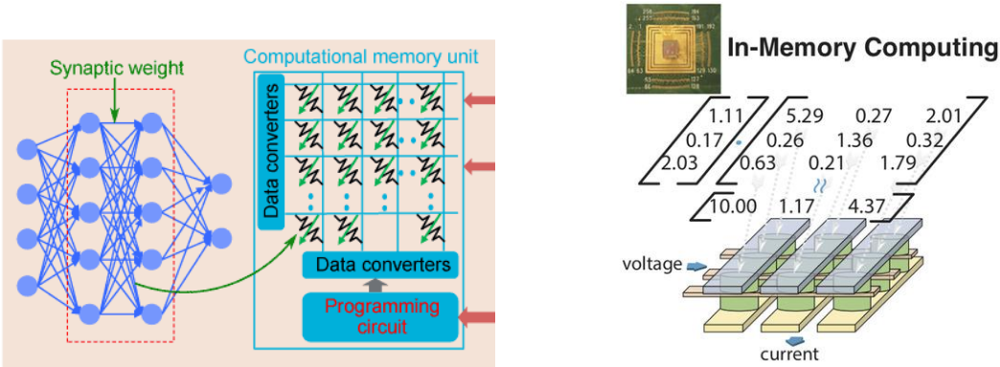{width=50%}

This is kinda like the PE unit of google where we could save full the weight and directly route on the chip the data to go through multiple layers.

- THE GOODS:
  - Analog in-memory compute allows extreme input and output reuse
    - Due to compact memory (multiplier cell & added) & large arrays
  - Analog in-memory compute enables extreme weight stationarity
    - Program weights once, and leave them there forever?
    - If weight reloading is rare (needs large arrays, or small networks…)
      - Throughput/area increase (dense computing)
      - The larger is the memory the higher is the benefit. But not every NN will be this large to actually witness any gains.
- THE BADS:
  1. Can all NN layers exploit large arrays? $\rightarrow$ underutilization!
  2. Only precise at low quantization level? $\rightarrow$ Chip-specific training? Accuracy loss?

### Digital IMC

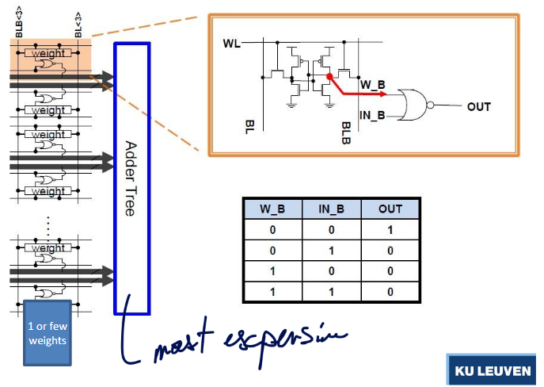{width=40%}

We digitize the 1*1 bit results and accumulation is done digitally. This adder tree is now the bottleneck. 1 weight per adder or weight bank. Here, results are deterministic which is  better suited for the industry. 

For example, TSMC provides special node for this kind of IMC. They share multiplier across 4 weights, it's not really IMC in the strict sense.

More freedom:

- Type of memory cell (now SRAM)
- Number of bitcells (weights) per multiplier $\rightarrow$ local data reuse (higher level stationarity)
- Number of cells per core (=size adder tree), or reconfigurable?
- Number of cores
- Data sharing between cores

Benefits of analog in memory compute still hold (but less!)

- In-memory compute allows extreme input and output parallelism (reuse)
- In-memory compute enables extreme weight stationarity

Compared to analog:

- More flexible (reconfiguration of data reuse in function of layer topology?)
- More reliable (precision guaranteed)
- But… less dense (Tops/mm2 lower)
- But… less efficient (Tops/Watt lower (at core level, not at system level?))

# Lecture 6: Efficient deep inference: Sparsity, Scheduling, Fusion

## Exploit sparsity

### What is sparsity? Types of sparsity?

Not all NN are fully-connected NN. Thus, not all inputs go to every single nodes which result in matrices with empty spot. This is what we call **sparsity**. But not only the architecture affect sparsity but also: quantization (small values get rounded to 0) and explicit training rules (think about $ReLU$ function).

From this 3 types of sparsity emerges:

| Type                    | Description                                              |                Advantages                |
| :---------------------- | :------------------------------------------------------- | :--------------------------------------: |
| **Unstructured**        | Weights are distributed at random                        | Easy for software ppl, hard for hardware |
| **Structured**          | Weights are pack in sparsity block                       | Easy for hardware ppl, hard for software |
| **Density block bound** | A ratio of weight/elements can be garante per row/column |              middle ground               |

#### At training

It is possible to only retain the dominant weights (can have some applications in specific AI cases). We add an optimization constraint which will also improve training efficiency:

$$
\min_{\beta \in \mathbb{R}^p} ||y-X\beta||_2^2 + g||\beta||_1
$$

Unstructured sparsity showed often better result but it is possible to obtain acceptable results with DBB sparsity. Sadly, the more recent models are less sparse since they are more complex and features are not easily detectible as it used to be in Resnet and other models.

### Exploiting sparsity in memory size/access

The goal here is to avoid useless 0 data as it will hinder the bandwidth. Many encoding schemes exist depending on the sparsity (Compressed sparse row, bitmap, ...)

Using structured sparsity, it is much easier to setup a mask/index matrix and to efficiently store and deploy. With DBB sparsity, we need as many numbers as non-zero data BUT the matrix is regular contrary to unstructured data which can be challenging in modern libraries such as `Numpy` which only accepts regular matrices.

#### Envision processor

They use some Huffman encoding inside the DRAM and DMA (huffman tree), it will analyze and find the useless operation to reduce data transfer.

### Exploiting sparsity in processing

As seen previously, GPU relies on the fact we can stream lots of data in parallel and do the same operation. But having non-rigorous data may compromised the benefit of GPU.

Sparse `BLAS` libraries exist but need huge sparsity to have any benefits.

#### Envision processor

On top of the memory flag to guard read as introduced previously, we re-use this flag to guard MAC execution. It only improves the power consumption but doesn't improve speed or throughput!

#### Sparse CNN engine

There is some specific hardware tailored for such operation. It stores inputs and weights compressed and schedule **dynamically** the operations. This require an extensive control on operation and scheduler.

Does perform better than Envision at low sparsity $<60\%$ due to the massive overhead. But this proves, dedicated hardware yield significant benefits!

#### Systolic array

Using DBB, we can have a dedicated X MAC array per block which will be sure to have some operation to do at all time. We have the same throughput for less MAC.

#### CUDA

On `CUDA`, there is now (Ampere) the `cuSPARSELt` library that assumes 2:4 DBB. It will force in a mux 4 operands by using non-zero indices MUX. At a perfect 50% sparsity we can almost double the operations! 

## Operator fusion / scheduling

It is important to understand the advantages and limitations of algorithms and hardware to better design them.

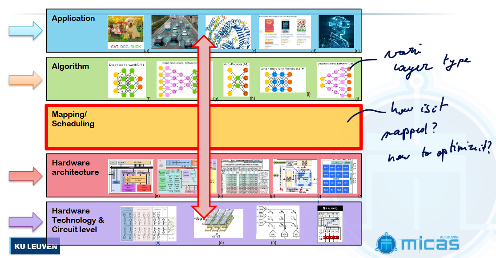{ width=50% }

### Single core / single layer

Besides the usual `for`-`parfor` as seen previously, we can leverage from various level of cache to hide the latency of accessing memory.

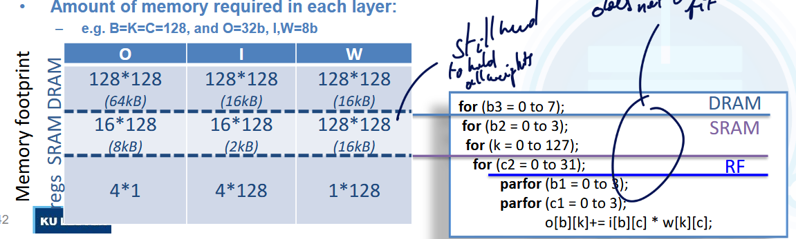{ width=50% }

A good and simple algorithm for scheduling and putting the right boundaries is to:

- If we have not enough memory a level x
  - Drop upper memory boundary
  - Cache size related
- Too many memory accesses of level x
  - Increase lower memory boundary
  - AI mem accesses/clock cycle

#### Automated performance estimation

We can also think about possible automated tools that can find the best architecture for a given algorithm. The best is to build an *analytical performance model* that do not need extensive compilations or simulations for each NN performance evaluation.

This is what ZigZag is solving where based on:

- NN workload
- Mapping
- Hardware architecture & constraints
- Technology characteristics

It builds a cost model.

### Single core / multi-layer

If we did our job well, we should have optimized single layer. But if we don't look at the interconnect between layers, we may miss potential benefits.

Typically in LLM, there is many linear layer, we could fuse the instructions together to reduce redundant architecture.

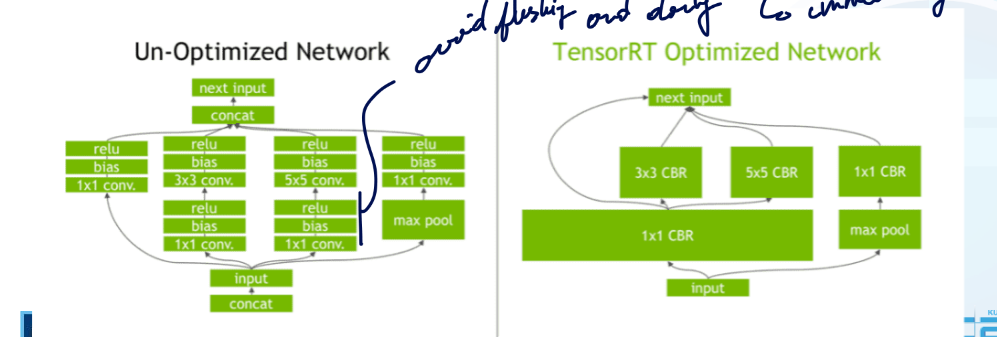{ width=50% }

As in threading, we can try to do some round-robin scheduling and have a divide and conquer approach. Instead of waiting for full output, we can start the next layer with partial output. But this is not possible for every architectures. 

Split operation is really interesting for memory constrained architecture where we must rely on tiling or other operations to obtain the outputs.

### Multi-core / multi-layer

#### Homogeneous

We simply duplicate the core multiple time. It is easily scalable and it gives some mapping flexibility. But only allows output re-use.

#### Heterogeneous - Diana chip

We have a distributed memory hierarchy with digital and analog cores. We can do pipelining and fusion with a small memory which allows for good performance and low shuffling of data.

It is flexible, maybe too flexible and requires tool to efficiently schedule (stream).

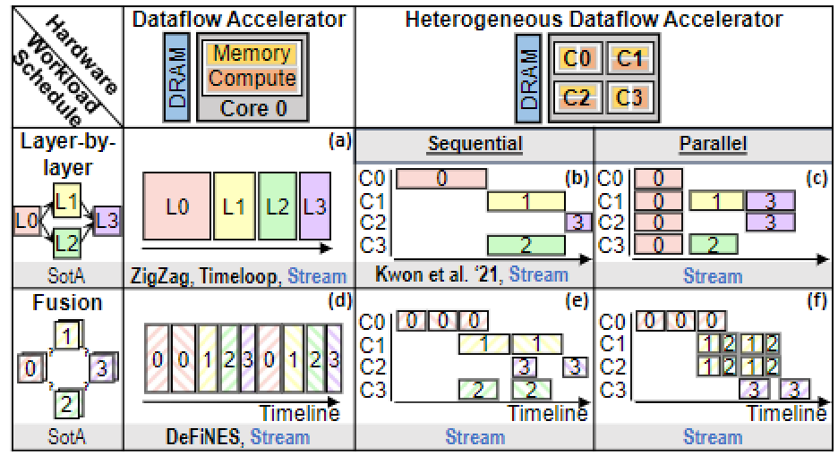{ width=50% }

# Lecture 7: Heterogeneous processor co-operation

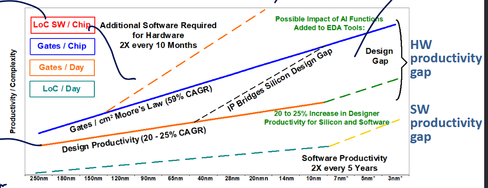{ width=50% }

We will be looking at how we can keep up in productivity.

## Improving design efficiency

### IP reuse

One of the first way to improve productivity is to reuse IP. This technique has been extensively used for the past few years topping at around 90% of IP reuse in a 2018 chip. There is also an Open-Source movement for hardware like RISC-V.

The goal of RISC-V is to standardized and build a common API for Software and Hardware engineers to work on. This will allow for compatibility, shared compiler and simulators, ...

RISC only provides the ISA **not** the full processor. It provides the format and set but also leaves room for variants and extensions. So, many flavours of processor exist each being tailored for a specific utilization.

### IP extension

It is important to make them easy to adapt. Meaning, we should avoid writing low-level Verilog code but instead use some Hardware Construction Language like Chisel (Scala). The best choice is to use some OOP (object oriented programming) to be able to deploy and parametrized new modules easily. 

With one object, we can produce many variants and insert it like we desire. From a dual issue to a quad issue, ...

#### Changing the ISA

On top of that, we can also support extra instructions not defined in the standard ISA. If we want to keep support with basic C-compiler we can only use the opcode `00010xx` or `01010xx`. For example, RI5CY allows for efficient hardware loop by introducing extra instruction.

AI-centered extension can be designed to support quantized values for efficient operations like in XpulpNN.

In XpulpNN, we provide some extra unit with multiplier designed to work at lower bit precision. We must start playing with VDD due to the modified critical path. The energy per operation is getting much better.

### IP integration

We can also do some "Frankenstein" cores by mixing and integrating them together. Using PULP, we can easily mix and match components.

## Improving deployment efficiency

The investement made for each new process node has a major software part. The hardware could help at hiding the complexity for software (choosing the right cores, ...)

### CPU-centric

By using multiple level of cores, we can tailor each of them for specific tasks and performance, maximizing their efficiency. This is like the Big.LITTLE architecture from ARM. Each core has the same ISA and can easily transfer workload from one core to the other.

We use a cache coherent interconnect so every cores have access to the same content at all time. Need some good cache coherency protocol such as bus snooping, MESI protocols, ...

To monitor the workload, we monitor the *running average* of the task state (is the core used or not), if it crosses a certain threshold it could be migrated (**up migration**). The **down migration** threshold is lower than the up migration to avoid constant workload migration.

| Architecture           |                                         Description                                         |                               Advantages |
| :--------------------- | :-----------------------------------------------------------------------------------------: | ---------------------------------------: |
| Core pairing           | We have a pair of big.LITTLE cores. Using DVFS (of core) we determine which core is active. |     Quite simple to program and migrate. |
| Global task scheduling | Every core can migrate to any other core. We again use DFVS (of threads) to monitor usage.  | Harder to monitor and dispatch the work. |
:Migration architecture

#### Scheduling

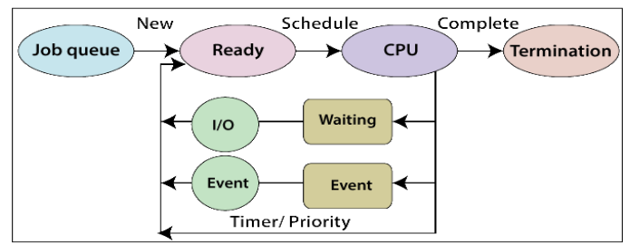{ width=50% }

Will try to maximize usage by looking at the state of the threads and checking if they are terminated. Scheduler is an art in itself and various level of hierarchy exist in schedulers.

But one key components is the need to synchronize them together to share data or commit data.

- data synchronization:
  - Avoid double access/parallel access. One thread locks the ressource, commit on it and release it. This ensures a chronological succession.
- event synchronization:
  - To make sure multiple thread end at the same time. Typically if we want to synchronize the output of a parallel function. We put a barrier to block on a loc.

Barriers can be realized in SW or HW! In SW, we have a lock that decrement the value and all thread must force a fresh read (no compiler optimization `volatile`) until the value of 0 is reached. This adds a lot of overhead and busy waiting.

In HW this can be solve with dedicated register such as the **Control Status Register**. It requires some special instruction (to make it atomic) but any core can access this CSR.

### Heterogeneous SoC's

It is still a field that is not mature yet and many architecture and design variants are proposed to overcome some shortcoming.

#### hUMA - heterogeneous Uniform Memory Access

We have only one shared memory (system) for CPU, GPU, ... We can also make it virtually shared so the OS does the heavy lifting. Avoid snooping since it will have a lot of traffic. Typically the M1 of Apple.

The DRAM is IN the package and unified which allows for drastic performance boost.

#### Shared ISA for CPU, GPU, TPU, ...

Not solved yet but many obstacles. We don't want to go back to a non-RISC set where we have too many instructions. But, we are looking at an *unified intermediate* representation. So could be easily mapable to any device and the hardware only needs to compile it once and dispatch on the fly.

This is still quite abstract. The backend for support on hardware still requires lots of improvements.

Every compilation target still needs own (custom written/optimized) “finalizer” (optimized kernel functions). Which is not easy to add new/own HW accelerators.

- Difficult (impossible) for tools to automatically allocate code to cores
  - Detect / optimize fused kernel opportunities, ...
- Difficult (impossible) for tools to automatically optimize schedulingacross cores
  - Detect / optimize parallelization opportunities, ...

Current vendors just have hardcoded kernel implementations, lots of work to do until reaching this shared ISA.

# Lecture 8

TODO


\newpage

# Paper to Read

## Lecture 1

> **Paper to read**
> 
> *Paper1*: A New Golden Age for Computer Architecture J. Hennessy AND D. Patterson
> 
> *Paper2*: Apple M1: Ditching x86 A. Frumusanu
>
> *Paper3*: Paper2: Apple M1 deep dive: Micro-architecture (pg2) Anandtech, Andrei Frumusanu; [*link related to the article*](https://www.tomshardware.com/news/apple-a14-cpu-details)

## Lecture 2

> **Paper to read**
>
> *Paper 1*: Attention is all you need sec. 1-5

## Lecture 3

> **Paper to read**
>
> *Paper 1*: How to keep pushing ML accelerator performance? Know your rooflines!

## Lecture 5

> **Paper to read**
>
> *Paper 1*: ENVISION: A 0.26-to-10TOPS/W Subword-Parallel Dynamic-Voltage-Accuracy-Frequency-Scalable Convolutional Neural Network Processor in 28nm FDSOI

# Questions

Access the online Google docs with this [link](https://docs.google.com/document/d/1-78EFv326HanFbBDpIHGobIe6YWkITXwQaS58lerUes/edit?usp=sharing).

## Lecture 1

1. *What is Dennard’s law and how is it linked to the evolution of computer architectures over the last 30 years? Describe the different phases we see in this evolution, and the architectural consequences. Illustrate this with examples from processors discussed in class and the papers to be read.*

> **To be answered**
> 
> &nbsp;
> 
> &nbsp;

2. *Why do Henessey and Patterson say it is a New Golden Age for computer architectures, and which opportunities should be exploited in this Golden Age, according to them? (See L1_Turing.pdf)*

> **To be answered**
> 
> &nbsp;
> 
> &nbsp;

3. *Discuss the different types of processors present in a modern embedded system (like iPhone’s, smart glasses, Tesla cars, or...). In what sense do they differ? Why are they all there? How do they exploit area for efficiency? (after L8: How would they exchange data and processing jobs?)*

> **To be answered**
> 
> &nbsp;
> 
> &nbsp;

4. *Apply the different concepts from this class to the Apple M1 processor. Which “area for efficiency” techniques do they exploit and why? What is unique about the FireStorm cores. (See also paper L1_Apple.pdf)*

> **To be answered**
> 
> &nbsp;
> 
> &nbsp;

5. *What are the reasons for the going to multi-core CPU’s, first homogeneous and later heterogeneous? How are the micro-architectures of the CPU’s different/similar, and how are they exploited? Does this offer energy efficiency and/or carbon footprint benefits?*

> **To be answered**
> 
> &nbsp;
> 
> &nbsp;


## Lecture 2

6. What are ISP’s and IPU’s? Explain the evolution in their architecture, using example processors to illustrate the trends. What are the main characteristics that distinguish the Google Pixel IPU from a CPU and from the Hexagon processor?

> **To be answered**
> 
> &nbsp;
> 
> &nbsp;

7. Explain the workload of embedded rendering tasks and how this leads to new GPU processing architectures beyond CPU’s. What are the main characteristics that distinguish GPU’s from CPU’s? How do mobile GPU’s differ from cloud GPU’s?

> **To be answered**
> 
> &nbsp;
> 
> &nbsp;

8. What is the difference between a fully connected, a convolutional neural network layer and a depthwise separable layer. Which one is considered more hardware efficient, and why?

> **To be answered**
> 
> &nbsp;
> 
> &nbsp;

9.  What is the attention mechanism in transformers, and what operations does it require in prefill and decode? what are its benefits and downsides compared to convolutional networks. (Also use L2_Attention.pdf)

> **To be answered**
> 
> &nbsp;
> 
> &nbsp;

10. (After having studied L3-5) How can certain types of neural network layers be more efficient from an algorithmic point of view and at the same time be more inefficient from a HW point of view?

> **To be answered**
> 
> &nbsp;
> 
> &nbsp;

## Lecture 3

11. How can Rooflines be used to assess NPU performance? How do the techniques we discussed in L3-6 impact the rooflines themselves, or the position of a workload in the roofline. (also use paper L3_Rooflines).

> **To be answered**
> 
> &nbsp;
> 
> &nbsp;

12. [After L4:] What is the difference between spatial and temporal unrolling of for-loops, and how does it impact the arithmetic intensity? What sub-types of spatial and temporal unrolling can you distinguish?

> **To be answered**
> 
> &nbsp;
> 
> &nbsp;

13. Explain the difference between the GeMM execution dataflows of:
      1. Tesla’s NPU
      2.  An Nvidia TensorCore

> **To be answered**
> 
> &nbsp;
> 
> &nbsp;

14. How can spatial unrolling be extended from the datapath to the core level? What sharding opportunities exist and what are their benefits or downsides?

> **To be answered**
> 
> &nbsp;
> 
> &nbsp;

15. [After L4:] Given a nested (par)for loop representation (see examples in L4), explain me what the data parallelism and the stationarity is (spatial and temporal unrolling). Also derive the AI.

> **To be answered**
> 
> &nbsp;
> 
> &nbsp;

## Lecture 5

16. What data types are relevant for ML computation? What are their main differences? How can this be exploited in an ML processor ans what is the impact on the roofline model? Also use paper L5_MoonsISSCC.

> **To be answered**
> 
> &nbsp;
> 
> &nbsp;

17. What different ways are there to build precision scalable MAC units / MAC arrays, and what is the impact on the nested for-loop representation? Use this to discuss the dataflow and utilization consequences (opportunities and challenges) of adapting the MAC precision?.

> **To be answered**
> 
> &nbsp;
> 
> &nbsp;

18. Discuss the parallelism, stationarity and sparsity aspects (after L6) of the Envision processor and the Nvidia Tensor Cores, and how these aspects depend on the chosen data type.

> **To be answered**
> 
> &nbsp;
> 
> &nbsp;

19. What are the opportunities that come from extreme binary quantization (in the digital, mixed-signal and the in-memory domain? You can use BinarEye as an illustration.

> **To be answered**
> 
> &nbsp;
> 
> &nbsp;

20. What is the difference between analog and digital in-memory compute and what are their relative benefits and weaknesses?

> **To be answered**
> 
> &nbsp;
> 
> &nbsp;

## Lecture 6

21. What is neural network sparsity and how can it improve energy efficiency and/or throughput in neural network storage as well as processing? Include the relative advantages and disadvantages of more or less structured sparsity.

> **To be answered**
> 
> &nbsp;
> 
> &nbsp;

22. How can one analytically estimate the utilization (throughput) and energy consumption for executing a given neural network layer on a given hardware architecture? 

      - Exercise: given a set of nested for-loops and a memory allocation (e.g. a variation on slide 41, with a different loop set), discuss required memory sizes, spatial utilization, memory bandwidth requirements, AI

> **To be answered**
> 
> &nbsp;
> 
> &nbsp;

23. How can one optimize a schedule and/or hardware architecture for a set of workloads.
    - Exercise: given a set of nested for-loops (e.g. a variation on slide 41, with a different loop set), discuss possible hardware, scheduling and/or memory allocation optimizations and their impact.

> **To be answered**
> 
> &nbsp;
> 
> &nbsp;

24.  What is operator fusion (layer fusion) and why does it matter? What are its challenges?

> **To be answered**
> 
> &nbsp;
> 
> &nbsp;

25.  What are the benefits and downsides of homogeneous/heterogeneous multi-core implementations and scheduling? Illustrate with the L6_Diana chip.

> **To be answered**
> 
> &nbsp;
> 
> &nbsp;

## Lecture 7

31. Using slide 4, explain the causes and solutions to the HW- and SW-productivity gap.

> **To be answered**
> 
> &nbsp;
> 
> &nbsp;

32. What is RISC-V and how does it allow individuals to speed up SoC design, without giving up on customization? (discuss implementation flows and standard and custom extension approaches)

> **To be answered**
> 
> &nbsp;
> 
> &nbsp;

33. Which CPU extensions make sense in this era of embedded AI processing. Explain the impact of different opportunities on the system efficiency (also use L7_PulpNN).

> **To be answered**
> 
> &nbsp;
> 
> &nbsp;

34. How can hardware designers make heterogeneous multiprocessing systems based on CPU cores (big.LITTLE) easier to use/program? How is scheduling and synchronization organized in such systems? (see also L7_ARMscheduling)

> **To be answered**
> 
> &nbsp;
> 
> &nbsp;

35. What solutions are proposed to alleviate using truly heterogeneous multi-core CPU/GPU/NPU systems? What challenges remain?

> **To be answered**
> 
> &nbsp;
> 
> &nbsp;

## Lecture 8

36. How do DVFS and AFS work, what is the difference between them and what are their advantages/disadvantages?

> **To be answered**
> 
> &nbsp;
> 
> &nbsp;

37. What is the difference between resilient and adaptive designs? Give and explain an example of both. Are they sometimes combined?

> **To be answered**
> 
> &nbsp;
> 
> &nbsp;

38. What is the difference between EDS and TRCs, and how can they be used in a pipelined processor? What are their advantages / disadvantages? Explain their different performance (L8, slide 29/30).

> **To be answered**
> 
> &nbsp;
> 
> &nbsp;

39. What can be done to overcome very fast voltage droops under a fixed supply voltage and static clock generation.

> **To be answered**
> 
> &nbsp;
> 
> &nbsp;

40. What can be done to overcome very fast voltage droops, when exploiting integrated supply and voltage regulation (illustrate with L8_Zimmer)

> **To be answered**
> 
> &nbsp;
> 
> &nbsp;
