\newpage

# Lecture 1: Towards heterogeneous many-core processors

## Scaling

In IC and chip design, there is two fondamental laws:

- **Denard's law:** as transistors get smaller, the power density remains constant, which leads to lower and lower supply voltage to avoid to break down the oxide due to a strong $\vec{E}$.
- **Moore's law:** every generation can fit twice as many transistors on a certain area. 

### Denard broke down

Denard's law is based on the fact that the width, length, oxide thickness and voltage is reduced by a factor $\alpha$ each time. This factor also influences:

- Density: $\alpha^2$
- Capacitance: $1/\alpha$
- Delay: $1/\alpha$

Thus, Power = $CV_{DD}^2 f \propto 1/\alpha \cdot cst \cdot 1/\alpha = 1/\alpha^2$. Finally the power density is a constant.

On paper, this is valid but we can't infinitely scale down $V$ or we will have lower speed the closer we come to $V_{th}$ which is not feasible. Moreover, the wire cannot scale down as desired or we will have a bad resistance in the wire. This will make the wires a bit more "capacitive" and so the $\alpha$ factors will no longer cross out as Denard predicted. The power is constant and the power density is $\alpha^2$ which is quite problematic.

### Dark and Dim Silicon

The end of the Denard's scaling lead to a plateau in the power consumption of chips. We have to buy this energy efficiency. We know that the power density scales with $\alpha^2$ at maximum clock frequency. So we will introduce:

- **Dim silicon:** silicon running at below max $f_\phi/\alpha^2$
- **Dark silicon:** $1/\alpha^2$ blocks that totally shut down when not used

In practice, if we scale with a factor $S=2$ we can put $2^2$ more silicon and the speed should increase by a factor $2$. In *dark silicon*, we will still speedup the clock frequency but all the newly added cores will be shutdown. This is quite unsustainable as more cores (due to Adhalm's law) won't leverage from parallelism. The better idea is to not clock faster and use this extra factor $2$ to produce dim silicon and then the rest with dark silicon.

{ width=50% }

Recently, we are using more and more dark silicon as accelerators that get turned on for specific task -- accelerators.

## Area for energy in single-core

To make a processor faster, we can use either:

- *Instruction-level parallelism*: VLIW, OOO super-scalar
- *Data-level parallelism*: SIMD, GPU

> Won't re-explain what those are, check the computer architecture lecture: [*link*](https://github.com/Tfloow/ESATSummary/raw/main/PDF/M1S2_Computer_Architecture.pdf)

Those are prime examples of dim silicon with lower clock speed for same throughput thanks to parallelism.

There is also the vector extension that can be seen as a sort of *temporal* data parallelism. SIMD, VLIW and other processing is often found in DSP chip since such processing is often data intensive.

### Super-scalar

In this version, it is out of order and the processor can schedule instructions when it wants. It uses the Tomasulo's algorithm but must commit in order to avoid data dependency issues.

The advantage of such processor is the flexibility of the operations. Typically, some execution stage can take more time than others. We must use a reorder buffer (ROB) to commit in order. This is a prime example of spending extra transistors instead of clocking faster. There is a certain overhead for controlling such processors but the gains are far superior.

### Memory area

Memory access time is the usual bottleneck in computing, a lot of time, the thread is blocked because it waits for data to arrive. Latency of cache and memory is quite important and to hide it we use multi-threading with some level of granularity to keep all cores as busy as possible.

We can't use too much of simultaneous multithreading SMT because the overhead is quite important. Need each time a program counter, register file and a reorder per thread. On top of that, the commit and scoreboard is more complex.

This is why we use various cache level and we exchange latency with transistors count. A recent trend is using large reorder buffer to see well in advance and to re-order online the instructions. This will increase parallelism and reduce off-chip memory accesses.

## Area for energy through multi-core

Sadly, this is not enough and *Amdahl's law* explain that parallelism will not always lead to a speedup and lots of applications are not easily parallelizable.

### Homogenous

We first started by doing `ctrl+c` and `ctrl+v` on the cores to realize a speedup. On top of that, we would some p-state (dim silicon) or shut it down completely (dark silicon) if not used.

### Heterogeneous

Here, we will have dedicated low-power cores that can realize operations if low performance is needed. Depending on the workload, we can switch to efficiency core or performance core. This is present in the **big.LITTLE** ARM architecture. We must use the same instruction set to seamlessly transfer from one core to the other.

This idea is heavily used in embedded devices like smartphone and is starting to make its way through in personal computer, typically Apple's computer.

## Area for energy through domain specific accelerators (DSA)

We are now facing the utilization wall. More and more silicon must be dim or dark, we must use the extra transistors for something. Here comes accelerators which are custom ASIC blocks for specific function.

# Lecture 2: ISP's, GPU's and AI Workloads

## ISP’s & GPU’s for graphics/images

### ISP applications, architecture and operation

To take a picture, many steps are required: calibration, RGB conversion, encoding, post-processing, ... Image Signal Processor is one of the earliest example of ASIC. The operations are fixed and easily paralleziable. 

Initially, it was mostly hardwired but more recently introduction of more flexibility. It gained popularity in commercially available ISP as people demanded more from their smartphones and cameras.

#### IPU

This is becoming more and more like an Image Processing Unit where we want the best of both world:

{ width=50% }

This is the idea introduced in the google pixel family with their Pixel Visual Core that allows data processing alongside the CPU. They use multiple small ASIP and use their locality on the die to exchange information between each other. It is a fast paced processing where data is consumed and sent to the next processor.

They arange multiple Processing Elements (PE) next to each other and hardwired them all together. They are composed of ALU's and MAC units and can be programmed and sent to the next PE. The dawn of NPU...

In short, the goal is to exploit **parallelism** and functional pipelining. We try to provide more programmability without losing in efficiency.

### GPU applications, architecture and operation

> Repeat of Computer Architecture, [Summary here](https://github.com/Tfloow/ESATSummary/raw/main/PDF/M1S2_Computer_Architecture.pdf).

#### Mobile

Here we will try to maximize throughput under power and area limitation. We will also use extensively lower precision data types that can relieve stress and increase throughput while minimizing its impact on the output quality.

We will more and more see tight integration with the CPU and GPU with shared coherent memory space. More and more programmability with CUDA or openCL. Anything that can be parallelized is interesting to run on a GPU.

## Deep learning algorithms

> **Definition of AI**
>
> Any program that mimics human intelligence. A program that can sense, reason, act and adapt

### What is deep learning?

- **Machine learning**: is a subset of AI and it is an *algorithm that is able to learn from data*.
  - **Deep learning**: a representational machine-learning using multi-layered neural networks (NN)

The idea of a deep-learning network is one that has many layers and the computer truly learns on its own without much human interaction or tuning. It learns its own representation of the world or task he must accomplish.

### From neural nets to deep neural nets

A basic neural network is composed of many **nodes** which forms a **layer**. They are often *fully-connected* to the next layer. The NN will adjust its weight based on algorithm during the training phase. Weight represents how much the information of one node will be forwarded to the next one. The AI can also tweak the **bias** to adjust its performance. Finally, to reduce the "*fuzziness*" we use some **activation functions**.

$$o_n^l = \sigma \left( \sum_{m} w_{m,n}^l \cdot o_m^{l-1} + b_n^l\right)$$

| Name       | Function                              | Good in math | Easy in HW |
| :--------- | :------------------------------------ | -----------: | ---------: |
| Sigmoid    | $\frac{1}{1+e^{-x}}$                  |        **V** |      **X** |
| Tanh       | $tanh(x)$                             |        **V** |      **X** |
| ReLU       | $max(0,x)$                            |        **X** |      **V** |
| Leaky ReLU | $max(0.1x,x)$                         |        **X** |      **V** |
| Maxout     | $max(w_1^T x + b_1, w_2^Tx+b_2)$      |        **X** |      **V** |
| ELU        | $x\geqslant0;x$ else $\alpha (e^x-1)$ |        **X** |      **V** |
:Various $\sigma$ activation function

By using labeled data, we can train the AI to accomplish a task. Using the AI to do for example pattern recognition is called *inference*.

### Classes of deep neural networks:

#### DNN

In the simple example of NN, we had a vector as an input. But, we can also have an image (matrix) as the input which we can apply the same pattern. This time, we will use a matrix notation to realize 2D-2D operations; a fully connected layer looks like:

$$o_{nx,ny}^l = \sigma \left( \sum_{mx,my}^{M,M} w_{mx,my,nx,ny}^l \cdot o_{mx,my}^{l-1} + b_n^l\right)$$

The matrices are quite large and this can be detrimental sometimes as one result is based on the full image.

#### CNN

We are no longer fully connected, it is a sparse matrix. It has better convergence and faster training.

$$o_{nx,ny}^l = \sigma \left( \sum_{fx,fy}^{FX,FY} w_{kx,ky}^l \cdot o_{xn+kx,ny+ky}^{l-1} + b_n^l\right)$$

This will avoid to have a $M$ matrix but rather a small kernel that is sliding over the matrix and of size $Fx \cdot Fy$. We can go further and perform some tensor kernel to apply the same or different kernel on multiple inputs. Each inputs can influence the same output. A kernel is of size $Fx\cdot Fy\cdot C$.

$$o_{nx,ny,k}^l = \sigma \left( \sum_{fx,fy,c}^{FX,FY,C} w_{kx,ky,c}^l \cdot o_{xn+kx,ny+ky,c}^{l-1} + b_n^l\right)$$

This operation requires 7 nested for loops. Bad news for software engineer, good news for hardware engineer has it opens the door for massive parallelism.

To avoid the size to get too big, we often finish by a **Pool and normalization** layer to "compress" the info. Finally we inject it in a classic fully connected NN to output a scalar result.

There are many architectures and flavor of CNN, each with their pros and cons, trying to solve different problems.

**DO THE DEPTHWISE POINTWISE CONV EXPLANATION**

#### Transformer and LLM

The secret sauce of current LLM's is the use of the **attention** mechanism. It is an algorithmic representation of linguistic property of words and sentences. It will connect words between each other regarding the context which allows to not only process one word but also its context surrounding it. The maximum path length is only $\mathcal{O}(n)$ as the information is already embedded in the word after the attention process.

{ width=75% }

The query is for one word we want to inspect, the keys are the result of the query. This form a linear transformation which will tweak the high-dimensional embedding space to "distort" and bring words that are alike closer together. Finally we use the value matrix that will realize a linear transformation to help and find the next most probable word.

$$
softmax(\frac{\underbar{x} Q_w * XK_w^T}{\sqrt{100}}) * XV_w
$$

Multiplication can be quite annoying but with efficient hardware, it can be accelerated. The real bummer here is the $softmax$ function:

$$
softmax = \frac{e^{x_i}}{\sum_{j=1}^K e^{x_i}}
$$

Where $x_i$ are values. The issue is that it can only be computed after processing all of the data. It is also a non-linear function that cannot be realized in one single pass. This means that we must re-access value from the cache which is slow and **not** energy efficient. Same story for the $norm = \frac{value_{original} - \mu}{\sigma}$.

After doing this pre-fill and encoding, we want to generate some new tokens. This is handled by the decoder block.

{ width=75% }

Those matrix multiplications are quite repetitive, we can thus save the result in what we call **KV cache**. We only append the new token and perform some vector matrix computation instead of the full matrix matrix computation. 

- Prefill: compute limited
- Decode: memory limited

On a side note, most LLM's are now *decoder-only* but we still have this prefill stage.

# Lecture 3: Efficient Deep Inference: Hardware Bottlenecks & Parallelization

## Baseline and hardware challenges

The two main efficiency metrics are:

- Latency: time per inference, time to get the first token
- Throughput: inferences per second

We often represent operations per second as TOPs - $10^{12}$ operations per second. When batching (running multiple queries at once) we gain in efficiency and it provides better throughput as we can reuse the weight of layers loaded in RAM for other users at the same time.

We also look at the energy and power. Where, TOPs/W (or TOP/J) matters  depending of the scenario (cooling, embedded, infrastructure, ... constrained)

With Moore's law, we should get twice the efficiency roughly every 2 years. The issue is that AI's complexity is getting more and more complex at a higher rate leading to a massive gap between computation abilities and needs. 

We can fight at multiple font:

- TP/Latency: $time/op \cdot 1/utilization \cdot ops/inf$
- Energy: $energy/op \cdot 1/utilization \cdot ops/inf$

### Metrics for execution efficiency

Matrix multiplications are needed in prefill stage. We call this operation a General Matrix Multiplication or GeMM. This type of optimized operations are implemented in the BLAS library that ensure fast and smart computation. A CPU has small **Processing Element (PE)** with specific datapath to accelerate such calculations.

The main drawback is the recurrent movements of data from on-chip to off-chip. A typical NPU will try to optimize those steps. Sadly, we will hit the memory wall which will lead to unavoidable latency and energy constraints. 

One solution is to use lower precision operations to reduce the energy cost. Thankfully, energy savings is linear with the precision but the quality of the LLM isn't, especially if we use smart algorithm.

### A tale of two rooflines

The roofline diagram we are familiar with is the $AI-TOPs$ one. Where we plot the Arithmetic Intensity as Operations per bytes of memory access. We have one horizontal line where there is the maximum compute in TOPs $N_{op}$ and a diagonal line that is $AI\cdot BW$ depicting the bottleneck of the memory access. The ideal operating point is where those two line crosses as we are using the maximum of memory and compute. Otherwise the maximum attainable performance is $min(AI\cdot BW, N_{op})$.

But we can also have the **energy roofline**. We wil have the horizontal line being the minimum for an operation (without the transfer and other operations) and the the energy per DRAM access that is $AI/E_{DRAM}$ access. We have the attainable efficiency as

$$
\text{Attainable efficiency} = \frac{1}{E_{comp} + E_{mem}/AI}
$$

{ width=70% }

We can see that the optimal performance point may not be the most energy efficient one! It all depends on our goals and seeing the large scale AI infrastructure we prefer to be slightly compute bound to avoid excess energy overhead.

## xPU processor enhancements for AI

As explained earlier, the extra transistors we are gaining thanks to Moore's law need to be used to something. That's why we choose to do specific ASICS block or xPU. They all rely on one of the 5 tricks explained in the coming subsections.

Every trick here will try to push some limits (AI, BW, ...) to further improve the performances.

### Parallelization (spatial unrolling optimization)

#### Parallelization in CPU and GPU cores

Sadly, simply parallelizing work won't reduce the AI or increase it. We need to also push the peak performance or else no gain.

This is why we are interested in SIMD (parallel MAC in FP), Super-scalar (parallel load/store and compute) and also multi-core parallelism.

A good solution that is often employed is **fused multiply add** to avoid the extra load/store. Multiple inputs for one output, we almost divide memory access by 2.

Basic GPU's do not have this fused MAC in the classic CUDA cores, only massive parallelized MAC.

#### Advanced spatial data reuse in NPU's & Tensor Cores

{ width=70% }

Of course, if we could unroll and reuse everything it would be ideal but the values are getting quickly out of hand. For example, with $B=9;C=4;K=8$ where $B \times C$ and $C \times K$ are the inputs and weights dimensions respectfully. We thus need $B \cdot C \cdot K = 288$ MAC to do all the computations all at once. For the amount of access we have $K\cdot C + B \cdot C + B \cdot K= 8\cdot 4 + 9\cdot 4 + 9\cdot 8=$.

But we can't have such high number of mac even for those simple architectures. We often have only $100-1000$'s MAC in an accelerator. We will smartly fold convolutions on multiplier array. The main optimization criterion will be to optimize towards minimal memory access.

A good way is to mix spatial and temporal unrolling. For example do sub-vector sub-vector multiplication. The compiler can also optimize the loops and re-organize (tiling, ...), this is **dataflow optimization**.

```c
for (b = 0 to B-1); // for each image in the batch
  for (k = 0 to K-1); // for each output channel
    for (c = 0 to C-1); // for each input channel
      o[b][k] += i[b][c] * w[c][k];

// Compiler optimization - tiling + spatial optimization
for (b2 = 0 to B/S-1); // for each image in the batch
  for (k = 0 to K-1); // for each output channel
    for (c = 0 to C-1); // for each input channel
      parfor (b1 = 0 to S-1); // for each image in the batch
        o[b2*S+b1][k] += i[b2*S+b1][c] * w[c][k];
```

In this code example, we are dong *weight reuse* as we the weight are reused (the indices are not impacted by a parfor loop so only 1 will be loaded at a time). If we insert the parfor in any other lines we will do some input or output reuse.


| &nbsp;    | Weight reuse | Input reuse | Output reuse $\rightarrow$ FMA |
| :-------- | :----------: | :---------: | :----------------------------: |
| Weight BW |     $1$      |     $S$     |              $S$               |
| Input BW  |     $S$      |     $1$     |              $S$               |
| Output BW |    $S+S$     |    $S+S$    |             $1+1$              |
| AI        | $2S/(3S+1)$  | $2S/(3S+1)$ |          $2S/(2S+2)$           |
:Comparison of techniques, $S=$ spatial reuse factor 

#### State of the Art examples

The real magic sauce of NVIDIA is their tensor cores. The major speed up comes from complex instructions such as HMMA and IMMA (Matrix Multiply Accumulate). It allows us to work with tensor and realize such operation efficiently. According to NVIDIA, such operation only has a $16-22$% of overheard compared with scalar or vector mac which can have up to $2000$% of overhead.

Most of tensor cores in a NVIDIA chip are quite "small" they realize operation on 4x4 tiles to increase utilization.

For a 4x4 we have 128 operations and 16 input, weight access and 16 output read and access totaling at 64 memory access. The arithmetic intensity is $128/64 = 2$. Of course, we have to do tiling for bigger matrices, the code can look like:

```c
for (b2 = 0 to B/PB-1);
  for (k2 = 0 to K/PK-1);
    for (c2 = 0 to C/PC-1);
      parfor (c1 = 0 to PC-1);
      parfor (k1 = 0 to PK-1);
      parfor (b1 = 0 to PB-1);
        o[b2*PB+b1][k2*PK+k1] += i[b2*P+b1][c]*w[c][k2*PK+k1];
```

Tensor cores give a 10x boost to operations. Other improvements are such as larger kernel, support for other data type. Flexibility and shared architecture for FP16 and INT4.

#### Tesla NPU

Instead of a 3D approach, they do a classic GeMM operation:

```c
for (c = 0 to C-1);
  parfor (k = 0 to 95);
  parfor (b = 0 to 95);
    o[b][k] += i[b][c] * w[c] [k];
```

We must have a large bandwidth to process all of this together. This is quite large and only a vertical company can choose this solution. Since NVIDIA must support multiple form of workload, they cannot bet that everyone will use 96x96 matrix multiplication but Tesla can make this and reduce underutilization.

#### Huawei DaVinci

```c
for (b1 = 0 to B/16-1); //for each image/pixel in the batch
  for (k1 = 0 to K/16-1); //for each output channel
    for (c1 = 0 to C/16-1); //for each input channel
      parfor (b2 = 0 to 15); //for each image in the batch
      parfor (k2 = 0 to 15); //for each output channel
      parfor (c2 = 0 to 15); //for each input channel
        o[b][k]+= i[b][c] * w[k][c];
```

But which is better for 1024 MAC's ? 2D or 3D ?

- 2D: we will have to re-access 32x32 output making the total access cost $32+32+2*32*32$ For $2*1024$ which results in a total AI of $2048/(2*32+2*1024) \approx 1$.
- 3D: we will have 8x8x16 MACs with $2(8*16)+2*(8*8)$ memory access for the same amount of operations leading to $2048/(2*128 + 2*64) \approx 5.4$.

In this case 3D is much better, but is it always ?

#### Multi-core parallelism

Use the `parfor` loops at a higher level not just the datapath! We must communicate between core and split data among core until gathering all the results. It is **sharding**.

```c
parfor (b = 0 to B-1); // Unrolling at the multi-core level
  for (k = 0 to K-1);
    parfor (c = 0 to C-1);
    o[b][k] += i[b][c] * w[c][k]; // Spatial unrolling at the core level
```

| Options              |               Input                |          Weight           |                Output                 |                                                               Comment                                                               |
| :------------------- | :--------------------------------: | :-----------------------: | :-----------------------------------: | :---------------------------------------------------------------------------------------------------------------------------------: |
| Data parallelism     | User data split on different GPU's |        Replicated         |          No gathering needed          |                                   Everything is working in parallel no need to gather at the end                                    |
| Tensor parallelism   |     Replicate the input across     |  Distributed (row-wise)   |               Gathering               |                          We slice the tensor and each GPU's realize part of the MMA and then recombine all                          |
| Tensor parallelism   |     Replicate the input across     | Distributed (column-wise) |               Gathering               |                                         Like tensor parallelism but in the other dimension                                          |
| Pipeline parallelism |   All input go to the same GPU's   |  Set of weight per GPU's  | Output are grouped together (unicast) | We distribute the weights across GPU's, can lead to underutilization as not every layer needs this much operation compared to other |
:Distributing and parallelizing 

There is not just one perfect technique, most of the time, we must combine different techniques depending on our need, architecture, FoM, ...

SambaNova startup is also believing in parallelism with intelligent on chip data routing for efficient distribution of computations.

At the end, we all try to raise the roof and tend to higher arithmetic intensity to gain in computing power.

# Lecture 4: Efficient Deep Inference: Sationarity & Tiling

## Stationarity (temporal unrolling optimization)

As always our goal is to improve the Arithmetic intensity to:

1. Improve performances
2. Improve energy efficiency

### Tiling in CPU and (traditional) GPU cores

If we don't have data locality (e.g.: systolic array), we can still improve the operation by fetching one line of data and reusing across. Typically we fetch one row of A matrix and all the columns of the B matrix to obtain the first row of results. This is called **tiling**.

We can also be aware of the abstraction level of the memory and to reuse what was fetched in SRAM or other caches. For example, if the computer fetches a full row of 4 by X of matrix A, then we could compute all of those rows first.

Of course, this makes the AI roofline plot tougher has we have distinct bandwidth for each memory type.

$$
\min (BW_{dram} \cdot AI_{dram},BW_{sram} \cdot AI_{sram},BW_{rf} \cdot AI_{rf})
$$

With the temporal utilization:

$$
\text{Temporal Utilization (TU)} = \frac{\text{Compute CC}}{\text{{Total CC}}}
$$

For the energy efficiency, we take the weighted sum of energy access of DRAM, SRAM and register file. Not really clear to what happens at lower level.

The preferred stationarity is the output sationarity as we need 1 output read and 1 output write. Outputs are often 4 times larger than inputs !

```c
for (b = 0 to B-1); // for each image in the batch
  for (k = 0 to K-1); // for each output channel
    for (c2 = 0 to C/P-1); // for each input channel
      parfor (c1 = 0 to P-1);
        o[b][k] += i[b][c2*P+c1] * w[c2*P+c1][k];
```

With `T` the factor of data reuse we can establish for matrix and vector computation the following results:

|           | Weight-stationary | Input-stationary | Output-stationary |
| :-------- | :---------------: | :--------------: | :---------------: |
| Weight BW |        S/T        |        S         |         S         |
| Input BW  |         S         |       S/T        |         S         |
| Output BW |         1         |        1         |        1/T        |
| AI_SRAM   |   2S/(S/T+S+2)    |   2S/(S+S/T+2)   |    2S/(2S+2/T)    |
:Matrix computation efficiency for various temporal reuse

|           | Weight-stationary | Input-stationary | Output-stationary |
| :-------- | :---------------: | :--------------: | :---------------: |
| Weight BW |        1/T        |        1         |         1         |
| Input BW  |         S         |       S/T        |         S         |
| Output BW |         S         |        S         |        S/T        |
| AI_SRAM   |    2S/(1/T+3S)    |   S/(1+S/T+2S)   |   S/(1+S+2S/T)    |
:Vector computation efficiency for various temporal reuse

## Advanced temporal data reuse (stationarity) in NPU’s & TC’s


- Huawei DaVinci core
  - Based on tensor architecture with output reuse. The AI is 8 using 4096 MAC.
  - ```c 
    for (b1 = 0 to B/16-1); for each image/pixel in the batch
      for (k1 = 0 to K/16-1); for each output channel
        for (c1 = 0 to C/16-1); for each input channel
          parfor (b2 = 0 to 15); for each image in the batch
          parfor (k2 = 0 to 15); for each output channel
          parfor (c2 = 0 to 15); for each input channel
          o[b][k]+= i[b][c] * w[k][c]
  ```
- Tesla NPU
  - It has roughly 10.000 MACs and only fetch 2*96 weights at each cycle bringing the AI to 104.
  - ```c
    for (c = 0 to C-1);
      parfor (k = 0 to 95);
      parfor (b = 0 to 95);
      o[b][k] += i[b][c] * w[c] [k];
  ```
- Systolic arrays: Google TPU & ARM’s systolic tensor array
  - Pass inputs and outputs to neighboring PE. We pre-load all the weights in the array and we pass partial sum to the next PE to complete the operation. Lots of register switching!
  - 256 by 256 for variable size B*256 input, it requires only B clock cycles with an AI of 256.

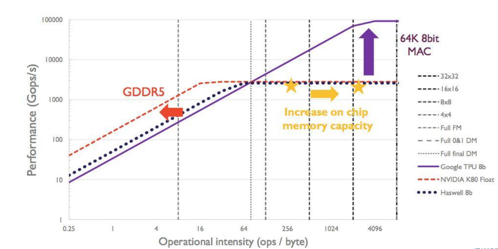{width=50%}

The biggest issue with systolic array is the register overhead.

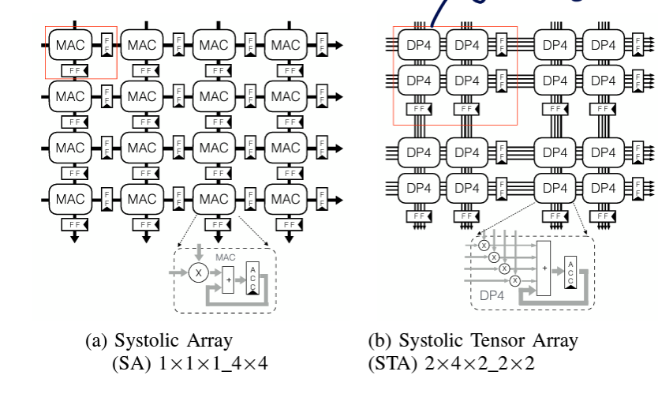{width=50%}

# Lecture 5: Efficient Deep Inference: Quantization

Using quantization will result into better roof as we can push the throughput further with low-accuracy operation using the same hardware. Instead of using full precision `FP32`, we can use lower bit precision as 4-bit, 1-bit, ... Lower order precision is often computed in `int`

{width=40%}

The `TF32` format is used inside Nvidia's card in memory. It is not a real 32 bit float. They use this format as doing fp32 fp32 operation will unavoidably lead to trimming and rounding errors.

## Block quantization 

We can group exponent together and then use the mantissa for the operation. It is a form of **dynamic** fixed point arithmetic. The exponent is fixed and the mantissa can still vary. This allow for smart operation that can re-use previously computed results.

We can push this idea further by trying to group more than just the same components together. We can group multiple numbers under the same scale. This is the basic idea behind int quantization:

$$
w_{quant} = quant(S_q \cdot (w-O_q))
$$

We must add an offset $O_q$ in the case the distribution is not symmetric.


| Format Name | Block Size | Scale Data | Scale bits | Element data format | Element bit-width |
| :---------- | :--------: | :--------: | :--------: | :-----------------: | :---------------: |
| MXFP8       |     32     |    E8MO    |     8      |  FP8 (E4M3 / E5M2)  |         8         |
| MXFP        |     32     |    E8MO    |     8      |  FP (E2M3 / E3M2)   |         6         |
| MXFP4       |     32     |    E8MO    |     8      |     FP4 (E2M1)      |         4         |
| MXINT       |     32     |    E8MO    |     8      |        INT8         |         8         |
:The MX-compliant data types

### PQT and QAT

The cheapest way to implement quantization is to do some **Post-training quantization**. After training, an expensive and time consuming step, we apply the quantization on the weights. We need some calibration data to make sure the quantization will not impact negatively the model.

On the other hand, **Quantization aware training** is ran at training. We quantize on the fly and and finetune with the training data. This is often better but more costly especially with LLM's.

{width=60%}

### Mixed precision NN

In the same idea as quantization per group, we can apply different quantization order in the neural network. During the training, all possibilities exist and then model will adapt the $\pi$ transfer function. Finally certain layers will prefer different quantization order than other.

{width=50%}

## Variable precision `int` MAC's

All of this is cool and interesting but if we can't reuse hardware or do something a bit smarter, we cannot leverage from those algorithmic technique in real life. This is where versatile MAC arrays come into play.

### Data gating

{width=50%}

It is a relatively naive idea and will let lots of space unused ! We gate the LSB's to avoid unnecessary toggling and reduce energy consumption.

### Multi-gating

{width=50%}

This can only be done for **symmetric** operations as asymmetric is quite inefficient. Interestingly, the more sub-word we have, the larger are the registers getting. It is not depicted in the figures, but we must also ensure some gating of the signal to avoid carry propagation between each sub word.

### Add/shift-gating

{width=50%}

This method is suitable for asymmetric operations. We operate on sub-unit and combine the results as required. This method presents a finite granularity and the more range we want to support the more adder need to be chained hurting the critical path.

### Bit-serial way

{width=50%}

We chain operations depending on the width and adjust the clock cycle.

### Comparing

At full precision, data-gating is the best as there is little to no extra hardware or register toggling. But if we look at a reduced precision bit-serial and add-shift have the best energy usage and the best hardware usage.

### From MAC to array level

For fair comparaison, we should compare at the MAC array as it presents many data sharing opportunities.

{width=50%}

{width=50%}

## SoTA example of Quantization

### Envision (KU Leuven)

It is a mult-gating approach with precision scalability. There are 256 MACS in a 16 by 16 array.

```c
for (c = 0 to C-1);
  parfor (k = 0 to 15);
    parfor (b = 0 to 15);
      o[b][k] = i[b][c]*w[c][k]

// Can also be acting 512 MAC units and so on...
for (c = 0 to C-1);
  parfor (k = 0 to 15);
    parfor (b = 0 to 31);
      parfor (bw = 0 to 7);
        parfor (bi = 0 to 7);
```

This was successfully taped out and tested. They managed to adapt the supply voltage to gain even more in power efficiency.

### Tensor Cores (Nvidia)

Same ideas occurs here where we can sort of extend the tensor in multiple dimensions if operating different datatype.

### Hybrid training / inference chip in 7nm (IBM)

IBM has been pushing for lower and lower order of quantization. Proposing special structure for LLM inferences. They have some multi-precision compute array MPE with 16-way hybrid FP8 and 8-way FP16 engine in it. They do the same for int4 and int2 but they separate fp and int as they witnessed a significant energy saving and slight area reduction.

### Binareye - digital and MS (KU Leuven & Stanford)

This extreme 1-bit quantization where we can use XOR gate to compute the multiplication. This is highly efficient in area and energy. The main drawback is the gathering of all those results which constitute the main bottleneck of this architecture. 

The results were quite impressive for such low-order operations. This opens the possibility to run lightweight model on very efficient hardware.

We have really good weight stationary and we keep feeding input in parallel. We break down the input into Fx*Fy and repeat the feeding process for x*y cycles.

```c
for (k2 = 0 to K/64-1); //for each output channel
  for (x = 0 to X-1); //for each in/output column
    for (y = 0 to Y-1); //for each in/output row
      parfor (c = 0 to 255); //for each input channel
      parfor (fx = 0 to 2) ; //for each kernel row
      parfor (fy = 0 to 2) ; //for each kernel column
      parfor (k1 = 0 to 63); //for each output channel
      o[b][k1+64.k2][x][y]+= i[b][c][x+fx][y+fy]
      * w[k1+64.k2][c][fx][fy];
```

#### Reducing the gathering bottleneck

We can replace those large neurons array by a Mixed Signal approach that is composed of a switched-cap adder (sorts of ADC).

{width=50%}

This presented multiple issues:

- Variations of cap: using cap is better than a resistor ladder, ... but high variation could make accuracy plummet
- Noise: again sufficient margin must be taken and extra technique should be employed to reduce impact of the noise
- Comparator offset: this can be quite detrimental but at least we can calibrate this effect reducing its impact

Even with this, the results are still stochastic around the perfect digital model. The energy used by the neuron array is reduced by a factor 12.

## In memory compute

### Concept

Instead of transferring all the time the data from memory, bring the computation in memory. The idea is to use the bitcell and use the selection line as the input and the weight are saved in the bitcell (weight stationary). So the data lines are actually the output lines. 

By measuring the amount of discharge, we could be able to compute the result and digitize it.

### Analog IMC

This seems like a good idea on paper but the amount of extra hardware around is important. We need to use DAC to convert the inputs in analog domain, sum up the current and digitize it with ADC. Finally some post process can be applied (ReLu, ...)

Typically spatially unroll C*FX*FY in vertical direction. Unroll K in horizontal direction, B,X,Y temporal

#### Input pulse width

Use bit width pulses to discharge a certain amount each time.

{width=50%}

We have superposition of binary weighted bitline discharges across multiple rows. Essentially a MAC operation with digital inputs and analog output. The inputs are now digital.

Quite nonlinear & random, difficult to manage large mismatches between SRAM cells

#### Input pulse count

Here, all the pulses are the same, the only difference is the amount of pulse. Current-based addition still present large bitline non-linearity. This can be adapted using some non-linear modeling to counter-act it.

Both techniques use memory element as *current-source like* and the summation is realized with precharge-discharge cycle.

#### Voltage

We use a regular resistance with ReRAM (or Flash) cell. We make resistive weighted sum.

{width=50%}

This is kinda like the PE unit of google where we could save full the weight and directly route on the chip the data to go through multiple layers.

- THE GOODS:
  - Analog in-memory compute allows extreme input and output reuse
    - Due to compact memory (multiplier cell & added) & large arrays
  - Analog in-memory compute enables extreme weight stationarity
    - Program weights once, and leave them there forever?
    - If weight reloading is rare (needs large arrays, or small networks…)
      - Throughput/area increase (dense computing)
      - The larger is the memory the higher is the benefit. But not every NN will be this large to actually witness any gains.
- THE BADS:
  1. Can all NN layers exploit large arrays? $\rightarrow$ underutilization!
  2. Only precise at low quantization level? $\rightarrow$ Chip-specific training? Accuracy loss?

### Digital IMC

{width=40%}

We digitize the 1*1 bit results and accumulation is done digitally. This adder tree is now the bottleneck. 1 weight per adder or weight bank. Here, results are deterministic which is  better suited for the industry. 

For example, TSMC provides special node for this kind of IMC. They share multiplier across 4 weights, it's not really IMC in the strict sense.

More freedom:

- Type of memory cell (now SRAM)
- Number of bitcells (weights) per multiplier $\rightarrow$ local data reuse (higher level stationarity)
- Number of cells per core (=size adder tree), or reconfigurable?
- Number of cores
- Data sharing between cores

Benefits of analog in memory compute still hold (but less!)

- In-memory compute allows extreme input and output parallelism (reuse)
- In-memory compute enables extreme weight stationarity

Compared to analog:

- More flexible (reconfiguration of data reuse in function of layer topology?)
- More reliable (precision guaranteed)
- But… less dense (Tops/mm2 lower)
- But… less efficient (Tops/Watt lower (at core level, not at system level?))

# Lecture 6: Efficient deep inference: Sparsity, Scheduling, Fusion

## Exploit sparsity

### What is sparsity? Types of sparsity?

Not all NN are fully-connected NN. Thus, not all inputs go to every single nodes which result in matrices with empty spot. This is what we call **sparsity**. But not only the architecture affect sparsity but also: quantization (small values get rounded to 0) and explicit training rules (think about $ReLU$ function).

From this 3 types of sparsity emerges:

| Type                    | Description                                              |                Advantages                |
| :---------------------- | :------------------------------------------------------- | :--------------------------------------: |
| **Unstructured**        | Weights are distributed at random                        | Easy for software ppl, hard for hardware |
| **Structured**          | Weights are pack in sparsity block                       | Easy for hardware ppl, hard for software |
| **Density block bound** | A ratio of weight/elements can be garante per row/column |              middle ground               |

#### At training

It is possible to only retain the dominant weights (can have some applications in specific AI cases). We add an optimization constraint which will also improve training efficiency:

$$
\min_{\beta \in \mathbb{R}^p} ||y-X\beta||_2^2 + g||\beta||_1
$$

Unstructured sparsity showed often better result but it is possible to obtain acceptable results with DBB sparsity. Sadly, the more recent models are less sparse since they are more complex and features are not easily detectible as it used to be in Resnet and other models.

### Exploiting sparsity in memory size/access

The goal here is to avoid useless 0 data as it will hinder the bandwidth. Many encoding schemes exist depending on the sparsity (Compressed sparse row, bitmap, ...)

Using structured sparsity, it is much easier to setup a mask/index matrix and to efficiently store and deploy. With DBB sparsity, we need as many numbers as non-zero data BUT the matrix is regular contrary to unstructured data which can be challenging in modern libraries such as `Numpy` which only accepts regular matrices.

#### Envision processor

They use some Huffman encoding inside the DRAM and DMA (huffman tree), it will analyze and find the useless operation to reduce data transfer.

### Exploiting sparsity in processing

As seen previously, GPU relies on the fact we can stream lots of data in parallel and do the same operation. But having non-rigorous data may compromised the benefit of GPU.

Sparse `BLAS` libraries exist but need huge sparsity to have any benefits.

#### Envision processor

On top of the memory flag to guard read as introduced previously, we re-use this flag to guard MAC execution. It only improves the power consumption but doesn't improve speed or throughput!

#### Sparse CNN engine

There is some specific hardware tailored for such operation. It stores inputs and weights compressed and schedule **dynamically** the operations. This require an extensive control on operation and scheduler.

Does perform better than Envision at low sparsity $<60\%$ due to the massive overhead. But this proves, dedicated hardware yield significant benefits!

#### Systolic array

Using DBB, we can have a dedicated X MAC array per block which will be sure to have some operation to do at all time. We have the same throughput for less MAC.

#### CUDA

On `CUDA`, there is now (Ampere) the `cuSPARSELt` library that assumes 2:4 DBB. It will force in a mux 4 operands by using non-zero indices MUX. At a perfect 50% sparsity we can almost double the operations! 

## Operator fusion / scheduling

It is important to understand the advantages and limitations of algorithms and hardware to better design them.

{ width=50% }

### Single core / single layer

Besides the usual `for`-`parfor` as seen previously, we can leverage from various level of cache to hide the latency of accessing memory.

{ width=50% }

A good and simple algorithm for scheduling and putting the right boundaries is to:

- If we have not enough memory a level x
  - Drop upper memory boundary
  - Cache size related
- Too many memory accesses of level x
  - Increase lower memory boundary
  - AI mem accesses/clock cycle

#### Automated performance estimation

We can also think about possible automated tools that can find the best architecture for a given algorithm. The best is to build an *analytical performance model* that do not need extensive compilations or simulations for each NN performance evaluation.

This is what ZigZag is solving where based on:

- NN workload
- Mapping
- Hardware architecture & constraints
- Technology characteristics

It builds a cost model.

### Single core / multi-layer

If we did our job well, we should have optimized single layer. But if we don't look at the interconnect between layers, we may miss potential benefits.

Typically in LLM, there is many linear layer, we could fuse the instructions together to reduce redundant architecture.

{ width=50% }

As in threading, we can try to do some round-robin scheduling and have a divide and conquer approach. Instead of waiting for full output, we can start the next layer with partial output. But this is not possible for every architectures. 

Split operation is really interesting for memory constrained architecture where we must rely on tiling or other operations to obtain the outputs.

### Multi-core / multi-layer

#### Homogeneous

We simply duplicate the core multiple time. It is easily scalable and it gives some mapping flexibility. But only allows output re-use.

#### Heterogeneous - Diana chip

We have a distributed memory hierarchy with digital and analog cores. We can do pipelining and fusion with a small memory which allows for good performance and low shuffling of data.

It is flexible, maybe too flexible and requires tool to efficiently schedule (stream).

{ width=50% }

# Lecture 7: Heterogeneous processor co-operation

{ width=50% }

We will be looking at how we can keep up in productivity.

## Improving design efficiency

### IP reuse

One of the first way to improve productivity is to reuse IP. This technique has been extensively used for the past few years topping at around 90% of IP reuse in a 2018 chip. There is also an Open-Source movement for hardware like RISC-V.

The goal of RISC-V is to standardized and build a common API for Software and Hardware engineers to work on. This will allow for compatibility, shared compiler and simulators, ...

RISC only provides the ISA **not** the full processor. It provides the format and set but also leaves room for variants and extensions. So, many flavours of processor exist each being tailored for a specific utilization.

### IP extension

It is important to make them easy to adapt. Meaning, we should avoid writing low-level Verilog code but instead use some Hardware Construction Language like Chisel (Scala). The best choice is to use some OOP (object oriented programming) to be able to deploy and parametrized new modules easily. 

With one object, we can produce many variants and insert it like we desire. From a dual issue to a quad issue, ...

#### Changing the ISA

On top of that, we can also support extra instructions not defined in the standard ISA. If we want to keep support with basic C-compiler we can only use the opcode `00010xx` or `01010xx`. For example, RI5CY allows for efficient hardware loop by introducing extra instruction.

AI-centered extension can be designed to support quantized values for efficient operations like in XpulpNN.

In XpulpNN, we provide some extra unit with multiplier designed to work at lower bit precision. We must start playing with VDD due to the modified critical path. The energy per operation is getting much better.

### IP integration

We can also do some "Frankenstein" cores by mixing and integrating them together. Using PULP, we can easily mix and match components.

## Improving deployment efficiency

The investement made for each new process node has a major software part. The hardware could help at hiding the complexity for software (choosing the right cores, ...)

### CPU-centric

By using multiple level of cores, we can tailor each of them for specific tasks and performance, maximizing their efficiency. This is like the Big.LITTLE architecture from ARM. Each core has the same ISA and can easily transfer workload from one core to the other.

We use a cache coherent interconnect so every cores have access to the same content at all time. Need some good cache coherency protocol such as bus snooping, MESI protocols, ...

To monitor the workload, we monitor the *running average* of the task state (is the core used or not), if it crosses a certain threshold it could be migrated (**up migration**). The **down migration** threshold is lower than the up migration to avoid constant workload migration.

| Architecture           |                                         Description                                         |                               Advantages |
| :--------------------- | :-----------------------------------------------------------------------------------------: | ---------------------------------------: |
| Core pairing           | We have a pair of big.LITTLE cores. Using DVFS (of core) we determine which core is active. |     Quite simple to program and migrate. |
| Global task scheduling | Every core can migrate to any other core. We again use DFVS (of threads) to monitor usage.  | Harder to monitor and dispatch the work. |
:Migration architecture

#### Scheduling

{ width=50% }

Will try to maximize usage by looking at the state of the threads and checking if they are terminated. Scheduler is an art in itself and various level of hierarchy exist in schedulers.

But one key components is the need to synchronize them together to share data or commit data.

- data synchronization:
  - Avoid double access/parallel access. One thread locks the ressource, commit on it and release it. This ensures a chronological succession.
- event synchronization:
  - To make sure multiple thread end at the same time. Typically if we want to synchronize the output of a parallel function. We put a barrier to block on a loc.

Barriers can be realized in SW or HW! In SW, we have a lock that decrement the value and all thread must force a fresh read (no compiler optimization `volatile`) until the value of 0 is reached. This adds a lot of overhead and busy waiting.

In HW this can be solve with dedicated register such as
 the **Control Status Register**. It requires some special instruction (to make it atomic) but any core can access this CSR.

### Heterogeneous SoC's

It is still a field that is not mature yet and many architecture and design variants are proposed to overcome some shortcoming.

#### hUMA - heterogeneous Uniform Memory Access

We have only one shared memory (system) for CPU, GPU, ... We can also make it virtually shared so the OS does the heavy lifting. Avoid snooping since it will have a lot of traffic. Typically the M1 of Apple.

The DRAM is IN the package and unified which allows for drastic performance boost.

#### Shared ISA for CPU, GPU, TPU, ...

Not solved yet but many obstacles. We don't want to go back to a non-RISC set where we have too many instructions. But, we are looking at an *unified intermediate* representation. So could be easily mapable to any device and the hardware only needs to compile it once and dispatch on the fly.

This is still quite abstract. The backend for support on hardware still requires lots of improvements.

Every compilation target still needs own (custom written/optimized) “finalizer” (optimized kernel functions). Which is not easy to add new/own HW accelerators.

- Difficult (impossible) for tools to automatically allocate code to cores
  - Detect / optimize fused kernel opportunities, ...
- Difficult (impossible) for tools to automatically optimize schedulingacross cores
  - Detect / optimize parallelization opportunities, ...

Current vendors just have hardcoded kernel implementations, lots of work to do until reaching this shared ISA.

# Lecture 8: Adaptive SoC's

We must adapt at all time as the workload on a computer changes rapidly. The core workload changes, the frequency changes at all time, ...

## Open loop solutions for handling workload variations

### DVFS

As seen in previous classes, dynamic voltage and frequency scaling is one of the most important tool for efficient and dynamic computing. By scaling the Vdd at runtime, we can make sure our processor is much more energy efficient thus less heat dissipation. $P_{dyn} = \alpha \cdot C \cdot f \cdot V_{dd}^2$ 

We can have preset pair of $(f, V_{dd})$ called **power states** and this can be chosen by the scheduler. One easy way is to use some LUT.

### Problems of DVFS

It does not take into account slow runtime variations and it is too slow for fast variations. It is a feedback system which can have quite significant delay compared to small burst.

#### Slow variation

It is a fixed LUT realized at production time, thus overtime those values can drift significantly. It doesn't control well the temperature either. That's why we need a closed loop system maximizing performance under thermal limit.

#### Fast variation

When using intensively the core, we can witness *voltage droop* that can further impact performances beyond a certain threshold.

Typically, those droop can create setup time violation as the data may arrive late. The issue is that simply adding guardband can be problematic. Especially at lower power mode, since we are operating near $V_{th}$ thus the guardband must be larger. We could also add some decoupling cap but this would cost lots of area and energy.

## Closed loop solutions for handling variations

### Resiliency $\rightarrow$ detect error & instruction replay: tolerate errors

We want to detect and correct errors due to dynamic variations.

### Adaptivity for slow changes $\rightarrow$ AFS & instruction throttling: avoid errors

#### Error-Detection Sequential - EDS - Insitu

This is the idea of the razor latch has seen in other classes:

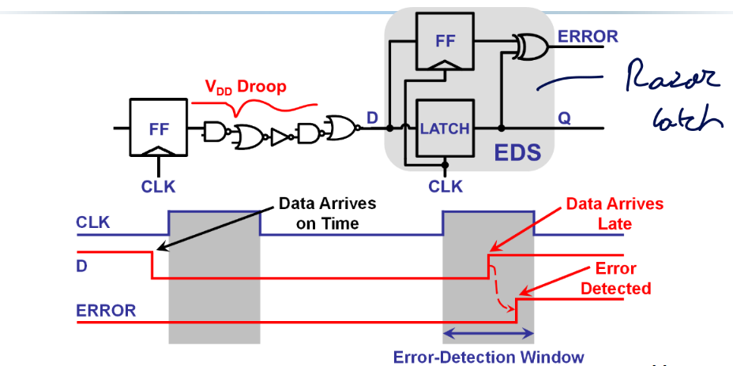{ width=50% }

The error-detection must be carefully chosen. Too small and we could miss errors, too big and we could interpret some combinational logic change as a late data arrival while it is just data already ready for next clock cycle. To help with the last type of error, we must add min-delay penalty to avoid those errors.

#### Tunable Replica Circuit - TRC - Non Insitu

We have a succession of gates, NOT, ... that has an equivalent delay as the path we are actively monitoring. This TRC must be calibrated to make sure we are accurately monitoring the critical path.

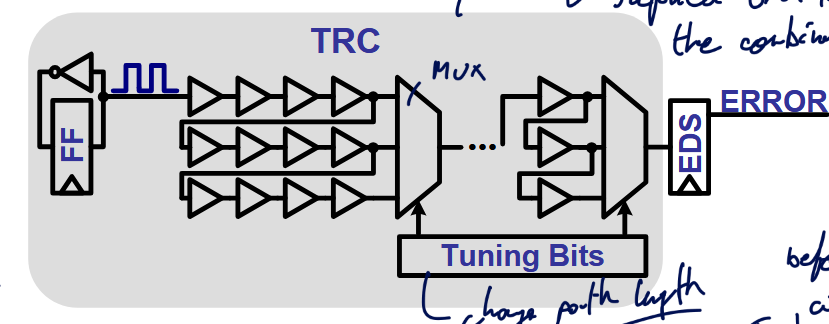{ width=50% }

We also need some tuning bits to change the path length. We also need to make sure the TRC fails at any VDD, temperature, ... before the critical path does.

#### Error recovery

| Feature                            | Local: Value Injection                                                                                                  | Local: Instruction Replay                                                                                                                                                              |
| :--------------------------------- | :---------------------------------------------------------------------------------------------------------------------- | :------------------------------------------------------------------------------------------------------------------------------------------------------------------------------------- |
| **Detection Method Compatibility** | **EDS**                                                                                                                 | **EDS** or **TRC**                                                                                                                                                                     |
| **Error Feedback Mechanism**       | Value is injected back into the pipeline. If an error is detected, the value is fed back using a **MUX** (Multiplexer). | Uses a **flag** that propagates through the pipeline stages.                                                                                                                           |
| **Pipeline Recovery Action**       | Requires stalling the **full chip for one cycle**.                                                                      | At the WB stage, the pipeline stages are **flushed** and the instruction is **re-fetched** from where the miss occurred. Can use an Error Control Unit to replay at different (f,VDD). |
| **Immediate Stall Required?**      | **Yes** (full chip for one cycle).                                                                                      | **No** immediate stall, but has a **significant delay** due to flush and re-fetch.                                                                                                     |
| **Implementation Status**          | **Never really implemented** in commercial products.                                                                    | Requires tracking the **critical path** for each pipeline stage.                                                                                                                       |

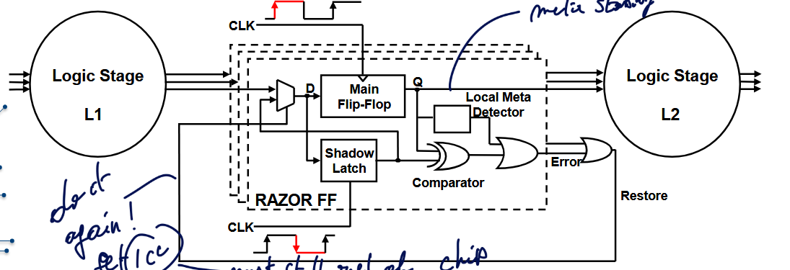{ width=50% } 

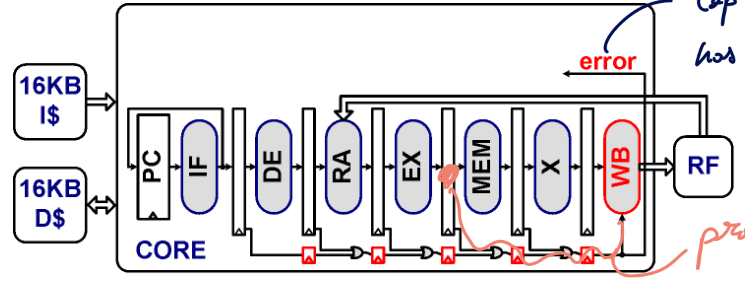{ width=50% } 

#### TRC Vs. EDS

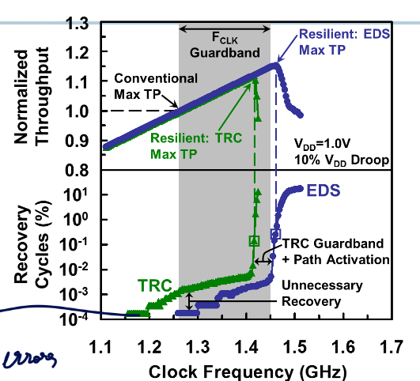{ width=50% } 

This difference is due to the fact that for TRC, extra guardband must be used.

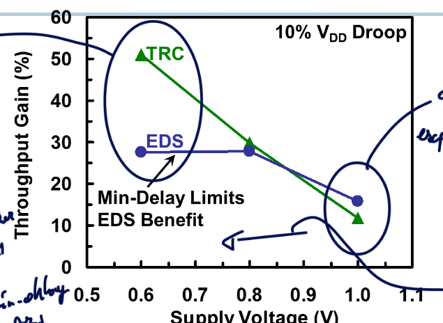{ width=50% }

This graph, however, shows a totally different story! The issue lays in the fact that EDS has a minimum detection window for error detection. Remember, this window must be large enough and the path of fast path adapted for it. For TRC, since we are mimicking the critical path behavior, no need to have a constant guardband like in EDS. 

Those solutions are easy to implement and quickly act upon error, but yet no system to actively retry without trying with the same settings.

Will ensure to change operation settings to not keep doing the same errors. We can use some thermal, aging or Vdd sensor to base our changes on them.

#### Instruciton throttling

Fetch less instruction per CC and let the power decrease on its own. But after the throttle mode finish, they will again spike up! Sometimes, to avoid to let all cores run fast after a throttle, we can use **staged throttle** to gradually release throttle.

#### Adaptive frequency scaling

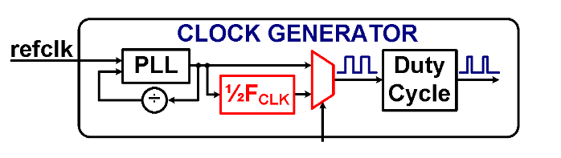{ width=50% }

Reduce the clock frequency with the same VDD as it is faster than changing VDD. We can imagine the mux being controlled by a Error Control Unit based on TRC.

This is easy to implement in commercial product. The main issue with those two methods is that fact it will still take some time to recover + propagation may be too long. We loose some clock cycle and so on. The droop is mitigated but not stopped.

### Adaptivity for fast changes $\rightarrow$ adaptive clocking: avoid errors

The VDD droop will impact datapath and clock distribution timing. Which means the clock and datapath will slow down at the same time! Then, when it ramps up the delay goes faster and clock compress.

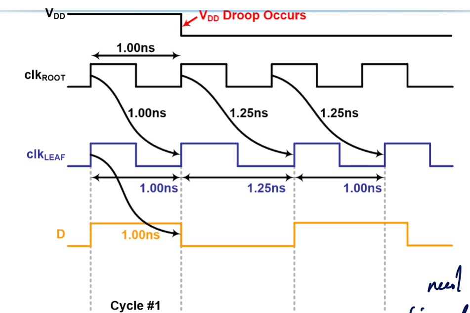{ width=50% }

At first, the data is compensated, but then as it compresses in the last clock cycle on the graph, the data fails and an error occurs. The stretch period must be long enough to allow other adaptations to kick in.

So why not extending this effect to allow more margin during the droop? This is **adaptive clocking distribution**.

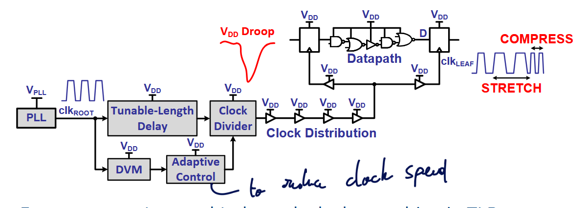{ width=50% }

For this, we also need some Dynamic Variation Monitor (TRC) and use adaptive control, clock divider and a tunable length delay.

The top path is the fast response with clock stretching while the bottom is slower. The TRC, the slow path, triggers clock frequency adaptation in adaptive clock system. 

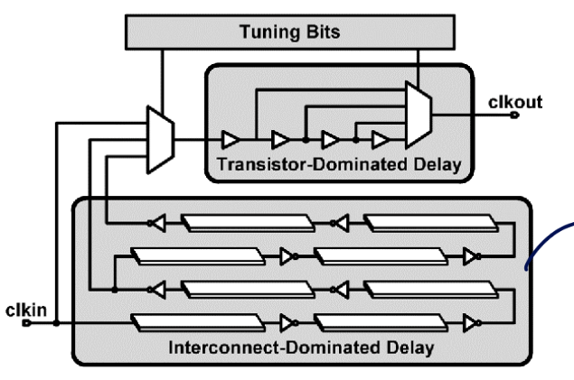{ width=50% }


### Future $\rightarrow$ UVFR

We want to add some feedback for the droop preventions to better monitor and adapt.

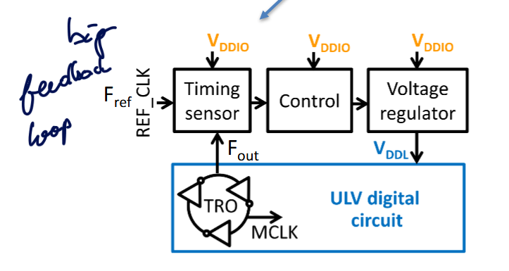{ width=50% }

We adapt the clock itself, linked with VDD droop in a single control loop. LDO regulator controlled on average (Fref - Fout). The clock is generated on the same supply voltage as logic so will follow together the speed.

UVFR avoids timing-margin violations but is not yet very programmable. But it adapts vdd to temperature, die-to-die and ageing variations.

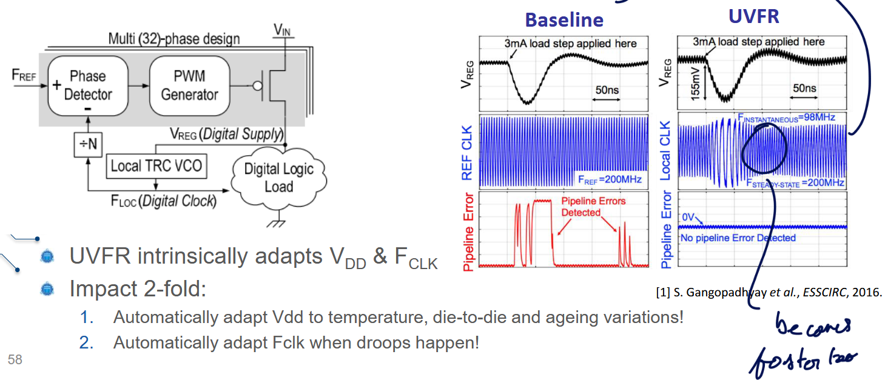{ width=50% }


#### RISC-V example

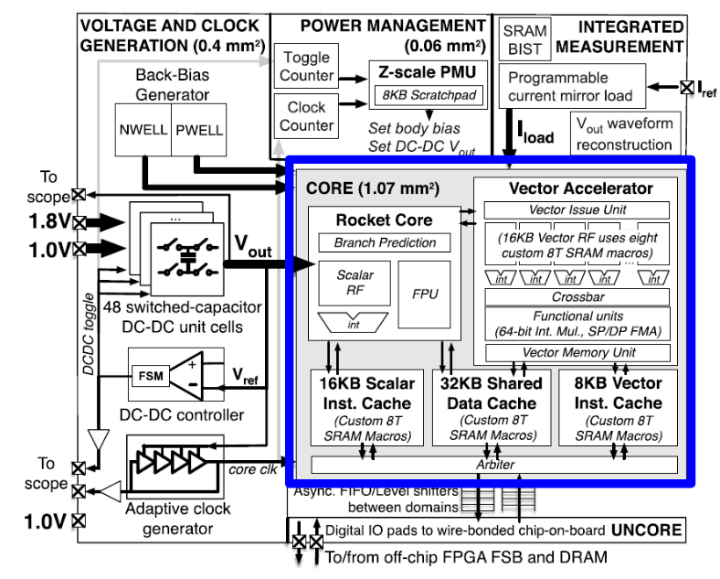{ width=50% }

The voltage regulator is implemented using switch-cap voltage regulator. By controling the toggling and which array to use, we can produce various voltages. The feedback circuit allows to precisely control the output voltage when it fluctuates. The power consumption governs the discharge rate and thus we must adapt the DC DC toggle rate to keep a sufficient supply. This creates large ripple on VDD and some IC's can be sensitive to it. 

This is why we use an adaptive clock generator to avoid this ripple effect.

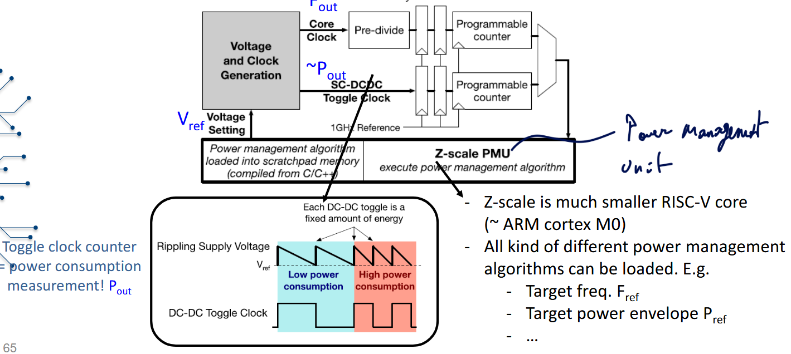{ width=50% }

The idea is to no longer have fixed power states but set an average frequency.

\newpage

# Paper to Read

## Lecture 1

> **Paper to read**
> 
> *Paper1*: A New Golden Age for Computer Architecture J. Hennessy AND D. Patterson
> 
> *Paper2*: Apple M1: Ditching x86 A. Frumusanu
>
> *Paper3*: Paper2: Apple M1 deep dive: Micro-architecture (pg2) Anandtech, Andrei Frumusanu; [*link related to the article*](https://www.tomshardware.com/news/apple-a14-cpu-details)

## Lecture 2

> **Paper to read**
>
> *Paper 1*: Attention is all you need sec. 1-5

## Lecture 3

> **Paper to read**
>
> *Paper 1*: How to keep pushing ML accelerator performance? Know your rooflines!

## Lecture 5

> **Paper to read**
>
> *Paper 1*: ENVISION: A 0.26-to-10TOPS/W Subword-Parallel Dynamic-Voltage-Accuracy-Frequency-Scalable Convolutional Neural Network Processor in 28nm FDSOI

# Questions

Access the online Google docs with this [link](https://docs.google.com/document/d/1-78EFv326HanFbBDpIHGobIe6YWkITXwQaS58lerUes/edit?usp=sharing).

Here is some notebook LM based answers:

## Lecture 1

### 1. Dennard’s Law and the Evolution of Computer Architectures

**Dennard’s Law** posits that as transistors become smaller (scaling by a factor of $\alpha$), their power density stays constant. Ideally, this meant that with each new technology generation, transistors became faster and more energy-efficient, allowing total power consumption to remain stable even as the number of transistors on a chip doubled (Moore's Law). In short Power drops by half as size reduces by half. V/2 + S/2.

However, around 2005, Dennard scaling broke down because voltage scaling hit physical limits (leakage currents), causing power density to increase rather than stay constant. This triggered a shift in architectural evolution across three phases:

1.  **Frequency Scaling Era (Pre-2005):** Architects relied on faster transistors and Instruction Level Parallelism (ILP) to boost single-core performance. Power density was manageable.
2.  **Multicore Era (Homogeneous):** To utilize the increasing transistor count (Moore’s Law) without overheating (Power Wall), the industry shifted to multicore CPUs. Instead of one faster core, chips used multiple cores running at lower frequencies to improve throughput within the thermal budget,.
3.  **Heterogeneous & Dark Silicon Era:** As scaling continued without energy benefits, "Dark Silicon" emerged—designers could fit more transistors than they could power simultaneously. This forced a shift to **heterogeneous architectures**, where "area is spent to buy energy efficiency." Instead of generic cores, silicon area is dedicated to specialized accelerators (Domain Specific Architectures or DSAs) that are far more efficient for specific tasks, while unused parts of the chip remain powered off ("dark"),.

**Examples:**

*   **Homogeneous:** Early multi-core CPUs like the Intel Core i7.
*   **Heterogeneous:** The **Apple M1** and **Nvidia Tegra** integrate CPUs, GPUs, and NPUs to execute workloads more efficiently than a general-purpose CPU could,.


### 2. A New Golden Age for Computer Architecture

Hennessy and Patterson declare a "New Golden Age" because the traditional techniques for performance gains (Dennard scaling and Moore’s Law) have slowed or ended, forcing architects to innovate rather than rely on process technology improvements,.

According to them, the following opportunities should be exploited:

*   **Domain-Specific Architectures (DSAs):** Designing hardware tailored to specific problem domains (e.g., GPUs for graphics, TPUs for AI) to achieve significant efficiency and performance gains compared to general-purpose CPUs.
*   **Agile Hardware Development:** Adopting agile software methodologies for hardware design to enable faster iteration and prototyping,.
*   **Open Architectures:** Promoting open instruction set architectures (ISAs) like **RISC-V** to foster community innovation and competition, similar to open-source software.
*   **Enhanced Security:** Rethinking architecture to treat security as a first-class design concern, addressing hardware vulnerabilities like Meltdown and Spectre.


### 3. Processors in Modern Embedded Systems

Modern embedded systems (e.g., smartphones, autonomous cars) contain a diverse mix of processors to handle varying workloads efficiently:

*   **CPUs:** General-purpose processing for operating systems and control logic.
*   **GPUs:** Throughput-oriented processing for graphics and parallel data tasks.
*   **DSPs/NPUs:** Highly specialized math engines (e.g., Hexagon DSP, Neural Engines) for signal processing and AI,.
*   **ISPs:** Image Signal Processors for converting raw sensor data into images,.

**Differences & Efficiency:**

They differ in their trade-off between flexibility and efficiency. CPUs are flexible but energy-expensive; accelerators (NPUs/ISPs) are inflexible but highly energy-efficient. They "exploit area for efficiency" by dedicating transistors to specialized datapaths that perform specific tasks (like matrix multiplication) with much less energy than a generic instruction cycle on a CPU,.

**Data Exchange (Post-L8):**

To exchange data efficiently without stalling, these heterogeneous cores often use **Shared Memory** architectures (like the **Apple M1**'s Unified Memory) or hardware **Cache Coherency Interconnects** (like ARM's CoreLink). This allows different processors to access the same data in memory without expensive copying operations,.


### 4. The Apple M1 Processor

The Apple M1 applies "area for efficiency" by integrating massive amounts of specialized hardware alongside its CPUs:

*   **Specialization:** It includes dedicated accelerators like a 16-core **Neural Engine** for AI and an 8-core **GPU**, using silicon area to offload tasks from the CPU at much higher energy efficiency,.
*   **Unified Memory:** It integrates DRAM into the package with a unified architecture, reducing the energy and latency costs of moving data between separate memory pools for the CPU, GPU, and NPU.
*   **FireStorm Cores (Performance):** The high-performance "FireStorm" cores are unique because of their **extremely wide decoder design** (8-wide compared to the industry standard ~4-wide). This allows them to process far more instructions in parallel (Instruction Level Parallelism), maximizing single-thread performance.


### 5. Multi-core CPUs: Homogeneous to Heterogeneous

**Reasons for Multi-core:**

*   **Homogeneous:** Initially driven by the "Power Wall" (breakdown of Dennard scaling). Since frequency could not be increased, performance was improved by adding more identical cores,.
*   **Heterogeneous (big.LITTLE):** Workloads on mobile devices vary wildly in intensity. Using a single core type is inefficient. **big.LITTLE** architectures (pioneered by ARM) pair powerful, power-hungry cores ("big") with simple, energy-efficient cores ("LITTLE") to dynamically match the hardware to the workload,.

**Micro-architectures:**

*   **Similarity:** Both core types share the **same Instruction Set Architecture (ISA)** so they can run the same software binary,.
*   **Difference:** "Big" cores use complex **Out-of-Order (OoO)** execution and deep pipelines for performance. "LITTLE" cores use simpler **In-Order** or limited OoO designs to save area and power,.

**Benefits:**

*   **Energy Efficiency:** Heterogeneity offers significant **operational energy efficiency** (e.g., 40% improvement) by running background tasks on efficient cores,.
*   **Carbon Footprint:** While operational efficiency reduces energy use (and thus carbon during use), the manufacturing complexity of these advanced, large heterogeneous chips typically leads to **rising embodied carbon** emissions during production.


## Lecture 2

### 6. ISPs and IPUs

**ISPs (Image Signal Processors)** are specialized processors designed to convert raw data from a camera sensor into a viewable digital image. Traditionally, they relied on fixed-function, hardwired pipelines to perform standardized operations like demosaicing, noise reduction, and white balance efficiently.

**Evolution towards IPUs:**

The architecture has evolved from rigid, hardwired pipelines toward programmable **Image Processing Units (IPUs)**. This shift is driven by the need for flexibility to support new "Computational Photography" tasks (e.g., bokeh effects, multi-frame interpolation) that go beyond standard image reconstruction. While early ISPs like the ARM Mali-C71 used dedicated buffers and fixed dataflows, modern architectures like the **Google Pixel Visual Core** (PVC) introduce full programmability to handle diverse and evolving algorithms without sacrificing the efficiency of hardware acceleration.

**Google Pixel Visual Core (IPU) Characteristics:**

*   **vs. CPU:** The Pixel IPU is a Domain-Specific Architecture (DSA) designed for massive parallelism, capable of 3 trillion operations per second. It is approximately **10x more energy-efficient** than a general-purpose CPU for image tasks because it avoids the overhead of complex control logic (out-of-order execution, branch prediction) found in CPUs.
*   **vs. Hexagon:** While the Qualcomm Hexagon is a VLIW/SIMD DSP optimized for 1D vector processing, the Pixel IPU functions as a 2D array. It features a **16x16 array of Processing Elements (PEs)** that can shift data directly to neighbors (North, East, South, West) in a "torus" configuration. This 2D spatial architecture allows it to exploit the 2D nature of image data (stencil operations) more naturally and efficiently than the 1D vector processing of a standard DSP, essentially acting like a "Hexagon on steroids".

### 7. Embedded Rendering and GPU Architectures

**Workload:**

Embedded rendering involves two massive tasks: **geometry processing** (vertex shading) to calculate the shape and position of 3D objects, and **pixel shading** to determine the color of individual pixels. These tasks are inherently parallel, involving millions of independent calculations (e.g., millions of pixels on a screen), which maps poorly to serial CPU execution.

**GPU vs. CPU:**

*   **CPU:** Designed for latency minimization with complex control logic (branch prediction) and large caches to handle sequential code.
*   **GPU:** Designed for **throughput maximization**. They dedicate silicon area to thousands of simple execution cores (ALUs) rather than control logic. They hide memory latency not with large caches, but by switching instantly between thousands of active threads (multi-threading).

**Mobile vs. Cloud GPUs:**

*   **Cloud GPUs:** Discrete cards with massive power budgets (hundreds of watts) and dedicated high-bandwidth memory (e.g., GDDR).
*   **Mobile GPUs:** Tightly integrated into a **System-on-Chip (SoC)** alongside the CPU. They share the same system memory (**Unified Memory**) to avoid energy-intensive data copying between CPU and GPU. They must operate under strict power and thermal limits (passive cooling), forcing them to rely on fewer cores and specialized bandwidth-saving techniques like tile-based rendering.

### 8. Neural Network Layers and Hardware Efficiency

*   **Fully Connected (FC):** Performs matrix-vector multiplication where every input connects to every output. It has low data reuse (weights are used only once per input vector), making it **memory-bandwidth bound** and inefficient if the batch size is small.
*   **Convolutional (CNN):** Performs sliding window operations. Weights are reused across the entire spatial dimension of the input image. This high **spatial reuse** results in high Arithmetic Intensity (AI), making CNNs **compute-bound** and highly efficient on hardware accelerators.
*   **Depthwise Separable:** Decomposes a standard convolution into a depthwise layer (spatial filtering only) and a pointwise layer (channel mixing).
    *   **Hardware Efficiency:** While **algorithmically efficient** (fewer FLOPs), depthwise layers are often **hardware inefficient**. The depthwise step has low arithmetic intensity because it lacks channel-wise weight reuse, often making it **memory-bound**. This can lead to low utilization of dense compute arrays (like systolic arrays or Tensor Cores) designed for massive matrix multiplications.

### 9. Transformers: Attention Mechanism, Prefill vs. Decode

**Attention Mechanism:**
The attention mechanism computes dependencies between *any* two positions in a sequence, regardless of their distance. It calculates a weighted average of values ($V$) based on the similarity between queries ($Q$) and keys ($K$). This allows modeling global context, unlike CNNs which are limited to local receptive fields.

**Prefill vs. Decode Operations:**

*   **Prefill (Encoding):** Processes the entire input prompt in parallel. It performs large matrix-matrix multiplications ($Q \times K^T$), which have **high arithmetic intensity** because weights and inputs are reused across the sequence length. This phase is typically **compute-bound**.
*   **Decode (Generation):** Generates tokens sequentially (one by one). This involves vector-matrix operations (using the KV cache). Since weights and cached values are loaded for only one new token, the **arithmetic intensity is very low** (close to 1 or 2), making this phase heavily **memory-bandwidth bound**.

**Comparison to CNNs:**

*   **Benefit:** Captures long-range global dependencies in a constant number of operations.
*   **Downside:** Computational cost and memory usage for attention grow quadratically with sequence length, whereas CNNs scale linearly. The memory-bound nature of the decode phase makes efficient hardware utilization difficult compared to the compute-bound nature of CNNs.

### 10. Algorithmic Efficiency vs. Hardware Inefficiency

A neural network layer can be **algorithmically efficient** (low number of total operations/FLOPs) yet **hardware inefficient** (low utilization or throughput) if it reduces the **Arithmetic Intensity (AI)** or disrupts data regularity.


*   **Low Arithmetic Intensity:** Techniques like **Depthwise Separable Convolutions** drastically reduce the number of MAC operations. However, because they remove the dense cross-channel weight reuse found in standard convolutions, the ratio of computation to memory access drops. This pushes the workload into the **memory-bound region** of the roofline model, leaving high-performance compute units (like large MAC arrays) idle waiting for data.
*   **Irregularity:** Techniques like **Sparsity** (skipping zero-valued weights) theoretically reduce work. However, managing irregular indices creates overhead and memory fragmentation. If the hardware cannot efficiently handle these irregular patterns, the theoretical speedup is lost to stalling or complex control logic, leading to lower real-world performance compared to dense, regular operations.


## Lecture 3


### 11. Rooflines and NPU Performance

Roofline models are used to visualize the theoretical peak performance (throughput or energy efficiency) of an NPU against its **Arithmetic Intensity (AI)** (operations per byte of memory access). They identify whether a workload is **memory-bound** (limited by bandwidth, lying on the sloped part of the graph) or **compute-bound** (limited by peak MAC capacity, lying on the flat part).

Unlike standard processors, ML accelerators typically have **two rooflines**: a performance roofline (Ops/sec) and an energy roofline (Ops/Joule). The energy roofline is curved rather than sharp because energy is the sum of compute and memory costs, whereas throughput is determined by the bottleneck (min function) of the two.

Techniques discussed in Lectures 3–6 impact the rooflines as follows:

*   **Raising the Roof (Peak Performance):** Increasing the number of Processing Elements (PEs) or using **Quantization** (e.g., INT8 vs FP32) increases the operations per second/Joule, lifting the horizontal "compute-bound" ceiling. **Sparsity** can also raise the effective roofline by skipping zero-valued operations.
*   **Raising the Slope (Bandwidth):** Techniques like **memory banking**, advanced packaging (e.g., HBM), or **In-Memory Computing (IMC)** increase the effective bandwidth or reduce the energy per access, shifting the memory-bound slope upward and moving the "knee" (turning point) to the left.
*   **Moving the Workload Right (Increasing AI):** **Spatial and temporal data reuse** (tiling) increases the number of operations performed for every byte fetched from memory. This shifts the workload to the right on the X-axis, potentially moving it from the memory-bound region to the efficient compute-bound region.
*   **Approaching the Roof (Utilization):** Optimization of execution schedules (e.g., double buffering to hide latency) ensures high **utilization** (spatial and temporal), allowing the actual performance to rise closer to the theoretical roofline.

### 12. Spatial vs. Temporal Unrolling

**Spatial unrolling** refers to parallelizing loop iterations across multiple hardware units (MACs/PEs) within a single clock cycle. It is represented by `parfor` loops in the code. **Temporal unrolling** refers to distributing loop iterations over time (sequential clock cycles) on the same hardware, often keeping specific data operands "stationary" in local memory. It is represented by standard `for` loops.

*   **Impact on Arithmetic Intensity (AI):** Both techniques increase AI by enabling data reuse.
    *   **Spatial unrolling** enables **spatial reuse** (multicasting inputs/weights or spatially reducing outputs), reducing the bandwidth requirement relative to the compute throughput.
    *   **Temporal unrolling** (Tiling) enables **temporal reuse** (stationarity), where data fetched from DRAM is stored in local SRAM/RF and reused across multiple cycles, drastically reducing off-chip memory accesses.

*   **Sub-types:**
    1.  **Input Reuse/Stationary:** The input feature map is reused/kept constant while weights change (e.g., across different output channels).
    2.  **Weight Reuse/Stationary:** The weight is reused/kept constant (e.g., across a batch of inputs).
    3.  **Output Reuse/Stationary:** The partial sum accumulation is kept local (e.g., in a register) while inputs and weights change (accumulation of dot products).

### 13. GeMM Execution Dataflows: Tesla vs. Nvidia

1.  **Tesla’s NPU:**
    *   Uses a massive, monolithic **96x96 MAC array**.
    *   It executes Convolutional Neural Networks (CNNs) by mapping them to General Matrix Multiplications (GeMM). It typically unrolls the channel ($C$) and filter ($K$) dimensions.
    *   **Pros/Cons:** It offers immense throughput for large layers. However, it suffers from **under-utilization** (idle MACs) if the workload dimensions (e.g., batch size or channel count) are not multiples of 96.
2.  **Nvidia TensorCore:**
    *   Uses smaller, modular tiles, such as **4x4x4** (Volta) or **8x4x8** (Ampere).
    *   It builds larger matrix operations by issuing many instructions to these smaller blocks.
    *   **Pros/Cons:** This granular approach offers higher flexibility and easier utilization for varied layer shapes compared to the massive rigid array of the Tesla NPU, but relies heavily on the compiler/scheduler to feed the cores efficiently.

### 14. Spatial Unrolling at the Core Level (Sharding)

Spatial unrolling can be extended from the datapath to the **multi-core level** (also called "sharding") by distributing the outer loops (e.g., Batch or Output Channel) across different processor cores.

**Opportunities:**

1.  **Data Parallelism (Split Batch $B$):** Different cores process different images/inputs.
    *   *Benefit:* High utilization for large batches.
    *   *Downside:* **Weight replication** is required (weights must be broadcast to all cores), increasing memory footprint.
2.  **Model Parallelism (Split Channels $K$ or $C$):** Different cores process different parts of the neural network layer (e.g., subset of filters).
    *   *Benefit:* Allows running large models that don't fit in one core's memory; lower latency for batch-1 inference.
    *   *Downside:* High **communication overhead** (requires gathering/reducing partial sums from all cores to get the final output).

### 15. Analysis of Nested Loops (Data Parallelism, Stationarity, AI)

Given a generic nested loop structure (based on Lecture 4 examples):

```c
for (b = 0 to B-1)      // Temporal Loop 1
  for (k = 0 to K-1)    // Temporal Loop 2
    parfor (c = 0 to C-1) // Spatial Loop (Parallel)
       o[b][k] += i[b][c] * w[c][k]
```

*   **Data Parallelism (Spatial Unrolling):**
    *   Look at the **`parfor`** loop. Here, `parfor (c)` indicates that the **Input Channel ($C$)** dimension is spatially unrolled. This means $C$ MAC units work in parallel, each taking a different channel element $c$. This represents **spatial accumulation** (reducing partial sums across channels).

*   **Stationarity (Temporal Unrolling):**
    *   Look at the **innermost sequential `for` loop** (the one just above `parfor`). Here, it is `for (k)`.
    *   Inside this loop, as $k$ varies:
        *   `w[c][k]` changes (Load Weight).
        *   `o[b][k]` changes (Load/Store Accumulator).
        *   `i[b][c]` depends on $b$ and $c$, which are constant within the $k$ loop. Therefore, the **Input `i` is stationary** in the registers during the execution of the $k$ loop.

*   **Deriving Arithmetic Intensity (AI):**
    *   *Operations:* The loop body performs 1 MAC (2 ops: 1 multiply + 1 add).
    *   *Memory Accesses (per cycle/iteration):*
        *   Input $i$: 0 reads (Stationary in register).
        *   Weight $w$: 1 read.
        *   Output $o$: 1 read + 1 write (Partial sum update).
    *   *Formula:* $AI = \frac{\text{Ops}}{\text{Bytes}}$.
    *   Assuming 1 byte per word: $AI = \frac{2 \text{ ops}}{1 (W) + 2 (O)} = 0.66$ Ops/byte.
    *   *Note:* If the output accumulation happens in a register file and only the final result is written to memory after the loop finishes, the output bandwidth cost drops, significantly increasing AI. For example, if we tile heavily, we fetch weights and inputs once and perform many ops. The exact AI depends on the specific tiling sizes chosen for the loops.

## Lecture 4

### 16. Tiling and Arithmetic Intensity

**Tiling** involves cutting large data structures (matrices or tensors) into smaller blocks, known as tiles, that fit into specific levels of the on-chip memory hierarchy (e.g., SRAM or Register Files).

*   **Improvement on Arithmetic Intensity (AI):** Tiling improves AI through **temporal data reuse**. By loading a tile of data from a large, energy-expensive memory (like DRAM) into a smaller, local memory (like SRAM) and performing multiple operations on it before evicting it, the system reduces the number of times data must be fetched from the main memory. For example, in a tiled matrix multiplication, an input tile loaded once from DRAM can be reused multiple times against different weight tiles, significantly increasing the operations performed per DRAM byte accessed.
*   **Recognition in Loops:** You can recognize tiling in code when a single loop iterating over a dimension is split into **nested loops**. The outer loop iterates across the blocks (tiles) residing in the larger memory, while the inner loop iterates through the elements within that block residing in the local memory.

### 17. MAC Arrays (1D, 2D, 3D) and Reuse

For a fixed number of MACs (e.g., 256), the arrangement affects reuse opportunities:

*   **1D Array (SIMD/Vector):** Typical of CPUs/GPUs. These generally exploit spatial reuse along only one dimension (e.g., reusing an instruction across data, or broadcasting one weight to multiple inputs). They often rely heavily on high memory bandwidth because they cannot exploit multidimensional reuse as effectively as 2D/3D arrays.
*   **2D Array (e.g., 16x16):** Allows for **spatial reuse** in two dimensions (e.g., broadcasting inputs across rows and weights across columns). While the *spatial* arithmetic intensity (AI) might be moderate (e.g., ~1), 2D arrays allow for highly efficient **temporal reuse** (stationarity) strategies. In specific examples discussed in class, a 2D array utilizing weight, input, and output reuse achieved a higher temporal AI (32) compared to a 3D array (8) because it allows for more flexibility in temporal unrolling.
*   **3D Array (e.g., 8x8x4):** Exploits spatial reuse across three dimensions (e.g., input, weight, and output partial sums). While this results in a very high **spatial** AI (reducing immediate bandwidth pressure significantly), it imposes rigid constraints on the workload dimensions.
*   **Efficiency Conclusion:** While 3D arrays maximize spatial AI, **2D arrays** are often considered the most efficient datapaths for general workloads. They strike a balance, offering good spatial reuse while maintaining the flexibility to exploit significant temporal reuse (tiling) without the rigid dimension constraints that often lead to under-utilization in 3D arrays.

### 18. Systolic Arrays

A **systolic array** is a grid of Processing Elements (PEs) where data flows rhythmically (like a heartbeat) from one neighbor to the next rather than being broadcast from a central memory.

*   **Benefits:**
    *   **Energy Efficiency:** It saves significant energy by minimizing access to large, power-hungry SRAMs. Data is passed directly between local registers in PEs.
    *   **High Throughput:** It allows for massive parallelism (e.g., the TPU has a 256x256 array) executing tens of thousands of operations per cycle.
    *   **Reduced Bandwidth:** It provides reduced memory bandwidth requirements due to high reuse within the array.
*   **Downsides:**
    *   **Latency/Warm-up:** There is a pipeline delay ("warm-up" and "cool-down") to fill the array with data before valid results appear.
    *   **Inflexibility:** The rigid structure makes it difficult to handle irregular computation graphs or layers with dimensions that do not match the array size.
*   **Overcoming Downsides:**
    *   **Utilization:** Low utilization caused by dimension mismatches can be mitigated by software compilers and dataflow techniques (e.g., reordering passes) that pack data to fit the hardware efficiency.
    *   **Area/Cost:** While the array is large, using lower precision (e.g., 8-bit integers) reduces energy and area by an order of magnitude compared to FP32, allowing massive arrays like the TPU's to be feasible.

### 19. Utilization of an AI Processor Core

**Utilization** is the fraction of the processor's peak computational power that is effectively used during execution. It is calculated as the product of **Spatial Utilization (SU)** and **Temporal Utilization (TU)**.

*   **Spatial Utilization (SU):** The ratio of useful MACs to total MACs per clock cycle. It is influenced by the **workload dimensions**. If the neural network layer dimensions (e.g., channel count) are smaller than the physical array dimensions (e.g., 128 channels on a 256-wide array), many PEs will remain idle.
*   **Temporal Utilization (TU):** The ratio of compute cycles to total cycles. It is primarily influenced by **memory bandwidth constraints**. If the system cannot fetch data fast enough to keep the PEs busy (memory-bound), the datapath stalls, reducing TU.

### 20. Rooflines and Multiple Roofs

A roofline model encompasses **multiple roofs** (horizontal ceilings and sloped bandwidth limits) because bottlenecks can occur at different levels of the memory hierarchy.

*   **Multiple Levels:** A system has different bandwidths and Arithmetic Intensities (AI) for the Register File (RF), SRAM, and DRAM. Performance is limited by the minimum of these bottlenecks: $P = \min(BW_{DRAM} \times AI_{DRAM}, BW_{SRAM} \times AI_{SRAM}, PeakCompute)$.
*   **Connection to Temporal Optimizations:** Temporal loop optimizations, specifically **tiling**, directly determine the position of the workload relative to these roofs.
    *   By optimizing the tile sizes for the SRAM level (inner loops), you maximize $AI_{SRAM}$.
    *   By optimizing the tile sizes for the DRAM level (outer loops), you maximize $AI_{DRAM}$.
    *   These optimizations shift the workload operating point to the right on the AI axis for that specific memory level, potentially moving the task from a memory-bound region (sloped roof) to a compute-bound region (flat roof).


## Lecture 5

### 21. Data Types in ML and Roofline Impact

**Relevant Data Types:**

Machine learning computation utilizes a spectrum of data types ranging from high-precision floating-point to low-precision integers:

*   **Floating Point:** Used primarily for training and high-precision inference. Includes **FP32** (single precision), **FP16** (half precision), **BF16** (Brain Float), and **TF32** (Tensor Float). Newer formats like **FP8** (E4M3/E5M2) are emerging for transformers.
*   **Integers (Fixed Point):** Standard for efficient inference. Includes **INT16**, **INT8** (most common for edge), **INT4**, and **INT2**.
*   **Dynamic Fixed Point (Block Floating Point):** A hybrid approach (e.g., **MXFP**, **MXINT**) where a block of numbers (e.g., 32) shares a single exponent/scale factor while individual elements use low-precision mantissas (e.g., 4 to 8 bits). This combines the efficiency of integer math with the dynamic range of floating point.
*   **Binary/Ternary:** Extreme quantization using 1-bit (**Binary**) or {-1, 0, 1} (**Ternary**) weights and activations.

**Exploitation in Processors:**

Processors exploit these types to reduce energy and memory traffic.

*   **Energy:** An 8-bit integer multiply consumes approx. **18.5x less energy** than a 32-bit float multiply.
*   **Memory:** Reducing precision reduces the memory footprint and bandwidth requirements linearly (e.g., INT8 requires 4x less bandwidth than FP32).

**Impact on Roofline Model:**

1.  **Raises the Roof (Performance):** Lower precision allows packing more Processing Elements (PEs) into the same silicon area. For example, the Envision processor increases throughput by **40x** (from 0.26 to 10 TOPS/W) by scaling from 16-bit to 4-bit.
2.  **Shifts the Slope (Bandwidth):** By transferring smaller data types, the effective "elements per second" bandwidth increases. This shifts the memory-bound slope to the left, allowing workloads with lower Arithmetic Intensity (AI) to reach peak compute performance.

### 22. Precision Scalable MAC Units and For-Loop Representation

**Ways to Build Scalable MACs:**

1.  **Data Gating (Naive):** Simply forcing zeros into the unused bits of a large multiplier (e.g., running 8-bit data on a 16-bit MAC). This saves some power but wastes area and does not improve throughput.
2.  **Subword Parallelism (Mult-gating):** Reconfiguring hardware so that one large multiplier splits into multiple smaller ones. For instance, a 16x16 multiplier can be reconfigured to perform two 8x8 or four 4x4 multiplications in parallel. This is used in the **Envision** processor.
3.  **Bit-Serial/Shift-Add:** Processing bits sequentially over time. The MAC unit processes 1 bit per cycle, accumulating the result. This offers fine-grained variable precision but increases latency.

**Impact on Nested For-Loops:**

Adapting precision introduces **two additional inner loops** to the standard 3-loop convolution/matrix-multiplication nest: one for the bits of the weights (`bw`) and one for the bits of the inputs (`bi`).

*   *Equation:* `o[b][k] += i[b][c][bi] * 2^bi * w[c][k][bw] * 2^bw`.

**Dataflow and Utilization Consequences:**

*   **Opportunities:** Allows trading temporal execution for spatial execution. In a **bit-serial** architecture, the loops `bw` and `bi` are unrolled temporally (more cycles). In a **bit-parallel** architecture (like subword parallelism), these loops are unrolled spatially (more operations per cycle). This provides massive throughput gains for low-precision workloads.
*   **Challenges:** Utilization drops if the workload precision does not match the hardware vector width. For example, running a 3-bit workload on a 4-bit hardwired subword-parallel engine results in wasted compute cycles or idle bits (padding).

### 23. Parallelism, Stationarity, and Sparsity: Envision vs. Nvidia Tensor Cores

**Envision Processor:**

*   **Data Type:** Supports dynamic fixed-point precision scalable from 16-bit down to 1-4 bits.
*   **Parallelism:** Uses a **2D-SIMD** MAC array (16x16). It exploits **spatial subword parallelism**, turning one 16-bit MAC into four 4-bit MACs to boost throughput at low precision.
*   **Stationarity:** It employs an **Output Stationary** dataflow where intermediate partial sums are accumulated in local registers within the array to minimize memory access.
*   **Sparsity:** Uses "Guarded" execution. It stores sparsity flags in a separate memory (GRD) to prevent data fetches and clock-gate the MAC units when weights or inputs are zero. This improves energy but *not* throughput (cycles are still consumed).

**Nvidia Tensor Cores (A100/H100):**

*   **Data Type:** Extensive support for Mixed Precision, including FP16, BF16, TF32, INT8, and recently FP8.
*   **Parallelism:** Operates on fixed-size matrix tiles (e.g., 4x4x4 or 8x8x4). It uses massive spatial parallelism to perform tile-level matrix-multiply-accumulate (MMA) operations in one instruction.
*   **Stationarity:** Also utilizes **Output Stationarity** (accumulating into 32-bit registers) but relies heavily on input/weight reuse within the register file due to the "tile" processing nature.
*   **Sparsity:** Implements **Structured Sparsity (2:4)**. It requires that for every block of 4 values, at least 2 are zero. This allows the hardware to compress indices and skip math, effectively doubling throughput for compatible workloads.

### 24. Extreme Binary Quantization Opportunities (BinarEye)

**Digital Domain:**

Binary Neural Networks (BNNs) restrict weights and activations to 1 bit (0 or 1, representing -1 or +1).

*   **Opportunity:** The expensive Multiply-Accumulate (MAC) operation is replaced by a simple **XNOR** gate (for multiplication) and a **PopCount** (population count) for accumulation. This reduces hardware cost significantly.
*   **BinarEye Example:** A fully digital BNN processor where the "neuron array" consists entirely of XNORs and PopCounters. However, the PopCount becomes the new bottleneck (75% of area/energy) because accumulation still requires multi-bit precision to prevent overflow before the final activation.

**Mixed-Signal Domain:**

*   **Opportunity:** Using switched-capacitor logic or current summation to perform the accumulation in the analog domain. This can be more energy-efficient than digital PopCounting but suffers from noise.

**In-Memory Domain:**

*   **Opportunity:** A 6T SRAM cell can inherently perform the XNOR function. By modifying the word-line/bit-line access, the memory array itself becomes the compute engine, achieving extreme density and eliminating the memory bottleneck.

### 25. Analog vs. Digital In-Memory Compute (IMC)

**Analog IMC:**

*   **Mechanism:** Performs MAC operations using physical laws (Ohm’s law, Kirchhoff’s law) on the bit-lines (e.g., accumulating current or charge).
*   **Benefits:** Highest possible energy efficiency (often <1 fJ/op) and density. Enables **extreme weight stationarity** (weights programmed once and used for many inputs).
*   **Weaknesses:** Suffer from **Signal-to-Noise Ratio (SNR)** issues, non-linearities (requiring specialized training), and Process-Voltage-Temperature (PVT) variations. It typically requires expensive ADCs (Analog-to-Digital Converters) to read results back, which can dominate power consumption.

**Digital IMC:**

*   **Mechanism:** Embeds digital logic gates (e.g., bit-serial adders) directly inside or immediately next to the memory bit-cells.
*   **Benefits:** **Reliable and deterministic** (no noise or PVT issues). Flexible precision support and scalable with process technology scaling (unlike analog, which struggles at lower nodes due to mismatch).
*   **Weaknesses:** Lower compute density (TOPS/mm²) and lower peak energy efficiency (TOPS/W) compared to analog IMC because digital logic takes up more space than analog wire-summation.

## Lecture 6

### 26. Neural Network Sparsity

**Neural network sparsity** refers to the prevalence of zero-valued elements within a neural network's data structures, specifically in the weights (static sparsity) and activations (dynamic sparsity, often due to ReLU functions).

**Improvements in Efficiency:**

*   **Storage (Memory):** Sparsity allows for compression. Instead of storing every value, systems can store only non-zero values and their indices (e.g., using formats like Compressed Sparse Row). This reduces the memory footprint and the off-chip bandwidth required to fetch data.
*   **Processing (Compute):** Energy is saved by "guarding" operations. If an input or weight is zero, the Multiply-Accumulate (MAC) operation ($X \times 0$) is redundant. Hardware can skip these operations to save switching energy. If the hardware can also skip the *cycles* associated with these zeros, throughput increases.

**Structured vs. Unstructured Sparsity:**

*   **Unstructured (Random) Sparsity:** Individual weights are pruned arbitrarily.
    *   *Advantages:* High compression potential; models can often be pruned significantly (up to 90%+) with minimal accuracy loss.
    *   *Disadvantages:* Extremely irregular memory access patterns make it hard to utilize hardware efficiently. It creates load imbalances and control overhead (indexing) that can negate performance gains.
*   **Structured Sparsity:** Weights are pruned in blocks or fixed patterns (e.g., N:M sparsity where N out of M elements are non-zero).
    *   *Advantages:* Hardware-friendly. Regular patterns allow for efficient block transfers and vector processing (SIMD). Nvidia’s Ampere architecture, for instance, supports 2:4 sparsity effectively.
    *   *Disadvantages:* Lower compression rates compared to unstructured sparsity; enforcing structure may require more retraining to maintain accuracy.

### 27. Analytical Estimation of Utilization and Energy

To analytically estimate performance, one uses a cost model that inputs the neural network layer dimensions, hardware specifications (memory hierarchy, PE array size), and the mapping (loop order/tiling).

**Throughput/Latency Estimation:**

Throughput is determined by the **Total Utilization**, which is the product of:

1.  **Spatial Utilization (SU):** The fraction of the PE array active per cycle. It is calculated by comparing the hardware parallelism dimensions (e.g., 16x16 array) with the spatially unrolled loops in the mapping (e.g., `parfor`). If the workload dimension is smaller than the hardware dimension, PEs are idle.
2.  **Temporal Utilization (TU):** The ratio of compute cycles to total cycles (including stalls). This accounts for bottlenecks where computation stalls waiting for data from memory.
    *   *Formula:* $Utilization = TU \times SU$.

**Energy Estimation:**

Energy is the sum of computational and data movement costs:

*   $E_{total} = (N_{ops} \times E_{MAC}) + \sum (N_{accesses\_level\_i} \times E_{access\_level\_i})$.
*   The number of accesses depends on the loop tiling: a tensor is accessed from a memory level every time the loops *above* that level iterate, unless it is stationary.

**Exercise Analysis (Scenario based on Slide 61/62):**

*   **Given:** A memory hierarchy (DRAM -> SRAM -> Register File) and a nested loop mapping.
*   **Memory Sizes:** Calculated by the product of the ranges of the loops *below* a specific memory level. For example, if the SRAM level encloses loops for channels $C_{tile}$ and width $W_{tile}$, the SRAM must fit $C_{tile} \times W_{tile}$ values.
*   **Spatial Utilization:** Check the innermost `parfor` loops. If the hardware has 16 PEs and the `parfor` loop iterates 4 times, SU = 4/16 = 25%.
*   **Memory Bandwidth:** Determined by the loops feeding from that level. If the loop feeding from DRAM iterates $N$ times and fetches $M$ bytes each time, the required BW is proportional to $N \times M$ / cycles.
*   **AI (Arithmetic Intensity):** Calculated as $Ops / Bytes$. High temporal reuse (tiling) at the RF/SRAM level reduces bandwidth needs at the DRAM level, increasing the DRAM-level AI.

### 28. Optimizing Schedule and Hardware

**Optimization Strategy:**

*   **Schedule:** To optimize a schedule for a set of workloads, one must maximize reuse (AI) and utilization. This involves:
    *   **Tiling:** adjusting block sizes to fit available SRAM/RF.
    *   **Ordering:** placing loops with highest reuse innermost (stationarity).
    *   **Parallelism:** mapping dimensions with sufficient parallelism to the spatial array.
*   **Hardware:** Designers can tune memory banking (to increase bandwidth for low-AI workloads) or increase MAC parallelism (for high-AI workloads).

**Exercise Impact (Slide 61/62 context):**

*   *Scenario:* If the calculated required memory for weights exceeds the SRAM size.
*   *Optimization:* Reduce the tile size of the weight-related loops (e.g., `k` or `c` loops).
*   *Impact:* This fits the data in SRAM but increases the number of times data must be fetched from DRAM (reducing DRAM-level AI) because the outer loops now iterate more often, reloading the same data.

### 29. Operator Fusion (Layer Fusion)

**Definition:** Operator fusion combines the execution of multiple neural network layers (e.g., Convolution + ReLU, or Conv + Conv) into a single pass. Instead of writing the output of Layer 1 to main memory (DRAM) and reading it back for Layer 2, the data flows directly from Layer 1 compute to Layer 2 compute via small on-chip buffers (SRAM/L1).

**Why it matters:**

*   **Energy & Latency:** Drastically reduces off-chip memory accesses, which are energy-expensive and slow. It mitigates the "memory wall".
*   **Footprint:** Reduces the need to store massive intermediate feature maps in memory.

**Challenges:**

*   **Memory Constraints:** The on-chip buffer must be large enough to hold the "overlap" or "halo" rows required for the next convolution. If the tile size required for fusion exceeds local memory, fusion becomes complex or impossible.
*   **Scheduling Complexity:** It requires complex depth-first pipeline scheduling rather than simple layer-by-layer execution.
*   **Hardware Support:** Not all hardware supports the flexible dataflow required to pipeline different operators simultaneously.

### 30. Homogeneous vs. Heterogeneous Multi-core & Diana

**Homogeneous Multi-core:**

*   **Benefits:** Scalable design (copy-paste cores); easier load balancing since all cores are identical.
*   **Downsides:** "One size fits all" is inefficient. A core optimized for Conv layers is inefficient for Fully Connected layers, and vice versa.

**Heterogeneous Multi-core:**

*   **Benefits:** Assigns tasks to the "best fit" hardware.
*   **Downsides:** Complex global scheduling. The scheduler must decide which core executes which task based on availability and efficiency, handling data migration between different core types.

**Illustration with L6_Diana Chip:**

*   **Architecture:** Diana features a flexible **Digital Core** (SIMD) and a specialized **Analog In-Memory Compute (AiMC)** core.
*   **Benefit:** The AiMC core is ultra-efficient for dense convolution (1152x512 array), while the Digital core handles layers the AiMC cannot (like high-precision or irregular layers).
*   **Scheduling/Fusion:** Diana demonstrates **heterogeneous pipelining**. While the Digital core processes part of Layer 1, the AiMC core simultaneously processes Layer 2. By fusing layers and pipelining them between these heterogeneous cores, Diana reduces L1 memory requirements (data doesn't go off-chip) and improves latency by 1.73x compared to sequential execution.


## Lecture 7


### 31. The HW- and SW-Productivity Gap

*   **Causes:** The gap, often referred to as the "Design Gap," arises from the disparity between the potential complexity of hardware and the ability of designers to utilize it. According to the data, hardware complexity (measured in gates/cm² via Moore's Law) has grown at a Compound Annual Growth Rate (CAGR) of **59%**, while design productivity has only grown at **20–25%**. Simultaneously, the complexity of software (Lines of Code per chip) is exploding, doubling every 10 months.
*   **Solutions:** To bridge this gap, the industry relies on:
    1.  **IP Reuse:** Instead of designing from scratch, designers reuse blocks (IP) to "bridge the silicon design gap".
    2.  **AI in EDA:** Integrating Artificial Intelligence into Electronic Design Automation (EDA) tools is projected to provide the necessary productivity boost to manage rising complexity.
    3.  **High-Level Abstraction:** Moving towards higher-level languages and agile hardware development methodologies (discussed in the L1 Turing paper) to iterate faster.

### 32. RISC-V and SoC Design Acceleration

**RISC-V** is an open-source, modular Instruction Set Architecture (ISA) that allows designers to implement processors without paying royalties or asking for permission.

*   **Customization without fragmentation:** Unlike proprietary ISAs (like ARM), RISC-V is modular. It consists of a small frozen **base ISA** (e.g., RV32I) and optional **standard extensions** (M for multiply, C for compressed, etc.). Crucially, it reserves specific opcode spaces for **custom extensions**. This allows designers to add domain-specific instructions (e.g., for AI or DSP) to accelerate specific tasks without breaking compliance with the standard software stack.
*   **Implementation Flows:**
    *   **Generators (Chisel):** RISC-V facilitates the use of hardware construction languages like **Chisel** (used for Berkeley's BOOM core). Chisel uses object-oriented programming to generate RTL. This enables a single high-level source to generate compilable Verilog for both **FPGAs** (for fast emulation/software development) and **ASICs** (for final silicon), enabling an **Agile Hardware Development** flow.
    *   **IP Reuse:** The open nature fosters a library of open-source cores (e.g., PULP, Rocket) that can be easily integrated or modified, drastically reducing design time compared to negotiating licenses for proprietary cores.

### 33. CPU Extensions for Embedded AI (XpulpNN)

In the era of embedded AI, general-purpose CPUs are inefficient due to the lack of support for low-precision arithmetic used in quantized neural networks (QNNs).

*   **Sensible Extensions:**
    1.  **Sub-byte SIMD:** Extensions that support **4-bit (nibble)** and **2-bit (crumb)** packed vectors allow executing multiple operations in parallel within a standard 32-bit register.
    2.  **Dot Product Units:** Dedicated instructions (like `sdotp`) that perform multiply-accumulate operations on these packed vectors in a single cycle.
    3.  **Hardware Quantization (`pv.qnt`):** A dedicated instruction to handle the re-quantization step (compressing 32-bit accumulated results back to 8/4/2 bits). Without this, the overhead of unpacking, scaling, and repacking data in software negates the benefits of low-precision compute.
*   **Impact on Efficiency:**
    *   **Performance:** These extensions can speed up execution by **5.3x (4-bit)** to **8.9x (2-bit)** compared to a baseline RISC-V core that relies on software overhead for sub-byte handling.
    *   **System Efficiency:** They improve energy efficiency by up to **9x** (achieving hundreds of GMAC/s/W). By packing more data into registers and memory, they also effectively increase the memory bandwidth and cache capacity, alleviating the memory bottleneck.

### 34. Heterogeneous Multiprocessing (big.LITTLE)

Hardware designers make heterogeneous systems (like ARM's big.LITTLE) manageable by ensuring **transparency** to the software.

*   **Ease of Use:**
    *   **Same ISA:** Both "big" (performance) and "LITTLE" (efficiency) cores share the exact same Instruction Set Architecture. A program binary can run on either core without modification.
    *   **Cache Coherency:** A hardware **Cache Coherent Interconnect (CCI)** ensures that all cores see the same memory view. Data modified by a big core is automatically visible to a LITTLE core without the operating system having to manually flush caches or copy data, which would be slow and complex.
*   **Scheduling (Global Task Scheduling - GTS):**
    *   The scheduler tracks the **historical load** of each software thread.
    *   **Migration:** It uses thresholds. If a task's load exceeds an "up-migration threshold," it is moved to a big core. If it drops below a "down-migration threshold," it moves to a LITTLE core.
    *   **Mechanisms:** It uses techniques like **Fork Migration** (new heavy tasks start big), **Wake Migration** (waking tasks stay where they were unless load changed), and **Offload Migration** (moving background work to LITTLE cores to free up big cores).
*   **Synchronization:**
    *   **Hardware Barriers:** Specialized hardware registers (in the interconnect or interrupt controller) allow cores to synchronize (e.g., signal completion) faster than using shared memory variables.
    *   **Software Locks:** Standard atomic instructions (Load-Linked/Store-Conditional) are used for mutual exclusion, relying on the coherent interconnect to pass lock states between cores.

### 35. Solutions and Challenges for *Truly* Heterogeneous Systems

When integrating distinct architectures (CPU, GPU, NPU) that do *not* share the same ISA, the complexity increases.

*   **Solutions:**
    *   **Unified Memory (Hardware):** Architectures like the **Apple M1** use a physically unified memory where CPU, GPU, and NPU access the same DRAM. This eliminates the need for checking data coherency or copying data buffers between separate "CPU memory" and "GPU memory," drastically reducing latency and energy.
    *   **Virtual Unified Memory:** Systems like Nvidia's CUDA use page-fault mechanisms to automatically migrate data between CPU and GPU memory behind the scenes, simplifying the programmer's view.
    *   **Libraries & No-Code Tools:** Vendors provide highly optimized kernel libraries (e.g., CMSIS-NN, cuDNN) or "No-Code" compilation flows that map high-level graphs (like TensorFlow) to specific hardware kernels, hiding the complexity from the user.
*   **Remaining Challenges:**
    *   **Automated Mapping:** It remains very difficult for compilers to *automatically* decide which code section should run on which core (CPU vs. NPU) or how to partition a workload (sharding) across them without manual intervention.
    *   **Customization vs. Tooling:** Every new hardware accelerator requires a custom-written compiler backend or "finalizer" to map operations efficiently. There is currently no "universal compiler" that can instantly target a custom NPU design with high efficiency.

## Lecture 8

### 36. DVFS vs. AFS

**How they work:**

*   **DVFS (Dynamic Voltage and Frequency Scaling):** This is an **open-loop** control technique. The operating system or scheduler determines the frequency and voltage based on the current **workload** (the number of tasks in the queue). It selects a pre-defined pair of frequency and voltage settings (often called P-states) from a look-up table established at design/test time.
*   **AFS (Adaptive Frequency Scaling):** This is a **closed-loop** control technique. It uses on-chip **sensors** (monitoring temperature, aging, or timing margins) to detect the *actual* physical conditions of the chip at runtime. It dynamically adjusts the frequency (and potentially voltage) to the maximum safe level possible under the current conditions.

**Differences & Trade-offs:**

*   **Reaction Speed:** DVFS is generally slow and predictive, reacting to software workload changes. AFS is reactive and fast, capable of responding to physical variations.
*   **Margins (Guardbands):**
    *   **DVFS Disadvantage:** Because it is open-loop, it must include large safety margins (guardbands) to account for worst-case scenarios (worst-case silicon, temperature, and aging) to ensure the pre-defined P-states always work. This wastes energy and performance.
    *   **AFS Advantage:** By monitoring the actual silicon speed, AFS allows the removal of these pessimistic guardbands, reclaiming performance or energy efficiency,.

### 37. Resilient vs. Adaptive Designs

**Difference:**

*   **Resilient Designs:** Focus on **error detection and correction**. They allow timing errors to happen (e.g., during a fast voltage droop) but have mechanisms to detect them immediately and correct the result (e.g., by replaying the instruction),.
*   **Adaptive Designs:** Focus on **error avoidance**. They sense conditions (like a voltage droop starting) and adjust parameters (like slowing down the clock or throttling instructions) to prevent errors from occurring in the future.

**Combination:**

Yes, they are often combined because they solve different problems.

*   **Resiliency** is fast enough to handle the *immediate* impact of a fast voltage droop (first few cycles) where feedback loops are too slow.
*   **Adaptivity** is used to adjust the system for sustained problems.
*   **Example:** A system might use **EDS** (resiliency) to detect a timing error during a sharp voltage droop and trigger a replay. Simultaneously, this error signal acts as a trigger for the **Adaptive Control** to lower the clock frequency or throttle instructions to prevent further errors while the voltage remains low,.

### 38. EDS vs. TRC

**Definitions & Usage:**

*   **EDS (Error-Detection Sequential):** This is an **intrusive** "in-situ" technique. It replaces standard flip-flops on the critical path with "Razor" flip-flops (a flip-flop + a latch + a comparator). It detects if data changes *after* the clock edge but within a specific detection window. If an error is detected, it triggers a pipeline flush and replay.
*   **TRC (Tunable Replica Circuit):** This is a **non-intrusive** technique. It places a tunable delay line (a dummy path) next to the processor core that mimics the critical path delay. If the replica circuit fails, the system assumes the core is about to fail and takes action.

**Performance (Slide 29/30 reference):**

*   **EDS Performance:** EDS generally achieves higher throughput gains (e.g., **16%**) because it monitors the *actual* critical path. It can run the processor right up to the point of failure, removing almost all margins.
*   **TRC Performance:** TRC achieves lower gains (e.g., **12%**).
*   **Explanation:** TRC requires a "safety margin" (guardband) because the replica circuit never perfectly matches the real critical path (miscorrelation). EDS is limited only by the "min-delay" constraint (the detection window size), whereas TRC is limited by the accuracy of the replica,.

### 39. Overcoming Fast Voltage Droops (Fixed Supply/Clock)

If the supply voltage is fixed and the clock generation is static (meaning you cannot slow down the clock instantly), you have limited options to handle fast voltage droops caused by sudden current spikes:

1.  **Guardbands:** Run the processor permanently at a higher voltage or lower frequency than necessary to ensure it survives the worst-case droop without failing.
2.  **Decoupling Capacitance:** Add massive on-chip decoupling capacitors to act as local energy reservoirs, smoothing out the droops. This consumes significant silicon area.
3.  **Instruction Throttling:** Use a "Critical Path Monitor" (CPM) or voltage sensor to detect the start of a droop. Immediately reduce the workload intensity by **throttling the instruction fetch** (e.g., fetching instructions only every other cycle). This reduces the current draw, allowing the voltage to recover.

### 40. Overcoming Fast Voltage Droops with Integrated Regulation (L8_Zimmer)

When exploiting integrated supply and voltage regulation, specifically **Unified Voltage & Frequency Regulation (UVFR)**, one can use **Adaptive Clocking** to overcome droops.

*   **Mechanism:** Instead of trying to keep the voltage perfectly stable, the system allows the voltage to ripple or droop. The clock generator is designed to track the supply voltage instantly.
*   **L8_Zimmer Illustration:** The RISC-V processor described in the Zimmer paper uses **Switched-Capacitor DC-DC converters** that are non-interleaved, causing a significant, intentional voltage ripple.
*   **Solution:** An **adaptive clock generator** uses a Tunable Replica Circuit (TRC) powered by the same rippling voltage as the core.
    *   When the voltage drops (droop/ripple), the TRC slows down.
    *   This instantly slows down the clock being sent to the core.
    *   This ensures that the "Clock Data Compensation" happens cycle-by-cycle: as the logic slows down due to low voltage, the clock period stretches to accommodate it,.
*   **Result:** The processor operates reliably even with large 100mV ripples and fast transitions, achieving high efficiency (26.2 GFLOPS/W) without needing large margins or off-chip components,.

## Guest Lecture

### 41. NXP's Micro-NPU vs. Traditional NPUs (e.g., Envision)

**Differences:**

*   **Memory Architecture:** Traditional NPUs, like Envision, typically rely on massive, private on-chip SRAMs (scratchpads) to store complete models or large activation maps to minimize external memory access. In contrast, NXP's **Micro-NPU** is designed as a "Near-Memory Compute" architecture deeply integrated into the SoC. It uses small, tightly coupled memories (TCM) and relies on **interconnect awareness** to efficiently reuse shared system resources (system SRAM, Flash, DDR) rather than owning large private buffers,.
*   **Data Handling:** Instead of static data buffering, the Micro-NPU employs a programmable **Data Engine**. This engine fetches, realigns, and constructs input vectors (rows and columns) "on-the-fly" from system memory to feed the compute units, hiding system memory latency,.

**Why NXP makes these choices:**

*   **Cost and Area Efficiency:** High peak performance (TOPS) often correlates with high silicon cost. By removing large dedicated SRAMs and reusing existing system memory, NXP minimizes the silicon area, making the NPU affordable for cost-sensitive edge devices (MCUs/MPUs),.
*   **Flexibility:** Storing entire models on-chip is impractical for modern, large-scale models (e.g., Transformers). The data-driven, programmable dataflow allows the Micro-NPU to handle diverse and evolving workloads without the rigid constraints of a fixed internal memory hierarchy.

### 42. Operation of NXP's Systolic Dot Product Array

**Operation:**

The core consists of $M$ parallel dot-product units. In every clock cycle, each unit computes a dot product of two vectors of length $N$. The array executes a **tile** of computation (e.g., $M \times A$ results) by utilizing **spatial parallelism** (calculating $M$ output rows in parallel) and **temporal accumulation** (accumulating partial results over time in local registers),. To reduce bandwidth, operands are often shared across lanes (e.g., broadcasting one weight vector to all $M$ units).

**Comparison to a Regular Systolic Array (e.g., TPU):**

*   **Benefits:**
    *   **Utilization:** Regular systolic arrays (fixed grids) suffer from low utilization when workload dimensions do not perfectly match the array size. NXP's dot-product approach allows for flexible tiling (spatial and temporal unrolling), ensuring high utilization even for irregular layer shapes provided $A \geq M$,.
    *   **Efficiency (Area/Wiring):** A regular array typically requires $N \cdot M$ wide (32-bit) accumulators and complex neighbor-to-neighbor wiring. NXP's architecture drastically reduces this overhead by sharing operands and accumulating temporally in a smaller set of local registers ($A$ accumulators per unit), reducing logic and wire/register costs,.
*   **Downsides:**
    *   **Control Complexity:** Unlike the rhythmic, self-managing data flow of a pure systolic array, NXP's approach shifts complexity to the **Data Engine** and the **compiler**, which must orchestrate the precise fetching and "on-the-fly" construction of data tiles to keep the pipelines fed.

### 43. NXP Compiler Techniques for Memory Optimization

The compiler uses a **Constraint Programming (CP)** approach to solve the joint problem of scheduling and allocation. Specific techniques include:

1.  **Ahead-of-Time (AoT) Scheduling:** The compiler statically schedules all compute jobs and data movements (DMA) to overlap computation with memory transfers (Decoupled Access-Execute), effectively hiding memory latency,.
2.  **Tiling and Format Selection:** It automatically selects optimal **temporal tile sizes** to fit within the TCM and chooses between **Line Parallelism** (spatial tiling along height) and **Depth Parallelism** (spatial tiling along channels) to maximize compute utilization based on the layer dimensions,.
3.  **Layer Fusion:** The compiler interleaves the execution of consecutive layers (fusing them) to keep intermediate activation data within the small L1/TCM memory, significantly reducing traffic to off-chip memory (DRAM).
4.  **Memory Banking & Reuse:** It manages memory allocation at the **bank level** to prevent access conflicts and aggressively reuses memory addresses for tensors whose lifetimes do not overlap,.
5.  **Compression:** It supports **Weight Entropy Encoding** (decompressed on-the-fly by hardware) and exploits **Sparsity** (pruning) to reduce the memory footprint and bandwidth requirements.

### 44. Roofline Model and Transformer Execution

**Phases of Execution:**

1.  **Prompt Encoding (Prefill):** This phase involves Matrix-Matrix multiplication ($Q \times K^T \times V$) over the input sequence.
    *   **Roofline Position:** High Arithmetic Intensity (AI). The AI is approximately $2t$, where $t$ is the token sequence length. For long prompts ($t \gg 1$), this phase is **compute-bound** (flat part of the roofline).
    *   **Impact of Embedding Length:** As the sequence length ($t$) increases, the AI increases linearly, pushing the workload further to the right into the compute-bound region, maximizing hardware utilization.
2.  **Token Generation (Decode):** This phase is auto-regressive (generating one token at a time), involving Matrix-Vector multiplication.
    *   **Roofline Position:** Low Arithmetic Intensity. Since weights must be loaded for every single generated token, the AI is low, making this phase heavily **memory-bandwidth bound** (sloped part of the roofline).

**Impact of Datatype:**

*   **Memory-Bound (Decode):** Reducing precision (e.g., INT8 to INT4) is critical here. It linearly increases the effective throughput because it reduces the data volume fetched from memory, effectively "shifting the slope" of the roofline up or moving the workload to the right (higher Ops/Byte),.
*   **Compute-Bound (Encoding):** Reducing precision improves performance only if the NPU has specific hardware support (e.g., 2x more parallel MACs for INT8 vs FP16) to raise the peak compute ceiling.