\newpage

# Terminology

- **Electromagnetic Compatibility (EMC):** the fact that devices can work normally in the neighborhood of other. Capability of a device, apparatus or system to function properly (with a pre-defined margin) in its electromagnetic environment (given in advance) without generating intolerable disturbing signals in this environment
  - **EMEmission:** emission; to disturb. within and between systems
  - **EMSusceptibility:** to be disturbed. within and between systems
  - Everything is a probability and we must take margins to ensure the proper function of a circuit.
- **Electromagnetic Interference (EMI):** the fact that device can be influenced by other. Degradation of the functioning of a device, apparatus or system as a consequence of a disturbing signal; degradation = intolerable behavior, hard to define.
  - This is more and more problematic as:
    - Density increase; speed increase
    - More broadband 
    - Small and High amplitude

This course is all about understanding the fundamental of what makes a circuit and electricity flow. We ground for safety and no current flows in GND in a household. A coaxial is not shielded ! When nothing powers it, it doesn't act as a shielding, only after we power it it will look as shielded.

General rule for disturbance and interference:

- Disturbance: signal causing the problem
- Interference: problem

One thing to always consider is to also check for possible interferences outside the working band as external phenomena happening at higher or lower frequencies can be perceived in the circuit.

## Basic Scheme

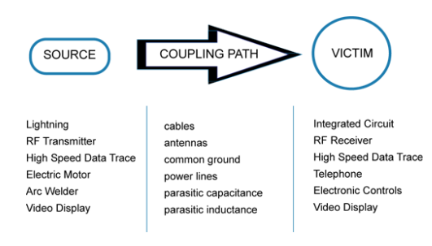

Important to note that there is not just 1 coupling path. It can be inductive, capacitive, ... but can be also conducted through the wires !

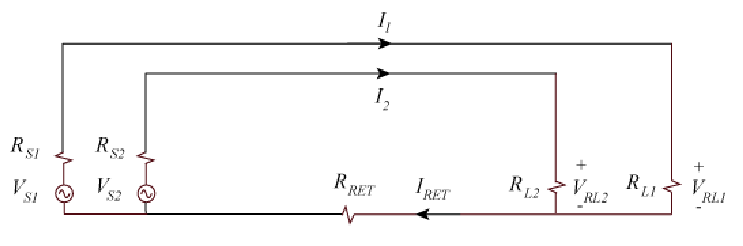

On top of this we can have some common impedance coupling where the length and slight different in material results in differences in the signal.

### Common mode and Differential mode

They are both important in EM but generally, we are interested in the DM as no current is going through the ground. Common mode is problematic due to its fact the signal go to ground. This could also create an unexpected path that could damage components.

### Size of a system

It is always related to the wavelength $\lambda$.

- $<\lambda/10$: Small: quasi-stationary
- $>\lambda/10$: Large: wave behavior

For the near and far-field we use:

- $<\lambda/2\pi$: near-field
- $>\lambda/2\pi$: far-field

For antenna, we must also take into account the directivity with $10\lambda$ and $2D^2/\lambda$.

Another reminder is the fact that for a signal in dB, we use $20 log(X(y))$ but if it is the power, we use $10 log(X(y)_{power})$ as it is a quadratic value.

# Coupling Mechanisms

> **Note**
>
> Physical meaning: the notions potential and voltage actually **ONLY EXIST AT DC**.

This can be proven with the basic Maxwell equation:

$$
\nabla \times E = - \frac{dB}{dt}
$$

If we are at DC, no change of rate respecting the time so $dB/dt = 0$. We also know that $\nabla \cdot \nabla \times V = 0$ by definition. This leads us to $E= - \nabla \phi$ with the $-$ as a convention so we go from high to low potential. Finally, we can transform this equation into an integral equation:

$$
\int_1^2 E dl = \phi_1 -\phi_2
$$

In the case of an AC signal where the derivate is no longer null we have:

\begin{align}
  \int \nabla \times E dS &= \int - \frac{dB}{dt} dS & \text{with } \int \nabla \times E dS &= \oint E dC \text{ the contour}\\
  \oint E dC &= \int - \frac{dB}{dt} dS & \text{with } B &= \frac{\phi}{dS}\\
  \oint E dC + \frac{d\phi }{dt} &= 0
\end{align}

In other words, the sum of the voltage drop over a closed loop is not equal to 0! This contradicts the KCL.

Which means that when we want to model any RC circuit we will find:

$$
\begin{cases}
  \oint E dC &= -V + RI\\
  \frac{d\phi}{dt} &= \frac{dLI}{dt} = L \frac{dI}{dt}
\end{cases}
$$

Where we have first the voltage drop and then the extra term cause by the loop and the creation of a surface where a magnetic flux is going through. In short, we must model a simple resistive circuit with an extra inductance to keep it correct with Maxwell equation.

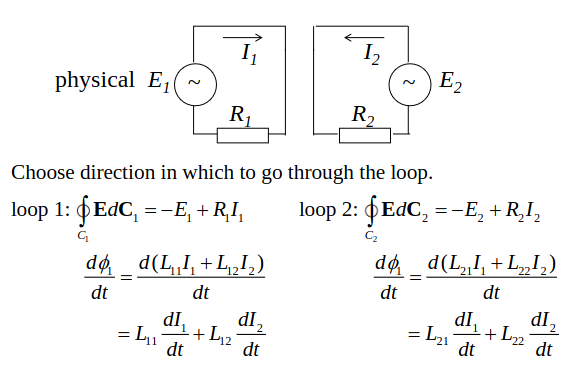{ width=50% }

Each pair of loop as to be modeled as a **transformer**!

## Transition between conductor and dielectric

Circuit theory is a simple first order approximation of field theory. When we have a dielectric/vacuum on top of a conductor, we know that the netto charge in conductor is null.

$$
\nabla \times H_2 = (j\omega \varepsilon_2 + \sigma_2) E_2 \text{ with } J_2 = \sigma_2 E_2  
$$

And as used before $\nabla \cdot \nabla \times V = 0$ and so the divergence of the current. Which means what comes in comes out ! The net is null.

### Transition between medium

Now, if we inspect a small loop going around the first and second medium, we can find:

$$
\int_V \nabla (j\omega \varepsilon + \sigma )E dV = \oint_S (j\omega \varepsilon + \sigma) E dS = 0
$$

There is a current flowing to the surface of the conductor that is related to the field outside the conductor:

$$
J_{2n} = \frac{\sigma_2 j \omega \varepsilon_1}{(j\omega \varepsilon_2 + \sigma_2)} E_{1n}
$$

And at DC and with a perfect conductor $(\sigma_2 \rightarrow \infty)$, we have $J_{2n} = j \omega \varepsilon_1 E_{1n}$. This appears immediately after switching it on, this charge ensures the correct voltage drop outside. And later inside, the electrical field is created for the current flow.

### Link with the term capacity

This phenomena is the same that govern the capacity in its strict definition. If we have an area $A$ at a distance $d$ from each other with a voltage potential of $V$ and permitivity of $\varepsilon$. We have:

$$
J_{2n} = j \omega \varepsilon_1 E_{1n} \longrightarrow \underbrace{AJ_{2n}}_I = j \omega \underbrace{\frac{\varepsilon_1 A}{d}}_C \overbrace{d E_{1n}}^{V}
$$

This can be applied to **any pair of conductors**, which is contrary to the current law of Kirchhoff. We must model it as a RC parallel network that appears at AC.

## Combined coupling

Capacitive and inductive couplings are **first order correction**. Any one port system can be modeled with a Maclauren series:

$$
Z(\omega) = R + A_1 \omega + A_2 \omega^2 + A_3 \omega^3 + ...
$$

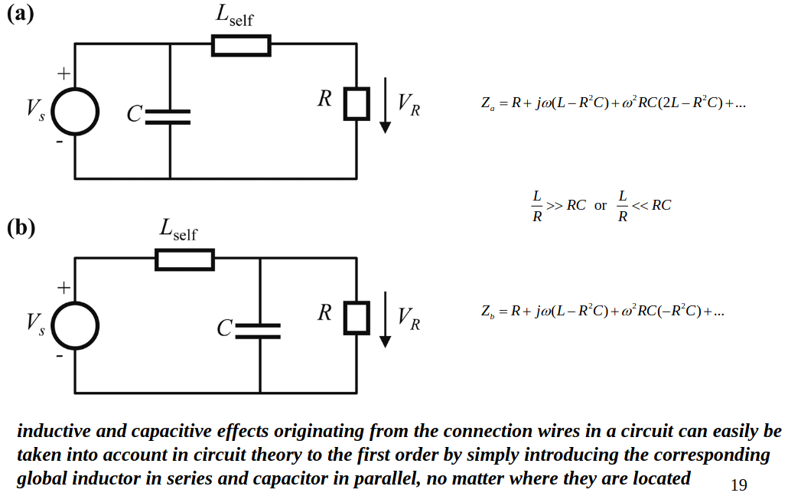{ width=70% }

Both circuits are equivalent but will have different values. We can then split-up the two networks and boom we have the same second order term by choosing wisely our split. This will lead to $L_{2R}C_{2R} = L_{2s}C_{2s}$ for an equal split.

Also, important to note that this combined coupling will change depending on the actual wiring and physical constraint which is sometimes forgotten about.

| Characteristics          |                           Circuit theory |                                      Reality |
| :----------------------- | ---------------------------------------: | -------------------------------------------: |
| Conductors               | Ideal just transport current and voltage | It is a component itself with non-idealities |
| Shape and implementation |    No impact, just the components matter |          At higher speed shape matters a lot |
| Components               |                      Localized, discrete |                     Distributed not discrete |
:Consequences of higher order phenomena

If we do not take care of this, we have lots of problem especially at higher frequencies as such effect because increasingly important. We have to switch gears and really ask ourselves what simplification does circuit theory.

- inductive coupling: make current loop as small as possible
- capacitive coupling: distance as short as possible

# Multi-conductor Transmission Lines

This is a generalization of the two conductors case where we witness some C and L coupling between conductors of length $>> \lambda$. This could be applied to shorter wires but this theory will be equal to circuit theory but with extra work and computation.

If we look transversal, the cross section is much smaller which leads to quasi-static (quasi TEM) and so possible to introduce L and C for correction.

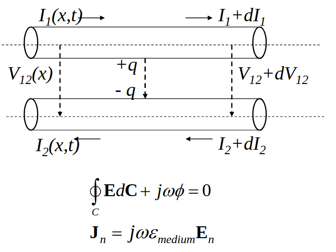{ width=50% }

If we look in telecommunication cables such as telephone line or Ethernet cable, we will see twister pairs, shielding, ... this is a first hint to answer the question "how to reduce coupling". This same principle is also found in microstrip line. The strongest coupling is the horizontal one between the microstrip but also some with the ground plate.

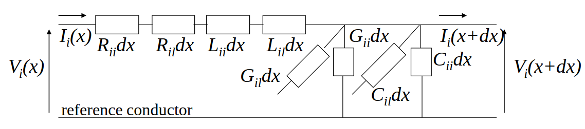{ width=70% }

Each components model the effects within a TL and with the other TL. Distributed ($dx$) components determined via electrostatics and magnetostatics in cross section. On small $dx$ we could use KCL. This models is **only valid if cross-section $<<\lambda$**. (*why?*)

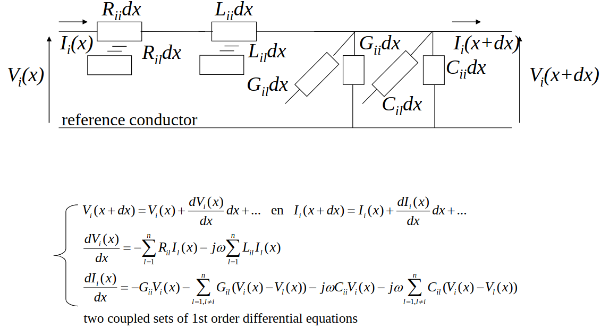{ width=70% }

If we lump everything in one single vector component, we can obtain a matrix representation with:

\begin{align}
  Rdx + j\omega L dx &= Zdx & Gdx+j\omega C dx &= Y dx
\end{align}

and

$$
\begin{cases}
  \frac{dV(x)}{dx} &= -\boldsymbol{Z}I(x) \\
  \frac{dI(x)}{dx} &= -\boldsymbol{Y}V(x)
\end{cases}
$$

If the matrix becomes of dimension 1, we are in the well-known case of a transmission line. This approach is simply a generalization of it. The matrices are like:

\begin{align}
  \boldsymbol{Z} &= \begin{bmatrix}
    Z_{11} &Z_{12} & ... & Z_{1n}\\
    Z_{21} &Z_{22} & ... & Z_{2n}\\
    \vdots &\vdots & \ddots & \vdots\\
    Z_{n1} &Z_{n2} & ... & Z_{nn}\\ 
  \end{bmatrix} & \boldsymbol{Y} &= \begin{bmatrix}
    \sum_{i=1}^n Y_{1i} &-Y_{12} & ... & -Y_{1n}\\
    -Y_{21} &\sum_{i=1}^n Y_{2i} & ... & -Y_{2n}\\
    \vdots &\vdots & \ddots & \vdots\\
    -Y_{n1} &-Y_{n2} & ... & \sum_{i=1}^n Y_{ni}\\ 
  \end{bmatrix}
\end{align}

If we assume $V(x) = V^+ e^{- \gamma x}$ and $I(x) = I^+ e^{- \gamma x}$, if we use the second derivate of the equation, we get:

$$
(\gamma^2 U - ZY)V^+ = 0 \qquad (\gamma^2 U - YZ)I^+ = 0
$$

Where $U$ is the modal transformation matrix related. The solution is thus given by the eigenvalues $\gamma_i$ and the eigenmodes $V_i^+;I_i^+$. If we look at the column of the current and voltage, they each represent 1 mode-1 base of the system. The matrix is full rank so each mode is orthogonal to the others.

$$
I_m = \left[ I_{m1} \quad I_{m2} \quad ... \quad I_{mn} \right] \qquad V_m = \left[ V_{m1} \quad V_{m2} \quad ... \quad V_{mn} \right]
$$

## Characteristic impedance matrix

We can derivate the equations we found and injecting the new notation of current and voltage which yield:

$$
V_{mi} = \gamma_i^{-1} Z I_{mi} \qquad V_{mi} = \gamma_i Y^{-1} I_{mi}
$$

We can the repeat for every entry of the matrix and by sorting the terms properly for $\gamma$ which will become a diagonal matrix $[\gamma]$:

$$
V_m = (ZI_m) [\gamma]^{-1}= (Y^{-1}I_m)[\gamma] \qquad I_m = Z^{-1}I_m [\gamma]= YV_m[\gamma]^{-1}
$$

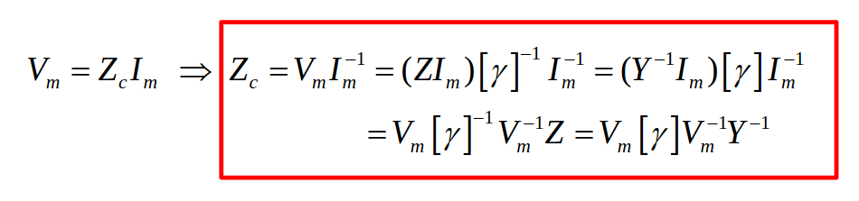{width=50%}

## Crosstalk

> **Definition**
>
> Crosstalk is any phenomenon by which a signal transmitted on one circuit or channel of a transmission system creates an undesired effect in another circuit or channel. Crosstalk is usually caused by undesired capacitive, inductive, or conductive coupling from one circuit or channel to another

So if we end the multi conductor TL with the impedance matrix it can remove the crosstalk.

The main takeaway from this is that, L and C coupling are unavoidable and it is a **physical** phenomena. But cross-talk is a result of this but **can be avoided** if we are putting data on one mode only.

### Special case: homogenous

If the medium is homogeneous, like in power distribution line for example, $\gamma_i \equiv \gamma_{\text{medium}}$. This means that:

$$
Z = \gamma_{\text{medium}}^2 Y^{-1} 
$$

This yields that:

$$
j\omega L = \left( j \omega \sqrt{\mu_{\text{medium}} \varepsilon_{\text{medium}}} \right)^2 (j\omega C)^{-1} \qquad \qquad L = (\mu_{\text{medium}} \varepsilon_{\text{medium}})C^{-1}
$$

This makes matching possible as it will create a real-valued $Y_c = \sqrt{\mu_{\text{medium}} \varepsilon_{\text{medium}}}^{-1}C$. And so each components is a real valued resistor.

### Transfer impedance

This concept indicates us how signal on the outside will influence the signal inside. Basic insight is to make the cable as short as possible and the connection as good as possible to avoid excess inductive coupling.

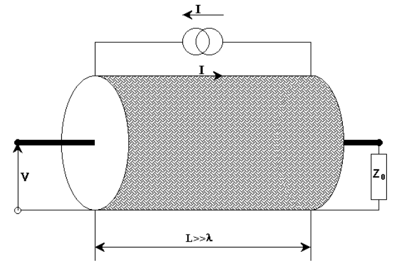{ width=50% }

#### Low frequencies

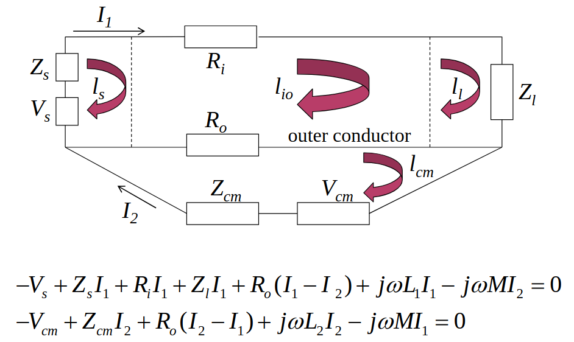{ width=70% }

On the left we have the sources, then the cable itself with $R_i$ and finally the load that is not active. Finally, we have the return path on the outer conductor. The extra loop at the bottom represents the common mode that is disturbing th signal, this will create a signal inside.

We have then the inner and outer loop equations. The L and M represents the self-inductance and mutual inductance between the loops. It appears due to reciprocity of Maxwell's equation and causes L coupling.

We are interested in the effects of the cable not the connections. For this, we will split the inner loop into the source, load and cable.

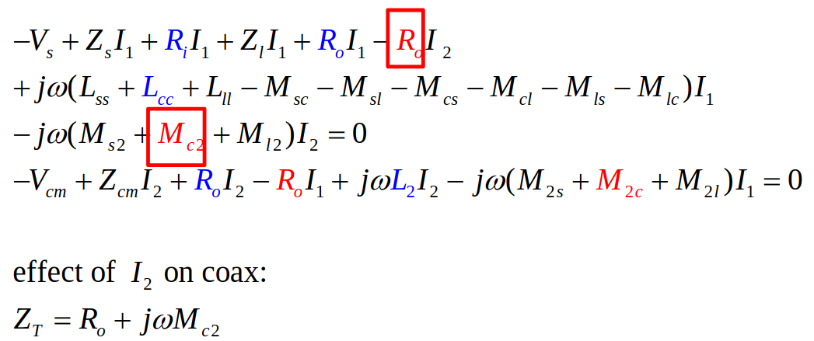{width=60%}

#### High frequencies

Cause of the skin depth effect, an exponential decay of exterior signal will be witnessed in the outer conductor. Ideally the characteristic impedance should be $0$ if the shielding is thick enough.

But if we look inside standard commercial coax cable, we will see a *woven metal* which will allow for flexibility. This will reduce its performance as depicted here:

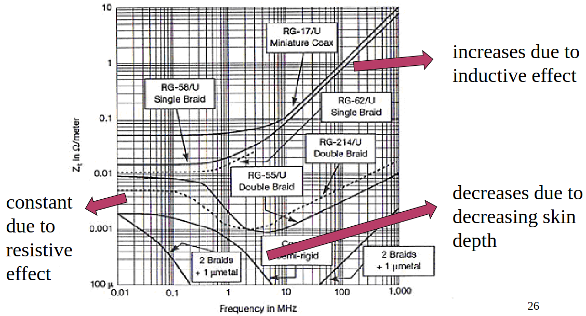{width=50%}

For high frequencies, the woven metal will have holes and so no skin-depth. Full copper will increase the skin-depth effect as the frequency increases. On the graph, the *mu-metal* is nickel/iron alloys with the permeability $\mu$.

# Shielding

> **Definition**
>
> Shielding = to diminish the electromagnetic field at the location of the susceptor by placing a physical barrier, in most cases consisting of a conducting material, between emitter and susceptor

We must shield from $\vec{E}$ and $\vec{H}$, those are 2 different cases. For plane wave, achieving one will achieve the other as their fields are orthogonal and their ratio equal to the medium constant. 

We can either shield a device or shield the source of disruption. A general rule is that the higher the $\sigma$, the better is the shielding. BUT, the topology can impact it drastically.

| Metal           | Conductivity - $\sigma$ | Permeability - $\mu$ |
| :-------------- | :---------------------: | :------------------: |
| Silver          |          1.05           |          1           |
| Copper          |            1            |          1           |
| Gold            |           0.7           |          1           |
| Aluminum        |          0.61           |          1           |
| Zinc            |          0.29           |          1           |
| Brass           |          0.26           |          1           |
| Nickel          |           0.2           |          1           |
| Iron            |          0.17           |         1000         |
| Tin             |          0.15           |          1           |
| Steel           |           0.1           |         1000         |
| Hypernick       |          0.06           |        80000         |
| Monel           |          0.04           |          1           |
| Mu-Metal        |          0.03           |        80000         |
| Stainless Steel |          0.02           |         1000         |
:Typical materials for shielding

## Plane waves

If we assume an infinite plane, it can be solved analytically.

{width=60%}

The shielding effectiveness is $SE=-20 log_{10}(T_{eff})$. Demonstrated how much energy goes through the shield. 

The usual way to solve such problem is to solve the boundary value problem. Integral equation with boundary value and in this case we have tangential field equal at the interface. Moreover, to respect basic fundamental law of physics, the sum of the transmissions and reflections should be equal to 0 at the interface.

### Analytic solve

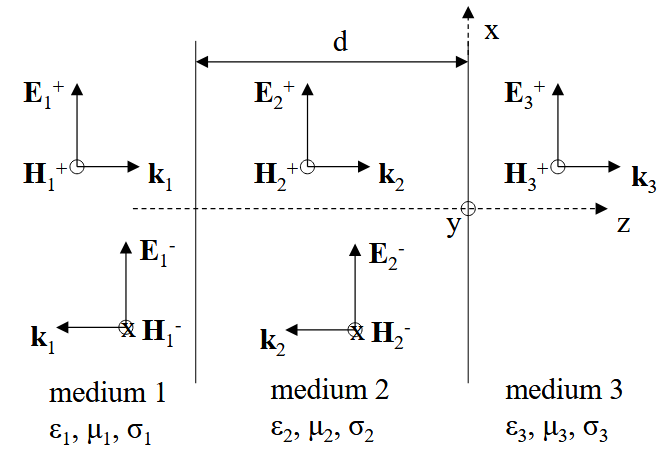{width=60%}

#### Medium 1 $z<-d$

# Shielding

**TODO** The other first part of the course that is still on my computer

## Shielding by general shields

Like in antenna, we are going to apply the same reflection and idea but to shield. A shield is nothing but a scatterer. This time, we don't want to create more total field but we want to reduce the electromagnetic field at a certain spot in space. The main equation that governs:

$$
J^{ind} = \sigma E^{tot} = \sigma \left( E^{inc} + E^{scatt} (J^{ind}) \right)
$$

The induced current satisfies the impedance boundary condition on the shield. We will consider a conductor with conductivity $\sigma$. For a conductor the current is proportional to the total field. The proportionality factor is the conductivity. The scattered field is only depending on the induced current flowing in the shield.

### Solution

We can see the $E^{scatt} (J^{ind})$ as a vector operator and not just as a function. This relaxes the problem and allow to write $(U - \sigma E^{scatt}) (J^{ind}) = \sigma E^{inc}$. The $U$ is the unit operator. Finally, using the inverse we can find the total electromagnetic field like this:

$$
E^{tot} = E^{inc} + \left( \frac{1}{\sigma} U - E^{scatt}\right)^{-1} E^{inc}
$$

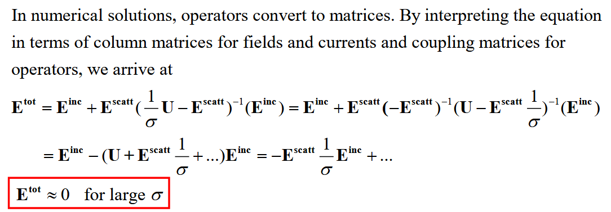{ width=50% }

Which means that for PEC, the total field is null. Which makes sense as we know PEC can make good shielding. The immediate neighborhood of the conductor can be seen as shielding.

If we move away from that conductor, the field becomes normal. But this change is depending on the **electrical size** of the shield (always expressed in $\lambda$). By combining conductor, we can find a solution using computer!

## Shielding broken down in 3 different mechanisms

By basic wave theory, we know that a wave can go through a screen (full or woven) but also *around* it using diffraction. The first one is often less impactful than the second one. An intuitive idea for this is the fact that modern base station relies on diffraction to cover all areas of a city yet our cellphones still work perfectly. In other words, diffraction reduces the signal but not enough to be considered as shielding. Thus must be taken care of. This is also an incentive to develop other methods not just the plane wave one.

> **Reading**
>
> G. A. E. Vandenbosch, “The Basic Concepts Determining Electromagnetic Shielding”, American Journal of Physics, Vol. 90, No. 9, pp. , Sep. 2022, 10.1119/5.0087295.

### Shielding by a wire

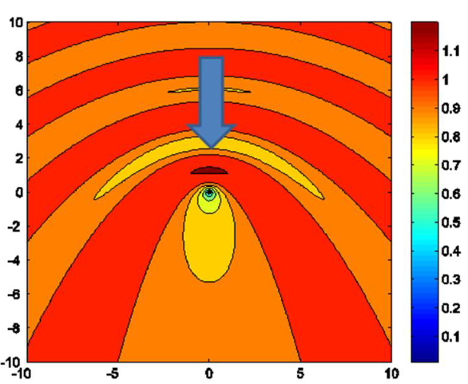{width=50%}

Important note, the plane wave must be **parallel** to the wire to create an $\vec E$ difference which will result into a current in the wire. If we do it perpendicular, the effect will be close to non-existent.

We can also witness a small area behind the wire where the intensity of the field is lower. This can be seen and considered as a form of shielding (bad nonetheless).

Inside the wire, the $\vec E$ is 0 if it is a PEC and the wire acts as a **scatterer**. This problem can be analytically solved.

### Shielding by a wire grid

If we form a mesh of wire, and space them regularly at a certain distance, the effect of shielding will be better. The tighter they are ($\lambda$ wise) the better is the shielding.

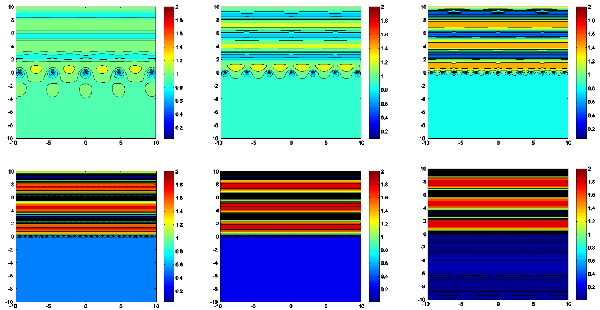{width=50%}

The last experiment has wire spaced at $\lambda / 32$ but has only a $-30dB$ shielding. This is far less than the $-100dB$ we could attain with a full screen. Also we can see the waves reflected are quasi-static (if we ignore the computer artifacts).

### Shielding by a half-plate

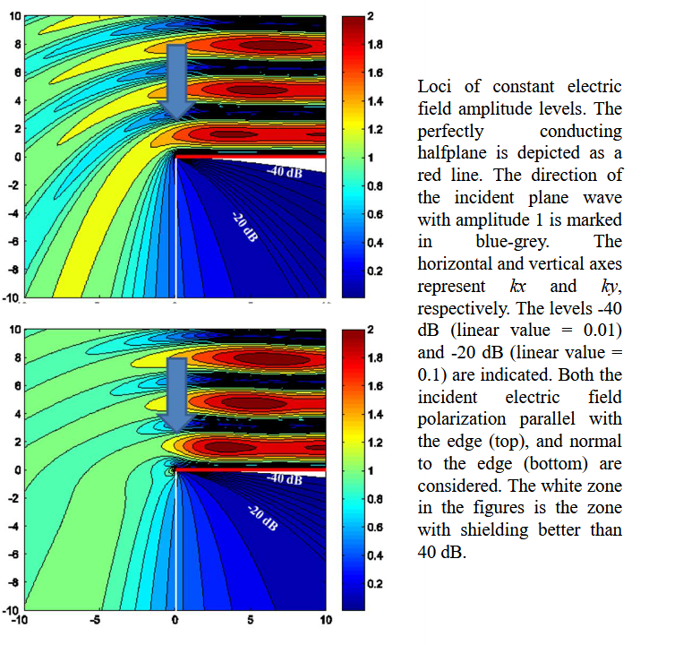{width=50%}

This can be solved analytically using cylindrical coordinate. Here we are seeing parallel and perpendicular polarization hitting the plane. We have slightly different results[^1].

[^1]: The dimensions are with $k = \frac{2\pi}{\lambda}$

Another takeaway here, is the fact we can only reach $-40dB$ which is quite a high figure for shielding. This really showcases how diffraction is more important that what goes through the screen magnitude wise.

## Shields: $\vec H$ field

[comment]: <> (need to check again this part because I think I am not really getting the subtlety)

> Potential exam question:
>
> *Explain mesh of microwave + the metal pieces behind the door*
>
> Mesh has small holes which are large for light $400 - 700 nm$ but which are small for microwave lengths. Microwave operates around $0.3 - 300 GHz$ which corresponds to roughly $1m-1mm$ of $\lambda$.
>
> The metal piece around the back of the door is there to avoid small cavity to form when closing the door. If we let it open, we could have excess of waves so we need to close it with these metal pieces.

A shield is a **scatterer with loop currents**.

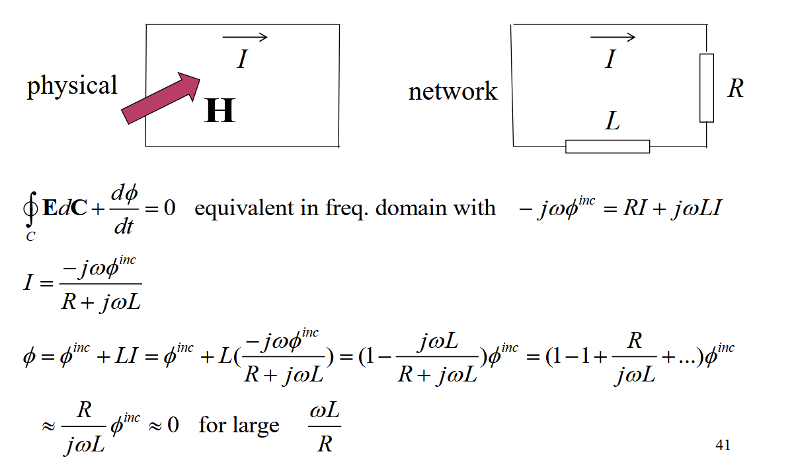{width=75%}

We have to add this $L$ to take into account the physical loop and respect Maxwell's equation. The 3rd equation originates from the fact we will have an incident flux and a new flux due to the loop cause by the current in it. We can then do some series expansion $\frac{j\omega L}{R + j \omega L} = \frac{1}{1+\frac{R}{j\omega L}} \approx 1 -\frac{R}{j\omega L}+...$.

$R$ and $L$ are defined by the loop and material itself. In the paper cited earlier, the professor found that this equation is $\approx 0$ for signal from $600$ Hz and more. Which means it is hard to shield against low frequencies signal.

The shielded field is the normal component of the magnetic field. Shielding magnetic field with electric conductors does not work if no loop current can flow **OR** for very low frequencies (limited conductivity).

A plate can be seen as having an infinite amount of loops so the *normal* component of the $\vec H$ can be shielded over the whole region. Same line of reasoning for a box.

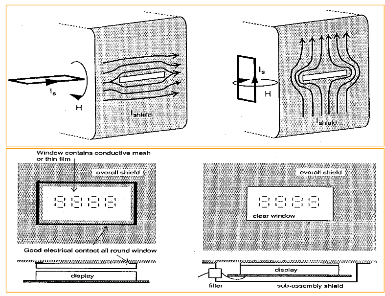{width=50%}

The first example is better shielded as the current loops see little to no obstacles while in the second case it's tougher to go around it.

## Shielding boxes and shielding rooms

Such box is made of very conductive material but we cannot just make a box, we must ventilate, ...

This is why we must add aperture which are often designed for a specific wavelength. In other words, for a given $\lambda$ the mesh will be seen as having small holes so not too much of this frequency and higher will go through.

But there must also be lab equipments and other connections with the other world which can create a parasitic effect like the coax effects. It can act as a scatterer (like an antenna) and introduce extra unwanted signal.

Bad connection or assembly of the box will create worse shielding. Any details count if we want to achieve significant order of magnitude like $-100 dB$.

# Transients

This section is about analyzing and understanding phenomena coming from outside of an electronic circuits. Those phenomena are:

- Sporadic
- Have an unknown amplitude
- Have an unknown time duration

Those are typically pulses:

- EMP: ElectroMagnetic Pulse (if capitalize like this, refers to EM fields created by nuclear explosion)
- Lightning
- ESD: ElectroStatic Discharge: due to build up of charges induced through friction

But there can also be some more "*continuous*" form of disturbance such as radio or the corona effect (the eerie purple gloom witness around high voltage line when there is mist). All signals and pulses are analyzed from a **time domain** point of view in this section.

## EMP

Due to nuclear explosion inducing gamma radiation. For a shell of $\sim 10m$, there is 50kV/m in 10 ns. In the atmosphere, this can span around 2000 km due to free electron there. At surface, we are closer to 20 km.

This is dangerous as a L or C coupling can appear and this can be then transferred to components. Simple protection as Zener diode (over-current protectors) or voltage limiters. At a larger scale, shielding is effective.

But, if we have communication outside a device, this means the shielding is not perfect thus creating a weakness point.

## Lightning

Lightning is an interesting phenomena which is **bi-directional**. There is a *leader* coming from the sky that is a electrically conductive channels of ionized gas that propagate through. This will splits in multiple channel trying to find the easiest connection. The leader is a negative stream that looks for a *streamers*. When a leader approaches the ground, the presence of opposite charges on the ground enhance the $\vec E$. A positively charged ionic channel may appear from ground object. Once the streamer reaches the leader, BOOM, thunder. The thunder is a **return stroke** so it back propagates.

The ionosphere has a constant 120V/m making it the largest condensator ever with approximately $10^5$ V. This is why we have around 100 lightnings per second! We do not feel those $\sim 250$ V on our body has we are a conductor. We have surface charge but inside there is no $\vec E$.

A lightning will discharged 500kV/m in approximately $1\mu s$ which is a 1/10 of an EMP. The magnetic field will be around 200 kA in $10\mu s$.

This phenomena can be studied statistically. We have the largest exchange in tails around 800 A, this peak current can cause explosion or if it's more continuous, fire. When striking the ground, the $\vec E$ is around 10 kV/m. It is injecting into the soil.

### Protection

To protect against strike, you should:

- Get inside:
  - House, car/train/plane acts as shielding and everything will flow around it
- Outside:
  - In the middle of a field, crouch, reduce area, keep feet close together to avoid to short your balls.

This is really important as a lightning will try to find the easiest path to ground and the conductivity of a human body is better than the air or soil.

We can use lightning rod to attract but also control more the lightning. Another solution is to try to avoid metal in construction. Use voltage and current limiters. Galvanically separate earthing systems, only 1 pin in the ground. Good isolator is glass fiber for example.

## ESD

This is the phenomena where there is a "*transfer of charge between bodies of different electrostatic potential, caused by direct contact or induced  by an electrostatic field*". It is a discharge so we will have a high peak voltage, short time and sharp rising time. Then we couple the charges through induction, approaching speed.

The build up of charges is due to rubbing. Typically rubbing on a carpet with shoes. This will capture some electrons and a positively charged field appears the other side of the dielectric (the soil of the shoe). The body is becoming positively charged. This is the **Tribo-electric effect**. We have non-conductors that act as a slow neutralisation and a fast neutralisation (discharge) with conductor.

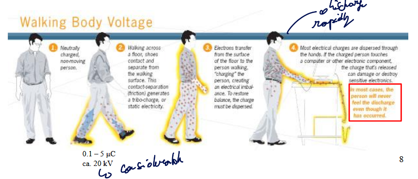{width=70%}

There is the triboelectric series of material where if 2 materials are opposing on this chart, the effect will be even stronger. 

According to the surface resistance different thing can happen:

- $0-10^6 \Omega$/square: Conductive: spark
- $10^6-10^9 \Omega$/square: Little Conductive: no spark, safe discharge
- $>10^9 \Omega$/square: Non-Conductive: induce charge on conductors

This discharge effect also gets stronger with the capillarity. Typically, the thinner the contact point is (finger, pin, ...) the stronger will be the discharge. This is why there is a small nail sticking out of helicopter's rotor to dissipate this build-up of charges which can reach up to 300 kV. This is similar in some ways to the Corona effect.

In summary, we need 2 conductors for the spark (skin and metal for example) and 1 non-conductor that isolate the electrons from the positive charges formed in the body.

### Modeling

- Assume pulse shape for “source current” $i_s(t)$
  - for example sum slow and fast exponential
- Calculate $i_s(\omega)$ via Fourier transform
- Calculate transfer function to "load" $T_{ls}(\omega)$ with circuit theory
- Calculate $u_l(\omega) = T_{ls}(\omega) \cdot i_s(\omega)$
- Calculate $u_l(t)$
- Assess whether the "load" will fail or not ...

> CORONA effect: 
> 
> electric field around conductor is high enough to form a conductive region, but not high enough to cause electrical breakdown or arcing to nearby objects. It is often seen as a bluish (or other color) glow in the air adjacent to pointed metal conductors carrying high voltages

The maximum voltage is *strongly* dependent on relative humidity. The ESD increases with approaching speed and sharpness of the tip.

### Sharpness

It is possible to model this effect based on Gauss's law. It states that for a sphere:

$$
\oint \oint E dS = \frac{Q}{\varepsilon_0}
$$

The field is thus uniform:

$$
E_n = \frac{Q}{4 \pi r^2 \varepsilon_0} = \frac{\sigma}{\varepsilon_0}
$$

But, if we start to flatten the sphere, positive surface charge will appear around. This will increase $\sigma$ and thus $\vec E_n$. But, we still need to respect Gauss's law and any cut in that flat sphere should hold the same amount of charges left and right of that cut. So the density will start to increase!

The charge separation is typically an induction phenomena.

### Spark by separation

In a capacitance, we have $Q=CV$. If the capacitance decrease the voltage will increase for the same charges $Q$. Now, if we have a capacitance that is slanted and will gradually go away, we will have an excess of charge density at the closest part to the other capacitance. So at some point, the voltage will be too high and a spark will appear.

A spark is due to trapped energy in a circuits.

ESD effects can be dangerous as a spark that can be sensed by human needs 30 mJ (3kV). And to be visible, it must be over 10 kV. But to ignite a gas like propane, only 3 mJ is required.

### Effects

Analog circuits are affected by ESD only for the duration of the discharge. It makes them more reliable than digital circuits. 

Digital circuits can suffer from bit switch due to ESD. 15 kV over 1 k$\Omega$ yields 15 A $\rightarrow$ H = 24 A/m at 10 cm. The rise time of 10 ns yields 30 V in loop of 100 $cm^2$.

But no matter if they are digital or analog, components can be damaged at any time. Either making them unusable or worse, latent, meaning something has weakened inside and so performance may differ from expected. Typically, the dielectric breakdown can change, metallization burn out for MOS, junction burnout for BJT.

### Protection

To avoid this, we can have special meters that can measure it. We also ground ourselves to discharge the build up. We can also increase the humidity to increase conductivity of air and so discharge in the air. Use plasma (ion charges) with flame.

Equipment:

- touchable parts: offer low HF impedance with earthing or insulate
- shielding behind insulator
- very high freq. (GHz): avoid apertures, holes, slots

Components:

- special diodes (Zener)
- anti-static material (ca. $10^9 \Omega$/square): forms humid layer
  - high enough to avoid sparks
  - low enough to avoid static charge
- Anti-static and shielding (using some metal)

| Phenomena | Electric Field discharge |   Time   | Magnetic Field discharge |   Time    |
| :-------- | :----------------------: | :------: | :----------------------: | :-------: |
| EMP       |         50 kV/m          |  $10ns$  |            NA            |    NA     |
| Lightning |         500kV/m          | $1\mu s$ |          200 kA          | $10\mu s$ |
:Recapitulative table of discharges phenomena

# Green radiation - are EM waves dangerous?

## EM fields and radiation

> **definition**
>
> radiation is the principle that leads to EM field propagating through space

We must do the distinction between non-propagating waves. Typically high voltage power line, we call this near field waves. On the contrary, there is far field waves like GSM, ... 

$$
\frac{\lambda}{c} \text{ is } \begin{cases}
  << & \text{ near-field} \\
  >> & \text{ far-field}
\end{cases}
$$

The important characteristics of a wave:

### 1 - Spectrum

To find if a wave is dangerous, we must look at the energy it carries:

$$
E = \hbar f
$$

To reach the energy level that can cause damage to the DNA and cause cancer, it must be a high frequency similar to the gamma waves.

### 2 - Radiated power

Power or energy radiated per second is around 2 W for a phone and 10s of W for a base station.

### 3 - Distance

The intensity decreases with $1/r^2$ so fast reduction. On top of this, if we take into account the fact that we are in a city with no direct line of sight with a base station, the power quickly drops. Usually to 1-10mV/m instead of the 3-0.6V/m of the base station.

### 4 - Enting (?) of information onto radiation

To carry information, we can't simply send a singletone signal, it must have some variation. Typically in GSM we use Gaussian-filtered minimum shift keying.

|Source| Frequency| Power |Distance| Intensity|
|:---:|:---:|:---:|:---:|:---:|
|Radio/TV| kHz – MHz |up to 100 kW| 1000 m| 0.016 W/m2|
GSM BS 0.9 - 1.8 GHz 20 – 100 W 10 m
100 m
3.2 W/m2
0.032 W/m2
GSM handset 0.9 -1.8 GHz 20 mW - 2 W
(1/8 time)
1 – 2 cm
1 m
2 - 200 W/m2
0.0002 – 0.02 W/m2
DECT
(phone)
1.9 GHz 250 mW peak 1 m 0.02 W/m2
WLAN,WIFI
(internet)
2.4 GHz 100 mW max 1 m
10 m
0.008 W/m2
0.00008 W/m2
Bluetooth 2.4 GHz 1-10 mW 1 – 2 cm 0.8 - 8 W/m2
UMTS handset 0.85 – 1.7 –
1.9 – 2.1 GHz
max. 125-250 mW 1 – 2 cm max. 12.5-25 W/m2
:Various characteristics of waves

### Relation between gain and effective length

We have an antenna of a certain length but the effective length can be bigger or smaller than the actual length. The wave comes at an angle $\theta$. The received wave can be modeled as $V_{open}$.

$$
V_{open} = E_{inc} i_z l_{eff} = E_{inc} sin(\theta) l_{eff} 
$$

If the antenna is matched $Z_{rec} = Z_{ant}^*$ we get:

$$
\begin{aligned}
  P_{\text{rec}} &= - \mathbf{S}_{\text{inc}} \cdot \mathbf{A}_{\text{eff}}(\theta, \phi) \mathbf{i}_r = - \frac{\mathbf{E}_{\text{inc}} \times \mathbf{H}_{\text{inc}}^*}{2} \cdot \mathbf{A}_{\text{eff}}(\theta, \phi) \mathbf{i}_r = \frac{1}{2 \eta_0} |\mathbf{E}_{\text{inc}}|^2 A_{\text{eff}}(\theta, \phi)\\
  P_{\text{rec}} &= \frac{1}{2} R_{\text{ant}} \left( \frac{|\mathbf{V}_{\text{open}}|}{2 R_{\text{ant}}} \right)^2 = \frac{1}{8} \frac{|\mathbf{V}_{\text{open}}|^2}{R_{\text{ant}}} = \frac{1}{8} \frac{|\mathbf{E}_{\text{inc}} \sin \theta \cdot l_{\text{eff}}|^2}{R_{\text{ant}}}\\
  \frac{1}{2 \eta_0} |\mathbf{E}_{\text{inc}}|^2 A_{\text{eff}}(\theta, \phi) &= \frac{1}{8} \frac{|\mathbf{E}_{\text{inc}} \sin \theta \cdot l_{\text{eff}}|^2}{R_{\text{ant}}}\\
  l_{\text{eff}} &= 2 \sqrt{\frac{R_{\text{ant}} A_{\text{eff}}(\theta, \phi)}{\eta_0 |\sin \theta|}} = \lambda \sqrt{\frac{R_{\text{ant}} G(\theta, \phi)}{\pi \eta_0 |\sin \theta|}}
\end{aligned}
$$

which creates at the terminal of the antenna:

$$
\begin{aligned}
  V &= l_eff E_{inc} = \lambda \sqrt{\frac{\Re(Z_{in}) \eta^{rad} D}{\pi \eta_0}} \cdot E_{inc}\\
  &\approx \frac{\lambda}{2 \pi} \sqrt{\frac{5}{3}} \approx \frac{\lambda }{5} E_{inc}
\end{aligned}
$$

With $\eta^{rad}$, $Z_{in} = 50$ and $D=1$. For a frequency of $900$ Mhz, we have a maximum of $40$ mV.

## ALATA principle

> **ALATA**
>
> As Low As Technically Achievable

To avoid enduring unnecessary risk or potential danger to user especially if better SoTA alternatives exist. This a precautionary principle broadly used in the UE.

For the telecom world, this means reducing the SNR as much as possible since this means lower transmitted energy thus reduces potential risk.

Reducing the power from 20 to 3 V per meter is a decrease by 44.4 while going from 20 to 0.06 is by 100.000.

## Reducing EM radiation

### In general

The received power follows:

$$
p^{inc} = \frac{P^{tr}}{4 \pi r^2} G^{tr}
$$

3 strategies can emerge looking at this equation.

#### 1 - constant minimum $p^{inc}$

We deploy more cell tower at lower power so we keep the power at a minimum power everywhere. This will decrease the r in the equation (let's say by 2) and to make power constant with the basic case, we have to divide by 4 the transmitted power.

Now, the maximum power induced will be 4 times smaller than the baseline. It's the easiest to implement, no need for new equipment.

#### 2 - constant $p^{inc}$

To avoid this spherical effect, we could imagine a high cell tower such that on the ground, the power induced is constant (sphere flattens out).

The r will drastically increase and the Gtr will have to increase quadratically. Moreover, the maximum receivable power will be the minimal.

It was attempted in the 90's by the Japanese with the High ALtitude Platforms (HAPS). It seemed quite interesting with decent speed and low noise low power solution but deemed not feasible by the operators.

#### 3 - radiation where needed

More gain with less power, beam-steering idea. We can imagine having twice as much gain, closer to base station which will require us 1/8 of the transmitted power. If we are not on the right spot we loose 77,5% of the power.

It is quite a tough solution as it requires a lot of architectural changes!

### At user level

Nowadays, antenna from mobile phones radiate away from the head which was not always the case before. But since phones are quite small compared to wavelength (30 cm) it's hard to shield. That is why mm wave will help for better shielding in our phones.

$$
G^{mobile} = \frac{4\pi}{\lambda^2} A^{mobile}
$$

#### Normal frequency

The gain is roughly 2.3 and 10% goes towards the head. It's a green antenna that uses the whole surface with a ground. Less radiation towards head but more interference with hand.

Reduces radiation levels, no extra energy. Simple and SOTA.

#### Higher frequencies

We can improve the G by going to higher frequencies and can also be topped with beam steering.

## requirements for radiation

We must compare the radiation depending on the frequency as we can have 120 V/m radiation for f=0! The WHO recommends 0.08W/kg = 42 V/m while in Belgium we are around 21 V/m max. This is 4 times smaller than the HWO norm.

### Effects on the body

We know that EM waves are not ionizing as the frequency is too small, little thermic effects (20 mins call increase the brain by 0.1 C). But may have some biological effects as an EM wave is a polarizing waves that creates some excitation of charge. 

Hard to demonstrate using a group, may introduce bias, weird results + hard to create a placebo group as we are all living in a world full of EM.

For now, the most trustworthy is in vitro experiments. They have shown some impact on tissues! But this doesn't help understanding how this would behave for a full body.

So there may be some impact of EM waves on human's body. The issue is that the problems will maybe appear as benign over long term over large population. But wireless communication has been a massive benefit for society. The best we can do at the moment is to approach the matter following **ALATA**. 

# Best practices for EMC

> This chapter is about the most important design rules and concepts to remember when designing with EMC in mind. It is important to understand them and their impact.
>
> You should never try to comply with them all as some may degrade more important rules. Be aware and understand what is happening.
>
> 1. Minimize loop area
> 2. No split, gap or cut in signal return path
> 3. No high-speed circuitry between connectors (high-speed can have CM noise voltage that may disturb other signals)
> 4. Avoid sharp rise-time
>
> [http://www.learnemc.com/tutorials/guidelines.html](http://www.learnemc.com/tutorials/guidelines.html)

## Golden rules

1. Make the current paths as short as possible. Always think about the return path.
   - The larger the area, the more important is the dipole
   - Higher frequencies means $\frac{d}{dt}$ goes up and the **more it radiates**.
2. Avoid unexpected dipole or monopole antennas
3. Make good High Frequencies (HF) connections
     - So you won't have bad surprise with unexpected current loops flowing out of "nowhere"
4. Use of shielded cables
5. Segregation: separate ground
6. Use filters correctly
7. Practical design rules: avoid abrupt current changes as they will induce the most $\frac{d}{dt}$. 

### 1 - Return path

We must have a ground plane; **Watch out** GND at DC = 0V but at HF it doesn't really mean anything. It is simply a common reference.

#### Return path

At DC ($f < 100 kHz$), the return path in a ground plane is distributed! Meaning there is not a single one and it will simply average out the resistivity change due to current.

At HF ($f > 100 kHz$), the inductive effect gets predominant and thus $Z = R + j\omega L$. It will know try to reduce $L$ by choosing the path right under the signal trace.

#### Gaping of GND

It is important to properly separate 2 grounds to avoid possible crosstalk. But we must also be aware of the interconnect of the chips together and avoid that the Digital and Analog GND creates long return path for a DAC or ADC. 

So it is best advised to avoid having separate GND BUT if needed, avoid traces crossing over 2 gaps and that the planes must be seen as 2 different voltages. So be extra careful

If a conductor is referenced to multiple grounds, it can be a good antenna or noisy! We need to only have one HF ground!

#### Switching planes

In the case where a signal *must* cut through a planes, the return current can be disrupted. Since we break the plane, the only way the return current can flow is by capacitive and inductive coupling.

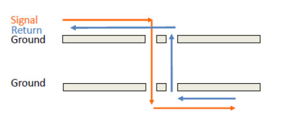{width=50%}

In the case of a mother-daughter board like GPU slotted in a PCIe port, we must switch the GND and PWR.

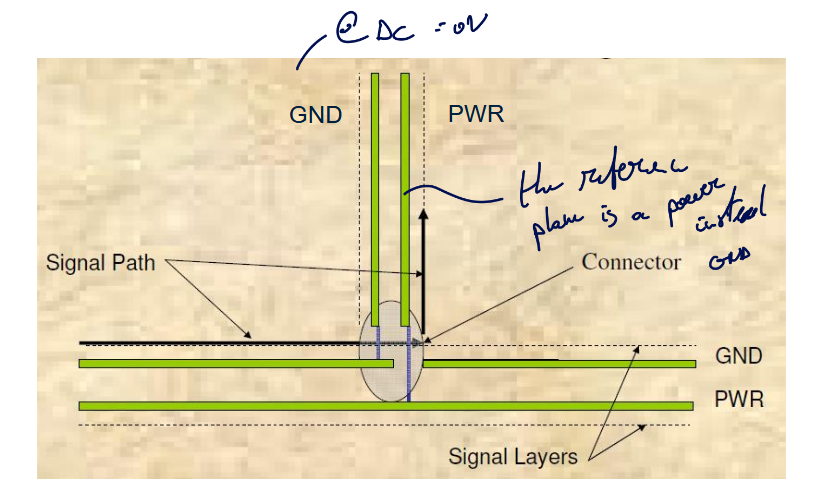{width=50%}

It can also be a good thing to place some extra decoupling cap between the two planes where we insert a return via.

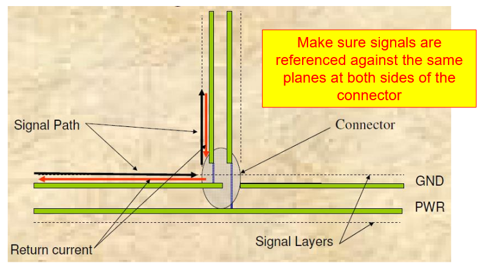{width=50%}

#### Multi-conductor TL

With flat ribbon cables:

- Minimum configuration: Return-Sig-Sig-Return-Sig-Sig-...
- Best configuration: Return-Sig-Return-Sig-...

This can be seen as the 1D shield seen previously in the class. This is still not the best shielding.

The best solution is to bundle all the wires together. For connector, scatter some return wires through the panel or better, intertwined them all together at a ratio of 1:1.

Twisted pair still remains the best solution as the flux can cancel each other's polarity and improve isolation. It is even better if we can attach the twisted pair next to a metallic plate. Always keep returning path close to signal path.

### 2 - Dipole & Monopole antennas

Can appear more than we think (e.g.: heatsink). A dipole/monopole is simply 2 metal parts excited by a voltage.

### 3 - Make good HF connections

It is simply to ensure that the designed path for return current is going to be the one used as we have a much lower impedance. But DC low impedance is **not** HF low impedance, a 1 meter cable will gets a much high resistivity even with higher gauge (linear increase with $f$)! (Green/yellow wire is not a low-Z HF, not meant to carry current, only used for safety)

For this matter, it is best to use flat and wide conductors and braided (skin effect). Always add shielding before connecting to a metallic plate. Also, make use of the EM shadow area of right angle plates. Evaluate possible aging effects.

### 4 - Use of shielded cables

We add a shield around conductors, must be careful to what is happening around the edges of the shield! Moreover, the shield must be thick enough to not transmit the J from inside or outside. The higher is the frequency the more pronounced is this effect.

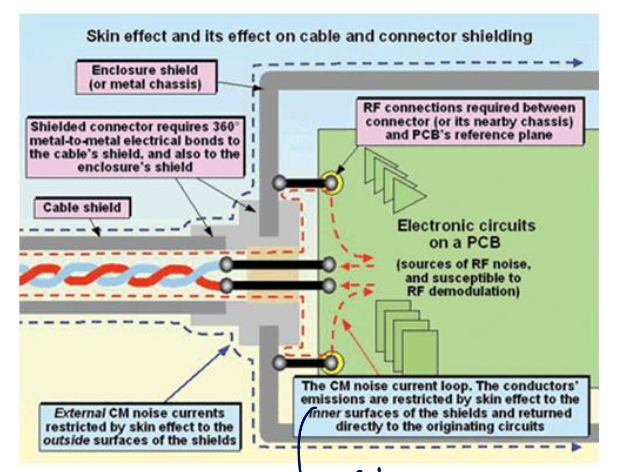{width=50%}

To transmit information between two shielded enclosures, it is important to not disrupt the shielding and use filters when we have unshielded connections coming in. All cables are routed close to the PEC.

### 5 - Segregation

Separate the components on a PCB, for example, avoid IO communications too close to clocked circuit as those circuits are not in sync with each other and may cause unforeseen effects. In summary:

- Keep IO from high-speed logic + memory
- shorter loop
  - HF oscillators close to circuits that needs it
  - IO drivers close to connectors
- Video + low-frequency analog circuits should have access to IO area without being near or crossing high-speed area
- Again, good HF connections to chassis (better reference plane especially for IO).

The critical signals in a PCB are:

- Small rise/fall times
- High fundamental frequency
- Large transient current when gate switch

System clock is the biggest enemy for EMC.

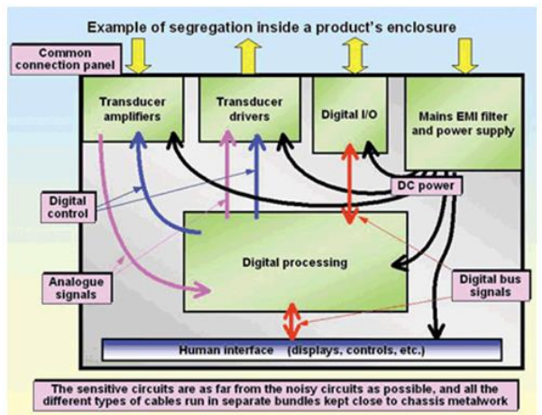{width=50%}

For larger systems, we can even imagine different compartment separating power and low signals. Also, bring chassis ground to IO but the best would be giving the same ground to every components.

To separate zones, the **keep out zone** should be 20 times larger than the thickness between the signal layer and the return plane.

### 6 - Filters

#### Working principle

The goal is to mismatch impedance so that an undesired input signal won't propagate to the output  (typical LC, RC filters).

#### Types

The passive filters have losses.

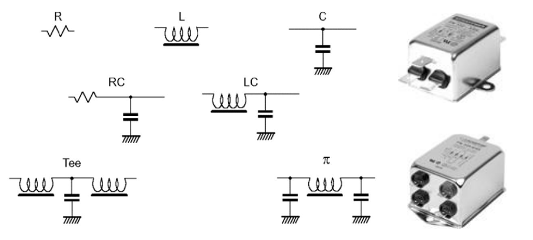{width=50%}

#### Insertion loss

This is a typical term in telecom circuits where inserting a DUT will impact the circuit and create losses.

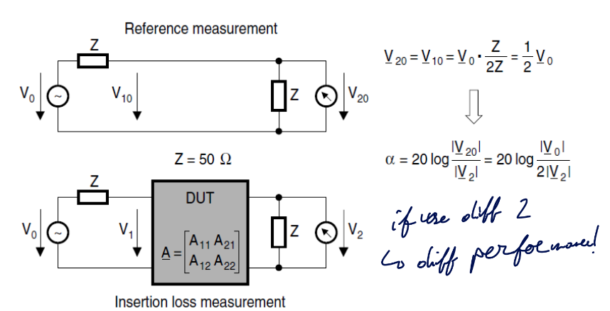{width=50%}

#### Source and load impedance

The filters performances will always be given assuming a 50 Ohm load and source impedance.

#### Ferrites

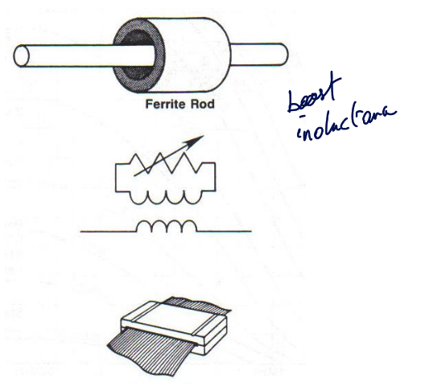{width=30%} 

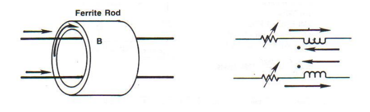{width=40%}

Here, we concentrate the CM current inside the ferrite to have more dissipation. The model has a frequency dependent resistor + mutual inductance.

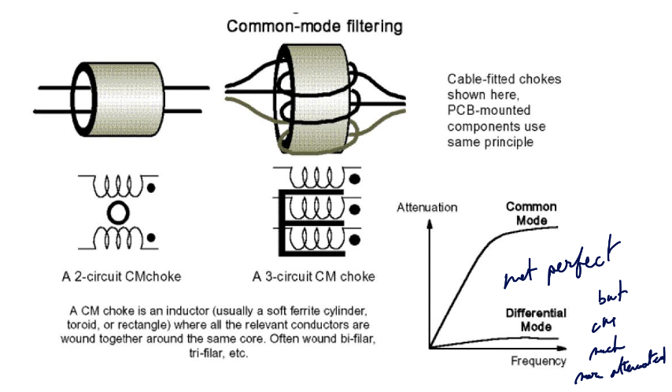{width=50%}

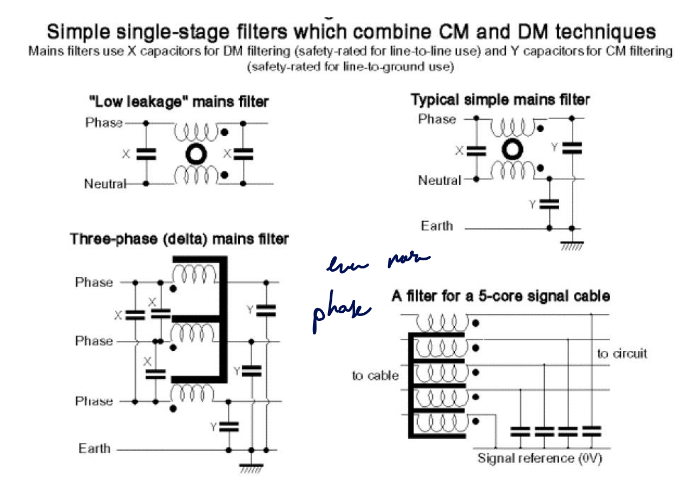{width=50%}

#### Placement

Bad grounding destroys the inductance's characteristics. 

Always avoid putting unfiltered/noisy signal wires next to filtered one. Inside a chassis, keep the distance with noisy side as short as possible (none is the best).