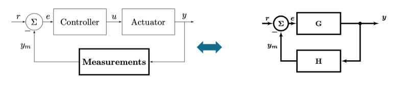
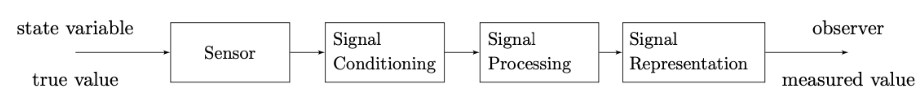

> **Note**
>
> This summary will only be based on the slides and lectures. No figures or copy from the cursus book is permitted due to copyrights.
>
> Nonetheless, it is recommended to also go through the cursus book as it may go more in depth than this summary

# Introduction

## Why is measuring important ?

In a feedback system, we want some input to transform in a specific output. Later, we want to measure this output to adapt the control and see how effective this is. 

Using the standard $G$ and $H$ notation we can find that:

\begin{align}
    y &= \frac{G}{1+GH}r & e&=\frac{1}{1+GH}r\\
    y&= \lim_{G\rightarrow\infty} \frac{G}{1+GH}r \approx \frac{1}{H}r
\end{align}

## General principles

> Building a measurement system is transforming energy/information from one domain to another.

We first start by building the physical knowledge (build physical quantity model), mathematical reasoning (find how accurate we can make the model to reflect the system) and finally we must take noise and other limits into consideration.

In a system, at a high-level, there is 2 forms of variables:

1. **Across Variables:** describe the *state*, in **parallel** with the terminal. Effort to change the state
2. **Through Variables:** describe the *flow*, in **series** with the terminal.

Then combining those two can give us some fundamental quantities:
- $A\cdot T$: **power** generated or dissipated in the element
- $A/T$: **impedance** of the system. Describes how an element transforms an $A$ into a $T$

## Modelling a system : the physical model

We usually want to map the IO behavior based on physical knowledge. Each model tries to represent reality but will always introduce errors or not take into account higher order phenomena. 

For example, we can model a pressure change using a diaphragm to a capacitance change. If we take a simple spring model we don't take second order term into account which introduces errors.

| Strength                                     | Weakness                                                          |
| :------------------------------------------- | :---------------------------------------------------------------- |
| Good insight                                 | Error due to approximations                                       |
| System optimization is possible              | Derivation of this formula is not always straightforward/possible |
| Calibration techniques can be easily derived | Errors due to tolerances in fabrication                           |
:Strength and weaknesses of physical approach

## Correlation

A typical operation used in system is **correlation**, it is used to find the "likelihood" between two signals. It helps us extract features:

$$
R_{fg}(t) = \int_{-\infty}^{\infty} f(t) g(t-\tau) d\tau
$$

Knowing Fourrier's theory, we can represent any signal as a combination of $sin$ and $cos$. Instead of using $g(t-\tau)$, this gives us:

\begin{align}
F(f) &=F_{cosine}(f) + F_{sine}(f)\\
&= \int_{-\infty}^{\infty} (cos(2\pi ft) + i sin(2\phi ft)) f(t) dt 
\end{align}

### Freshen up of Laplace transform

The Fourier transform can be written as:

$$
\mathcal{F}f(t) = \int_{-\infty}^\infty e^{i 2\pi ft} f(t) dt
$$

The Laplace transform goes one step further by using the Euler notation $e^{ix} = cos(x)+isin(x)$ and extend the Fourier transform with complex numbers:

$$
\mathcal{L}f(s) = \int_{0}^\infty e^{-st} f(t) dt \qquad s=\sigma + i\omega t
$$

It can be seen that:

$$
\mathcal{F}(f(t)) = \mathcal{L}(f(t)) \Longleftrightarrow f(t) = 0 \text{ if } t<0
$$

Laplace transform is an easy tool to solve differential equation and work with derivative:

$$
\mathcal{L}\left( \frac{df(t)}{dt} \right) = s \mathcal{L}(f(t)) + f(0)
$$

## The Measurement Chain

> A measurement system converts a state variable in a measured value

The idea behind a *signal conditioning* is to reduce error and filter out the signal. This should also convert it into a digital signal that can be easily processed by a DSP block. DSP block is used to work with the input and realize complex function while the signal representation can be a screen, plot, ...

### 4 major components

#### Sensor

Each sensor is made of 2 sensors to be exact.

1. A primary that transform a physical quantity to an "*easier to measure*" quantity
2. A secondary that converts this quantity into an electrical signal

#### Signal conditioning 

This is usually an ADC block. Such block are limited by the current technologies and we call that a **technological constant** $C_T$. There is no free lunch and everything is a tradeoff leading to a basic formula from information theory:

$$
\frac{Speed(Accuracy)^2}{Power} = C_T
$$

An ADC needs an input **and** a reference voltage. I outputs $\frac{V_{in}}{V_{ref}} = \frac{N}{2^{n-1}}$. The flash converter using a resistive ladder is a typical (but bad way) to convert into digital. We also need a clock and comparators to convert.

Accuracy is important and the Effective Number of Bits or ENOB is a crucial metric for any system. Due to quantization error and the SNR required for 1 valid bit, we can find such formula[^1] :

[^1]: Find more information about how we can get such formula in the DAMSIC course, [***link to a summary of the course***](https://github.com/Tfloow/ESATSummary/raw/main/PDF/M1S2_DAMSIC.pdf). Check the section 4.1.2

$$
ENOB = \frac{SNDR - 1.76 dB}{6.02 dB}
$$