> **Note**
>
> This summary will only be based on the slides and lectures. No figures or copy from the cursus book is permitted due to copyrights.
>
> Nonetheless, it is recommended to also go through the cursus book as it may go more in depth than this summary

\part{Introduction}

# Introduction

## Why is measuring important ?

In a feedback system, we want some input to transform in a specific output. Later, we want to measure this output to adapt the control and see how effective this is. 

Using the standard $G$ and $H$ notation we can find that:

\begin{align}
    y &= \frac{G}{1+GH}r & e&=\frac{1}{1+GH}r\\
    y&= \lim_{G\rightarrow\infty} \frac{G}{1+GH}r \approx \frac{1}{H}r
\end{align}

## General principles

> Building a measurement system is transforming energy/information from one domain to another.

We first start by building the physical knowledge (build physical quantity model), mathematical reasoning (find how accurate we can make the model to reflect the system) and finally we must take noise and other limits into consideration.

In a system, at a high-level, there is 2 forms of variables:

1. **Across Variables:** describe the *state*, in **parallel** with the terminal. Effort to change the state
2. **Through Variables:** describe the *flow*, in **series** with the terminal.

Then combining those two can give us some fundamental quantities:
- $A\cdot T$: **power** generated or dissipated in the element
- $A/T$: **impedance** of the system. Describes how an element transforms an $A$ into a $T$

## Modelling a system : the physical model

We usually want to map the IO behavior based on physical knowledge. Each model tries to represent reality but will always introduce errors or not take into account higher order phenomena. 

For example, we can model a pressure change using a diaphragm to a capacitance change. If we take a simple spring model we don't take second order term into account which introduces errors.

| Strength                                     | Weakness                                                          |
| :------------------------------------------- | :---------------------------------------------------------------- |
| Good insight                                 | Error due to approximations                                       |
| System optimization is possible              | Derivation of this formula is not always straightforward/possible |
| Calibration techniques can be easily derived | Errors due to tolerances in fabrication                           |
:Strength and weaknesses of physical approach

## Correlation

A typical operation used in system is **correlation**, it is used to find the "likelihood" between two signals. It helps us extract features:

$$
R_{fg}(t) = \int_{-\infty}^{\infty} f(t) g(t-\tau) d\tau
$$

Knowing Fourrier's theory, we can represent any signal as a combination of $sin$ and $cos$. Instead of using $g(t-\tau)$, this gives us:

\begin{align}
F(f) &=F_{cosine}(f) + F_{sine}(f)\\
&= \int_{-\infty}^{\infty} (cos(2\pi ft) + i sin(2\phi ft)) f(t) dt 
\end{align}

### Freshen up of Laplace transform

The Fourier transform can be written as:

$$
\mathcal{F}f(t) = \int_{-\infty}^\infty e^{i 2\pi ft} f(t) dt
$$

The Laplace transform goes one step further by using the Euler notation $e^{ix} = cos(x)+isin(x)$ and extend the Fourier transform with complex numbers:

$$
\mathcal{L}f(s) = \int_{0}^\infty e^{-st} f(t) dt \qquad s=\sigma + i\omega t
$$

It can be seen that:

$$
\mathcal{F}(f(t)) = \mathcal{L}(f(t)) \Longleftrightarrow f(t) = 0 \text{ if } t<0
$$

Laplace transform is an easy tool to solve differential equation and work with derivative:

$$
\mathcal{L}\left( \frac{df(t)}{dt} \right) = s \mathcal{L}(f(t)) + f(0)
$$

## The Measurement Chain

> A measurement system converts a state variable in a measured value

The idea behind a *signal conditioning* is to reduce error and filter out the signal. This should also convert it into a digital signal that can be easily processed by a DSP block. DSP block is used to work with the input and realize complex function while the signal representation can be a screen, plot, ...

### 4 major components

#### Sensor

Each sensor is made of 2 sensors to be exact.

1. A primary that transform a physical quantity to an "*easier to measure*" quantity
2. A secondary that converts this quantity into an electrical signal

#### Signal conditioning 

This is usually an ADC block. Such block are limited by the current technologies and we call that a **technological constant** $C_T$. There is no free lunch and everything is a tradeoff leading to a basic formula from information theory:

$$
\frac{Speed(Accuracy)^2}{Power} = C_T
$$

An ADC needs an input **and** a reference voltage. I outputs $\frac{V_{in}}{V_{ref}} = \frac{N}{2^{n-1}}$. The flash converter using a resistive ladder is a typical (but bad way) to convert into digital. We also need a clock and comparators to convert.

Accuracy is important and the Effective Number of Bits or ENOB is a crucial metric for any system. Due to quantization error and the SNR required for 1 valid bit, we can find such formula[^1] :

[^1]: Find more information about how we can get such formula in the DAMSIC course, [***link to a summary of the course***](https://github.com/Tfloow/ESATSummary/raw/main/PDF/M1S2_DAMSIC.pdf). Check the section 4.1.2

$$
ENOB = \frac{SNDR - 1.76 dB}{6.02 dB}
$$

So in summary, building a physical models is a good step in the right direction to be able to better filter and analyze measurements.

# Characterization of measurements

## Measurement Errors

In any system, there will be error which will reduce its accuracy. The error is added after each operation in our model but it is important to understand how it **propagates** and its **origin**.

| Characteristics |                Absolute error |                             Relative error |
| :-------------- | ----------------------------: | -----------------------------------------: |
| Math            |                    $e=x_m -x$ |      $e_r = \frac{e}{x} = \frac{x_m-x}{x}$ |
| Unit            |         Same unit as variable |                             Unitless - ppm |
| Estimation      | Over-estimation, $e\propto G$ | Under-estimation, $e_r !\propto G$ |
:Comparing the two type of errors

\begin{align}
    x_m &= S(s)G(s)x+G(s)\bar{e_s} + \bar{e_c} &  &\text{Output measurement} & \bar{e_m} &= G(s) \bar{e_s} + \bar{e_c} & &\text{Error of this measurement}\\
    y &= \frac{x_m}{S(0)G(0)} &  &\text{Transfer function} &
    \bar{e_in} &= \frac{\bar{e_s}}{S(s)} + \frac{e_c}{S(s)G(s)} &  &\text{Input referred noise}
\end{align}

| Type        |                     Effect |                                  Example |
| :---------- | -------------------------: | ---------------------------------------: |
| Interfering |     Additive to the signal |                   Magnetic interferences |
| Modifying   | Modifies transfer function | Pressure sensor changes over deformation |
:Type and difference of errors

By understanding the nature of an error, we can reduce it or even make it disappear. Example, EM interference can disrupt ESG signals. Solution, add an extra probe (right leg) to also capture this interference and connect it to the $V_{ref}$. Now, $V_{in}$ and $V_{ref}$ in the ADC will have the same error which will cancel out.

## Error Propagation

We must understand how an error propagates in a system. We can build a simple model like:

$$
x_m = ax+by
$$

Where $x$ is the true value that will be measured $x_m$, but also possible interferance such as $y$. The error is:

$$
e_m = a\Delta x + b \Delta y
$$

We can also conduct some statistical analysis:

\begin{align}
    Var(x_m) &= \mathbb{E}\left[ (ax+by) - (\mathbb{E}(ax+by))^2 \right]\\
    &= ...\\
    \sigma_m^2&= a^2 \sigma_x^2 + b^2 \sigma_y^2 + 2 ab \sigma_{xy}
\end{align}

The last term is often forgotten because a lot of person assume $\perp$ between $x$ and $y$ which is not always the case. The covariance is null only if uncorrelated. So typically, if the errors are due to the same source, their covariance is most likely correlated.

### Non-linear functions

For more advance transfer function that are non-linear, we can rewrite it using the Taylor series:

$$
f(x,y) = f(x_1, y_1) + \frac{\partial f}{\partial x}(x-x_1) + \frac{\partial f}{\partial y}(y-y_1) + ...
$$

Assuming a small error we can simplify our function and say that

$$
 \sigma_m^2 \approx  \frac{\partial f}{\partial x}^2 \sigma_x^2 + \frac{\partial f}{\partial y}^2 \sigma_y^2 +  2 \frac{\partial f}{\partial x}\frac{\partial f}{\partial y} \sigma_{xy}
$$

### Static Characteristics

- **Range \& Span**: range is the min and max while the span is the delta between the two
  - Those values should reflect where the system is still meeting its specifications

#### Linearizing the reading

Knowing the range, we could force a simple linearization using:

$$
O-O_{min} = \frac{O_{max} - O_{min}}{I_{max} - I_{min}} (I-I_{min})
$$

But this is far from ideal, a better solution is the least square solution:

\begin{align}
    K &= \frac{Cov(X_1,Y_1)}{Var(X_1)}\\
    &= \frac{X_1 Y_1-n\overline{X_1 Y_1}}{X_1 Y_1-n\overline{X_1}^2}
\end{align}

| Metric    |                                                                   Description |                                                           Issue |
| :-------- | ----------------------------------------------------------------------------: | --------------------------------------------------------------: |
| Max error |                                            Maximum error from ideal and model |                                     Doesn't give a real insight |
| DNL       | Difference between width of the step and ideal LSB step. <1LSB or problematic |                                    Watch out for sign inversion |
| INL       |                                                  Maximum deviation (max(DNL)) |                                                    Less insight |
| THD       |         Each non-linearity causes distortion, highlight the distortion nature | Doesn't give information about the non-linearity characteristic |
:Quick overview of the metrics

It is important to understand the error of the non-linearity. Because compensating for it is costly as we will use a polynomial to cancel it. The order of the polynomial will require $n+1$ calibration measurements.

#### Resolution

> **Definition**
>
> Resolution is the smallest discrete step a system can take
>
> $$resolution = \frac{\Delta I_R}{I_{max} - I_{min}} \cdot 100 \%$$

The resolution isn't the accuracy as we could add dummy 0 which won't improve the accuracy but the resolution.

#### Hysteresis

It is a truly physical phenomena that depicts how when changing the input and reducing it will not lead to the same output path due to various reasons.

#### Dynamical errors

When measuring something, we often think we are in the steady state which is not really the case. Most of the time we will wait $x$ amount of time until it is "*good enough*".

This is all linked with the **memory elements** that is present in mechanical, electrical, ... systems. The more **independent** memory elements we have the higher is the order of the system. We talk here about settling time which models the *exponential* behavior of such event;

$$
\varepsilon = \Delta I expt\left( -\frac{t}{\tau}\right)
$$

Of course, Taylor series can be used for small amplitude: $TF(s) = \frac{\partial O}{\partial I}\large|_{I=I^*} 1/(1+s\tau)$

**Page 66**

## Measurement Characteristics

**Page 99**

### Quantization noise

When measuring through an ADC, we can see the loss of precision due to limited bitwidth as noise. It is not physical noise but more like a mathematical tricks to model the impact of quantization on signal. For this to work we must use the postula that the input is a varying signal. If it is not a varying signal, the error will be constant and not looking like white noise aka spread equally. The mean value of this noise will be 0:

$$
\mathbb{E}(e_q) = \frac{1}{\Delta I_R} \int_{-\frac{\Delta I_R}{2}}^{\frac{\Delta I_R}{2}} e \text{ } de=0
$$

The power can be seen as:

\begin{align}
    \sigma^2_q &= \frac{1}{\Delta I_R} \mathbb{E} \left((e_q - \mathbb{E}(e_q))^2\right)\\
    &= \frac{1}{\Delta I_R} \int_{-\frac{\Delta I_R}{2}}^{\frac{\Delta I_R}{2}} e^2 \text{ } de\\
    &= \frac{\Delta^2 I_R}{12}
\end{align}

As used and explained earlier, the $\sigma^2$ is the power of the signal (total integrated noise). The spectrum is limited to $f_s/2$. So we can model an ADC with an extra white noise source with a noise power of $\frac{\Delta^2 I_R}{12}$ with a bw of $f_s/2$. 

# Building a chain : reducing errors

{ width=70% }

Each blocks add offset, gain error and noise. This is commonly represented as the chain above. 

## Gain distribution

A common way to summarize a chain is by using *input referred* value. This also showcases some basic idea in measurement chains.

$$
v_{in}^2 = \frac{v^2_{n1,o}}{A_1^2} + \frac{v^2_{n2,o}}{A_1^2A_2^2} \qquad I_{ADC} = (V_{in} + v_{off,1}) A_1A_2 + v_{off,2} A_2
$$

We have to maximize the first stage gain as it will reduce the impact of noise for later stage components. But we are limited by the offset in the ADC. 

## Noise filtering

Another way to reduce the noise by averaging it:

$$
\sigma_n^2 = \sum_{i}^N \frac{x_i - \bar x}{N-1}
$$

This corresponds to filtering in the frequency domain. We have to be careful with aliasing and this technique cannot refer the $1/f$ noise.

## Chopping and modulation

Offset and $1/f$ cannot be filtered sadly. We would need 0 bandwidth filter for this. Another solution would be to **shift** the noise to higher frequencies:

$$
sin(\omega t) sin(\omega_c t) = \frac{cos((\omega_c - \omega) t) + cos((\omega_c + \omega)t)}{2}
$$

{width=70%}

### Demodulation

Using a sine, half of the energy is lost sadly. This is why actual chopping with a square wave is better.

### Chopping

{width=75%}

This will retain the signal energy. The input signal is modulated with pulse train, offset + $1/f$ added by $A_2$. Then demodulated at higher frequencies. Thus, a low-pass filter will not take the high frequency $1/f$ and offset. We are using a 1 -1 square wave.

We must have perfect reconstruction but amplifier has a finite bw. This cannot be easily realized as real components are not perfect. Chopping error.

The square wave signal contains all of the frequency and some beyond the amplifier $A_2$. This result also in chopping spikes. The chopping error at $2\omega_c$ will be gone but still problems. Energy put at $2\omega_c$ is also lost at the 0 frequency. It is a gain error, if 0 at input, 0 at output no error. The stronger is the signal the larger is the error thus gain error. The error becomes:

$$
\frac{4\pi}{\sqrt{2}} \sqrt{\left( \frac{\tau}{T} \right)^2 \frac{1}{1+\frac{\tau}{T}}}
$$

## Feedback

A good solution is feedback as it will remove distortion and improve settling.

$$
y = \frac{MG}{1+MGH}V_{in} + \frac{G}{1+MGH}\varepsilon\approx\frac{V_{in}}{H} + \frac{\varepsilon}{MH} = \frac{V_{in}}{H} \quad G\rightarrow\infty
$$

#### Example

Measurement of current in electric car. Use a TMR system but has 2 issues:

1. hysteresis
2. temperature issue: modifying environment error

We cannot directly measure on the path, add coils to counter-act the magnetic field which will linearize the reading by fighting an EM field effect with another EM field.

## Calibration

> **Definition**
>
> Calibration is a method to remove an error by measuring the signal with a better sensor and using this measurement to compensate errors (typically drift)

Typically realize offset and gain calibration. This can be realized in the factory, online (using a switch that measure known value then compare. Can also be a random signal in more advanced system) or timed calibration.

If we are measuring and calibrating with a worse system, we are increasing our error.

#### Gain error example

\begin{align}
    V_{out,cal} &= (BS+V_{offset} - a)b & \hat a &= b(a-V_{offset})\\
    V_{out,cal} &= B\hat b + \hat a & \hat b &= Sb
\end{align}

{width=80%}

We need two measurements to be able to model the error. We can see in the math that our calibration will be as good as the accuracy and noise we have.

Need long time to measure to average out the noise. Know the curve and what we should be expecting. Spread the points as wide as possible. A small error between two close points will result in large issues. Calibration is thus a mean to remove *stochastic error*.

## Compensation

> **Definition**
>
> Compensation is a technique where an environmental error is removed by measuring th is variable using another sensor

### Hall sensor compensation

Typically, if we know that a sensor may be subjected to variation due to temperature, we will try to measure temperature too to counteract this effect.

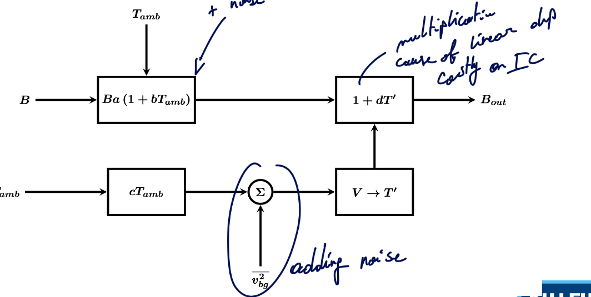{width=65%}

> *Note*
>
> Here, we multiply $T'$ by $d$ instead of dividing it as division is an expensive operation in digital.

The output of this chain is:

$$
B_{out} = Ba(1+bT_{amb}+ cdT_{amb}+bcdT_{amb}^2)
$$

We want the $B_{out}/B$ ratio to be constant, in other words not dependent on the temperature. One solution is to make the slope 0 at some temperature. This will require **2** calibration points.

We could also use a quadratic measurement chain. This can make the slope equal 0 on a larger interval of temperature. 

#### noise of the temperature sensor

But, we will also have noise coming from this compensation chain. Namely the added noise is modeled as:

$$
\sigma_{B_{out}}^2 = \left( \frac{dB_{out}}{dT'} \right)^2\bigg|_{T'=T_{amb}} \sigma^2_{T'}
$$

Luckily, the temperature is a slow varying process meaning that the bandwidth is in the Hz range. This can be thus filtered out as magnetic field has a bandwidth in the kHz range.

## Conclusion

- White noise can be filtered
- Flicker noise limits the applicability of filtering
    - Move 1/f to higher frequencies : chopping
- Static errors can be removed using calibration
- Environmental errors can be removed using compensation

- BUT : every correction technique adds errors
  - Filtering $\rightarrow$ settling error
  - Chopping $\rightarrow$ gain error
  - Calibration $\rightarrow$ as good as calibration equipment
  - Compensation $\rightarrow$ add noise of compensating sensor

# Measuring electrical quantities

## OpAmp

Basic facts about OpAmp:

- High input impedance: so almost no current flows in
- Low output impedance: delivers lots 
- Very high gain
- Has a positive and negative terminal

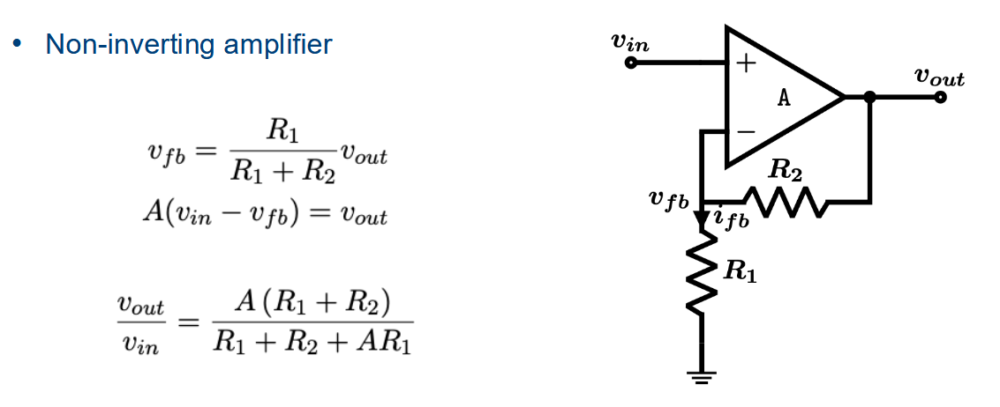{width=70%}

With $\lim_{A \rightarrow \infty}$ we get $1+\frac{R_2}{R_1}$. This means we can control the exact gain by controling the resistance ratio. Then, by combining two together, we can make an *instrumentation amplifier*:

{width=70%}

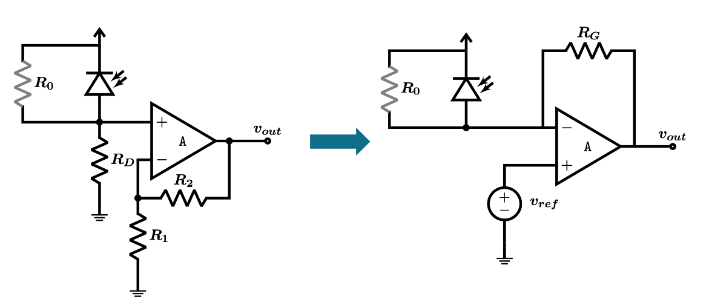{width=70%}

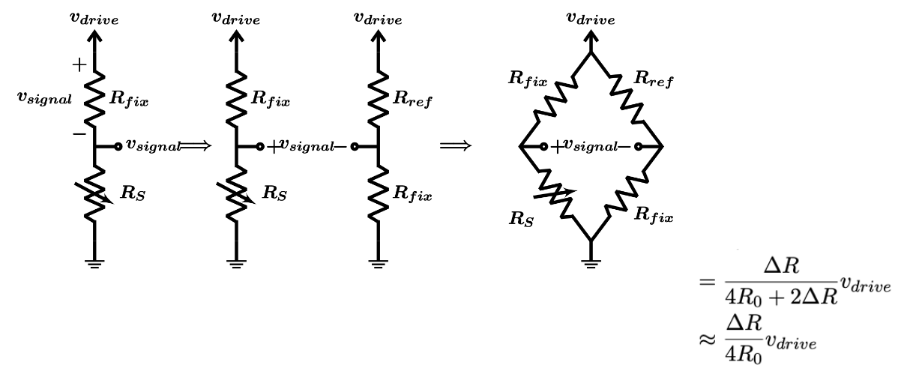{width=70%}

In the Wheatstone bridge, the $2\Delta R$ factor at the denominator will create non-linearity.

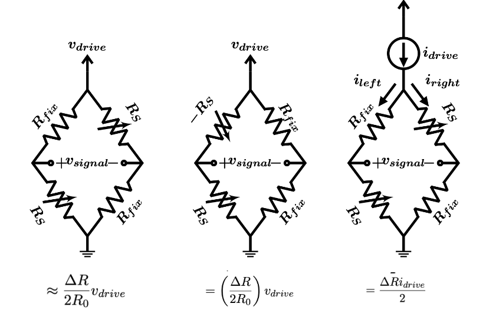{width=70%}

## Measuring reactive elements

As seen previously, reactive elements cannot be measured with DC currents as they will either short or be open. A good way is to apply a chopping/square signal instead of a $sin$ to avoid the reduction of energy by a factor 2.

### Using oscillators to measure reactive elements

An oscillator is a feedback device that becomes a positive feedback. This must respect the **Barkhausen criterium**:

\begin{align}
    |G(j \omega_n)H(j \omega_n)| &= 1\\
    \angle G(j\omega_n) + \angle H(j\omega_n) &= \pi
\end{align}

The $\pi$ indicates an inverse of the sign. Instead of a negative feedback, it becomes positive.

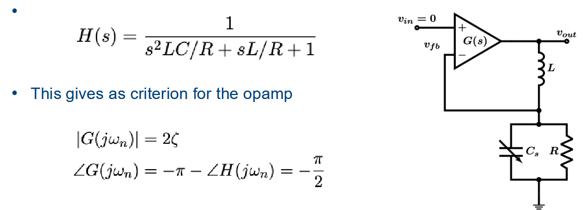{width=75%}

The resistance must be compensated.

$$
\omega_n = \frac{1}{\sqrt{LC}} \qquad \zeta = \frac{1}{2R} \sqrt{\frac{L}{C}} \qquad Q = R\sqrt{\frac{C}{L}}
$$

The $Q$ factor is a metric that depicts the quality of a system. It is the ratio of the total energy of the system over the power dissipated over a cycle $\omega$:

$$
Q = \frac{1}{2 \zeta} = \omega \frac{\text{Max energy stored}}{\text{Power loss}}
$$

The higher is the $Q$ factor, the narrower is the oscillation band. This makes it tough to oscillate but once in oscillation, it is hard to stop it.

#### Measuring the frequency

We can use a counter based on a system clock that will monitor the oscillation. The precision of this measurements is as a good as the digital clock (jitter, noise, ...). Of course, the clock should have a higher frequency than the frequency we are trying to monitor (Shanon sampling frequency, ...).

\begin{align}
    \Delta \omega &= \left( \frac{\partial \omega_n}{\partial C} \right) \Delta C\\
    &= \frac{1}{2} \frac{1}{\sqrt{LC^3}} \Delta C\\
    &= \frac{\omega_n}{2C_0}\Delta C
\end{align}

## Conclusion

- The design of a measurement chain is aimed to reduce the errors :
    - Meet the input range of the ADC to reduce quantization noise 
      - to avoid clipping or simply not using the full dynamic range
    - Filter of noise
    - Use chopping / modulation to be able to split frequencies
    - Calibration can be used to reduce production errors
      - For stochastic
    - Compensation to reduce environmental errors
    - Use feedback to reduce errors and improve dynamics

\part{sensors and specific measurement equipment}

**Page 154**

\part{Exam Questions}

# Theory questions

NotebookLM but verified by hand:

**Question 1:** Discuss resolution in measurement systems, give 2 examples. What is the influence on noise?

**Answer:** Resolution is defined as the smallest change in the input signal that produces a detectable change in the output signal. 
 
*  **Example 1:** A wire-wound potentiometer has a resolution limited by the thickness of the wires; the wiper moves in discrete steps from one turn to the next.
 
*   **Example 2:** An Analog-to-Digital Converter (ADC) has a resolution defined by its bit depth. For a voltage range $V_{ref}$, the resolution is $V_{ref}/2^n$.
 
*   **Influence on noise:** Resolution is often modeled as **quantization noise**. This is a mathematical formulation of the quantization error and is not a real noise! We assume random varying input which will create an uniformly distributed error. This error is assumed to be uniformly distributed between $\pm 0.5$ LSB, resulting in a noise variance (power) of $\Delta I_R^2 / 12$, where $\Delta I_R$ is the resolution step.

**Question 2:** Describe hysteresis. Give one example. Explain how feedback can be used to reduce hysteresis.

**Answer:** Hysteresis is a static error where the output value depends on the direction of the input change (history dependence). A common example is magnetic hysteresis in ferromagnetic materials, or mechanical backlash in a gearbox.
Feedback reduces hysteresis by placing the non-linear element in the forward path ($G$) and having a high loop gain. The transfer function becomes $y \approx 1/H$, meaning the system accuracy depends on the feedback path ($H$) rather than the hysteresis-prone forward path. For example, in a current sensor, a feedback coil generates a magnetic field to cancel the field being measured, keeping the hysteresis-prone magnetic sensor at a constant zero-field operating point.

**Question 3:** Elaborate on non-linearity. Which measurement characteristics describe non-linearity. Explain how feedback can be used to reduce non-linearity.

**Answer:** Non-linearity is the deviation of a system's transfer function from a straight line.
 
*   **Characteristics:** It is described by the maximum deviation from an Ideal Straight Line (often using least-square approximation), Integral Non-Linearity (INL), Differential Non-Linearity (DNL), and Total Harmonic Distortion (THD) in the frequency domain.
 
*   **Feedback:** Similar to hysteresis, negative feedback linearizes a system. If the forward gain $G$ is sufficiently high, the closed-loop transfer function approximates $1/H$. If the feedback component $H$ is linear, the overall system becomes linear, regardless of the non-linearity in $G$.

**Question 4:** Discuss the difference between rise time and settling time for a second order measurement system.

**Answer:**
 
*   **Rise Time ($t_r$):** The time required for the response to rise from a specified low value (e.g., 10%) to a specified high value (e.g., 90%) of its final value, or simply the time to reach the first crossing of the final value.
 
*   **Settling Time ($t_{settle}$):** The time required for the response curve to reach and stay within a specified error band (e.g., $\pm 2\%$) of the final steady-state value.
In an underdamped second-order system, the signal rises quickly (short rise time) but oscillates (rings), potentially causing a long settling time.

**Question 5:** Discuss the importance of differential systems. Discuss non-linearity and environmental interferers.

**Answer:** Differential systems measure the difference between two signals ($I_+ - I_-$) rather than a single signal relative to the ground.
 
*   **Non-linearity:** In a differential system, the even-order harmonic terms in the Taylor series expansion cancel out. This eliminates even-order harmonic distortion, leaving only odd harmonics, which improves linearity.
 
*   **Environmental Interferers:** Interfering inputs (like electromagnetic noise or supply voltage ripples) often affect both signal lines equally (Common Mode). A differential amplifier rejects these common-mode signals, amplifying only the differential measurement signal.

**Question 6:** Explain aliasing. Couple this to kT/C noise. When having a resistive sensor of 1/(2pi) MOhm filtered with a capacitor of 100pF, why would we need to take kT/C when we sample at 1kHz?

**Answer:** Aliasing occurs when a signal is sampled at a frequency $f_s$ less than twice its bandwidth. Frequencies above $f_s/2$ fold back into the baseband, causing distortion.
$kT/C$ noise is the total integrated thermal noise on a capacitor. Even if a low-pass RC filter has a bandwidth much higher than the sampling frequency, the wideband thermal noise above $f_s/2$ will alias (fold) down into the baseband during sampling.
 
*   **Example:** With $R \approx 159 k\Omega$ and $C=100 pF$, the filter bandwidth is $f_c = 1/(2\pi RC) \approx 10 kHz$. If we sample at 1kHz, the noise between 0.5kHz and 10kHz (and beyond) folds into the 0-500Hz band. The total noise power remains $kT/C$ regardless of the sampling rate, making it the fundamental noise limit for sampled systems.

**Question 7:** Long term drift. Explain why we can accelerate the drift measurements. Give 2 different drift tests.

**Answer:** Long-term drift is caused by aging processes (chemical/mechanical) which are temperature-dependent. According to the Arrhenius equation, reaction rates increase exponentially with temperature. Therefore, testing at elevated temperatures accelerates the aging process, allowing lifetime prediction in a shorter time.
 
*   **Tests:**
    1.  **HTOL (High Temperature Operating Life):** Device operates at high temp (e.g., 150°C).
    2.  **TCT (Temperature Cycling Test):** Device is cycled between temperature extremes to test mechanical stress robustness.

**Question 8:** Explain the difference between white noise and pink noise. Explain why we cannot filter 1/f noise.

**Answer:**
 
*   **White Noise:** Has a flat power spectral density (energy is constant per Hz). Originates from thermal motion of electrons.
 
*   **Pink Noise (1/f):** Power spectral density is inversely proportional to frequency (increases at low frequencies). Originates from carrier trapping/detrapping.
 
*   **Filtering:** Standard low-pass or high-pass filters cannot remove $1/f$ noise because it dominates at low frequencies (near DC), which is typically where the measurement signal of interest resides. Filtering the noise would also filter the signal.

What about chopping ???

**Question 9:** Why can we represent resolution as quantization noise? Can we filter quantization noise? Elaborate.

**Answer:** Resolution error is the rounding error between the analog input and digitized output. This error is uniformly distributed between $\pm 0.5$ LSB. Statistically, this acts like an added noise source with variance $\sigma_q^2 = \Delta^2 / 12$.
 
*   **Filtering:** Yes, quantization noise can be filtered. Since it is approximately white noise spread over the Nyquist bandwidth ($f_s/2$), sampling at a higher frequency (oversampling) and then digitally low-pass filtering (averaging) reduces the noise power in the signal bandwidth, effectively increasing the effective number of bits (ENOB).
*   Typically we can use some sigma delta design to oversample and spread the noise.

**Question 10:** Give a block diagram of a generalized measurement chain. Discuss gain distribution. Why would we sometimes split up the gain in several amplifiers in series?

**Answer:**
 
*   **Block Diagram:** Sensor $\rightarrow$ Signal Conditioning (Amplification/Filtering) $\rightarrow$ Signal Processing (DSP) $\rightarrow$ Representation.
 
*   **Gain Distribution:** To minimize noise, high gain should be applied as early as possible in the chain. However, high gain on the first stage can cause saturation due to the amplification of offset voltages or large DC components.
 
*   **Splitting Gain:** Gain is split into multiple stages (e.g., Stage 1 $\rightarrow$ Filter/Offset Removal $\rightarrow$ Stage 2) to amplify the signal without saturating the chain with offset errors. Typically if each OpAmp has 1 V of output swing, we could quickly saturates if we have a micro V measurement and mV offset.

**Question 11:** Explain chopping. Why would we use this in measurement systems? What is the origin of chopping ripple?

**Answer:** Chopping is a modulation technique where the input signal is modulated (multiplied) by a square wave to a higher frequency. The amplifier then processes this high-frequency signal. Since the amplifier's offset and $1/f$ noise are at low frequencies, they are separated from the signal.
 
*   **Use:** It allows the removal of offset and $1/f$ noise by filtering or demodulation later in the chain.
 
*   **Ripple Origin:** Chopping ripple arises because the square wave modulation produces harmonics. If the amplifier has finite bandwidth or if the subsequent low-pass filter is not perfect, residual high-frequency components remain, causing ripple.

**Question 12:** What is aliasing? How can we avoid this? What is the consequence for a measurement system?

**Answer:** Aliasing is the phenomenon where high-frequency signals (above the Nyquist frequency $f_s/2$) are indistinguishable from lower frequencies after sampling.
 
*   **Avoidance:** Apply an anti-aliasing low-pass filter before the ADC to attenuate frequencies above $f_s/2$.
 
*   **Consequence:** High-frequency noise or interference folds into the signal band, corrupting the measurement and increasing the noise floor (e.g., $kT/C$ noise).

**Question 13:** Discuss calibration: what will limit the accuracy? why would we need to take a long calibration time into account? Give an example why knowledge on the sensor helps the calibration process.

**Answer:**
 
*   **Limit:** The accuracy of a calibrated sensor is limited by the accuracy of the reference equipment used for calibration.
 
*   **Time:** Calibration measurements must be averaged over a long time to filter out noise, ensuring that only the systematic error (offset/gain) is corrected.
 
*   **Knowledge:** Knowing the physics allows using the correct model (e.g., polynomial order). For example, knowing a thermistor follows an exponential law allows for better linearization and fewer calibration points than blindly fitting a high-order polynomial.

**Question 14:** Explain the difference between compensation and calibration.

**Answer:**
 
*   **Calibration:** Correcting the device's intrinsic imperfections (tolerances like offset and gain error) by comparing it against a known standard. It is a one-time or periodic factory process.
 
*   **Compensation:** Correcting for *external* environmental effects (like temperature or stress) by measuring that environment (e.g., using a temp sensor) and adjusting the output in real-time based on a known sensitivity model.

**Question 15:** Draw the schematic of an instrumentation amplifier. Elaborate on its most important properties.

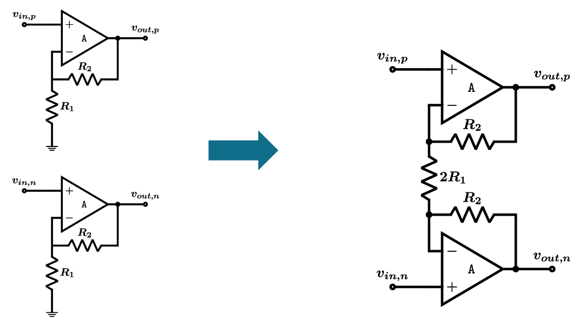{width=60%}

**Answer:** An instrumentation amplifier consists of two input buffers (non-inverting amplifiers) feeding into a differential amplifier.
 
*   **Properties:** It offers very high input impedance (does not load the sensor), high differential gain (set by a single resistor $R_g$), and high Common Mode Rejection Ratio (CMRR) to reject environmental noise.

**Question 16:** Explain the non-linearity of a Wheatstone bridge with only 1 sensing element. Discuss how to improve this. Give an example on how we could create a measurement system with 2 resistive sensors with inverted sensitivities.

**Answer:**
 
*   **Non-linearity:** A quarter bridge (1 variable resistor) has a transfer function $V_{out} \approx V_{drive} \frac{\Delta R}{4R_0 + 2\Delta R}$. The term $2\Delta R$ in the denominator causes non-linearity.
 
*   **Improvement:** Use a constant current drive or use multiple sensing elements. Using two elements with opposite sensitivities (one increases $R$, one decreases $R$) in the same branch linearizes the output.
 
*   **Example:** A bending beam with one strain gauge on top (tension) and one on the bottom (compression) creates opposite resistance changes.

**Question 17:** Describe the design of an oscillator as a sensor readout interface for a reactive sensor element.

**Answer:** A reactive sensor (Capacitor or Inductor) is placed in the feedback network of an amplifier to form an oscillator. The circuit must satisfy the Barkhausen criteria (Loop gain $\ge 1$, Phase shift = $360^\circ$). The oscillation frequency becomes a function of the sensor value (e.g., $\omega_n = 1/\sqrt{LC}$). The readout measures the frequency or period, effectively digitizing the signal without a standard ADC. We just need a digital counter.

**Question 18:** Explain the working principle of a strain gauge.

**Answer:** A strain gauge is a resistive sensor where resistance changes due to mechanical deformation (strain). The resistance change $\Delta R/R$ is caused by changes in geometry (length $l$ increases, area $A$ decreases) and the change in resistivity $\rho$. It is characterized by the Gauge Factor $G$ usually between 2 to 2.2.

Moreover, the stress and strain have a linear relationship. It is sensitive in only 1 direction

**Question 19:** Explain the working principle of an Hall sensor. Bonus question: explain spinning and explain why we can spin a Hall sensor and not another Wheatstone bridge.

**Answer:** A Hall sensor uses the Lorentz force. When current flows through a conductor in a magnetic field, charge carriers are deflected, creating a voltage perpendicular to both current and field. A hall sensor can be modeled as a wheatstone bridge which is anti-symmetrical. This is a major difference between regular wheatstone bridge which have one sensing arm and one reference arm, here everything is sensing and this fact is used for spinning.
 
*   **Spinning:** A technique to remove offset. The current direction is rotated by 90 degrees (terminals are swapped). The signal polarity flips, but the offset (due to resistive mismatch) remains or behaves differently. Averaging the phases cancels the offset. This is possible because the Hall plate is a symmetric 4-terminal device where input and output ports are geometrically interchangeable, unlike a standard Wheatstone bridge which has distinct drive and sense nodes.

**Question 20:** Why do we need at least 2 temperature sensors for getting a high accuracy in a MoX sensor?

**Answer:**

1.  **Heater Control:** One sensor measures the heater temperature to maintain the precise high temperature required for the chemical reaction. We must precisely heat up MOx to 600 degree C.
2.  **Compensation:** The second sensor measures the temperature of the sensing gas layer itself to compensate for the temperature dependence of the MOx material's resistivity.

**Question 21:** Explain a capacitive pressure sensor. Why do we need a CDAC?

**Answer:** A capacitive pressure sensor consists of a fixed plate and a flexible diaphragm. Pressure bends the diaphragm, changing the distance $d$ and thus the capacitance $C = \epsilon A / d$.
 
*   **CDAC:** A Capacitive Digital-to-Analog Converter is needed to subtract the large resting capacitance $C_0$ of the sensor. The sensor measures $C_0 + \Delta C$. Since $C_0 \gg \Delta C$, amplifying the raw signal would saturate the readout. The CDAC cancels $C_0$ so only $\Delta C$ is amplified.

**Question 22:** Explain how an accelerometer works. What is the difference between a capacitive accelerometer and a piezoresistive based accelerometer.

**Answer:** An accelerometer uses a mass-spring-damper system. Acceleration acts on the mass ($F=ma$), causing a displacement $x$ against the spring.
 
*   **Capacitive:** Measures the displacement $x$ by detecting the change in capacitance between fingers on the mass and a fixed frame. It has low power and low noise. Needs a CDAC for accurate readout.
 
*   **Piezoresistive:** Measures the stress in the spring/beam supporting the mass using strain gauges. It is generally less sensitive and consumes more power (resistive heating) but is easier to read out.

**Question 23:** Give 3 examples of capacitive sensors: one where we measure a difference in distance, one where we measure a difference in dielectric, one where we measure a difference in area.

**Answer:**

1.  **Distance:** Pressure sensor (diaphragm moves).
2.  **Dielectric:** Humidity sensor (polymer absorbs water, changing $\epsilon_r$).
3.  **Area:** Capacitive touch screens.

**Question 24:** Draw a typical piezo crystal readout. Explain the bode plot of a typical piezo crystal readout.

**Answer:**

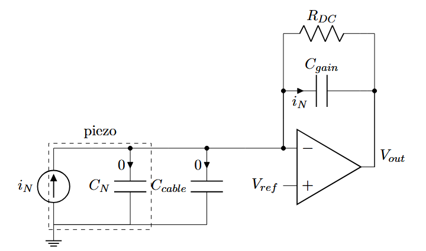{width=45%} 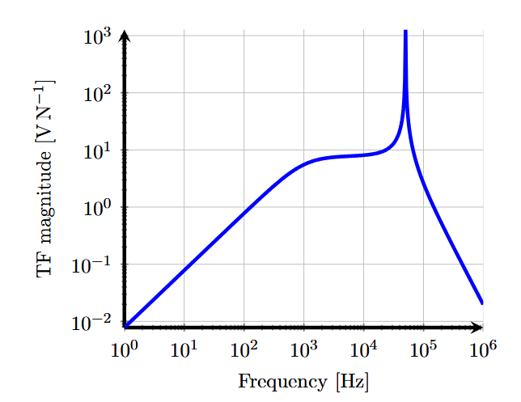{width=45%}
 
*   **Readout:** Typically a charge amplifier (op-amp with a capacitor in the feedback loop) to convert the charge $q$ generated by the crystal into a voltage.
 
*   **Bode Plot:** A piezo sensor behaves like a second-order system. The Bode plot shows a flat response (or rising depending on the variable) up to a sharp **resonance peak** at the crystal's natural frequency $\omega_n$, followed by a roll-off. This peak corresponds to the high Q-factor of the crystal. The piezo acts as an differentiator (cap in parallel) and this must be compensated by an integrator. For proper bias, we must add an extra resistor which will create an extra zero. But assuming sufficient gain, the current flows through C gain shielding from cable or n capacitance.

**Question 25:** Elaborate on acoustic transmission. What is acoustic impedance? what is reflection / transmission.

**Answer:**
 
*   **Acoustic Impedance ($Z_A$):** A material property defined as the product of density $\rho$ and sound velocity $c_L$ ($Z_A = \rho c_L$). It determines how sound propagates. Across/through variable for any system.
 
*   **Reflection/Transmission:** When sound hits an interface between two materials with different impedances ($Z_1, Z_2$), part of the energy is reflected and part is transmitted. The reflection coefficient depends on the mismatch $(Z_2 - Z_1)/(Z_2 + Z_1)$.

**Question 26:** Explain echography. Give some applications. How can we measure depth and material at the same time?

**Answer:** Echography transmits an ultrasonic pulse and listens for reflections (echoes) from interfaces.
 
*   **Applications:** Medical imaging (fetus), Non-Destructive Testing (cracks in metal).
 
*   **Depth/Material:** Depth is measured by the Time-of-Flight (ToF) of the echo ($d = c \cdot t / 2$). Material properties (impedance change) are inferred from the *amplitude* of the reflected echo.

**Question 27:** Why does a doctor use a gel in echography. Explain the properties of the gel. How would the gel change for measuring cracks in metal ( no numbers / just principle )

**Answer:** Gel is an impedance matching layer. Without it, the large impedance mismatch between the probe (quartz) and air would cause total reflection, and no sound would enter the body.
 
*   **Properties:** The gel has an acoustic impedance between that of the probe and the skin ($Z_{gel} \approx \sqrt{Z_{probe} Z_{skin}}$) to maximize transmission.
 
*   **For Metal:** A different coupling medium (oil or water) with a much higher impedance is needed to match the high impedance of metal.

**Question 28:** Explain the use of the doppler effect in the case of a flowmeter.

**Answer:** A flowmeter transmits sound into a flowing fluid. Particles or bubbles in the fluid reflect the sound. Because the particles are moving, the reflected frequency is shifted (Doppler shift) proportional to the flow velocity. Measuring the frequency shift $\Delta f$ allows calculating the flow speed.

**Question 29:** Use the theory of solid-state physics to explain absorption and transmission of light by specific molecules.

**Answer:** Molecules have discrete energy bands. Absorption occurs only if the energy of an incoming photon ($hf$) exactly matches the energy gap ($E_2 - E_1$) required to excite an electron to a higher energy state. If the energy does not match, the photon is transmitted. This creates a unique absorption spectrum (fingerprint) for each molecule.

**Question 30:** Explain the working principle of a LED.

**Answer:** An LED is a forward-biased p-n junction. Electrons from the n-side and holes from the p-side are injected into the depletion region where they recombine. This recombination releases energy in the form of photons with energy equal to the bandgap.

**Question 31:** Discuss the working principle of a photon detector.

**Answer:** A photon detector (like a photodiode) works on the reverse principle of an LED. Incident photons with energy greater than the bandgap excite electrons from the valence band to the conduction band, creating electron-hole pairs. In a reverse-biased junction, these carriers are swept away by the field, creating a measurable photocurrent.

**Question 32:** What is the difference between a bolometer and a photon detector.

**Answer:**
 
*   **Bolometer:** A thermal detector. It absorbs radiation, heats up, and measures the resistance change (using a thermistor). It is broadband (detects all wavelengths) but slow. They are painted in black to increase their heat absorption.
 
*   **Photon Detector:** A quantum detector. Photons directly knock electrons into the conduction band. It is very fast and wavelength-selective (depends on bandgap), but usually requires cooling to reduce thermal noise.

**Question 33:** Draw the basic schematic of a readout of a photon detector.

I think this is the answer but couldn't find anything precise in the course.

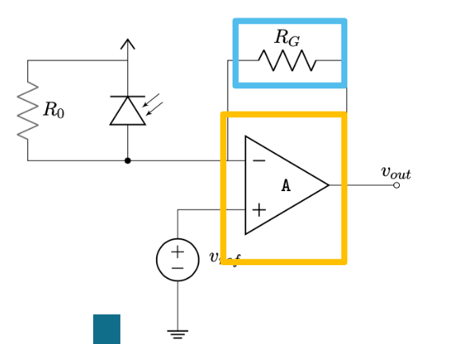{width=50%}

**Answer:** The basic readout is a **Transimpedance Amplifier (TIA)**. The photodiode acts as a current source connected to the inverting input of an op-amp. A feedback resistor $R_f$ connects the output to the input. The output voltage is $V_{out} = -I_{photo} \cdot R_f$.

**Question 34:** Discuss the imager matrix structure and the readout schematic.

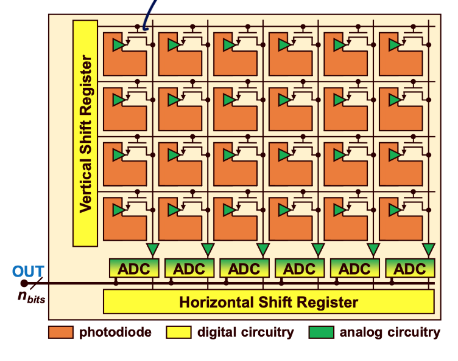{width=45%} 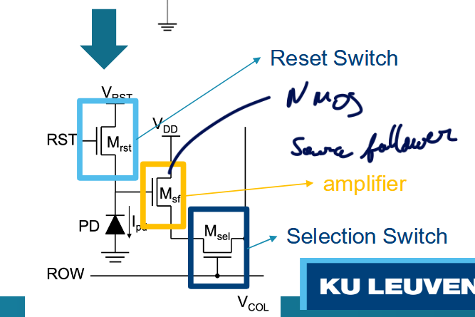{width=45%}

**Answer:** Imagers consist of a matrix of Active Pixels. Each pixel contains a photodiode and transistors for reset, selection, and amplification (Source Follower). Readout is done row-by-row (Rolling Shutter). When a row is selected, the voltage from each pixel is transferred to column ADCs for digitization.

**Question 35:** Give 3 examples of optical sensors : one where we measure a difference in source, one where we measure a difference in medium, one where we measure ToF

**Answer:**

1.  **Source:** NDIR gas analyzer (measures absorption of specific wavelengths by gas especially hydrocarbons).
2.  **Medium:** Liquid level sensor using a prism (measures change in reflection coefficient/refractive index of the medium surrounding the prism).
3.  **ToF:** LiDAR (Light Detection and Ranging) measures distance by time-of-flight of a laser pulse. Or the Interferometer.

**Question 36:** Give the difference between a Lidar and Radar system.

**Answer:** LiDAR uses laser light (optical micro meter), while RADAR uses radio waves (cm). LiDAR has much shorter wavelengths, allowing for higher resolution and more precise imaging (beam steering, ...), but is more susceptible to weather (fog/rain). RADAR has longer range and better weather penetration but lower resolution and usually requires larger antenna.

**Question 37:** Explain the working principle of an interferometer.

**Answer:** An interferometer (e.g., Michelson) splits a light beam into two paths: a reference path and a measurement path. When reflected back and recombined, the beams interfere constructively or destructively depending on the path difference relative to the wavelength $\lambda$. This allows measuring displacement with sub-wavelength precision.

**Question 38:** Give 3 examples of a time-of-flight sensor.

**Answer:**

1.  Ultrasonic distance sensor (echography).
2.  LiDAR.
3.  Inferometer

**Question 39:** Give 2 extensive and concrete examples of digital signal compensation used in a sensor.

**Answer:**

1.  **Hall Sensor Temperature Compensation:** A Hall sensor's sensitivity decreases with temperature. A DSP measures the temperature using an integrated sensor and digitally scales the Hall reading using a polynomial model (e.g., $1 + aT + bT^2$) to flatten the response.
2.  **Image Sensor Corrections:** DSP corrects for "Dead Pixels" (interpolating from neighbors), "Dark Current" (subtracting a dark frame offset), and "Fixed Pattern Noise" (correcting pixel-to-pixel gain variations).

**Question 40:** Why do we want to fit the input range of the ADC ? Elaborate on the speed-power-accuracy trade-off. Bonus question : how can we use an adc to remove the influence of the drive voltage of a Hall sensor.

**Answer:**
 
*   **Range:** To maximize the Signal-to-Noise Ratio (SNR). If a small signal uses only a fraction of the ADC range, resolution is wasted and quantization noise dominates.
 
*   **Trade-off:** Accuracy costs power. The relationship $\frac{\text{Speed} \cdot (\text{Accuracy})^2}{\text{Power}} = C_T$ implies that increasing accuracy (SNR) requires a quadratic increase in power, while speed scales linearly.
 
*   **Bonus:** Use a **ratiometric measurement**. If the Hall sensor is powered by $V_{drive}$ and the ADC uses $V_{drive}$ as its reference voltage ($V_{ref}$), the term $V_{drive}$ appears in the numerator (signal) and denominator (ADC scaling), cancelling out any fluctuations in the drive voltage.