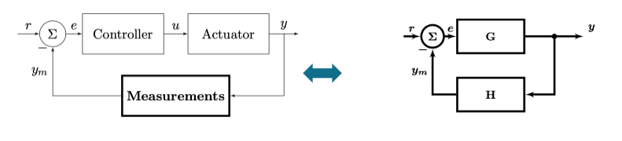
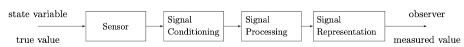
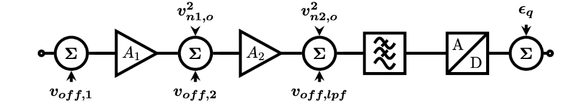
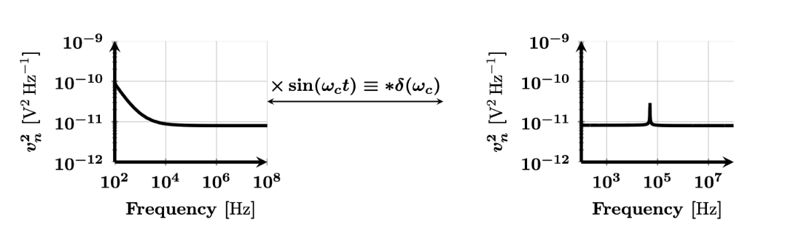
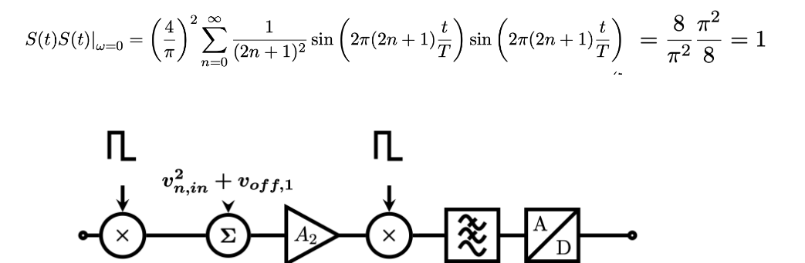
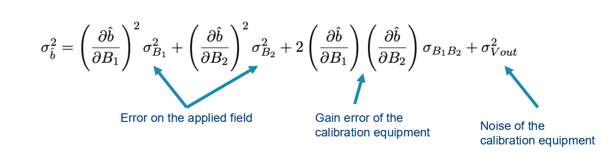

> **Note**
>
> This summary will only be based on the slides and lectures. No figures or copy from the cursus book is permitted due to copyrights.
>
> Nonetheless, it is recommended to also go through the cursus book as it may go more in depth than this summary

# Introduction

## Why is measuring important ?

In a feedback system, we want some input to transform in a specific output. Later, we want to measure this output to adapt the control and see how effective this is. 

Using the standard $G$ and $H$ notation we can find that:

\begin{align}
    y &= \frac{G}{1+GH}r & e&=\frac{1}{1+GH}r\\
    y&= \lim_{G\rightarrow\infty} \frac{G}{1+GH}r \approx \frac{1}{H}r
\end{align}

## General principles

> Building a measurement system is transforming energy/information from one domain to another.

We first start by building the physical knowledge (build physical quantity model), mathematical reasoning (find how accurate we can make the model to reflect the system) and finally we must take noise and other limits into consideration.

In a system, at a high-level, there is 2 forms of variables:

1. **Across Variables:** describe the *state*, in **parallel** with the terminal. Effort to change the state
2. **Through Variables:** describe the *flow*, in **series** with the terminal.

Then combining those two can give us some fundamental quantities:
- $A\cdot T$: **power** generated or dissipated in the element
- $A/T$: **impedance** of the system. Describes how an element transforms an $A$ into a $T$

## Modelling a system : the physical model

We usually want to map the IO behavior based on physical knowledge. Each model tries to represent reality but will always introduce errors or not take into account higher order phenomena. 

For example, we can model a pressure change using a diaphragm to a capacitance change. If we take a simple spring model we don't take second order term into account which introduces errors.

| Strength                                     | Weakness                                                          |
| :------------------------------------------- | :---------------------------------------------------------------- |
| Good insight                                 | Error due to approximations                                       |
| System optimization is possible              | Derivation of this formula is not always straightforward/possible |
| Calibration techniques can be easily derived | Errors due to tolerances in fabrication                           |
:Strength and weaknesses of physical approach

## Correlation

A typical operation used in system is **correlation**, it is used to find the "likelihood" between two signals. It helps us extract features:

$$
R_{fg}(t) = \int_{-\infty}^{\infty} f(t) g(t-\tau) d\tau
$$

Knowing Fourrier's theory, we can represent any signal as a combination of $sin$ and $cos$. Instead of using $g(t-\tau)$, this gives us:

\begin{align}
F(f) &=F_{cosine}(f) + F_{sine}(f)\\
&= \int_{-\infty}^{\infty} (cos(2\pi ft) + i sin(2\phi ft)) f(t) dt 
\end{align}

### Freshen up of Laplace transform

The Fourier transform can be written as:

$$
\mathcal{F}f(t) = \int_{-\infty}^\infty e^{i 2\pi ft} f(t) dt
$$

The Laplace transform goes one step further by using the Euler notation $e^{ix} = cos(x)+isin(x)$ and extend the Fourier transform with complex numbers:

$$
\mathcal{L}f(s) = \int_{0}^\infty e^{-st} f(t) dt \qquad s=\sigma + i\omega t
$$

It can be seen that:

$$
\mathcal{F}(f(t)) = \mathcal{L}(f(t)) \Longleftrightarrow f(t) = 0 \text{ if } t<0
$$

Laplace transform is an easy tool to solve differential equation and work with derivative:

$$
\mathcal{L}\left( \frac{df(t)}{dt} \right) = s \mathcal{L}(f(t)) + f(0)
$$

## The Measurement Chain

> A measurement system converts a state variable in a measured value

The idea behind a *signal conditioning* is to reduce error and filter out the signal. This should also convert it into a digital signal that can be easily processed by a DSP block. DSP block is used to work with the input and realize complex function while the signal representation can be a screen, plot, ...

### 4 major components

#### Sensor

Each sensor is made of 2 sensors to be exact.

1. A primary that transform a physical quantity to an "*easier to measure*" quantity
2. A secondary that converts this quantity into an electrical signal

#### Signal conditioning 

This is usually an ADC block. Such block are limited by the current technologies and we call that a **technological constant** $C_T$. There is no free lunch and everything is a tradeoff leading to a basic formula from information theory:

$$
\frac{Speed(Accuracy)^2}{Power} = C_T
$$

An ADC needs an input **and** a reference voltage. I outputs $\frac{V_{in}}{V_{ref}} = \frac{N}{2^{n-1}}$. The flash converter using a resistive ladder is a typical (but bad way) to convert into digital. We also need a clock and comparators to convert.

Accuracy is important and the Effective Number of Bits or ENOB is a crucial metric for any system. Due to quantization error and the SNR required for 1 valid bit, we can find such formula[^1] :

[^1]: Find more information about how we can get such formula in the DAMSIC course, [***link to a summary of the course***](https://github.com/Tfloow/ESATSummary/raw/main/PDF/M1S2_DAMSIC.pdf). Check the section 4.1.2

$$
ENOB = \frac{SNDR - 1.76 dB}{6.02 dB}
$$

So in summary, building a physical models is a good step in the right direction to be able to better filter and analyze measurements.

# Characterization of measurements

## Measurement Errors

In any system, there will be error which will reduce its accuracy. The error is added after each operation in our model but it is important to understand how it **propagates** and its **origin**.

| Characteristics |                Absolute error |                             Relative error |
| :-------------- | ----------------------------: | -----------------------------------------: |
| Math            |                    $e=x_m -x$ |      $e_r = \frac{e}{x} = \frac{x_m-x}{x}$ |
| Unit            |         Same unit as variable |                             Unitless - ppm |
| Estimation      | Over-estimation, $e\propto G$ | Under-estimation, $e_r !\propto G$ |
:Comparing the two type of errors

\begin{align}
    x_m &= S(s)G(s)x+G(s)\bar{e_s} + \bar{e_c} &  &\text{Output measurement} & \bar{e_m} &= G(s) \bar{e_s} + \bar{e_c} & &\text{Error of this measurement}\\
    y &= \frac{x_m}{S(0)G(0)} &  &\text{Transfer function} &
    \bar{e_in} &= \frac{\bar{e_s}}{S(s)} + \frac{e_c}{S(s)G(s)} &  &\text{Input referred noise}
\end{align}

| Type        |                     Effect |                                  Example |
| :---------- | -------------------------: | ---------------------------------------: |
| Interfering |     Additive to the signal |                   Magnetic interferences |
| Modifying   | Modifies transfer function | Pressure sensor changes over deformation |
:Type and difference of errors

By understanding the nature of an error, we can reduce it or even make it disappear. Example, EM interference can disrupt ESG signals. Solution, add an extra probe (right leg) to also capture this interference and connect it to the $V_{ref}$. Now, $V_{in}$ and $V_{ref}$ in the ADC will have the same error which will cancel out.

## Error Propagation

We must understand how an error propagates in a system. We can build a simple model like:

$$
x_m = ax+by
$$

Where $x$ is the true value that will be measured $x_m$, but also possible interferance such as $y$. The error is:

$$
e_m = a\Delta x + b \Delta y
$$

We can also conduct some statistical analysis:

\begin{align}
    Var(x_m) &= \mathbb{E}\left[ (ax+by) - (\mathbb{E}(ax+by))^2 \right]\\
    &= ...\\
    \sigma_m^2&= a^2 \sigma_x^2 + b^2 \sigma_y^2 + 2 ab \sigma_{xy}
\end{align}

The last term is often forgotten because a lot of person assume $\perp$ between $x$ and $y$ which is not always the case. The covariance is null only if uncorrelated. So typically, if the errors are due to the same source, their covariance is most likely correlated.

### Non-linear functions

For more advance transfer function that are non-linear, we can rewrite it using the Taylor series:

$$
f(x,y) = f(x_1, y_1) + \frac{\partial f}{\partial x}(x-x_1) + \frac{\partial f}{\partial y}(y-y_1) + ...
$$

Assuming a small error we can simplify our function and say that

$$
 \sigma_m^2 \approx  \frac{\partial f}{\partial x}^2 \sigma_x^2 + \frac{\partial f}{\partial y}^2 \sigma_y^2 +  2 \frac{\partial f}{\partial x}\frac{\partial f}{\partial y} \sigma_{xy}
$$

### Static Characteristics

- **Range \& Span**: range is the min and max while the span is the delta between the two
  - Those values should reflect where the system is still meeting its specifications

#### Linearizing the reading

Knowing the range, we could force a simple linearization using:

$$
O-O_{min} = \frac{O_{max} - O_{min}}{I_{max} - I_{min}} (I-I_{min})
$$

But this is far from ideal, a better solution is the least square solution:

\begin{align}
    K &= \frac{Cov(X_1,Y_1)}{Var(X_1)}\\
    &= \frac{X_1 Y_1-n\overline{X_1 Y_1}}{X_1 Y_1-n\overline{X_1}^2}
\end{align}

| Metric    |                                                                   Description |                                                           Issue |
| :-------- | ----------------------------------------------------------------------------: | --------------------------------------------------------------: |
| Max error |                                            Maximum error from ideal and model |                                     Doesn't give a real insight |
| DNL       | Difference between width of the step and ideal LSB step. <1LSB or problematic |                                    Watch out for sign inversion |
| INL       |                                                  Maximum deviation (max(DNL)) |                                                    Less insight |
| THD       |         Each non-linearity causes distortion, highlight the distortion nature | Doesn't give information about the non-linearity characteristic |
:Quick overview of the metrics

It is important to understand the error of the non-linearity. Because compensating for it is costly as we will use a polynomial to cancel it. The order of the polynomial will require $n+1$ calibration measurements.

#### Resolution

> **Definition**
>
> Resolution is the smallest discrete step a system can take
>
> $$resolution = \frac{\Delta I_R}{I_{max} - I_{min}} \cdot 100 \%$$

The resolution isn't the accuracy as we could add dummy 0 which won't improve the accuracy but the resolution.

#### Hysteresis

It is a truly physical phenomena that depicts how when changing the input and reducing it will not lead to the same output path due to various reasons.

#### Dynamical errors

When measuring something, we often think we are in the steady state which is not really the case. Most of the time we will wait $x$ amount of time until it is "*good enough*".

This is all linked with the **memory elements** that is present in mechanical, electrical, ... systems. The more **independent** memory elements we have the higher is the order of the system. We talk here about settling time which models the *exponential* behavior of such event;

$$
\varepsilon = \Delta I expt\left( -\frac{t}{\tau}\right)
$$

Of course, Taylor series can be used for small amplitude: $TF(s) = \frac{\partial O}{\partial I}\large|_{I=I^*} 1/(1+s\tau)$

**Page 66**

## Measurement Characteristics

**Page 99**

### Quantization noise

When measuring through an ADC, we can see the loss of precision due to limited bitwidth as noise. It is not physical noise but more like a mathematical tricks to model the impact of quantization on signal. For this to work we must use the postula that the input is a varying signal. If it is not a varying signal, the error will be constant and not looking like white noise aka spread equally. The mean value of this noise will be 0:

$$
\mathbb{E}(e_q) = \frac{1}{\Delta I_R} \int_{-\frac{\Delta I_R}{2}}^{\frac{\Delta I_R}{2}} e \text{ } de=0
$$

The power can be seen as:

\begin{align}
    \sigma^2_q &= \frac{1}{\Delta I_R} \mathbb{E} \left((e_q - \mathbb{E}(e_q))^2\right)\\
    &= \frac{1}{\Delta I_R} \int_{-\frac{\Delta I_R}{2}}^{\frac{\Delta I_R}{2}} e^2 \text{ } de\\
    &= \frac{\Delta^2 I_R}{12}
\end{align}

As used and explained earlier, the $\sigma^2$ is the power of the signal (total integrated noise). The spectrum is limited to $f_s/2$. So we can model an ADC with an extra white noise source with a noise power of $\frac{\Delta^2 I_R}{12}$ with a bw of $f_s/2$. 

# Building a chain : reducing errors

{ widht=50% }

each blocks add offset, gain error and noise. This is commonly represented as the chain above. 

## Gain distribution

A common way to summarize a chain is by using *input referred* value. This also showcases some basic idea in measurement chains.

$$
v_{in}^2 = \frac{v^2_{n1,o}}{A_1^2} + \frac{v^2_{n2,o}}{A_1^2A_2^2} \qquad I_{ADC} = (V_{in} + v_{off,1}) A_1A_2 + v_{off,2} A_2
$$

We have to maximize the first stage gain as it will reduce the impact of noise for later stage components. But we are limited by the offset in the ADC. 

## Noise filtering

Another way to reduce the noise by averaging it:

$$
\sigma_n^2 = \sum_{i}^N \frac{x_i - \bar x}{N-1}
$$

This corresponds to filtering in the frequency domain. We have to be careful with aliasing and this technique cannot refer the $1/f$ noise.

## Chopping and modulation

Offset and $1/f$ cannot be filtered sadly. We would need 0 bandwidth filter for this. Another solution would be to **shift** the noise to higher frequencies:

$$
sin(\omega t) sin(\omega_c t) = \frac{cos((\omega_c - \omega) t) + cos((\omega_c + \omega)t)}{2}
$$

{width=50%}

### Demodulation

Using a sine, half of the energy is lost sadly. This is why actual chopping with a square wave is better.

### Chopping

{width=50%}

This will retain the signal energy. The input signal is modulated with pulse train, offset + $1/f$ added by $A_2$. Then demodulated at higher frequencies. Thus, a low-pass filter will not take the high frequency $1/f$ and offset. We are using a 1 -1 square wave.

We must have perfect reconstruction but amplifier has a finite bw. This cannot be easily realized as real components are not perfect. Chopping error.

The square wave signal contains all of the frequency and some beyond the amplifier $A_2$. This result also in chopping spikes. The chopping error at $2\omega_c$ will be gone but still problems. Energy put at $2\omega_c$ is also lost at the 0 frequency. It is a gain error, if 0 at input, 0 at output no error. The stronger is the signal the larger is the error thus gain error. The error becomes:

$$
\frac{4\pi}{\sqrt{2}} \sqrt{\left( \frac{\tau}{T} \right)^2 \frac{1}{1+\frac{\tau}{T}}}
$$

## Feedback

A good solution is feedback as it will remove distortion and improve settling.

$$
y = \frac{MG}{1+MGH}V_{in} + \frac{G}{1+MGH}\varepsilon\approx\frac{V_{in}}{H} + \frac{\varepsilon}{MH} = \frac{V_{in}}{H} \quad G\rightarrow\infty
$$

#### Example

Measurement of current in electric car. Use a TMR system but has 2 issues:

1. hysteresis
2. temperature issue: modifying environment error

We cannot directly measure on the path, add coils to counter-act the magnetic field which will linearize the reading by fighting an EM field effect with another EM field.

## Calibration

> **Definition**
>
> Calibration is a method to remove an error by measuring the signal with a better sensor and using this measurement to compensate errors (typically drift)

Typically realize offset and gain calibration. This can be realized in the factory, online (using a switch that measure known value then compare. Can also be a random signal in more advanced system) or timed calibration.

If we are measuring and calibrating with a worse system, we are increasing our error.

#### Gain error example

$$
\begin{align}
    V_{out,cal} &= (BS+V_{offset} - a)b & \hat a &= b(a-V_{offset})\\
    V_{out,cal} &= B\hat b + \hat a & \hat b &= Sb
\end{align}
$$

{width=50%}

We need two measurements to be able to model the error. We can see in the math that our calibration will be as good as the accuracy and noise we have.

Need long time to measure to average out the noise. Know the curve and what we should be expecting. Spread the points as wide as possible. A small error between two close points will result in large issues.

## Compensation