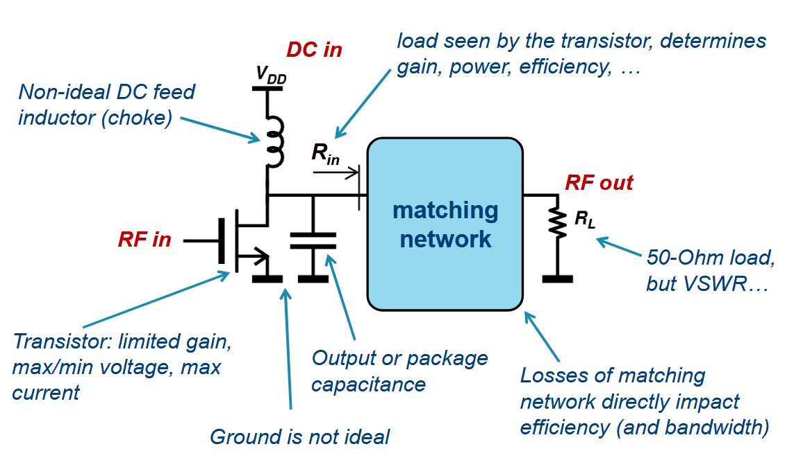
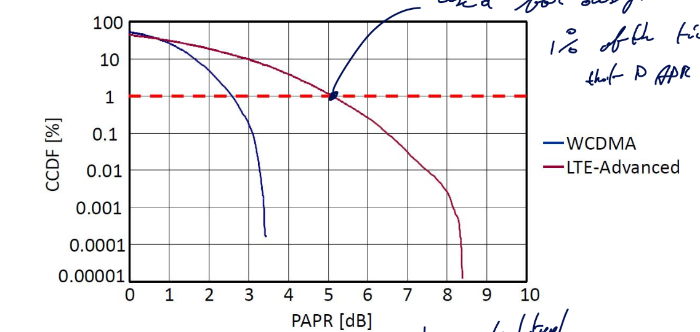
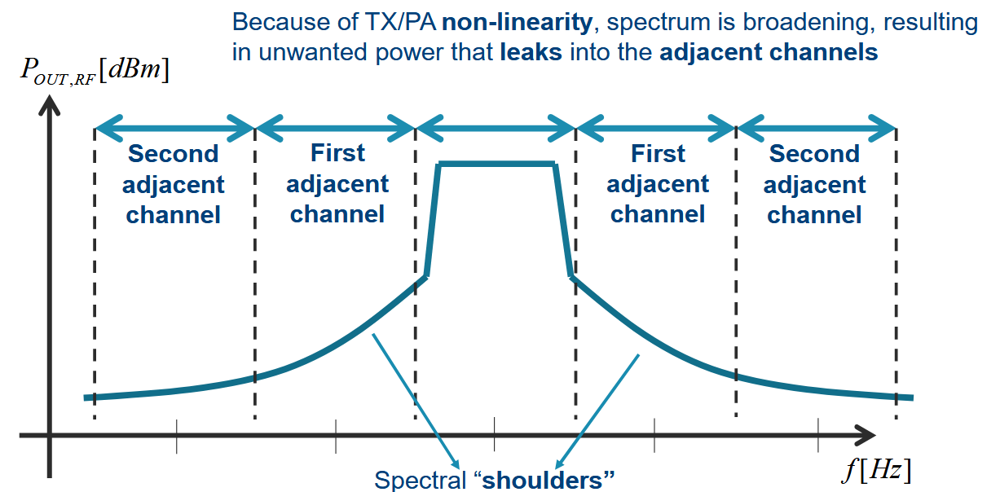
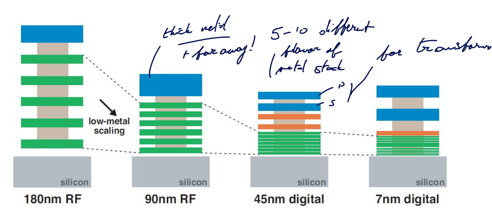
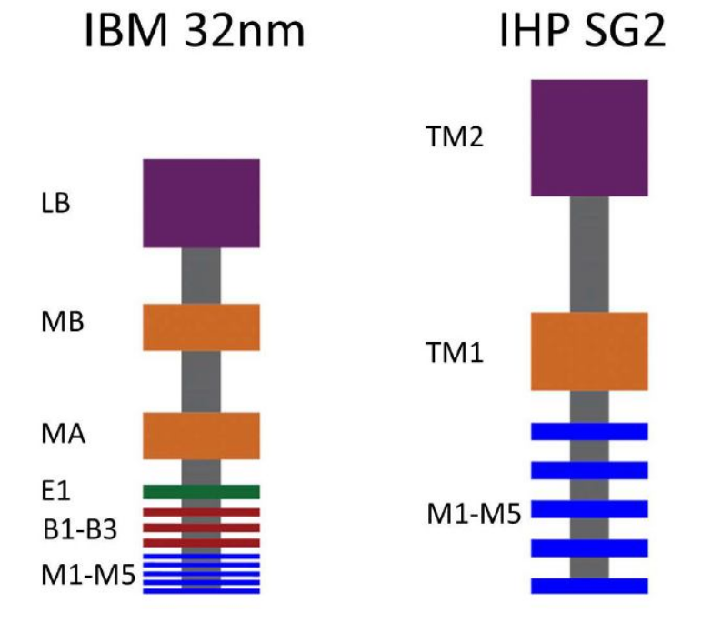
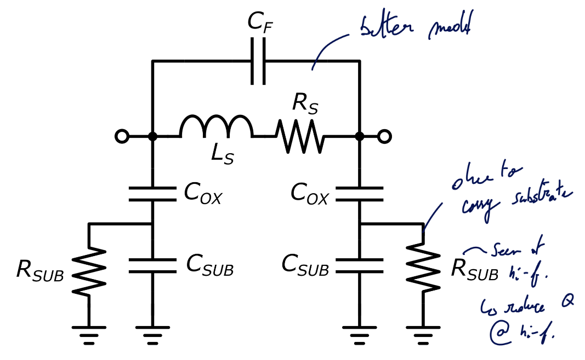
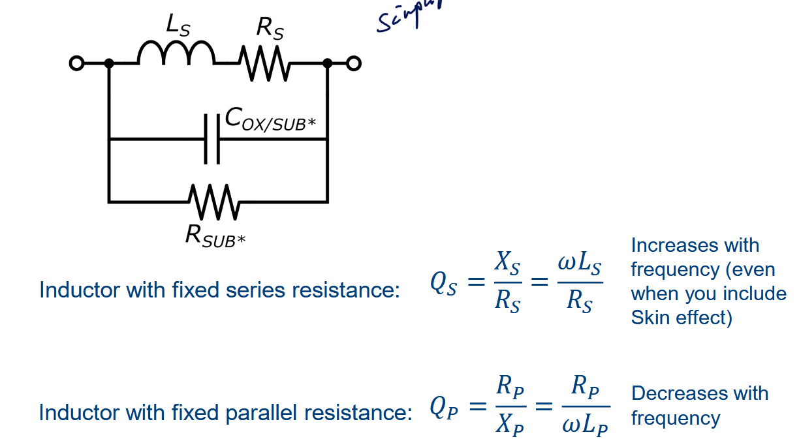

# Motivation

We want to go to higher frequency to transmit more and more data as per Shannon channel capacity

$$
BW\cdot \log_2 \left( 1 + \frac{S}{N} \right)
$$

## Problem 1

It was predicted that the $f_{max}$ and $f_T$ of CMOS would increase in the coming years. Sadly, this is not true as CMOS won't go much higher than 300 GHz. One of our best hope is **Si-Ge** which is a developing and promising technology for high speed application. The main drawback is the fact it doesn't scale well (factor 1000 between CMOS and Si-Ge) and it is a power hungry technology node.

Another issue with this Ge, is that the oxide is quite bad and can be dissolved just by water.

## Problem 2

Another big problem comes from fundamental EM theory. The **free-space path loss**:

$$
20 \log_{10} \frac{4 \pi f_c d}{c}
$$

The higher we go in frequency, the higher is the losses. Same with the Friis equation:

\begin{align}
    P_{\text{density}} &= \frac{P_t}{4\pi d^2} \cdot G_t\\
P_r &= P_{\text{density}} \cdot \frac{\lambda^2}{4\pi} \cdot G_r\\
\frac{P_r}{P_t} &= \left(\frac{\lambda}{4\pi d}\right)^2 \cdot G_r \cdot G_t
\end{align}

But, the gain of an antenna scales with the frequency. Which means, for the same area of a RF one, we can split it in multiple sub mmWave one.

$$
G_{\text{ant}} = \frac{4 \pi A_{ant} f_c^2}{c^2}
$$

This opens the way to *beamforming* antenna where tiny delays can steer the beam. Main issue is the energy consumption, it has currently troubles to find its way to the consumer market. Many architecture exists that try to overcome various challenges.

# mm-wave design in CMOS: Actives

## MOS transistor power gain, fT and fMAX

{width=70%}

A tuned amplifier can be seen as an amplifier where we have some L at the boundwire for gate and drain making it a tuned amplifier.

{width=60%}

Good RF model have GSD contact resistor and a bulk resistance model. This can be quite cumbersome to analyze, so for this reason the second model is preferred as lots of important problems can be explained with this model.

## Gate resistance

One of the main limits of gain is this $R_G$ as it will form with $C_{gs}$ a LPF. This value must be minimized to achieve high gain. 

The gate resistance is not just 1 resistance but a combination of various resistance all modeled through $R_G$. Those values depend on the layout of the transistor.

Typically, making smaller width finger will reduce the on resistance between the drain and source but the length of the gate resistance may again increase.

{width=50%}

The intrinsic corner frequency $f_T$ can be calculated as:

$$
f_T = \frac{g_{m}}{2\pi (C_{gs} + C_{gd})}
\qquad\begin{cases}
    h_{21}(f) &= \frac{i_{OUT}}{i_{in}} = \frac{Y_{21} v_{in}}{Y_{111} v_{in}}\\
    |h_{21}(f_T)| = 1
\end{cases}
$$

The "*amazing*" thing about this metric is that it does not depend on the layout! It is purely a technological constant!

In reality and more advanced model, there is only a weak dependency between $f_T$ and $R_G$. The higher is the bias point, the higher is the $f_T$ until it plateau and decreases.

### Matching source and load 

The goal is to transform the impedance seen by a load or a source to increase the performances of the circuit.

#### RL Series to Parallel conversion

With $Q_L = \frac{Z_L}{R_S} = \frac{\omega L_S}{R_S}$, we can convert to parallel with:

$$
L_P = L_S(1+1/Q_L^2) \qquad R_P = R_S(1+Q_L^2)
$$

#### RC Series to Parallel conversion

With $Q_C = \frac{Z_C}{R_S} = \frac{1}{\omega C_SR_S}$, we can convert to parallel with:

$$
C_P = \frac{C_S}{1+1/Q_L^2} \qquad R_P = R_S(1+Q_L^2)
$$

#### LC-match network

If we have a $L_m$, $C_m$ matching network in parallel of a $R_L$ load, we can convert into a fully in series network with $Q_C = \frac{1}{\omega C_m R_L}$.

$$
\omega = \frac{1}{\sqrt{L_m C_m'}} \qquad R_L' = \frac{R_L}{(1+Q_C^2)}
$$

And we have now that $R_{in} = R_L'$. There will be now power loss as $P_{out} = P_{in} = \frac{v_{in}^2}{R_{in}} = \frac{v_{in}^2}{R_{L}'} = (1+Q_C^2)\frac{v_{in}^2}{R_L}$. $v_{out} \approx Q_C v_{in}$ (narrowband) passive voltage amplifier.

#### Definition: $f_{max}$

{width=70%}

$$
G_P = \left(\frac{g_m}{2\pi f_{\text{MAX}} \cdot C_{gs}}\right)^2 \frac{r_{ds}}{4R_G} = 1 \Rightarrow f_{\text{MAX}} = \frac{g_m}{2\pi \cdot C_{gs}} \sqrt{\frac{r_{ds}}{4R_G}}
$$

Here, $f_{MAX}$ depends on biasing and layout !

$$
f_{MAX} = f_T \cdot \sqrt{\frac{r_{ds}}{4 R_G}}
$$

### Modeling it

{width=70%}

#### Horizontal gate resistance $R_{G,h}$

$$
R_{G,h} = \alpha \frac{W_F}{L}\rho_{sh, Sili}
$$

We have a distributed effect $\alpha$ using the sheet-resistance of the Silicide layer $\rho_{sh, Sili}$.

It would be naive to think that this resistance is constant throughout the gate, actually, the current $I_G$ will be high at the entrance of the gate and slowly decrease until reaching 0. In this case $\alpha = 1/3$.

One way to reduce this is by applying two contacts at each side. This will divide by 2 the current in each branch and each branch are 2 times smaller. So, $\alpha = 1/2 \cdot 1/2 \cdot 1/3 = 1/12$

#### Vertical gate resistance $R_{G,v}$

$$
R_{G,v} = \rho_{poly} \frac{t_{poly}}{L \cdot W_F}
$$

$L$ here is the cross-section of a gate finger and $\rho_{poly}$ is the gate resistivity poly.

#### Non-Quasi-Static (NQS) gate resistance $R_{G,NQS}$

$$
R_{G,NQS} \sim \frac{L}{W_F}
$$

It is not a "real" resistance, it appears due to charge in channel coming from the source. It models the time constant $\tau = 1/RC$ that appears due to the fact the charges must travel through the channel.

#### Multi-Finger connection resistance $R_{G,int}$

$$
R_{G,int} \sim \frac{W\cdot L}{W_F}
$$

Appears due to all the connections with each fingers.

#### Summary

| Name                               | Symbol      | Equation                                   |
| :--------------------------------- | :---------- | :----------------------------------------- |
| Horizontal gate resistance         | $R_{G,h}$   | $\alpha \frac{W_F}{L}\rho_{sh, Sili}$      |
| Vertical gate resistance           | $R_{G,v}$   | $\rho_{poly} \frac{t_{poly}}{L \cdot W_F}$ |
| NQS gate resistance                | $R_{G,NQS}$ | $\sim \frac{L}{W_F}$                       |
| Multi-Finger connection resistance | $R_{G,int}$ | $\sim \frac{W\cdot L}{W_F}$                |
:Summary of the various actor in the Gate Resistance $R_G$

To optimize it, we can find the ideal $W_F$ value. The vertical and NQS resistances are found in the `BSIM` model

The multi-finger can be found using the `PEX` model. 

The optimal $W_F$ isn't the same for every transistors. The optimum shifts as the transistor get larger. Typically, the width of a finger should get larger as the total width increase.

Surprisingly, the $f_{max}$ is also shifting as the total width increase. We see that $r_{ds}$ reduces by 10 while $R_G$ only reduces by a factor 3.7. This unequal reduction leads to a 60% reduction of $f_{max}$.

#### Layout optimization

We can focus only on the gate resistance which will add parasitic at the drain which is not too bad for our goal. We use wider trace at the gate which will increase the gate source capacitance. Luckily, this can be tuned out.

#### FinFETs

The total width is the number of fingers times the amount of fins per finger. We need fin depopulation to reduce the gate resistance.

### Interstage matching situation

This is a good way to enhance the gain by re-adjusting the impedance seen at the terminals. However, this will induce power loss and require more chip area ! The losses are proportional to the Impedance Transformation Ratio (ITR).

**Re-read this section + re-watch to fully grasp everything**

The bottom line is that matching with realistic Q factors only makes sense at higher frequencies. Higher than 20 GHz or we would have too much power loss at lower frequencies. 1:1 impedance ratio leads to a very easy matching network. This 1:1 happens at various frequencies for different technology node and size ratio.

#### Mismatch can give better output power

**Add slice example**

## Stability

The capacitance $C_{gd}$ forms a feedback between the output and input opening the door for instability issues. This limits the maximum attainable gain.

We define the term conditionally stable and unconditionally stable:

- Conditional: for some source and load impedance, the network will be unstable
- Unconditional: always stable for (any) source and load

This definition is only based on the fact that we put a network at the input and one at the output without any connections between. But, if add a voltage source between input and output we can make any unconditionally stable circuit oscillate.

### Rollett Stability Factor K

- $K>1$: unconditionally stable
- $K<1$: *potentially* unstable

$$
K = \frac{1-|S_{11}|^2 - |S_{22}|^2 + |\Delta|^2}{2|S_{21}S_{12}|} \qquad \Delta = S_{11}S_{22} - S_{21}S_{12} 
$$

#### Maximum Available Gain (MAG)

MAG provided ideal matching and $K>1$

$$
MAG = (K-\sqrt{K^2 - 1}) \cdot \frac{S_{21}}{S_{12}} = \frac{1}{K + \sqrt{K^2 - 1}} \cdot \frac{S_{21}}{S_{12}}
$$

#### Maximum Stable Gain (MSG)

To achieve stability, one way is to add loss at the input or output. If $K=1$ we have the MSG:

$$
MSG = \frac{S_{21}}{S_{12}}
$$

### Gmax in Cadence

At lower frequency, the transistor will be conditionally stable and thus the gain will be linear corresponding to the MSG. There will be a corner in the gain depending on the layout. Good layout (ideal finger width) will have a higher corner.

In this second region the MAG is the maximum gain as the transistor will be unconditionally stable.

Using the proper conjugate matching network, in the conditionally stable region, we can touch that MSG.

## Neutralization

Instead of adding losses, we could try to **tune out** the gate drain capacitance which is the reason for the feedback and instability. But, the inductance will be too large and consumes lots of chip area.

A better solution is to use a "*negative*" capacitance which will counter-act the effects of the gate drain one. In other words, use a **differential mode** approach.

{width=70%}

{width=70%}

One issue with the neutralization implementation is the fact that the $C_N$ will be not only $C_{gd}$ but also other parasitic.

Ultimately, neutralization will lead to far superior Gmax.

### Implementation

Implementing neutralization is quite easy and interesting to do. We can use transformers and at the middle inject the bias voltages. The transformers will ensure the symmetrical differential mode signal. 

{width=70%}

#### Neutralization with single-ended amps

{width=70%}

### Use dummy transistor

{width=70%}

Another way, instead of using a floating source, is to tie the drain and source together. With this technique, no current will flow as there will be no real polarity.

## Drawback of Neutralization

In DM, it is easy to analyze the stability of the circuit. We need to just check 1 frequency, the operating one. We are not really affected by the VDD and VBIAS as it is seen as a virtual ground only.

But in Common Mode, this is a whole different story. The circuit looks different, we see the bound pad inductances and we must sweep all frequencies to make sure it is always stable. Moreover, this stability depends on the impedance of the two DC voltages (VDD and VBIAS). Finally the transistor now looks twice as wide.

### CM stability

One solution is to use *harmonic traps* that will provide excess feedback:

{width=60%}

### CM feedback

A crucial thing is the fact that the the second order distortion is caused by the common mode ! In many research paper, this is often overlooked as this distortion will appear at $2\omega_1;2\omega_2;\omega_1+\omega_2$. So this is not close from the main frequencies. 

**BUT**, if a distorted signal is feedback at the input, it will mix and appear like a third order distortion. It is a secondary mixing terms due to the $C_{gd}$ and $C_N$ feedback network.

# System-level aspects of PAs

## Introduction

Designing a power amplifier is different than designing a regular amplifier. In a regular amplifier, we are trying to optimize the gain, so the input and output matching network will transform the impedance to be seen as $50\Omega$. In a PA, we want to send the maximum amount of power.

{width=70%}

The total power is proportional to $V_{DD}^2$, we kept pushing down the supply to maintain $\vec E$ over the diffusion area yet we didn't see any dramatic output power reduction. Why ?

## Gain and power matching

### Gain matching

We are trying to have the highest power gain thanks to conjugate matching as load. We create a sort of high load line to have the highest output power for the given input swing and this is called matching. This is based on a small-signal approach.

### Power matching

we allow to go more extreme and this requires a large-signal approach. We are limited by the $I_{max}$ and $V_{max}$. There is also a minimum $V_{knee}$. The result is a less resistive load and more swing.

- $I_{max}$: to avoid electron migration 
- $V_{max}$: to avoid breakdown voltage
- $V_{knee}$: to stay out of the triode region

The optimal loads for maximum gain and power are **not** the same. The best we can do is take an intermediate between the power curves. The corner point in the Pin/Pout plot is sooner for power matching than gain matching.

## Ratio-gain and slope-gain

- **Power gain:** $P_{out}- P_{in}$
- **Gain compression:**  Crossing point with the linear slope of the -1 dB gain at $P_{in}=0dB$
  - This indicates the start of the compression area where the PA becomes saturated. In this area, there is high output power and good PAE.
  - Often, in those plots, we can see the curve never flattens out. This is due to the feed-forward path.
- **Saturation power:** -3dB compression power, not a convention but usually used.

A good PA will have the $P_{1dB}$ and $P_{3dB}$ close to avoid the effect of "*soft compression*" which induces low input swing due to premature distortion.

### Slope gain and ratio gain

- Slope gain: take the derivative around 0 mW of input
- Ratio gain: take the difference over X 

Slope gain will remain constant while the ratio gain will continue changing, even in compression. slope gain will tend to 0 which reflects the actual added benefit of going to higher power input.

### Predistortion curve

If we take the Pout/Pin curve and its inverse on the same plot, we will find the **PD gain**. This only appears if the slope gain is bigger than one and this point is where the ratio gain and the output power gain meets.

The issue is the fact that after this distortion point, the slope gain is almost null but not the ratio gain.

- Slope gain: better for checking predistortion

## Efficiency

| Name                              | Description                                                                                       |                        Formula                        |
| :-------------------------------- | :------------------------------------------------------------------------------------------------ | :---------------------------------------------------: |
| Drain collector efficiency **DE** | The output power over the DC power                                                                |         $\eta = \frac{P_{out,RF}}{P_{DC,PA}}$         |
| Power-added efficiency **PAE**    | Subtracting the input power to the output power. Idea closer to laser where input flows to output |   $PAE = \frac{P_{out,RF} - P_{in,RF}}{P_{DC,PA}}$    |
| System efficiency **SE**          | Overall efficiency of the system, more meaningful and reflect reality                             | $\eta_{sys} = \frac{P_{out,RF}}{P_{in,RF}+P_{DC,PA}}$ |
: Various efficiency of a Power Amplifier

$$
\textbf{PAE} = \eta \cdot \left( 1 - \frac{1}{G_P} \right)
$$

> *Note*
>
> $P_{DC,PA}$ depends in most case on $P_{out,RF}$.

When running the simulations we can see that:

- **Linear region:** 
  - Good: gain, linearity
  - Bad: output power, efficiency
- **Compressed region:**
  - Good: output power, efficiency
  - Bad: gain, linearity

### $P_{DC} \text{ } \& \text{ } P_{BIAS}$

The DC power is not equal to the bias power besides at small input and output signals. Moreover:

$$
P_{DC,PA}(P_{out,RF})
$$

The DE keeps improving due to the feed-forward path but the PAE has an optimum. 

> *Note*
>
> PSAT is sometimes defined as the output power at $\textbf{PAE}_{max}$

#### Driver stage

The DE will always refer to the drain efficiency and thus never take into account the extra power burned by a driver stage. While for other metrics:

$$
\begin{aligned}
    PAE &= \frac{P_{out,RF} - P_{in,RF}}{P_{DC,DRV} + P_{DC,PA}} & \eta_{sys} &= \frac{P_{OUT,RF}}{P_{IN,RF} + P_{DC,PA} + P_{DC,DRV}}
\end{aligned}
$$

## PAPR

Or **Peak to Average Power Ratio**, a large difference between the average and peak power gives a *low efficiency*. This is an important metric in modern communication scheme as the PAPR grows bigger and bigger as the standards advance.

### Definition in Analog and RF

| Metric        | Symbol          |      Equation      |
| :------------ | :-------------- | :----------------: |
| Crest factor  | $CF$            | $V_{max}/V_{RMS}$  |
|               | $CF_{dB}$       |   $20 \log(CF)$    |
| ???           | $PIP$           |  $V_{max}^2/R_L$   |
| Average power | $P_{avg}$       |  $V_{RMS}^2/R_L$   |
| PAPR analog   | $PAPR_{analog}$ | $PIP/P_{AVG}=CF^2$ |
| PAPR RF       | $PAPR_{RF}$     | $PEP/P_{AVG}$                    |
|               | $PAPR_{dB}$     |     $CF_{dB}$      |
: Important metrics

In RF, we modulate our signal on a carrier which creates an enveloppe. If we take the $V_{max}$ of this enveloppe and map it to a *continuous wave* with amplitude equal to the peak of the modulated signal, we obtain the **PEP**.

$$
PEP = PIP - 3 dB
$$

So when $PAPR_{RF} = 0$, it will be $PAPR_{analog} = 3$. It is just a naming convention but important to distinguish. A good thing is to only use crest factor for $PAPR_{analog}$ instead.

$$
\begin{aligned}
    PEP &= \frac{PIP_{env}}{2} & P_{AVG} &= \frac{P_{AVG,ENV}}{2} 
\end{aligned}
$$

$$
PAPR_{RF} = \frac{PEP_{RF}}{P_{AVG,RF}} = \frac{PIP_{ENV}}{P_{AVG,ENV}} = PAPR_{ENV}
$$

### Modulated signals

We can use constellations plot to represent the *amplitude and phase* of the RF carrier. But, this plot shouldn't just be viewed as a static plot but as a points that carrier will visit and where change is not instantaneous.

$$
\begin{aligned}
    s(t) &= I(t) \cos (2\pi f_c t) - Q(t) \sin (2\pi f_c t)\\
    &= A(t) \cos (2 \pi f_c t+\varphi (t))
\end{aligned}
$$

The complex envelope signal is:

$$
\begin{aligned}
    g(t) &= \overbrace{A(t)}^{\text{Envelope signal}} \overbrace{e^{j\varphi (t)}}^{\text{phase modulation}} & s(t)&=\mathfrak{R} \left\{ A(t) e^{j\varphi(t)} e^{j2\pi f_c t} \right\}
\end{aligned}
$$

The envelope signal properties will influence the PA design and performance. We have:

$$
\begin{aligned}
  A(t) &= \sqrt{I(t)^2 + Q(t)^2} & \varphi(t) &= arctan \left( \frac{Q(t)}{I(t)} \right)
\end{aligned}
$$

Modulation and filtering will cause envelope variations. If we look at a QPSK constellation where all points lay around the circle of radius 1, if we assume perfect transition between the points, we have a $PAPR = 0$. But with a $RRC = 0.35$, we have $4$dB PAPR. This is due to the transition that takes the shortest path instead of going around the circle. This is some IQ filtering that will introduce the detrimental PAPR.

For constellations that do not have all their point laying on the circle, they will have a PAPR larger than 0.

#### OFDM

If we want to take into account OFDM modulation using $N$ modulated sinewaves, we have the following formula:

$$
PAPR_{RF,dB} = PAPR_{RF} + \overbrace{10 \log (N)}^{\text{OFDM factor}}
$$

#### Signal statistics

What define the PAPR is the ratio of the largest peak over the average signal. But some average peak can be quite rare as they must me an exact sequence of bits for example.

So, it is quite common to define the **likelihood** of a waveform of X symbols to have a PAPR of Y dB. A good reference point is using $1\%$. This is shown with a Complementary Cumulative Distribution Function Plot:

{width=60%}

The bad news is that, the more advance is a communication scheme, the worse is the PAPR becoming.

## Distortion: ACLR

> **Definition**
>
> ACLR: Adjacent Channel Leakage Ratio
>
> ACP: Adjacent Channel Power

This section is about ACLR and how we must take into account possible leakage from other channel. Indeed, we are not operating without any noise or other user. Everyone has a specific frequency range (ideally).

This is all related to Harmonic Distortion (HD) and how third order distortion (IMD3) of 2 signals will fold back next to the two first order signal. Thus, creating some distortion as unwanted signals can be difficultly filtered out.

A spectrum shows the power, measured inside a BW equal to the Resolution Bandwidth (RBW).

{ width=60% }

The shoulders are often asymmetric due to the memory effects and second order distortion. The power in the first **adjacent shoulder** is written as $P_{AC1}$. We can then extract the first ACLR:

$$
ACLR_{1 [dB]} = P_{OUT[dBm]} - P_{AC1[dBm]}
$$

## Distortion: EVM

> **Definition**
>
> EVM: Error Vector Measure

The error vector is a complex number that represents the difference in a time domain constellation IQ between the measured signal and the ideal signal.

$$
EVM = \sqrt{(I_{MEAS} - I_{REF})^2 + (Q_{MEAS} - I_{MEAS})^2}
$$

We can then measure it for each symbol transmitted and compute the RMS value of the EVM:

$$
EVM_{RMS} = \frac{\sqrt{\frac{1}{N} \sum_{i=1}^N EVM_i^2}}{\sqrt{\frac{1}{N} \sum_{i=1}^N |S_i|^2}}
$$

An interesting fact is that if we have little to no AM-AM, AM-PM noise, we will have $EVM_n \approx \frac{1}{\sqrt{SNR}}$.

### Understanding the pattern of constellation

If we don't have a nice grid square shaped pattern and rather a round shaped patterned with higher $EVM$ for signal further, this is likely a non-linear PA that saturates for higher signals.

> *Note*
>
> Always make sure to pick the root-square sum of the signals and not the max of the signal as Keysight default setting does.
>
> The difference is the PAPR of the unfiltered modulated signal. Not the PAPR of the RF signal.

## Distortion: AM/AM – AM/PM – PM/AM

### AM-AM

AM-AM is ratio gain it is the difference between the AM in minus the AM out. If we witness in a QAM constellation that the center is still square but the outside becomes round, this is typical sign of AM-AM distortion.

Cannot really be avoided as it is intrinsic of the PA.

### AM-PM

This is the fact that having a larger amplitude will create a phase change at the output. This can be avoided with better matching. Push the phase shift to higher input voltage.

AM-PM will be seen as the constellation is swirling a little bit. The full constellation is not just rotating but swirling and is more noticeable for the edges.

#### Typical causes

This is due to a changing $C_{GS}$ capacitance. This will change the resonance frequency and phase response. The root cause can also be:

- $C_{GD}$ and miller cap
- Gain compression
- Non-linear $C_{DS}$
- Non-linear $g_m$

But usually, a non-linear $C_{GS}$ is the sweetspot for amplifier.

Class A amplifier will have stronger negative output phase than class AB that will tend to be more positive output phase. Ideally we want a null output phase.

#### Compensating

We can compensate for this by inducing more gain for I instead of Q for example.

Also, a lot of systems have a precise time domain envelope that is not constant. Typically emitting data will have lots of radiation while receiving will be much smaller power-wise.

### Memory effects

The gain and phase relationships of PA depends on the previous power situation. This is caused by thermal behavior and low-frequency bias networks with large RC time constants.

A lot of decoupling capacitance will creates more memory effect as the circuit must (dis)charge more or less the caps. We must do proper sweep to see clearly those effects. 

# CMOS Passives

## Metal stacks, CMOS vs SiGe and Q-factor

For the metal part, we can use some microstrip line or coplanar line. A good model is **transmission lines** which are convenient as they are:

1. Length-scalable model
2. Current-return path is part of the model
  * no just floating around current that closes the loop somehow; this usually results in poor or unexpected behavior for simulations if not taken into account

In classic CMOS technology, we want to have our signal to run as far as possible from the substrate. We want to avoid any $\vec E$ in the lossy $SiO_2$. We usually shield metals from the substrate with a ground plane but this results into a low $Z_0 = \sqrt{\frac{L}{C}}$.

For more exotic technology such as $GaAs,InP$, the substrate as few losses so no need to shield, microstrip is preferred. The substrate is 3 times smaller than the CMOS one

### Slow-wave transmission lines

Under microstrip line signal line, we can add some floating isolated metal strips. This will increase the capacitance but not the inductance resulting into a slow wave propagation (can never be faster):

$$
v_c = \frac{1}{\sqrt{LC}} = \frac{\mu}{\varepsilon}
$$

### Lumping components

When lumping, it is harder to model the return current / closing the loop. As hinted before, this is a bad model choice.

One good choice is to use differential mode as it will have a virtual ground but the common mode is tougher to analyze.

{width=70%}

{width=40%}

When looking at the speed on CMOS, it's much faster than SiGe but when adding the interconnect, it becomes worse than SiGe.

The quality due to metal resistance $Q \approx \frac{\mathcal{Im}(Z_{11})}{\mathcal{Re}(Z_{11})}$

If we assume that $R_S \approx \sqrt{\omega}$ is dominated by the skin effect. This results in:

- Inductive: $Q_L = \frac{\omega L}{R_S} \approx \sqrt{\omega}$
- Capacitive: $Q_C = \frac{1}{\omega C R_S} \approx \frac{1}{\omega \sqrt{\omega}}$

So the quality depends on the frequency.

## Capacitors

Thin metal gives worse Quality factor. To have higher density, we must go towards but will create higher resistance.

## Inductors

### Q-factors definitions

In simple model we have $Z_{11} = R_S + j\omega L_S$ with the quality factor being $Q = \frac{\mathcal{Im}(Z_{11})}{\mathcal{Re}(Z_{11})}$. It implies that the quality facto grows until it completely crumbles. This is false as it assumes that the operating frequency is much lower than the self-resonance frequency $f_{SRF}$.

In reality, close to $f_{SRF}$, the impedance goes up due to resonance. We must model the inductance with an extra parasitic capacitance. The proper way to calculate the quality factor is by using $Q = \frac{f_{res}}{\Delta f_{-3 dB}}$.

{width=50%}

{width=50%}

### CM and DM behavior

## Transformers
## Transmission lines
## Shielding