# Motivation

We want to go to higher frequency to transmit more and more data as per Shannon channel capacity

$$
BW\cdot \log_2 \left( 1 + \frac{S}{N} \right)
$$

## Problem 1

It was predicted that the $f_{max}$ and $f_T$ of CMOS would increase in the coming years. Sadly, this is not true as CMOS won't go much higher than 300 GHz. One of our best hope is **Si-Ge** which is a developing and promising technology for high speed application. The main drawback is the fact it doesn't scale well (factor 1000 between CMOS and Si-Ge) and it is a power hungry technology node.

Another issue with this Ge, is that the oxide is quite bad and can be dissolved just by water.

## Problem 2

Another big problem comes from fundamental EM theory. The **free-space path loss**:

$$
20 \log_{10} \frac{4 \pi f_c d}{c}
$$

The higher we go in frequency, the higher is the losses. Same with the Friis equation:

\begin{align}
    P_{\text{density}} &= \frac{P_t}{4\pi d^2} \cdot G_t\\
P_r &= P_{\text{density}} \cdot \frac{\lambda^2}{4\pi} \cdot G_r\\
\frac{P_r}{P_t} &= \left(\frac{\lambda}{4\pi d}\right)^2 \cdot G_r \cdot G_t
\end{align}

But, the gain of an antenna scales with the frequency. Which means, for the same area of a RF one, we can split it in multiple sub mmWave one.

$$
G_{\text{ant}} = \frac{4 \pi A_{ant} f_c^2}{c^2}
$$

This opens the way to *beamforming* antenna where tiny delays can steer the beam. Main issue is the energy consumption, it has currently troubles to find its way to the consumer market. Many architecture exists that try to overcome various challenges.

# mm-wave design in CMOS: Actives

## MOS transistor power gain, fT and fMAX

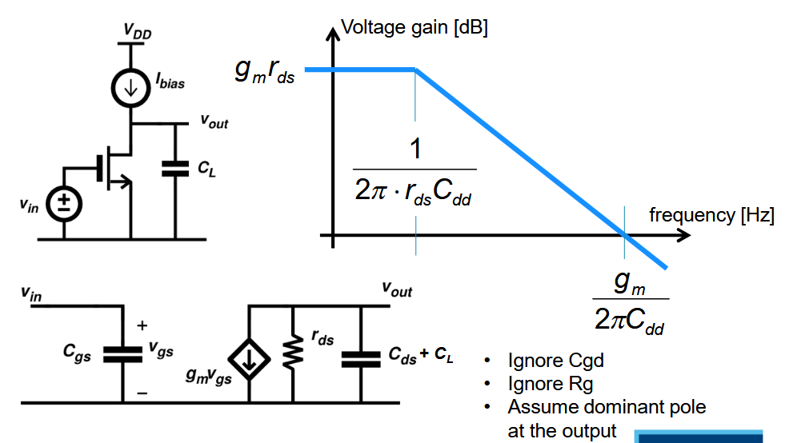{width=70%}

A tuned amplifier can be seen as an amplifier where we have some L at the boundwire for gate and drain making it a tuned amplifier.

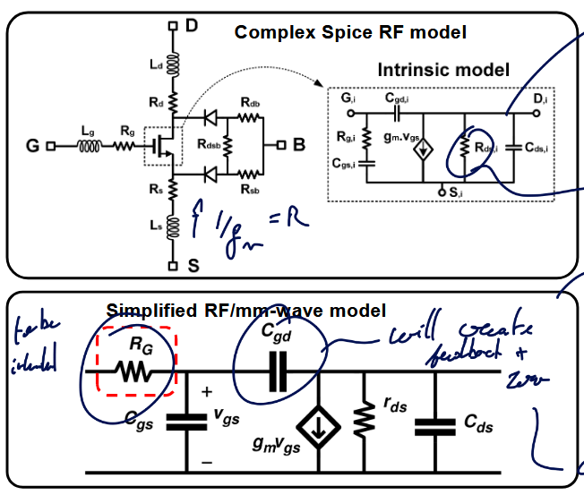{width=60%}

Good RF model have GSD contact resistor and a bulk resistance model. This can be quite cumbersome to analyze, so for this reason the second model is preferred as lots of important problems can be explained with this model.

## Gate resistance

One of the main limits of gain is this $R_G$ as it will form with $C_{gs}$ a LPF. This value must be minimized to achieve high gain. 

The gate resistance is not just 1 resistance but a combination of various resistance all modeled through $R_G$. Those values depend on the layout of the transistor.

Typically, making smaller width finger will reduce the on resistance between the drain and source but the length of the gate resistance may again increase.

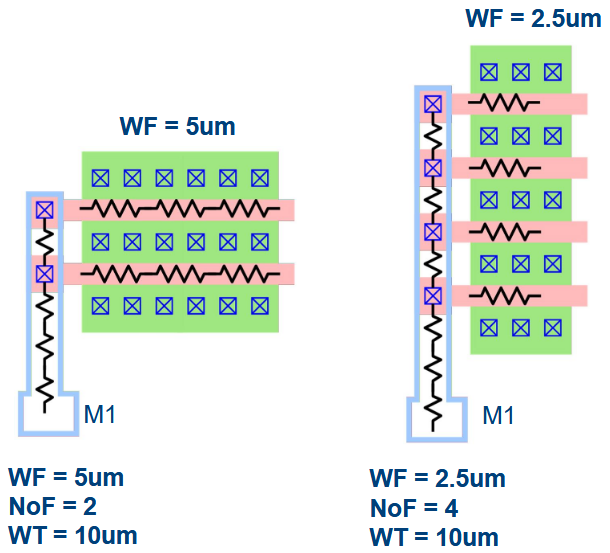{width=50%}

The intrinsic corner frequency $f_T$ can be calculated as:

$$
f_T = \frac{g_{m}}{2\pi (C_{gs} + C_{gd})}
\qquad\begin{cases}
    h_{21}(f) &= \frac{i_{OUT}}{i_{in}} = \frac{Y_{21} v_{in}}{Y_{111} v_{in}}\\
    |h_{21}(f_T)| = 1
\end{cases}
$$

The "*amazing*" thing about this metric is that it does not depend on the layout! It is purely a technological constant!

In reality and more advanced model, there is only a weak dependency between $f_T$ and $R_G$. The higher is the bias point, the higher is the $f_T$ until it plateau and decreases.

### Matching source and load 

The goal is to transform the impedance seen by a load or a source to increase the performances of the circuit.

#### RL Series to Parallel conversion

With $Q_L = \frac{Z_L}{R_S} = \frac{\omega L_S}{R_S}$, we can convert to parallel with:

$$
L_P = L_S(1+1/Q_L^2) \qquad R_P = R_S(1+Q_L^2)
$$

#### RC Series to Parallel conversion

With $Q_C = \frac{Z_C}{R_S} = \frac{1}{\omega C_SR_S}$, we can convert to parallel with:

$$
C_P = \frac{C_S}{1+1/Q_L^2} \qquad R_P = R_S(1+Q_L^2)
$$

#### LC-match network

If we have a $L_m$, $C_m$ matching network in parallel of a $R_L$ load, we can convert into a fully in series network with $Q_C = \frac{1}{\omega C_m R_L}$.

$$
\omega = \frac{1}{\sqrt{L_m C_m'}} \qquad R_L' = \frac{R_L}{(1+Q_C^2)}
$$

And we have now that $R_{in} = R_L'$. There will be now power loss as $P_{out} = P_{in} = \frac{v_{in}^2}{R_{in}} = \frac{v_{in}^2}{R_{L}'} = (1+Q_C^2)\frac{v_{in}^2}{R_L}$. $v_{out} \approx Q_C v_{in}$ (narrowband) passive voltage amplifier.

#### Definition: $f_{max}$

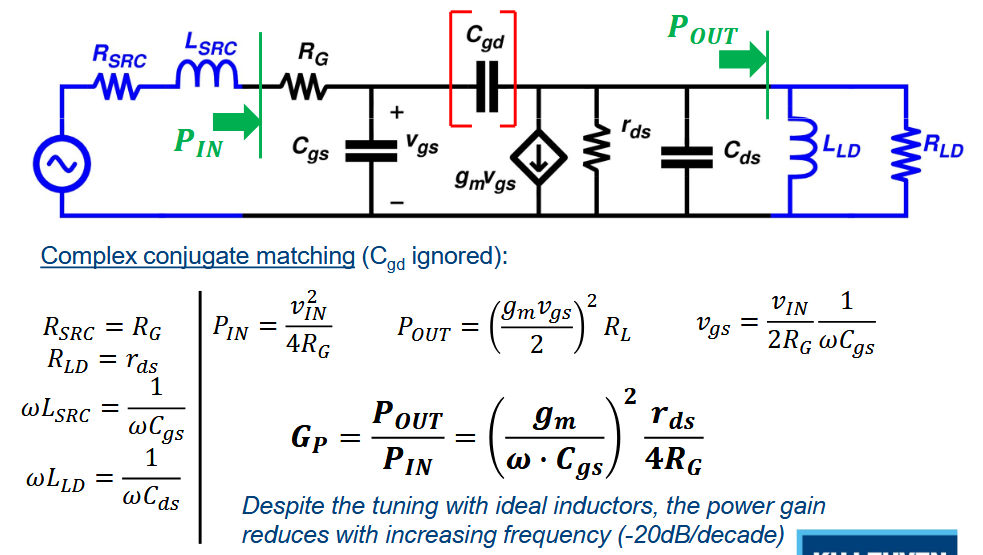{width=70%}

$$
G_P = \left(\frac{g_m}{2\pi f_{\text{MAX}} \cdot C_{gs}}\right)^2 \frac{r_{ds}}{4R_G} = 1 \Rightarrow f_{\text{MAX}} = \frac{g_m}{2\pi \cdot C_{gs}} \sqrt{\frac{r_{ds}}{4R_G}}
$$

Here, $f_{MAX}$ depends on biasing and layout !

$$
f_{MAX} = f_T \cdot \sqrt{\frac{r_{ds}}{4 R_G}}
$$

### Modeling it

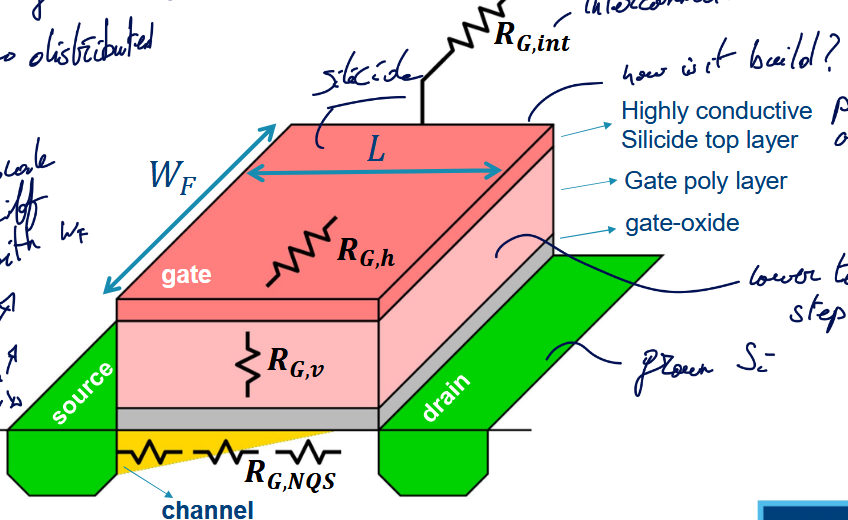{width=70%}

#### Horizontal gate resistance $R_{G,h}$

$$
R_{G,h} = \alpha \frac{W_F}{L}\rho_{sh, Sili}
$$

We have a distributed effect $\alpha$ using the sheet-resistance of the Silicide layer $\rho_{sh, Sili}$.

It would be naive to think that this resistance is constant throughout the gate, actually, the current $I_G$ will be high at the entrance of the gate and slowly decrease until reaching 0. In this case $\alpha = 1/3$.

One way to reduce this is by applying two contacts at each side. This will divide by 2 the current in each branch and each branch are 2 times smaller. So, $\alpha = 1/2 \cdot 1/2 \cdot 1/3 = 1/12$

#### Vertical gate resistance $R_{G,v}$

$$
R_{G,v} = \rho_{poly} \frac{t_{poly}}{L \cdot W_F}
$$

$L$ here is the cross-section of a gate finger and $\rho_{poly}$ is the gate resistivity poly.

#### Non-Quasi-Static (NQS) gate resistance $R_{G,NQS}$

$$
R_{G,NQS} \sim \frac{L}{W_F}
$$

It is not a "real" resistance, it appears due to charge in channel coming from the source. It models the time constant $\tau = 1/RC$ that appears due to the fact the charges must travel through the channel.

#### Multi-Finger connection resistance $R_{G,int}$

$$
R_{G,int} \sim \frac{W\cdot L}{W_F}
$$

Appears due to all the connections with each fingers.

#### Summary

| Name                               | Symbol      | Equation                                   |
| :--------------------------------- | :---------- | :----------------------------------------- |
| Horizontal gate resistance         | $R_{G,h}$   | $\alpha \frac{W_F}{L}\rho_{sh, Sili}$      |
| Vertical gate resistance           | $R_{G,v}$   | $\rho_{poly} \frac{t_{poly}}{L \cdot W_F}$ |
| NQS gate resistance                | $R_{G,NQS}$ | $\sim \frac{L}{W_F}$                       |
| Multi-Finger connection resistance | $R_{G,int}$ | $\sim \frac{W\cdot L}{W_F}$                |
:Summary of the various actor in the Gate Resistance $R_G$

To optimize it, we can find the ideal $W_F$ value. The vertical and NQS resistances are found in the `BSIM` model

The multi-finger can be found using the `PEX` model. 

The optimal $W_F$ isn't the same for every transistors. The optimum shifts as the transistor get larger. Typically, the width of a finger should get larger as the total width increase.

Surprisingly, the $f_{max}$ is also shifting as the total width increase. We see that $r_{ds}$ reduces by 10 while $R_G$ only reduces by a factor 3.7. This unequal reduction leads to a 60% reduction of $f_{max}$.

#### Layout optimization

We can focus only on the gate resistance which will add parasitic at the drain which is not too bad for our goal. We use wider trace at the gate which will increase the gate source capacitance. Luckily, this can be tuned out.

#### FinFETs

The total width is the number of fingers times the amount of fins per finger. We need fin depopulation to reduce the gate resistance.

### Interstage matching situation

This is a good way to enhance the gain by re-adjusting the impedance seen at the terminals. However, this will induce power loss and require more chip area ! The losses are proportional to the Impedance Transformation Ratio (ITR).

**Re-read this section + re-watch to fully grasp everything**

The bottom line is that matching with realistic Q factors only makes sense at higher frequencies. Higher than 20 GHz or we would have too much power loss at lower frequencies. 1:1 impedance ratio leads to a very easy matching network. This 1:1 happens at various frequencies for different technology node and size ratio.

#### Mismatch can give better output power

**Add slice example**

## Stability

The capacitance $C_{gd}$ forms a feedback between the output and input opening the door for instability issues. This limits the maximum attainable gain.

We define the term conditionally stable and unconditionally stable:

- Conditional: for some source and load impedance, the network will be unstable
- Unconditional: always stable for (any) source and load

This definition is only based on the fact that we put a network at the input and one at the output without any connections between. But, if add a voltage source between input and output we can make any unconditionally stable circuit oscillate.

### Rollett Stability Factor K

- $K>1$: unconditionally stable
- $K<1$: *potentially* unstable

$$
K = \frac{1-|S_{11}|^2 - |S_{22}|^2 + |\Delta|^2}{2|S_{21}S_{12}|} \qquad \Delta = S_{11}S_{22} - S_{21}S_{12} 
$$

#### Maximum Available Gain (MAG)

MAG provided ideal matching and $K>1$

$$
MAG = (K-\sqrt{K^2 - 1}) \cdot \frac{S_{21}}{S_{12}} = \frac{1}{K + \sqrt{K^2 - 1}} \cdot \frac{S_{21}}{S_{12}}
$$

#### Maximum Stable Gain (MSG)

To achieve stability, one way is to add loss at the input or output. If $K=1$ we have the MSG:

$$
MSG = \frac{S_{21}}{S_{12}}
$$

### Gmax in Cadence

At lower frequency, the transistor will be conditionally stable and thus the gain will be linear corresponding to the MSG. There will be a corner in the gain depending on the layout. Good layout (ideal finger width) will have a higher corner.

In this second region the MAG is the maximum gain as the transistor will be unconditionally stable.

Using the proper conjugate matching network, in the conditionally stable region, we can touch that MSG.

## Neutralization

Instead of adding losses, we could try to **tune out** the gate drain capacitance which is the reason for the feedback and instability. But, the inductance will be too large and consumes lots of chip area.

A better solution is to use a "*negative*" capacitance which will counter-act the effects of the gate drain one. In other words, use a **differential mode** approach.

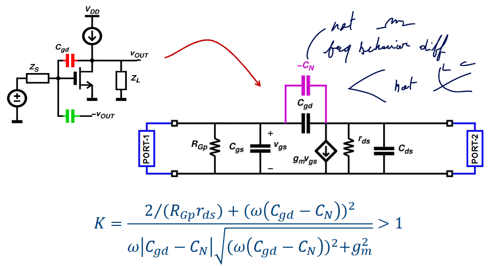{width=70%}

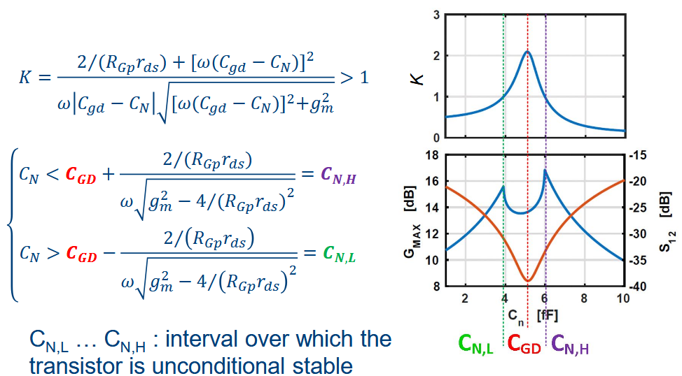{width=70%}

One issue with the neutralization implementation is the fact that the $C_N$ will be not only $C_{gd}$ but also other parasitic.

Ultimately, neutralization will lead to far superior Gmax.

### Implementation

Implementing neutralization is quite easy and interesting to do. We can use transformers and at the middle inject the bias voltages. The transformers will ensure the symmetrical differential mode signal. 

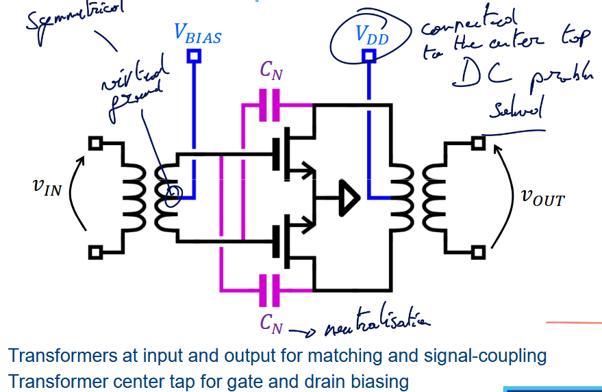{width=70%}

#### Neutralization with single-ended amps

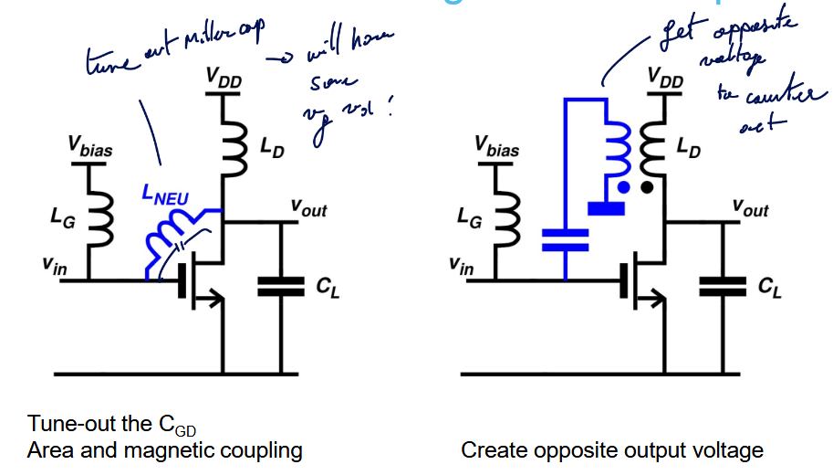{width=70%}

### Use dummy transistor

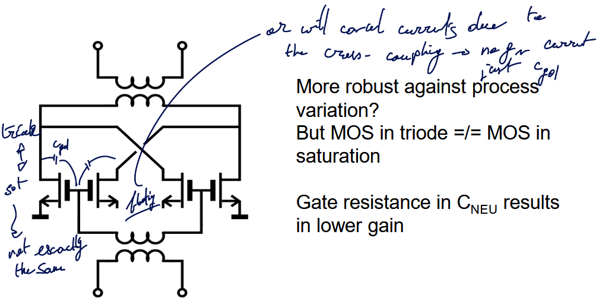{width=70%}

Another way, instead of using a floating source, is to tie the drain and source together. With this technique, no current will flow as there will be no real polarity.

## Drawback of Neutralization

In DM, it is easy to analyze the stability of the circuit. We need to just check 1 frequency, the operating one. We are not really affected by the VDD and VBIAS as it is seen as a virtual ground only.

But in Common Mode, this is a whole different story. The circuit looks different, we see the bound pad inductances and we must sweep all frequencies to make sure it is always stable. Moreover, this stability depends on the impedance of the two DC voltages (VDD and VBIAS). Finally the transistor now looks twice as wide.

### CM stability

One solution is to use *harmonic traps* that will provide excess feedback:

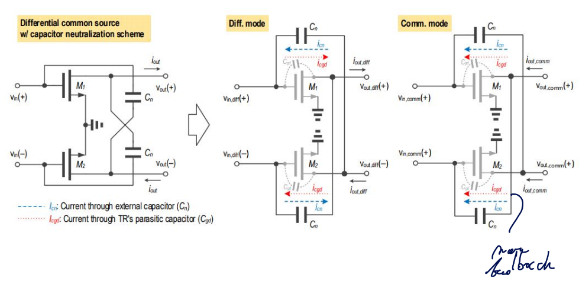{width=60%}

### CM feedback

A crucial thing is the fact that the the second order distortion is caused by the common mode ! In many research paper, this is often overlooked as this distortion will appear at $2\omega_1;2\omega_2;\omega_1+\omega_2$. So this is not close from the main frequencies. 

**BUT**, if a distorted signal is feedback at the input, it will mix and appear like a third order distortion. It is a secondary mixing terms due to the $C_{gd}$ and $C_N$ feedback network.
