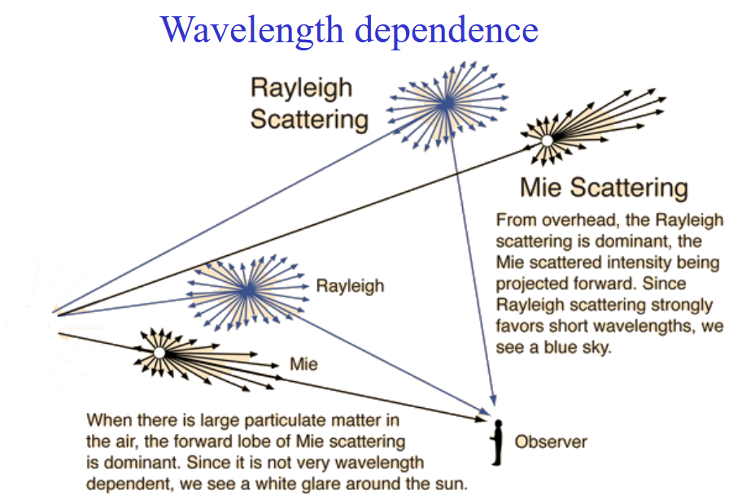
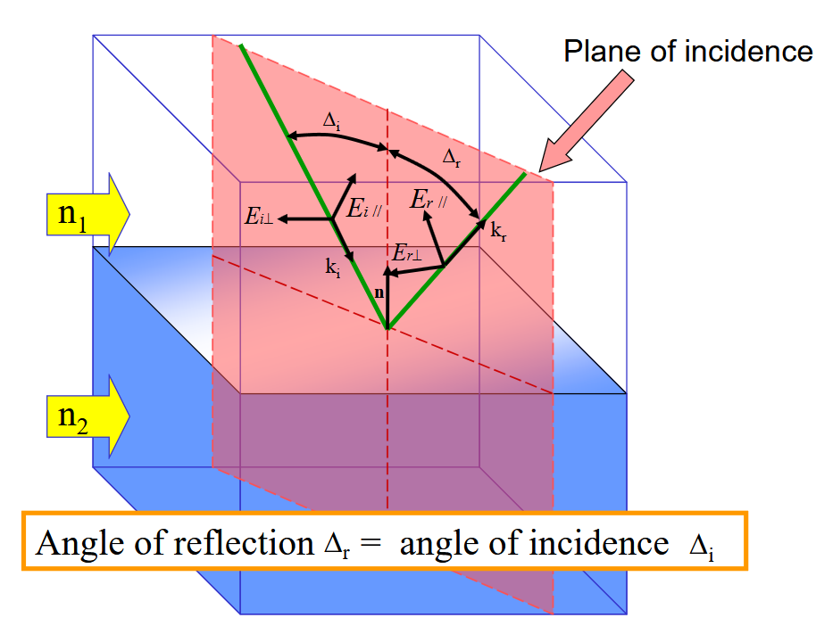
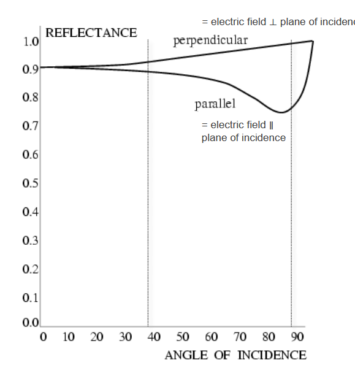
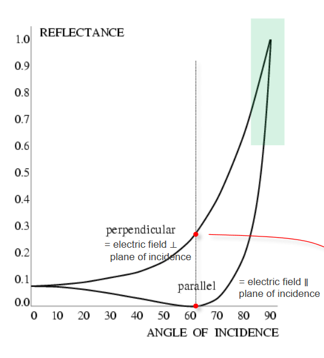
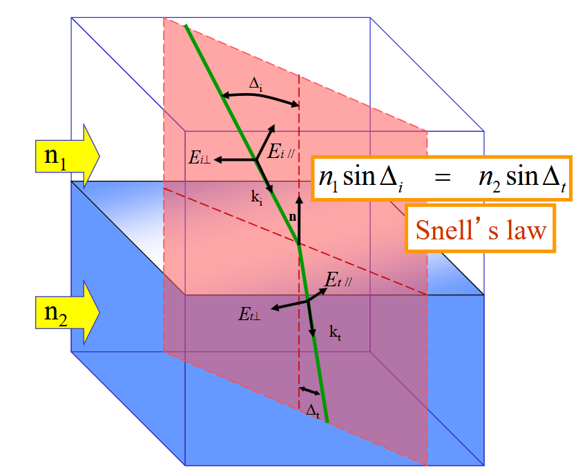
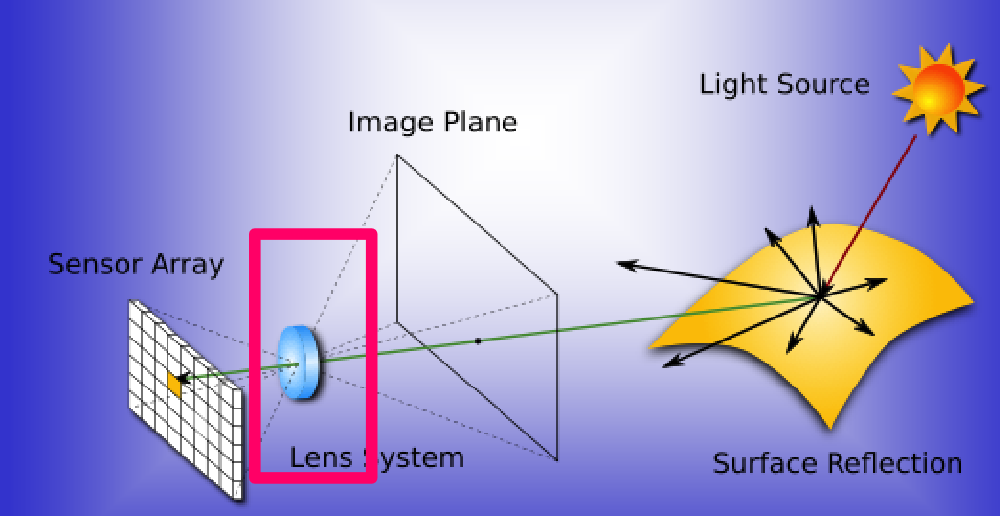
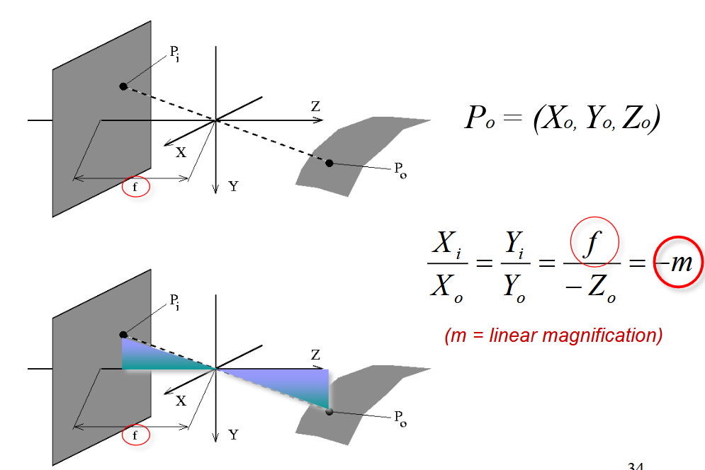
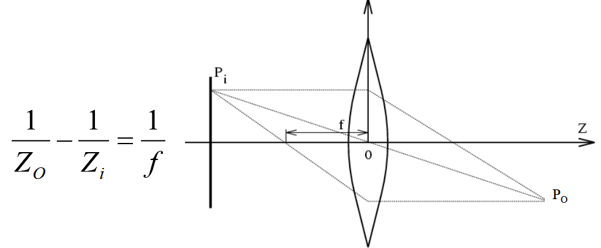

\newpage

# Introduction

The key take away is that vision is subjective to the human being and themselves. It is the results of continuous evolution and survival of the fittest. We are more sensitive to light and certain colors, to motion, ... And this fact will be used for efficient image representation and analysis.

We can think of the classic illusion where our brain will interpret certain lengths of an arrow longer than others. Context also does matter, even in a blurry picture our brain will train to make up for what he sees.

## The basics

We first need light to have vision. Light is influenced by object and create perception. ADD image slide 51. The light source bounce on the object and some scattered ray will get trough the 2D Image plane, which will be casted on the sensor array thanks to the lens system.

### Light

We will look at it from a physical optic (not geometrical (constant speed and straight path) nor quantum). Light is an Electro-magnetic wave which we assume it to be planar. aka $\frac{|E|}{|H|} = \eta$ in simple term, light is perpendicular. This is a **self-sustaining process** that is characterized by:

1. $\lambda$: wavelength
2. Direction
3. $E$: Amplitude
4. $\varphi$: phase
5. Direction of polarisation

Violet: low frequency ($380 nm$); Red: high frequency ($760 nm$). Remember $\lambda = \frac{c}{f}$.

### Perception

We don't perceive light equally. Humans have 3 cones that are not evenly spread apart. But the human vision is trained to compensate for it so everything feels similar in intensity to us. Some animals can have more cones.

### Interaction with matter

| **Phenomenon** |           **Example** |
| :------------- | --------------------: |
| Absorption     | Blue water,green leaf |
| Scattering     |  blue sky, red sunset |
| Reflection     |          colored in k |
| Refraction     | dispersion by a prism |
:The four types of interaction

#### Absorption

Dissipation of $\lambda$ specific for the medium. Resonance in molecules.

#### Scattering

When light (radiation/particles) deviates from a straight trajectory by local non-uniformities. Type depends on the relative size of particles and wavelengths:

1. **Rayleigh**: small ($\lambda$ dependent)
2. **Mie**: comparable (weakly $\lambda$ dependent)
3. **Non-selective**: large ($\lambda$ **in**dependent) 

We ignored transmission and diffraction.

{width=50%}

We need scatter to get the bluesky (Rayleigh with Tyndall effect) or it would be dark. Coloured cloud from volcanic eruption = Mie (particle all over the air). Grey cloud is due to non-selective.Less scatter for lower frequency light (infrared).

#### Reflection

{width=50%}

With reflection, the notion of polarization is important. The polarization effect creates the fact that a reflected wave on certain surfaces can be reflected with all but one direction of the electric field. This effect is more prominent on **non-metallic** surfaces!

{width=50%}

{width=50%}

Rough surfaces will lead to **diffuse** reflection as the reflection angles will be all over the place. On the other hand, smooth surfaces give **specular** reflection. Both **diffuse** and **specular** can also happen all together.

Reflectance varies through $\lambda$ and different side of vegetation can typically give various reflection[^1]

[^1]: This fact can be used for spectral reflectance of vegetation since it forms a signature

#### Refraction

Typically, refraction which is the bending of the light and dispersion which is a frequency dependency.

{width=50%}

# Acquisition of images

{width=50%}

Controlling the lights is essential for acquisition as it is the main vector to acquire images. Severals techniques exist

| Type                                      | Description                                                                                                                                       |                                                Examples |
| :---------------------------------------- | :------------------------------------------------------------------------------------------------------------------------------------------------ | ------------------------------------------------------: |
| Back-lighting                             | Light source behind object (better with a diffuser plate)                                                                                         | High contrast silhouette. **Binary vision**, inspection |
| Directional                               | Tilt lights to generate sharp shadow of specular reflection (rough surfaces)                                                                      |                                     Detection of cracks |
| Diffuse                                   | Uniform lighting, all directions contribute to the diffusion reflection but specular spike due to spike                                           |                                     Detection of cracks |
| Polarized: Contrast diffuse and specular  | diffuse makes light non-polarized while specular keeps polarized. Put polarizer/analyzer orthogonal, better for glare (high dynamic range) issue. |                                     Detection of cracks |
| Polarized: Contrast dielectrics and metal |            Dielectric at Brewster angle can be used as a polarizer which is not possible for metallic surface (see previous chapter).                                                                                                                                 |      So use a polarizer to suppress specular reflection from dielectric **OR** distinguish between specular and dielectric surfaces                                                       |
| Coloured                                  |      Highlight region of similar colour. Use laser (monochromatic light), differentiation between specular and diffuse. Comparing colours. Spectral sensitivity of a sensor.                                                                                                                                            |                                                         |
| Structured                                |    Spatially or temporally modulated light pattern. Projection on a 3D object will distort the projection pattern                                                                                                                                             |  3D reconstruction                                                       |
| Stroboscopic                              |    High intensity light flash. Eliminate motion blur.                                                                                                                                               |  For high speed inspection                                                       |

Note about the dar and bright field. Mostly relevant for the Directional/Diffuse lighting. *Dark field*, when the camera is placed outside the specular reflection area of the normal area, only specular reflection (different orientation from normal) will show up. On the other hand, *Bright field*, we place camera inside this specular reflection light area and the non-normal area will appear dark.

## Image formation

We use the pinhole model in this class:

{width=60%}

From this we can use the thin-lens equation which assumes:

- Spherical lens surfaces
- Incoming light $\pm \parallel$ to axis
- Thickness << radii
- Same refractive index on both sides

{width=50%}
