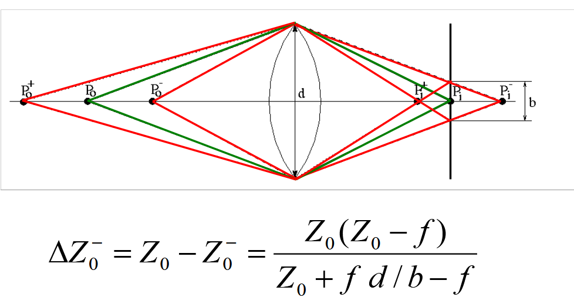
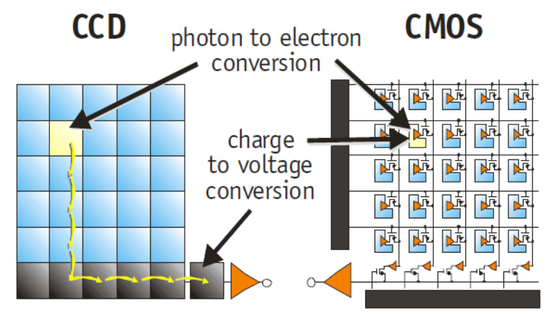
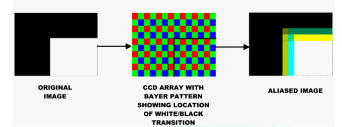
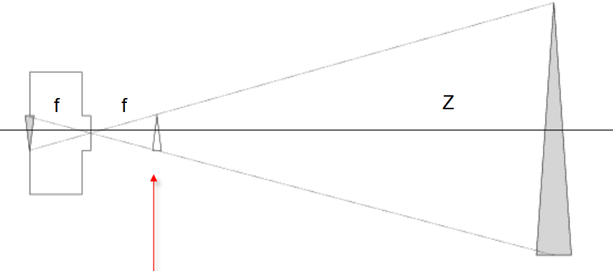
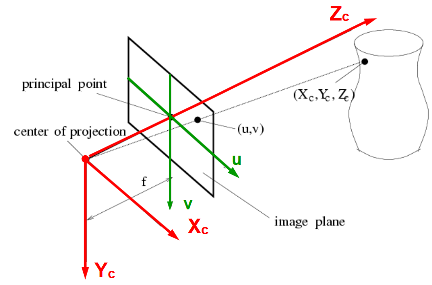
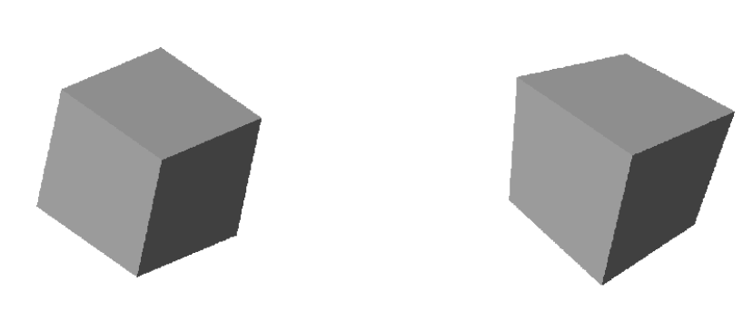
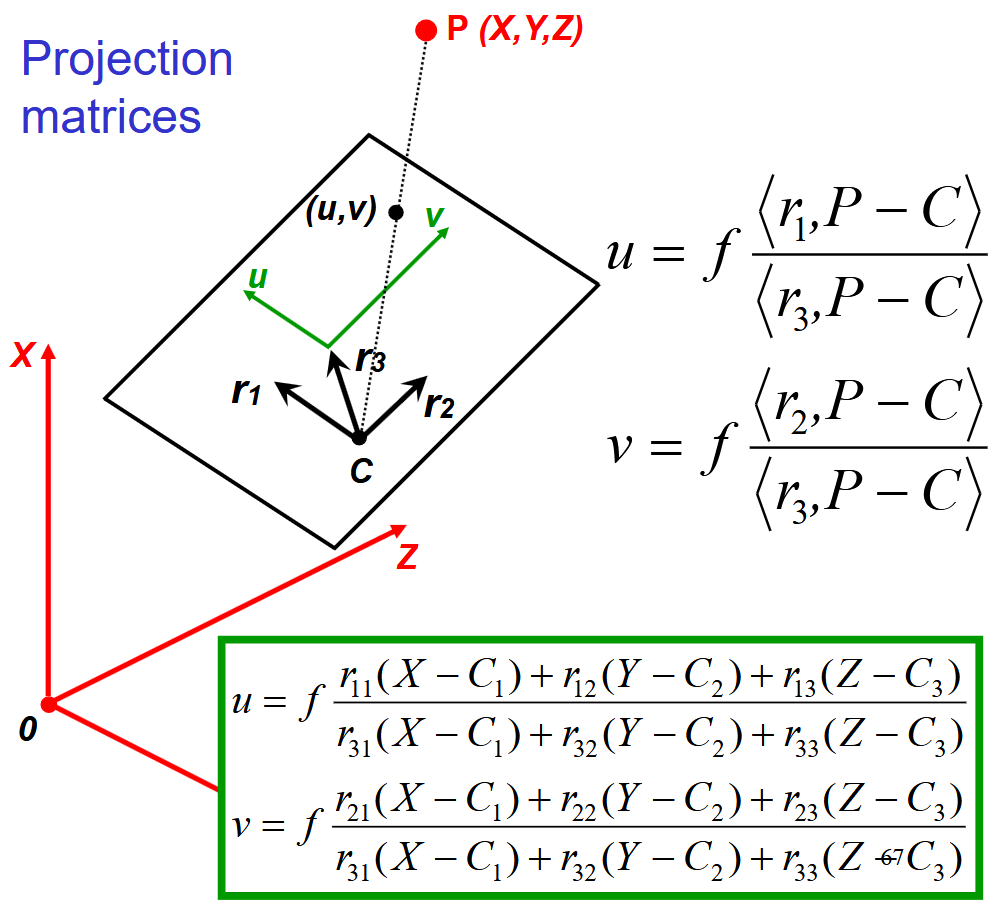
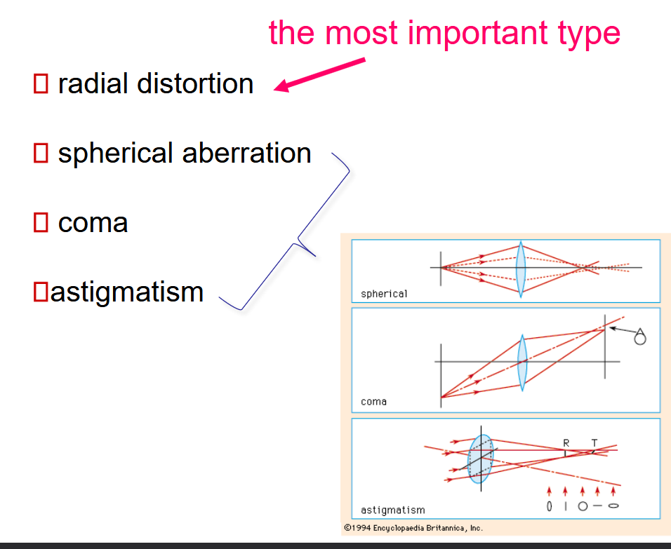
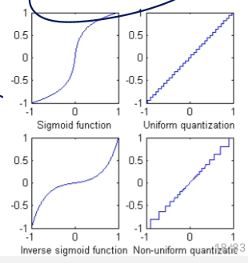
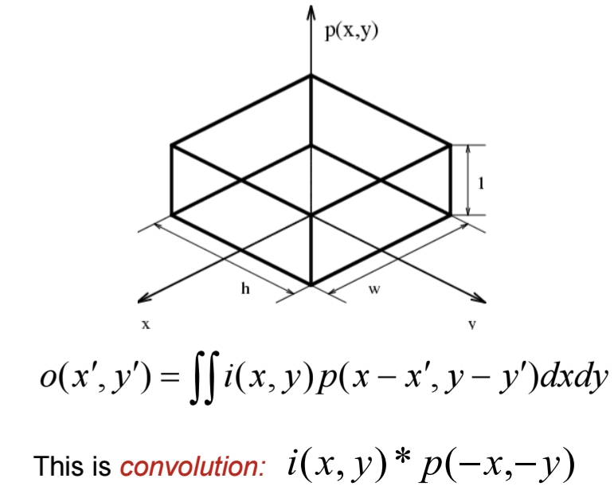

\newpage

# Introduction

The key take away is that vision is subjective to the human being and themselves. It is the results of continuous evolution and survival of the fittest. We are more sensitive to light and certain colors, to motion, ... And this fact will be used for efficient image representation and analysis.

We can think of the classic illusion where our brain will interpret certain lengths of an arrow longer than others. Context also does matter, even in a blurry picture our brain will train to make up for what he sees.

## The basics

We first need light to have vision. Light is influenced by object and create perception. ADD image slide 51. The light source bounce on the object and some scattered ray will get trough the 2D Image plane, which will be casted on the sensor array thanks to the lens system.

### Light

We will look at it from a physical optic (not geometrical (constant speed and straight path) nor quantum). Light is an Electro-magnetic wave which we assume it to be planar. aka $\frac{|E|}{|H|} = \eta$ in simple term, light is perpendicular. This is a **self-sustaining process** that is characterized by:

1. $\lambda$: wavelength
2. Direction
3. $E$: Amplitude
4. $\varphi$: phase
5. Direction of polarisation

Violet: low frequency ($380 nm$); Red: high frequency ($760 nm$). Remember $\lambda = \frac{c}{f}$.

### Perception

We don't perceive light equally. Humans have 3 cones that are not evenly spread apart. But the human vision is trained to compensate for it so everything feels similar in intensity to us. Some animals can have more cones.

### Interaction with matter

| **Phenomenon** |           **Example** |
| :------------- | --------------------: |
| Absorption     | Blue water,green leaf |
| Scattering     |  blue sky, red sunset |
| Reflection     |          colored in k |
| Refraction     | dispersion by a prism |
:The four types of interaction

#### Absorption

Dissipation of $\lambda$ specific for the medium. Resonance in molecules.

#### Scattering

When light (radiation/particles) deviates from a straight trajectory by local non-uniformities. Type depends on the relative size of particles and wavelengths:

1. **Rayleigh**: small ($\lambda$ dependent)
2. **Mie**: comparable (weakly $\lambda$ dependent)
3. **Non-selective**: large ($\lambda$ **in**dependent) 

We ignored transmission and diffraction.

{width=50%}

We need scatter to get the bluesky (Rayleigh with Tyndall effect) or it would be dark. Coloured cloud from volcanic eruption = Mie (particle all over the air). Grey cloud is due to non-selective.Less scatter for lower frequency light (infrared).

#### Reflection

{width=50%}

With reflection, the notion of polarization is important. The polarization effect creates the fact that a reflected wave on certain surfaces can be reflected with all but one direction of the electric field. This effect is more prominent on **non-metallic** surfaces!

{width=50%}

{width=50%}

Rough surfaces will lead to **diffuse** reflection as the reflection angles will be all over the place. On the other hand, smooth surfaces give **specular** reflection. Both **diffuse** and **specular** can also happen all together.

Reflectance varies through $\lambda$ and different side of vegetation can typically give various reflection[^1]

[^1]: This fact can be used for spectral reflectance of vegetation since it forms a signature

#### Refraction

Typically, refraction which is the bending of the light and dispersion which is a frequency dependency.

{width=50%}

# Acquisition of images

{width=50%}

Controlling the lights is essential for acquisition as it is the main vector to acquire images. Severals techniques exist

| Type                                      | Description                                                                                                                                                             |                                                                                                                       Examples |
| :---------------------------------------- | :---------------------------------------------------------------------------------------------------------------------------------------------------------------------- | -----------------------------------------------------------------------------------------------------------------------------: |
| Back-lighting                             | Light source behind object (better with a diffuser plate)                                                                                                               |                                                                        High contrast silhouette. **Binary vision**, inspection |
| Directional                               | Tilt lights to generate sharp shadow of specular reflection (rough surfaces)                                                                                            |                                                                                                            Detection of cracks |
| Diffuse                                   | Uniform lighting, all directions contribute to the diffusion reflection but specular spike due to spike                                                                 |                                                                                                            Detection of cracks |
| Polarized: Contrast diffuse and specular  | diffuse makes light non-polarized while specular keeps polarized. Put polarizer/analyzer orthogonal, better for glare (high dynamic range) issue.                       |                                                                                                            Detection of cracks |
| Polarized: Contrast dielectrics and metal | Dielectric at Brewster angle can be used as a polarizer which is not possible for metallic surface (see previous chapter).                                              | So use a polarizer to suppress specular reflection from dielectric **OR** distinguish between specular and dielectric surfaces |
| Coloured                                  | Highlight region of similar colour. Use laser (monochromatic light), differentiation between specular and diffuse. Comparing colours. Spectral sensitivity of a sensor. |                                                                                                                                |
| Structured                                | Spatially or temporally modulated light pattern. Projection on a 3D object will distort the projection pattern                                                          |                                                                                                              3D reconstruction |
| Stroboscopic                              | High intensity light flash. Eliminate motion blur.                                                                                                                      |                                                                                                      For high speed inspection |

Note about the dar and bright field. Mostly relevant for the Directional/Diffuse lighting. *Dark field*, when the camera is placed outside the specular reflection area of the normal area, only specular reflection (different orientation from normal) will show up. On the other hand, *Bright field*, we place camera inside this specular reflection light area and the non-normal area will appear dark.

## Image formation - Lens

We use the pinhole model in this class:

{width=60%}

From this we can use the thin-lens equation which assumes:

- Spherical lens surfaces
- Incoming light $\pm \parallel$ to axis
- Thickness << radii
- Same refractive index on both sides

{width=50%}

{width=50%}

There is one focal point. Strike a balance between incoming light (d) and large depth-of-field. Smaller depth-of-field is present in microscopes for example.

## Sensor array

### CCD vs CMOS

We have 2 types of sensors:

- CCD:  Charge-coupled device
  - Old school
  - Charges must hop from tile to tile
  - Cover the total pixel (high fill rate)
  - Expensive
  - Blooming (due to the charge hoping)
  - High power consumption
- CMOS: integrated
  - Cheap, Can put other component on the chip (integration)
  - Read line by line (like RAM = random access) 
  - Smaller
  - Low power
  - Same sensor as CCD but each has their own amplifier = more noise + not covering the full space = lower fill rate / sensitivity

They both works in 2 steps:

1. Photon to electron (charge) conversion
2. Electron (charge) to voltage conversion

{width=50%}

### Colour cameras

#### 1. Prism

The idea is to split the light using *dichroic prism* to split it in 3 colors. This requires really good precision but allows for good color separation.

#### 2. Filter mosaic

Back to the *bayer pattern* introduced earlier. Good for tricking the human eyes. Each pixel will have a filter in front to follow the bayer pattern. This is good but can create some aliasing especially when an edge is right on a pixel array causing some extra inexistant colors (aliasing).

{width=50%}

We loose actual resolution since know we need 2x2 pixel array to get 1 colored pixel ! We have to stack even more density but need to capture more lights --> Use microlenses.

#### 3. Filter wheel

Here instead of having 3 filters like in a filter mosaic, we have a full wheel with many filters. Behind the wheel, there is a static sensor (**only static scenes**).

#### Summary

| Type          |      Prism       |     Mosaic      |              Wheel              |
| :------------ | :--------------: | :-------------: | :-----------------------------: |
| # Sensors     |        3         |        1        |                1                |
| Resolution    |       High       |     Medium      |              Good               |
| Cost          |       High       |       Low       |             Medium              |
| Framerate     |       High       |      High       |               Low               |
| Artefacts     |       Low        |    Aliasing     | Aliasing (just motion of wheel) |
| Bands (color) |        3         |        3        |             3 or +              |
| Application   | High-end cameras | Low-end cameras |     Scientific applications     |
:Summary of the 3 coloured camera

#### Improvements

One issue is the Aliasing problem for object in motion. Since we read line by line in CMOS camera, for fast turning object (turning at $\geqslant f_s/2$) we have aliasing. To solve this, we need a global shutter instead of reading line by line.

## Perspective Projection - Image Plane

Here, we revisit the pinhole model where now, we first project everything on an object plane and then this will get through the lens. The center of the lens is the center of the projection, we have an virtual image plane which is also called **perspective projection** (we flattened out everything from the outside on it):

{width=50%}

{width=50%}

The origin is the center of the projection ($X_c$ row-pixel, $Y_c$ column-pixel space), the $Z_c$ axis correspond with the optical axis.

If we look at the $u,v$ space we have the following relationship, which comes from the "similar triangles property" where you look once from above (for X case) and one from the side (for Y case).

$$
u = f\frac{X_c}{Z_c} \qquad v = f\frac{Y_c}{Z_c}
$$

We can then say that if $Z$ is constant, we can write $x = kX_c$ and $y = kY_c$ where $k=f/Z$. Orthographic projection + a scaling. This forms a good approximation if objects are small compared to their distance from the camera.

### Projections limitations

{width=50%}

The perspective projection model is incomplete. What about world coordinate ? What if we want our u,v coordinates as a row and column numbers (like in a matrix of pixels).

**This part of the class that does not form exam material but helps with understanding where does those matrices come from.**

#### The (u,v) projection to pixel

We can see a matrix of pixel instead of the (u,v) projection. We just need 3 informations: 1. Center of matrix $x_0$ and $y_o$, 2. Width of array $k_x$ and 3. Height of array $k_y$ giving us:

$$
\begin{cases}
    x&= k_x u + x_0 + sv\\
    y&= ky_v +y_0
\end{cases}
$$

Note: the $s$ is for skew, we have the aspect ratio $k_y/k_x$[^2]

[^2]: I thought it was the opposite...

#### The global world coordinate problem

Those equations are based on the previous $u = f X/Z$ and $v = f Y/Z$. Here $\langle , \rangle$ represents the dot product $\cdot$ between 2 vectors.

{width=50%}

The $P-c$ represents the dotted vector and $C$ being the camera position in a global coordinate system (the camera is no longer stuck to the 0,0 point). We then use the dot product between on of its axis and the vector P-C to obtain the value in this specific vector dimension (a bit like the X before). Repeat it for Y and Z.

#### Homogeneous coordinates

Capturing a 2D image requires to navigate a 3D world (and so on for 3D and 4D). This is important in computer vision where we have to deal with projection where we **have to** divide a point by $z$ !

$$
\tau \begin{pmatrix}
    x\\ y\\ z
\end{pmatrix} \rightarrow_{\text{capturing/projection}} \begin{pmatrix}
    x/z\\ y/z
\end{pmatrix}
$$

#### Putting it all together

We can rewrite the previous big dot/inner product using the homogeneous coordinate (removes division) as:

$$
\tau \begin{pmatrix}
    u\\ v\\ 1
\end{pmatrix} = \begin{pmatrix}
    fr_{11} & fr_{12} & fr_{13} \\
    fr_{21} & fr_{22} & fr_{23} \\
    r_{31} & r_{12} & r_{13} \\
\end{pmatrix} \begin{pmatrix}
    X-C_1\\ Y-C_2 \\ Z-C_3
\end{pmatrix}
$$

we can then apply the pixel coordinate system on this equation:

$$
\tau \begin{pmatrix}
    x\\ y\\ 1
\end{pmatrix} = \begin{pmatrix}
    k_x & s & x_0 \\
    0 & k_y & y_0 \\
    0 & 0 & 1 \\
\end{pmatrix} \begin{pmatrix}
    fr_{11} & fr_{12} & fr_{13} \\
    fr_{21} & fr_{22} & fr_{23} \\
    r_{31} & r_{12} & r_{13} \\
\end{pmatrix} \begin{pmatrix}
    X-C_1\\ Y-C_2 \\ Z-C_3
\end{pmatrix}
$$
 
**Back to important material for exam.**

we can further simplify with

$$
\tau \begin{pmatrix}
    x\\ y\\ 1
\end{pmatrix} = \overbrace{\begin{pmatrix}
    k_x & s & x_0 \\
    0 & k_y & y_0 \\
    0 & 0 & 1 \\
\end{pmatrix} \begin{pmatrix}
    f & 0 & 0\\
    0 & f & 0\\
    0 & 0 & 1
\end{pmatrix}}^{K \text{ Calibration matrix}} \overbrace{\begin{pmatrix}
    r_{11} & r_{12} & r_{13} \\
    r_{21} & r_{22} & r_{23} \\
    r_{31} & r_{12} & r_{13} \\
\end{pmatrix}}^{R \text{ Camera rotation}} \begin{pmatrix}
    X-C_1\\ Y-C_2 \\ Z-C_3
\end{pmatrix}
$$

We then define the following vectors:

\begin{align}
    p &= \begin{pmatrix}
        x\\ y\\ 1
    \end{pmatrix} &     P &= \begin{pmatrix}
        X\\ Y\\ Z
    \end{pmatrix} &     \tilde{P} &= \begin{pmatrix}
        X \\ Y \\ Z \\ 1
    \end{pmatrix} 
\end{align}

Which then yields the simplified version:

$$
\rho p = KR^\top (P-C) \qquad \text{some non-zero } \rho \in \mathbb{R}
$$

$$
\text{or, } \rho p = K (R^\top | -R^\top C ) \tilde{P}
$$

$$
\text{or, }\text{or, } \rho p = (M|t) \tilde{P}
 \qquad \text{with rank } M = 3
$$

## Deviations from the lens model

We assume:

1. All rays from a point are focused onto 1 image point
2. All image points in a single plane
3. Magnification is constant

If those are not respected, we have **aberrations**! Aberrations acan be **geometrical** (small for paraxial rays) or **chromatic** (refractive index function of $\lambda$ - Snell's law)

{width=50%}

They all cause issues on the focus point of the image plane. Spherical appears when the bending of light is not uniform throughoutt the lens. Coma is a bit like spherical but this time with a tiled ray. Astigmatism is problems between the *tangential* and *sagittal* ($90^\circ$ rotation from tangential) focus point which are not equal.

# Sampling and Quantisation

We live in an analog world but our computers and digital world is finite. So we have to sample (Discretize points) and quantize (attribute them a finite value).

From what we have seen and learned before, we can trick the human eye to see a higher quality image than it is actually. For example the display on a phone has a RGB pixel ratio as 2:1:1 because the human is less sensible to green. We call this grid the **bayer filter**. Other representation exist which can be more exotic, e.g.: hexagonal (more isotropic, similar structure as in the retina, no connectivity ambiguities). 

We have quantization where we usually talk about levels. Typically a n bits representation has $2^n$ levels. We can also apply fancier quantization scheme instead of simple linear one. The most classic representation is the RGB888 (1 byte per pixel for each color).

{width=50%}

#### HDR

High Dynamic Range (HDR) is a technology where we have various luminance on the screen giving really good contrast in dark and bright area. Usually, we combine multiple photos with various gains and then recombine it all together with the various exposure.

## Sampling

### Integrate brightness over the cell window

{width=50%}

This forms a convolution. Convolution are **linear**, $f_1 \rightarrow g_1 \quad f_2 \rightarrow g_2 \Rightarrow af_1 + bf_2 \rightarrow ag_1+bg_2$ , and **shift-invariant**, $f(x,y) \rightarrow g(x,y) \Rightarrow f(x-a, y-b) \rightarrow g(x-a, y-b)$.

### Read out values only at the pixel centers

