\newpage

\part{Classic Image Analysis}

# Introduction

The key take away is that vision is subjective to the human being and themselves. It is the results of continuous evolution and survival of the fittest. We are more sensitive to light and certain colors, to motion, ... And this fact will be used for efficient image representation and analysis.

We can think of the classic illusion where our brain will interpret certain lengths of an arrow longer than others. Context also does matter, even in a blurry picture our brain will train to make up for what he sees.

## The basics

We first need light to have vision. Light is influenced by object and create perception. ADD image slide 51. The light source bounce on the object and some scattered ray will get trough the 2D Image plane, which will be casted on the sensor array thanks to the lens system.

### Light

We will look at it from a physical optic (not geometrical (constant speed and straight path) nor quantum). Light is an Electro-magnetic wave which we assume it to be planar. aka $\frac{|E|}{|H|} = \eta$ in simple term, light is perpendicular. This is a **self-sustaining process** that is characterized by:

1. $\lambda$: wavelength
2. Direction
3. $E$: Amplitude
4. $\varphi$: phase
5. Direction of polarisation

Violet: low frequency ($380 nm$); Red: high frequency ($760 nm$). Remember $\lambda = \frac{c}{f}$.

### Perception

We don't perceive light equally. Humans have 3 cones that are not evenly spread apart. But the human vision is trained to compensate for it so everything feels similar in intensity to us. Some animals can have more cones.

### Interaction with matter

| **Phenomenon** |           **Example** |
| :------------- | --------------------: |
| Absorption     | Blue water,green leaf |
| Scattering     |  blue sky, red sunset |
| Reflection     |          colored in k |
| Refraction     | dispersion by a prism |
:The four types of interaction

#### Absorption

Dissipation of $\lambda$ specific for the medium. Resonance in molecules.

#### Scattering

When light (radiation/particles) deviates from a straight trajectory by local non-uniformities. Type depends on the relative size of particles and wavelengths:

1. **Rayleigh**: small ($\lambda$ dependent)
2. **Mie**: comparable (weakly $\lambda$ dependent)
3. **Non-selective**: large ($\lambda$ **in**dependent) 

We ignored transmission and diffraction.

{width=50%}

We need scatter to get the bluesky (Rayleigh with Tyndall effect) or it would be dark. Coloured cloud from volcanic eruption = Mie (particle all over the air). Grey cloud is due to non-selective.Less scatter for lower frequency light (infrared).

#### Reflection

{width=50%}

With reflection, the notion of polarization is important. The polarization effect creates the fact that a reflected wave on certain surfaces can be reflected with all but one direction of the electric field. This effect is more prominent on **non-metallic** surfaces!

{width=50%}

{width=50%}

Rough surfaces will lead to **diffuse** reflection as the reflection angles will be all over the place. On the other hand, smooth surfaces give **specular** reflection. Both **diffuse** and **specular** can also happen all together.

Reflectance varies through $\lambda$ and different side of vegetation can typically give various reflection[^1]

[^1]: This fact can be used for spectral reflectance of vegetation since it forms a signature

#### Refraction

Typically, refraction which is the bending of the light and dispersion which is a frequency dependency.

{width=50%}

# Acquisition of images

{width=50%}

Controlling the lights is essential for acquisition as it is the main vector to acquire images. Severals techniques exist

| Type                                      | Description                                                                                                                                                             |                                                                                                                       Examples |
| :---------------------------------------- | :---------------------------------------------------------------------------------------------------------------------------------------------------------------------- | -----------------------------------------------------------------------------------------------------------------------------: |
| Back-lighting                             | Light source behind object (better with a diffuser plate)                                                                                                               |                                                                        High contrast silhouette. **Binary vision**, inspection |
| Directional                               | Tilt lights to generate sharp shadow of specular reflection (rough surfaces)                                                                                            |                                                                                                            Detection of cracks |
| Diffuse                                   | Uniform lighting, all directions contribute to the diffusion reflection but specular spike due to spike                                                                 |                                                                                                            Detection of cracks |
| Polarized: Contrast diffuse and specular  | diffuse makes light non-polarized while specular keeps polarized. Put polarizer/analyzer orthogonal, better for glare (high dynamic range) issue.                       |                                                                                                            Detection of cracks |
| Polarized: Contrast dielectrics and metal | Dielectric at Brewster angle can be used as a polarizer which is not possible for metallic surface (see previous chapter).                                              | So use a polarizer to suppress specular reflection from dielectric **OR** distinguish between specular and dielectric surfaces |
| Coloured                                  | Highlight region of similar colour. Use laser (monochromatic light), differentiation between specular and diffuse. Comparing colours. Spectral sensitivity of a sensor. |                                                                                                                                |
| Structured                                | Spatially or temporally modulated light pattern. Projection on a 3D object will distort the projection pattern                                                          |                                                                                                              3D reconstruction |
| Stroboscopic                              | High intensity light flash. Eliminate motion blur.                                                                                                                      |                                                                                                      For high speed inspection |

Note about the dar and bright field. Mostly relevant for the Directional/Diffuse lighting. *Dark field*, when the camera is placed outside the specular reflection area of the normal area, only specular reflection (different orientation from normal) will show up. On the other hand, *Bright field*, we place camera inside this specular reflection light area and the non-normal area will appear dark.

## Image formation - Lens

We use the pinhole model in this class:

{width=60%}

From this we can use the thin-lens equation which assumes:

- Spherical lens surfaces
- Incoming light $\pm \parallel$ to axis
- Thickness << radii
- Same refractive index on both sides

{width=50%}

{width=50%}

There is one focal point. Strike a balance between incoming light (d) and large depth-of-field. Smaller depth-of-field is present in microscopes for example.

## Sensor array

### CCD vs CMOS

We have 2 types of sensors:

- CCD:  Charge-coupled device
  - Old school
  - Charges must hop from tile to tile
  - Cover the total pixel (high fill rate)
  - Expensive
  - Blooming (due to the charge hoping)
  - High power consumption
- CMOS: integrated
  - Cheap, Can put other component on the chip (integration)
  - Read line by line (like RAM = random access) 
  - Smaller
  - Low power
  - Same sensor as CCD but each has their own amplifier = more noise + not covering the full space = lower fill rate / sensitivity

They both works in 2 steps:

1. Photon to electron (charge) conversion
2. Electron (charge) to voltage conversion

{width=50%}

### Colour cameras

#### 1. Prism

The idea is to split the light using *dichroic prism* to split it in 3 colors. This requires really good precision but allows for good color separation.

#### 2. Filter mosaic

Back to the *bayer pattern* introduced earlier. Good for tricking the human eyes. Each pixel will have a filter in front to follow the bayer pattern. This is good but can create some aliasing especially when an edge is right on a pixel array causing some extra inexistant colors (aliasing).

{width=50%}

We loose actual resolution since know we need 2x2 pixel array to get 1 colored pixel ! We have to stack even more density but need to capture more lights --> Use microlenses.

#### 3. Filter wheel

Here instead of having 3 filters like in a filter mosaic, we have a full wheel with many filters. Behind the wheel, there is a static sensor (**only static scenes**).

#### Summary

| Type          |      Prism       |     Mosaic      |              Wheel              |
| :------------ | :--------------: | :-------------: | :-----------------------------: |
| # Sensors     |        3         |        1        |                1                |
| Resolution    |       High       |     Medium      |              Good               |
| Cost          |       High       |       Low       |             Medium              |
| Framerate     |       High       |      High       |               Low               |
| Artefacts     |       Low        |    Aliasing     | Aliasing (just motion of wheel) |
| Bands (color) |        3         |        3        |             3 or +              |
| Application   | High-end cameras | Low-end cameras |     Scientific applications     |
:Summary of the 3 coloured camera

#### Improvements

One issue is the Aliasing problem for object in motion. Since we read line by line in CMOS camera, for fast turning object (turning at $\geqslant f_s/2$) we have aliasing. To solve this, we need a global shutter instead of reading line by line.

## Perspective Projection - Image Plane

Here, we revisit the pinhole model where now, we first project everything on an object plane and then this will get through the lens. The center of the lens is the center of the projection, we have an virtual image plane which is also called **perspective projection** (we flattened out everything from the outside on it):

{width=50%}

{width=50%}

The origin is the center of the projection ($X_c$ row-pixel, $Y_c$ column-pixel space), the $Z_c$ axis correspond with the optical axis.

If we look at the $u,v$ space we have the following relationship, which comes from the "similar triangles property" where you look once from above (for X case) and one from the side (for Y case).

$$
u = f\frac{X_c}{Z_c} \qquad v = f\frac{Y_c}{Z_c}
$$

We can then say that if $Z$ is constant, we can write $x = kX_c$ and $y = kY_c$ where $k=f/Z$. Orthographic projection + a scaling. This forms a good approximation if objects are small compared to their distance from the camera.

### Projections limitations

{width=50%}

The perspective projection model is incomplete. What about world coordinate ? What if we want our u,v coordinates as a row and column numbers (like in a matrix of pixels).

**This part of the class that does not form exam material but helps with understanding where does those matrices come from.**

#### The (u,v) projection to pixel

We can see a matrix of pixel instead of the (u,v) projection. We just need 3 informations: 1. Center of matrix $x_0$ and $y_o$, 2. Width of array $k_x$ and 3. Height of array $k_y$ giving us:

$$
\begin{cases}
    x&= k_x u + x_0 + sv\\
    y&= ky_v +y_0
\end{cases}
$$

Note: the $s$ is for skew, we have the aspect ratio $k_y/k_x$[^2]

[^2]: I thought it was the opposite...

#### The global world coordinate problem

Those equations are based on the previous $u = f X/Z$ and $v = f Y/Z$. Here $\langle , \rangle$ represents the dot product $\cdot$ between 2 vectors.

{width=50%}

The $P-c$ represents the dotted vector and $C$ being the camera position in a global coordinate system (the camera is no longer stuck to the 0,0 point). We then use the dot product between on of its axis and the vector P-C to obtain the value in this specific vector dimension (a bit like the X before). Repeat it for Y and Z.

#### Homogeneous coordinates

Capturing a 2D image requires to navigate a 3D world (and so on for 3D and 4D). This is important in computer vision where we have to deal with projection where we **have to** divide a point by $z$ !

$$
\tau \begin{pmatrix}
    x\\ y\\ z
\end{pmatrix} \rightarrow_{\text{capturing/projection}} \begin{pmatrix}
    x/z\\ y/z
\end{pmatrix}
$$

#### Putting it all together

We can rewrite the previous big dot/inner product using the homogeneous coordinate (removes division) as:

$$
\tau \begin{pmatrix}
    u\\ v\\ 1
\end{pmatrix} = \begin{pmatrix}
    fr_{11} & fr_{12} & fr_{13} \\
    fr_{21} & fr_{22} & fr_{23} \\
    r_{31} & r_{12} & r_{13} \\
\end{pmatrix} \begin{pmatrix}
    X-C_1\\ Y-C_2 \\ Z-C_3
\end{pmatrix}
$$

we can then apply the pixel coordinate system on this equation:

$$
\tau \begin{pmatrix}
    x\\ y\\ 1
\end{pmatrix} = \begin{pmatrix}
    k_x & s & x_0 \\
    0 & k_y & y_0 \\
    0 & 0 & 1 \\
\end{pmatrix} \begin{pmatrix}
    fr_{11} & fr_{12} & fr_{13} \\
    fr_{21} & fr_{22} & fr_{23} \\
    r_{31} & r_{12} & r_{13} \\
\end{pmatrix} \begin{pmatrix}
    X-C_1\\ Y-C_2 \\ Z-C_3
\end{pmatrix}
$$
 
**Back to important material for exam.**

we can further simplify with

$$
\tau \begin{pmatrix}
    x\\ y\\ 1
\end{pmatrix} = \overbrace{\begin{pmatrix}
    k_x & s & x_0 \\
    0 & k_y & y_0 \\
    0 & 0 & 1 \\
\end{pmatrix} \begin{pmatrix}
    f & 0 & 0\\
    0 & f & 0\\
    0 & 0 & 1
\end{pmatrix}}^{K \text{ Calibration matrix}} \overbrace{\begin{pmatrix}
    r_{11} & r_{12} & r_{13} \\
    r_{21} & r_{22} & r_{23} \\
    r_{31} & r_{12} & r_{13} \\
\end{pmatrix}}^{R \text{ Camera rotation}} \begin{pmatrix}
    X-C_1\\ Y-C_2 \\ Z-C_3
\end{pmatrix}
$$

We then define the following vectors:

\begin{align}
    p &= \begin{pmatrix}
        x\\ y\\ 1
    \end{pmatrix} &     P &= \begin{pmatrix}
        X\\ Y\\ Z
    \end{pmatrix} &     \tilde{P} &= \begin{pmatrix}
        X \\ Y \\ Z \\ 1
    \end{pmatrix} 
\end{align}

Which then yields the simplified version:

$$
\rho p = KR^\top (P-C) \qquad \text{some non-zero } \rho \in \mathbb{R}
$$

$$
\text{or, } \rho p = K (R^\top | -R^\top C ) \tilde{P}
$$

$$
\text{or, }\text{or, } \rho p = (M|t) \tilde{P}
 \qquad \text{with rank } M = 3
$$

## Deviations from the lens model

We assume:

1. All rays from a point are focused onto 1 image point
2. All image points in a single plane
3. Magnification is constant

If those are not respected, we have **aberrations**! Aberrations acan be **geometrical** (small for paraxial rays) or **chromatic** (refractive index function of $\lambda$ - Snell's law)

{width=50%}

They all cause issues on the focus point of the image plane. Spherical appears when the bending of light is not uniform throughout the lens, typically outer ray converges sooner (small focal length) then inner one. They do not converge all together. Coma is a bit like spherical but this time with a tiled ray. Astigmatism is problems between the *tangential* and *sagittal* ($90^\circ$ rotation from tangential) focus point which are not equal.

### Radial distortion

By far the most important type of distortion which causes "fish-eye" look or pincushion. It creates various *magnification* for different angles of inclination. The pixel either sinks towards the center or slides outside along the line connection the center and the original pixel.

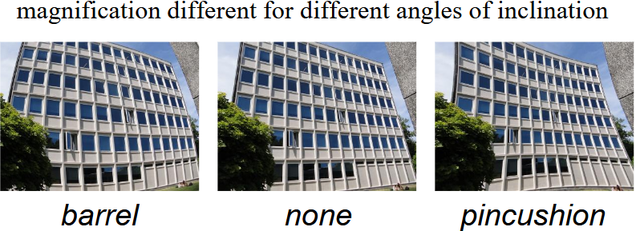{width=50%}

We can model this sliding distance $d$ with the following equation and thus can be corrected. Some algorithm looks at human made structure (straight lines) to establish the effect.

$$
d = (1+ \kappa_1 r^2 + \kappa_2 r^4 + ...)
$$

### Chromatic aberration

Rays of different $\lambda$ will focus in different planes. This creates various colours especially along sharp edges. This **can't** be removed completely but *achromatization* can be achieved by selecting the right type of glasses.

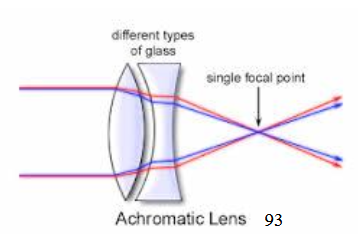{width=50%}

### Photometric camera model

We want to convert the object radiance into a pixel grey level. This is a 2-step process with our idea of the image plane. We first project the radiance of the object to the image, then this image irradiance projects to a pixel in a grey level. The **cos4** law governs the radiance. The more an object is of-axis from the center by an angle $\theta$ the more it reduces its irradiance in the pixel. This materializes with **natural vignetting**[^3] (like the old instagram filter).

$$
I = R \frac{A_l}{f^2} \cos^4 \theta
$$

This will get converted in a grey pixel with:

$$
pix = g I^\gamma + d
$$

With the $g$ of the camera, $d$ the dark reference of the camera. The gamma $\gamma$ is a non-linear relationship which changes the mid-tone without really changing the pure black or white. A value lower than 1 makes the image lighter and vice-versa. Nowadays, cameras have become quite linear meaning that $\gamma = 1$.

[^3]: optical vignetting appears due to an obstruction of the lens by an element

# Sampling and Quantisation

We live in an analog world but our computers and digital world is finite. So we have to sample (Discretize points) and quantize (attribute them a finite value).

From what we have seen and learned before, we can trick the human eye to see a higher quality image than it is actually. For example the display on a phone has a RGB pixel ratio as 2:1:1 because the human is less sensible to green. We call this grid the **bayer filter**. Other representation exist which can be more exotic, e.g.: hexagonal (more isotropic, similar structure as in the retina, no connectivity ambiguities). 

We have quantization where we usually talk about levels. Typically a n bits representation has $2^n$ levels. We can also apply fancier quantization scheme instead of simple linear one. The most classic representation is the RGB888 (1 byte per pixel for each color).

{width=50%}

#### HDR

High Dynamic Range (HDR) is a technology where we have various luminance on the screen giving really good contrast in dark and bright area. Usually, we combine multiple photos with various gains and then recombine it all together with the various exposure.

## Sampling

### Integrate brightness over the cell window

{width=50%}

This forms a convolution. Convolution are **linear**, $f_1 \rightarrow g_1 \quad f_2 \rightarrow g_2 \Rightarrow af_1 + bf_2 \rightarrow ag_1+bg_2$ , and **shift-invariant**, $f(x,y) \rightarrow g(x,y) \Rightarrow f(x-a, y-b) \rightarrow g(x-a, y-b)$.

Convolutions are also commutative and associative as proven in the Fourier domain.

$$
\mathfrak{F}(u) = \int_{-\infty}^{\infty} f(t) e^{-2i\pi x u}dx
$$

For the 2D case, we have $e^{-2i\pi (ux + vy)}$ which has for Euler form $\cos(2\pi (ux+vy)) +  i\sin(2\pi (ux+vy))$. Now, the $u$ and $v$ represents the frequency along the x and y dimensions. To obtain the $\lambda$ of  the signal we need to take the norm of the frequency for both axis inverted:

$$
\lambda = \frac{1}{\sqrt{u^2+v^2}}
$$

As in 1D, we can do Fourier transform to decomposition the image in a bunch of frequencies. As in 1D, we have a complex results where the magnitude is $|\mathfrak{F}(u,v)| = \sqrt{\mathbb{R}(\mathfrak{F}(u,v))^2 + \mathbb{I}(\mathfrak{F}(u,v))^2}$ and the phase angle $\angle\mathfrak{F}(u,v) = \arctan(\mathbb{I}(\mathfrak{F}(u,v))/\mathbb{R}(\mathfrak{F}(u,v)))$.

$$
\mathfrak{F}(u,v) = \int_{-\infty}^{\infty}  \int_{-\infty}^{\infty} f(x,y) e^{-2i\pi (xu + yv)}dxdy
$$

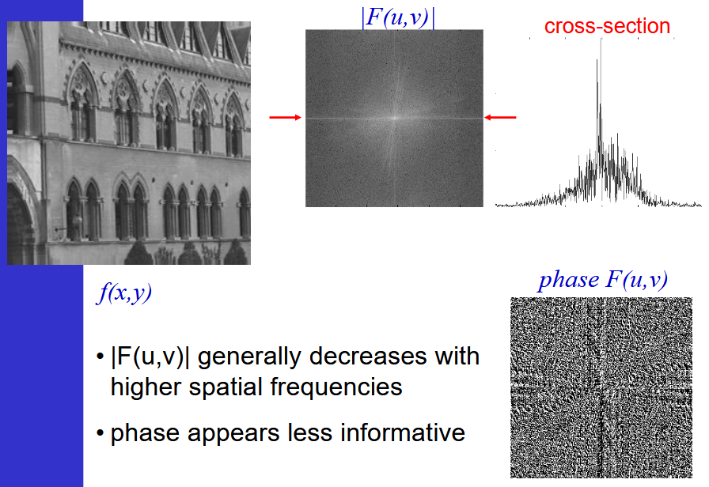{width=50%}

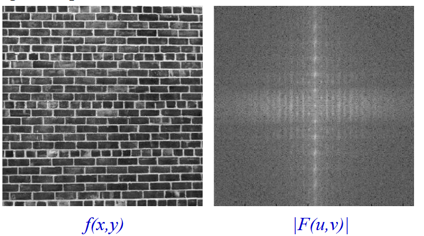{width=50%}

Removing patterns peak in frequency allows to remove periodic background.

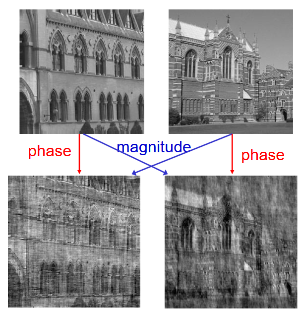{width=50%}

#### Properties of spatial-frequency domain

| Spatial domain |                                               Frequency domain |
| :------------- | -------------------------------------------------------------: |
| Real           | Real part $\rightarrow$ even; Imaginary part $\rightarrow$ odd |
| Real,even      |                                            Real, even (cosine) |
| Real,odd       |                                          Imaginary, odd (sine) |

Important to remember that a convolution in spatial domain is a multiplication in the frequency domain and vice versa.

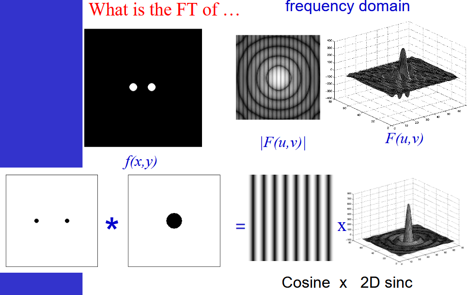{width=50%}

We have the base image (the dot) and the the transfer function, MTF R, which contains the amplification and phase shift information to every frequency in the input image I.

#### Integrating with the convolution

Re-using the integration over a cell window:

$$
o(x',y') = \int\int i(x,y)p(x-x', y-y') dxdy \leftrightarrow i(x,y) \ast p(-x,-y)
$$

We can then transform this $p(x,y)$ round-point (as seen in the previous figure) in a $P(u,v)$

\begin{align}
    P(u,v) &= \int_{-\infty}^{\infty} e^{-i 2 \pi (ux+vy)} p(x,y) dxdy\\
    &= wh \left( \frac{\sin(\pi wu)}{\pi wu} \right) \underbrace{\left( \frac{\sin (\pi h v)}{\pi hv} \right)}_{\text{sinc}}
\end{align}

The sinc function is predominantly low-pass **and** non-causal (no phase shift) and it has phase reversal.

## Aliasing

This corresponds to a 2D Dirac train convolution on the grid like:

$$
f(a,b) = \int\int f(x,y) \delta(x-a, y-b) dxdy
$$

The multiplication with the 2D pulse train with a spacing of distance w and h:

\begin{align}
    &\sum_{k=-\infty}^\infty\sum_{l=-\infty}^\infty \delta(x-kw, y-lh)\\
    &\longleftrightarrow \frac{1}{wh}\sum_{k=-\infty}^\infty\sum_{l=-\infty}^\infty \delta(x-k\frac{1}{w}, y-l\frac{1}{h})
\end{align}

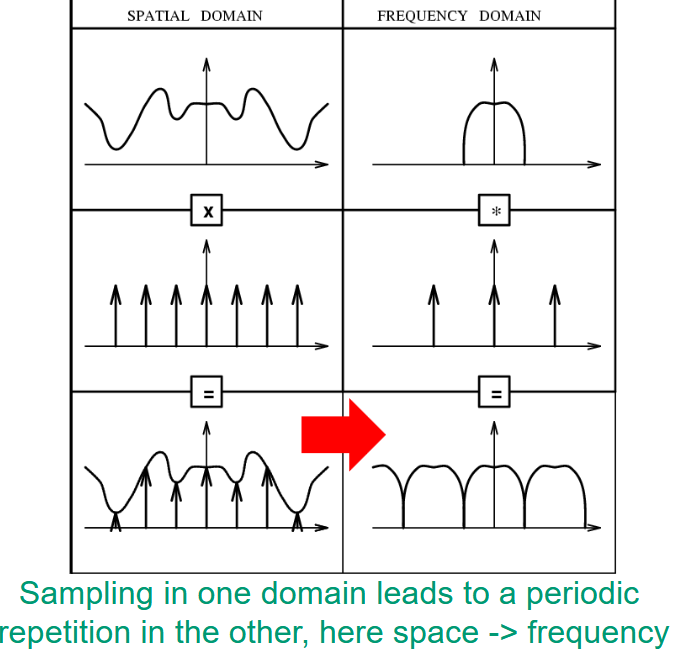{width=50%}

Also, we need to do a Discrete Fourier Transform, DFT, to discretize the space and frequency. We can also use FFT to bring the complexity of the algorithm from $N^2$ to $N\log_2 N$.

\begin{align}
    &\sum_{m=0}^{M-1}\sum_{n=0}^{N-1} F(k,l) e^{2\pi i \left( \frac{km}{M} + \frac{ln}{N} \right)}\\
    &\longleftrightarrow F(k,l)= \frac{1}{MN} \sum_{m=0}^{M-1}\sum_{n=0}^{N-1} f(m,n) e^{-2\pi i \left( \frac{km}{M} + \frac{ln}{N} \right)}
\end{align}

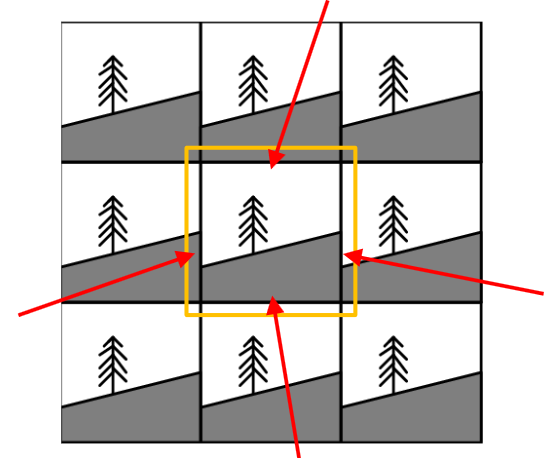{width=50%}

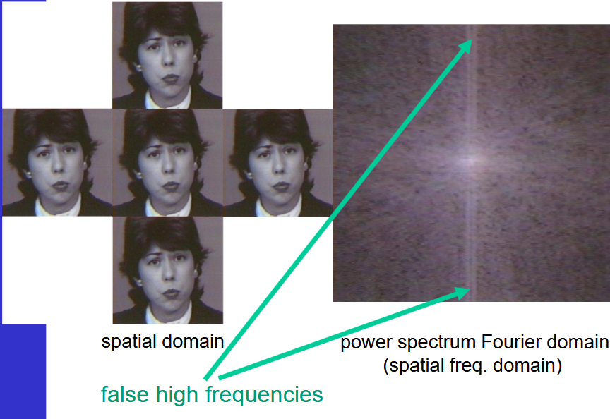{width=50%}

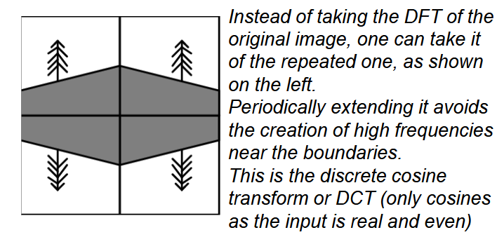{width=50%}

Again, the Shannon theorem is important in 2D as well such that the sampling distance $w,h$ along the $x,y$ axis must follow:

$$
w \leqslant \frac{1}{2 u_b} \qquad h \leqslant \frac{1}{2v_b}
$$

# Enhancement and feature detection

Strong from the knowledge of the previous section, we can do some spectral filtering. For example, if we have some white noise in an image we could apply a low pass filter on it to already remove a big part of the noise while losing a marginal part of the actual picture information. Usually, this will sorts of blur the image because sharp edges are like high-frequency information.

## Enhancement - better look of image

Typically, HDR is a form of enhancement for better contrast. A cheaper way of doing HDR is doing histogram equalisation which allows for better usage of the full dynamic range available (a bit like gamma correction I think).

### Histogram Equalisation

This will makes the image more vibrant if we exploit more of the dynamic range, we **redistribute** the intensities through a **mapping that keeps their relative order**. Ideally, we make the histogram **flat**.

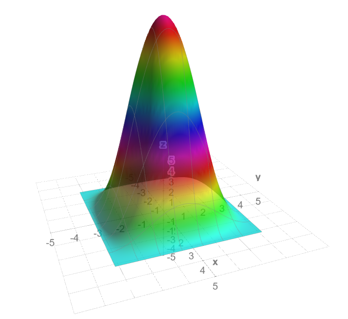{width=50%}

We will compress the flat parts of the CPD, and expand the steepest one. But the main issue, since we move bins, we want have a flat histogram, we will just spread the bins more equally due to the **discrete nature** of the input. On top, neigboring pixels won't always have the same difference of intensities after the remapping (less problematic though).

### Deblurring or Unsharp masking

If we deblur we actually increase the image sharpness. It's *simple, linear, image independent and effective*.

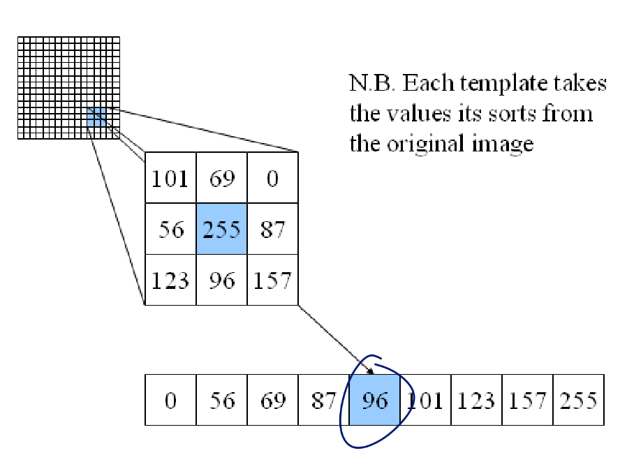{width=50%}

We see that we, indeed, make the edge steeper. Moreover, the difference between the original-smooth makes a good fit for second order derivative. This is a bit like running a diffusion process backwards.

The little over and under-shoots at the edge even magnifies the contrast (Mach band effect).

### Inverse Filtering

Now, we shift gears and go into the frequency. We have the frequency function that blurs the image with $B(u,v)$. To undo it we apply $B'(u,v)$ such that $B'(u,v)B(u,v) = 1$. Two danger here:

1. What happens for $B(u,v) = 0$
    - Use a constant at the denominator --> Spurious high-frequencies :'(
    - $B'(u,v)=B(u,v)/(B(u,v)^2 + C)$ --> Much better ! Wiener-like reduces C for larger SNR and vice versa.
2. For low $B(u,v)$ after noise was applied --> may over-fit the noise...

### Noise Suppression

#### Low pass

As introduced, we can use a low-pass filter for noise suppression. The main problem with applying this rectangular (actually a circle) window is the rippling due to the sinc function as seen here

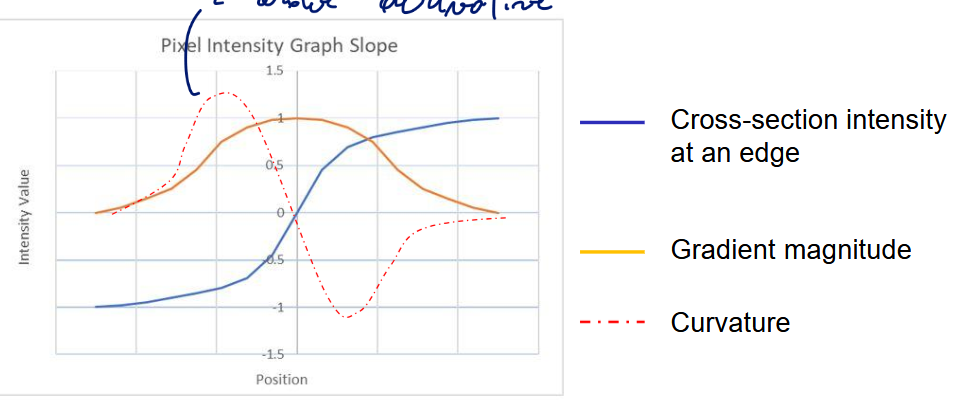{width=50%}

## Features - edge and corner detections

**ABOVE SHOULD BE THE START OF CHAPTER ABOUT ENHANCEMENT AND EDGES**

P.41

#### Convolution filters

It is based on the insight that noise affects high frequencies the most due to their low SNR. To build a low-pass filter, we will use an averaging kernel such:

$$
\begin{pmatrix}
    1 & 1 & 1\\
    1 & 1 & 1\\
    1 & 1 & 1
\end{pmatrix} = \underbrace{\begin{pmatrix}
    1 & 1 & 1
\end{pmatrix} \ast \begin{pmatrix}
    1\\
    1\\
    1\\
\end{pmatrix}}_{\text{separable filter}}
$$

The two $(1,1,1)$ vectors can be seen in the *frequency* domain as $1 + 2\cos(2\pi u)$ for the horizontal domain or $1 + 2\cos(2\pi v)$ in the vertical one. The intuition for this is to look at the vector as a 1D image centered around the middle value. Finally, the convolution can be simplified in the frequency domain as:

$$
(1 + 2\cos(2\pi u))(1 + 2\cos(2\pi v))
$$

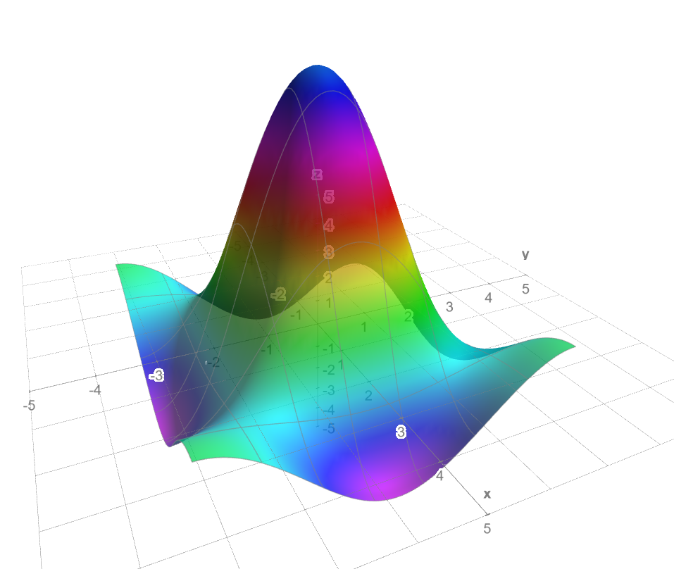{width=50%}

The function is purely real and low-pass with some phase reversal! We can again derivate something similar for a 5x5 kernel:

$$
(1 + 2\cos(2\pi u) + 2\cos(4\pi u))(1 + 2\cos(2\pi v) + 2\cos(4\pi v))
$$

With this one, the phase reversal is even more significant, the higher the frequency the more it looks like a sinc function. This creates more ripples and disturbing effects. Hard to get no ripple and a real low-pass for higher order functions.

From all those experiments we can draw 3 conclusions:

1. Separable filters can be implement more efficiently
2. Better to go in the frequency domain for large kernel
3. Keep it simple, mask of boolean or power of 2 are cheap!

### Binomial filters

They are here to solve the ripple and low-pass issue of the convolution filters presented before. This guarantees no phase reversal.

$$
\begin{pmatrix}
    1 & 2 & 1\\
    2 & 4 & 2\\
    1 & 2 & 1
\end{pmatrix} = \begin{pmatrix}
    1 & 2 & 1
\end{pmatrix} \ast \begin{pmatrix}
    1\\
    2\\
    1\\
\end{pmatrix} \longleftrightarrow (2 + 2\cos(2\pi u))(2 + 2\cos(2\pi v))
$$

{width=50%}{width=50%}

Note that noise removal linear filters will exhibit blurring due the fact they cannot difference noise and actual information.

### Median

Instead of averaging over using a kernel of ones, we take the median - the middle point of neighborhood of pixel. We don't create a new grey level, we take the one in the middle.

{width=50%}

One advantage of a median filter is the fact it is robust against outliers and it will preserve the contrast instead of smooching out all the values and making the image more blurry.

- Discard outliers
- Preserve discontinuities

But, it will loose in details (especially small areas). Moreover, give a patchy effect instead of a smooth uniform color.

### Anisotropic filters - all-in-on of filtering

This filter does:

1. Binomial smoothing between edges
2. Unsharp masking at edges

For this, we need to cover edge detection

| Operation name         |                                    Description                                    | Linear ? |
| :--------------------- | :-------------------------------------------------------------------------------: | :------: |
| Histogram equalisation |     Re-sort histogram to create a more linear Cumulative Probability Density      |    V     |
| Unsharp mask           |                                                                                   |    V     |
| Inverse Filtering      | Realize the opposite operation. Need to carefully handle low SNR with a constant. |    V     |
| Low pass               |        Removes noise since it affects more high-frequencies due to low SNR        |    V     |
| Binomial               |                      Like low-pass but avoids phase reversal                      |    V     |
| Median                 |                     Take the middle point instead of the mean                     |    X     |
| Anisotropic            |                     Binomial between edges - Unsharp at edge                      |    X     |
:Summary table of the enhancement procedures

## Enhancement and Feature Detection

### Edges

> **Definition:**
>
> Edge correspond to image locations with strong intensity changes due to:
> 
> 1. Reflectance
> 2. Orientation of shape normals (its surface) - the object's edge
> 3. Illuminations (shadow) 
>
> The hardest challenge in edge detection is linking up all the pixels into a good line drawing.

The methods cover here will be based on the gradient which gives the direction of the steepest change along as its magnitude being the rate of change:

$$
\text{gradient } = \left( \frac{\partial f}{\partial x}, \frac{\partial f}{\partial y} \right) \qquad \text{magnitude } = \sqrt{\left( \frac{\partial f}{\partial x}\right)^2 + \left( \frac{\partial f}{\partial y} \right)^2}
$$

2 methods will be covered using **isotropic** operators[^4]:

1. Locating high intensity gradient magnitude
2. Locating inflection points in the intensity profiles

[^4]: there exists other (and better) operators but too complex for this class

{width=50%}

### Gradient

The idea is to:

1. measure the gradient **magnitude** of all the steep slopes in the image. This operator is isotropic since there are equal contribution of the x and y direction.
2. Measure the angle $\theta$ that maximizes $\frac{\partial f}{\partial x'} = \frac{\partial f}{\partial x} \cos (\theta) + \frac{\partial f}{\partial y} \sin(\theta)$ this yields $\theta_{xtr} = \tan^{-1}\left( \frac{\partial f}{\partial y} / \frac{\partial f}{\partial x} \right)$

The gradient is a non-linear operator of $\partial / \partial x$ which are linear, shift-invariant ! So this can be implemented using a convolution, the **Sobel masks** which are separable and cheap to implement. The Sobel masks are a bit like a binomial filter but with a derivative in the middle. The idea is to have a strong response for high frequencies (edges) and low response for low frequencies (flat areas).:

$$
\frac{\partial}{\partial x} = (-1,0,1) \ast (1,2,1)^\top = \begin{pmatrix}
    -1 & 0 & 1\\
    -2 & 0 & 2\\
    -1 & 0 & 1
\end{pmatrix} \qquad \frac{\partial}{\partial y} = \begin{pmatrix}
    -1 & -2 & -1\\
    0 & 0 & 0\\
    1 & 2 & 1
\end{pmatrix}
$$

From their outputs, we take the square root of the sum of their squares, take the arctan which will give us the orientation of the edge! 

Again we can move to the frequency domain where we remember we can see the vector as a 1D image centered around the middle value. The Fourier transform of the Sobel mask is:

$$
(-1,0,1) \longleftrightarrow 2i \sin(2\pi u) \qquad (1,2,1) \longleftrightarrow 2 + 2\cos(2\pi u)
$$

We see that it is pass band along the u-dir (red on the graph) and low-pass along the v-dir (green on the graph).

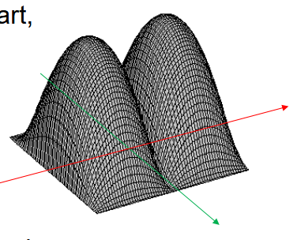{width=50%}

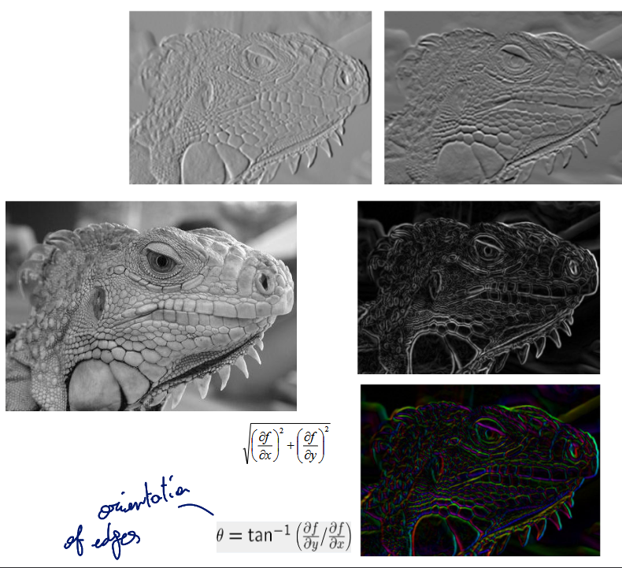{width=50%}

It is a great technique to map individual pixel edges, but cannot be perfect to edge detection. There can be gap, several pixels thick, weak or salient edges, and so on. But Sobel masks are the optimal 3 x 3 convolution filters with integer coefficients for step edge detection.

### Zero-crossing

First, we want to do edge thinning, to reduce a several pixel thick edge to only one continguous line. Once we found the gradient, we want to look at the direction giving the maximum gradient and interpolate to get these values. We can also apply the hysteresis thresholding to link up the edges. The idea is to have a high threshold for strong edges and a low threshold for weak edges. We then link the weak edges to the strong ones if they are connected.

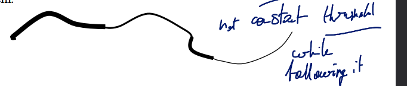{width=50%}

To do zero-crossing detection, we need to use second order derivative and make it equal to 0 to find inflexion points. This is linear + shift invariant (convolution) and isotropic (equal contribution of x and y). The Laplacian is sensitive to noise, so we often add a smoothing step (Gaussian) before applying the Laplacian. This is called the Laplacian of Gaussian (LoG) operator.

$$
\nabla^2 f = \frac{\partial^2 f}{\partial x^2} + \frac{\partial^2 f}{\partial y^2} = 0
$$

We can also use the Difference of Gaussian (DoG) which is a good approximation of the LoG and is much faster to compute. The idea is to take the difference between two Gaussian blurred images with different standard deviations.

$$
G_1 = \begin{pmatrix}
    0 & 1 &0 \\
    1 & -4 & 1\\
    0 & 1 & 0
\end{pmatrix} \qquad G_2 = \begin{pmatrix}
    1 & 2 & 1\\
    2 & -12 & 2\\
    1 & 2 & 1
\end{pmatrix}
$$

This DoG method will give us a closed-contour as it is based on the second order derivative. The zero-crossing will give us the edge location. The main issue is that it is not very good at linking up edges and can be quite sensitive to noise.

### Harris corner detection

This method will distinguish between homogeneous areas, edges and corners. The idea is to look at the eigenvalues of the second moment matrix of the gradient. If both eigenvalues are small, we have a homogeneous area. If one eigenvalue is large and the other is small, we have an edge. If both eigenvalues are large, we have a corner. The second order moment matrix is given by:

$$
\begin{pmatrix}
    \left(\frac{\partial f}{\partial x}\right)^2 & \frac{\partial f}{\partial x} \frac{\partial f}{\partial y}\\
    \frac{\partial f}{\partial x} \frac{\partial f}{\partial y} & \left(\frac{\partial f}{\partial y}\right)^2
\end{pmatrix}
$$

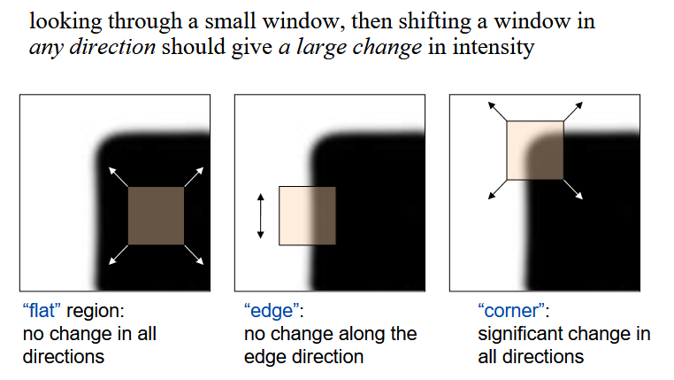{width=70%}

The idea is to find the directions of minimal and maximal change in the image. We move the kernel by a small amount (u,v) where our $w$ window function can be either a box or a Gaussian. We then look at the change in intensity which is given by:

$$
E(u,v) = \sum_{x,y} w(x,y) [f(x+u, y+v) - f(x,y)]^2
$$

$$
E(u,v) \approx [u,v] M \begin{bmatrix}
    u\\ v
    \end{bmatrix} \qquad \text{with } M = \sum_{x,y} w(x,y) \begin{pmatrix}
    \left(\frac{\partial f}{\partial x}\right)^2 & \frac{\partial f}{\partial x} \frac{\partial f}{\partial y}\\
    \frac{\partial f}{\partial x} \frac{\partial f}{\partial y} & \left(\frac{\partial f}{\partial y}\right)^2
\end{pmatrix}
$$

To analyze the harris detector, we use the iso-lines $= det -k trace^2 = \lambda_1 \lambda_2-k(\lambda_1 + \lambda_2)^2$. Where $\lambda_1$ and $\lambda_2$ are the eigenvalues of the matrix $M$ and represent a change in one or the other direction. If the iso-line is positive, we have a corner. If it is negative, we have an edge. If it is zero, we have a homogeneous area. The main issue with this method is that it is not very good at distinguishing between edges and corners in the presence of noise.

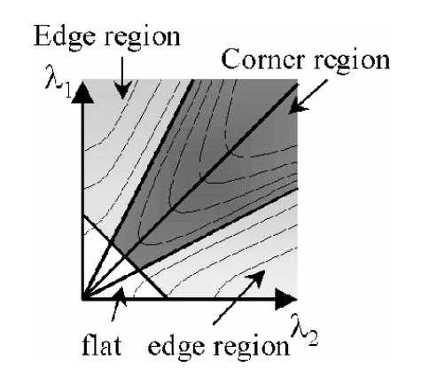{width=50%}

# Image decomposition

Images can be projected in various orthogonal basis, (pixels, fourier domain, ...). We can also do a rotation for example, but the most important thing is that we use **unitary transformations**$\rightarrow U^\ast U = I$.

## PCA

We want to reduce the dimensionality of the data while preserving as much variance as possible. We can do this by projecting the data onto the eigenvectors of the covariance matrix. The eigenvectors with the largest eigenvalues will be the principal components. This is a linear transformation that preserves the distances between points in the original space. It is an **unitary transformation** but **data dependent**. We want to reduce the dimension of the data while keeping as much information as possible.

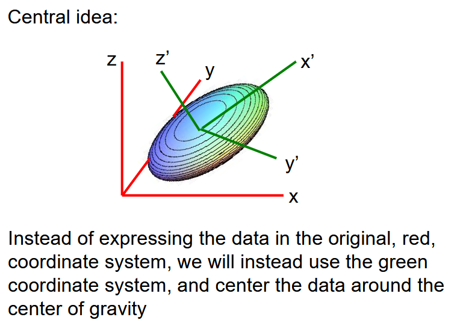{width=50%}

The Shannon entropy $H(x)$ quantifies the amount of entropy in a data set with a distribution P. This fact is interesting, because most pictures only span a sub-set of the total possible images. For example, natural images have a lot of structure and regularity, which means that they have a low entropy compared to random noise. This is why we can use PCA to reduce the dimensionality of the data while preserving most of the information. 

$$
H(x) = -\sum_{i} P(x_i) \log P(x_i)
$$

This issue with the lack of spanning in high-dimensional space is often referred to as the **curse of dimensionality**. PCA is a solution to this problem. Some intuitive explanation: 1D: $(r+\delta)/r \approx 1 + \delta/r$; 2D: $(r+\delta)^2/r^2 \approx 1 + 2\delta/r$; D: $(r+\delta)^D/r^D \approx 1 + D\delta/r$. So the volume of the space grows exponentially with the dimension, which means that we need an exponentially large number of samples to cover the space. PCA helps us to reduce the dimensionality of the data while preserving most of the information. 

For the PCA, we use the Pearson correlation coefficient. We need to be careful with it as it only indicates linear correlation between two variables!

$$
p_{ij} = \frac{cov(x,y)}{\sigma_i \sigma_j} = \frac{\sum_{i=1}^N (x_i - \bar{x})(y_i - \bar{y})}{\sqrt{\sum_{i=1}^N (x_i - \bar{x})^2} \sqrt{\sum_{i=1}^N (y_i - \bar{y})^2}}
$$

We first find the highest component with the maximum of correlation, then we find the second one with the lowest correlation. We can then apply a rotation in a high dimensional space.

By working around the mean, we benefit from parserval-equality which indicates the variances in $x_i$ will be the same in $z_j$. This indicates a redistribution of the energy.

$$
\sum_{i=1}^p \sigma_i^2 = \sum_{j=1}^p \tilde{\sigma}_j^2
$$

### Method

With $x$ a vector of $p$ variables. We first look for a linear combination $c_1^\top x$ which has the maximum variance. We then look for a second linear combination $c_2^\top x$ which has the maximum variance and is uncorrelated with the first one. We repeat this process until we have $p$ linear combinations. The first few linear combinations will capture most of the variance in the data, which is why we can reduce the dimensionality of the data by keeping only the first few principal components.

By relying on the Gaussian distribution postulat, we can derive a covariance matrix. Note, we need to center the data around the mean first. We need to maximize so $var(c_1^\top x) = \sum c_1^\top x (c_1^\top x)^\top =c_1^\top \sum (xx^T) c_1 = c_1^\top C c_1$ with $C$ the covariance matrix. And we make sure that $c_1^\top c_1 =1$ to avoid trivial solution.

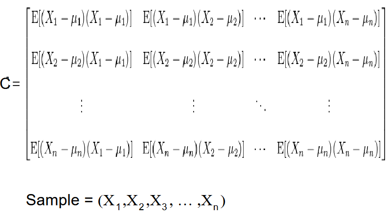{width=50%}

We can then use the Lagrange multiplier with the constrained mentioned ealier:

$$
\mathcal{L}(c_1, \lambda) = c_1^\top C c_1 - \lambda (c_1^\top c_1 - 1)
$$

$$
\frac{\partial \mathcal{L}(c_1, \lambda)}{\partial c_1} = 2C c_1 - 2\lambda c_1 =  2c_1 \underbrace{(C- \lambda I)}_{\text{eingevalue problem}} = 0 \qquad \frac{\partial \mathcal{L}(c_1,\lambda)}{\partial \lambda} = c_1^\top c_1 - 1 = 0
$$

So $c_1^\top C c_i = c_1^\top \lambda c_1 = \lambda c_1^\top c_1 = \lambda$ with $\lambda$ as large as possible. Decorrelation and orthogonality are the same thing in this case since we are in a Euclidean space. So $c_2^\top C c_1 = c_2^\top \lambda c_1 = \lambda c_2^\top c_1 = 0$.

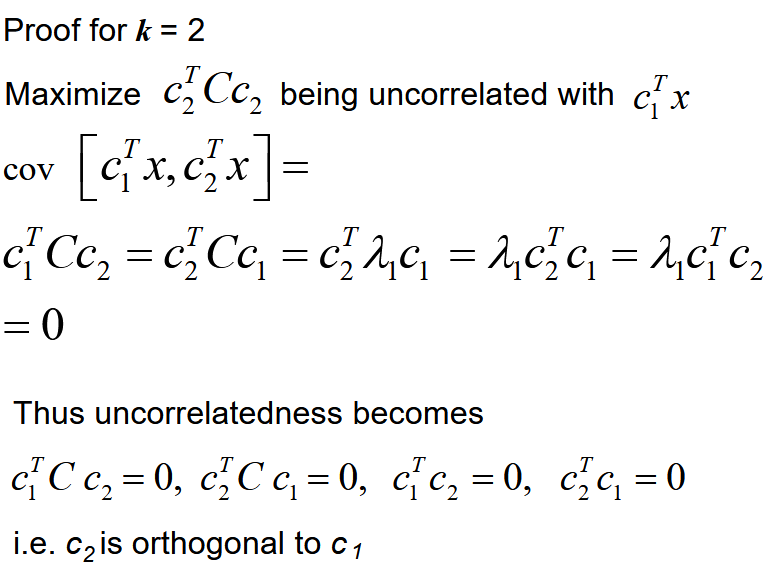{width=50%}

We can again use a Lagrange multiplier to ensure decorrelation:

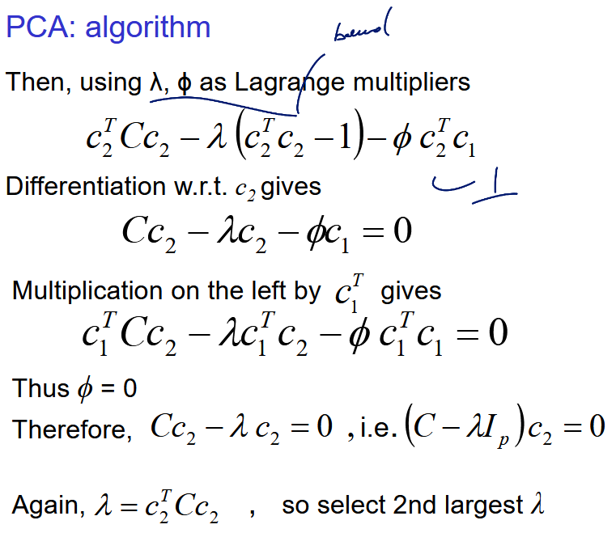{width=50%}

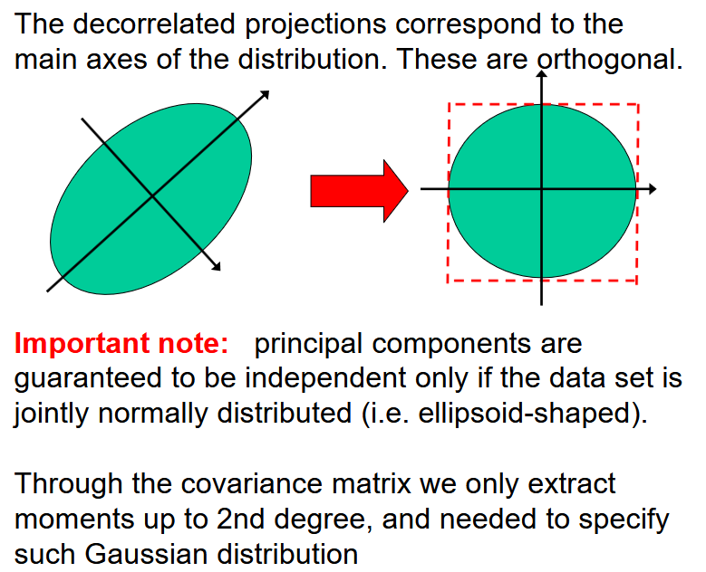{width=50%}

### Usage

- Classification of crops: using Near-infrared, Red, Green data. We see some correlation between red and green + near-infrared. We can compress the data to roughly 60% while retaining similar performance.
- Culture and heritage: reveal details that wasn't visible before. Quickly find the most important features in the data.
- Image compression: same density in neihboring pixels. Issue is that image of N pixels =$N^2$ base. So $N^2*N^2$ for the covariance matrix. PCA allows us to reduce the dimensionality of the data while preserving most of the information. We can then use a lossy compression algorithm to further reduce the size of the data.
  - We can use the **eingenfaces** of the covariance matrix as a basis for the image. We can then project the image onto this basis and keep only the first few components to reduce the size of the data. This is called **eigenface** method. We form a human face base using a base of already existing faces. (do not forget to substract the mean !)

### Limitations

As described before, the Pearson correlation coefficient is only for linear correlation. Moreover, the PCA is based on the assumption of a Gaussian distribution.

A solution is the Interesting Component analysis where we find multiple "interesting" components. Or we can use the Linear Discriminant Analysis (LDA) which is a supervised method that finds the linear combination of features that best separates two or more classes of objects or events. It is based on the idea of maximizing the between-class variance while minimizing the within-class variance. This approach is better for non Gaussian distribution.

There is also the support vector machine which look at an hyper plane to find the best separation between classes. 

PCA looks like the Harris corner detector but a few things chenge:

- No substraction by mean in Harris
- No normalization in Harris

# Surface features color and texture

## Color

It is important to distinguish between two important spectre of the color:

1. Radiometry: physical measurement of the light (radiance, irradiance, reflectance, ...)
2. Photometry: how the human eye perceives the light (brightness, colour, ...)

A light $l$ with a spectral composition $c(\lambda)$ and the human that perceives it with a sensitivity $h(\lambda)$, with the constant $k = 683$ lm/W. Ofc, we can span only the human visible spectrum which is roughly between 400 and 700 nm. The perceived brightness is then given by the following equation:

$$
l = k \int_{\lambda=0}^\infty c(\lambda) h(\lambda) d\lambda
$$

Human perception of color can be summarized with Brightness, Huhe, and saturation.

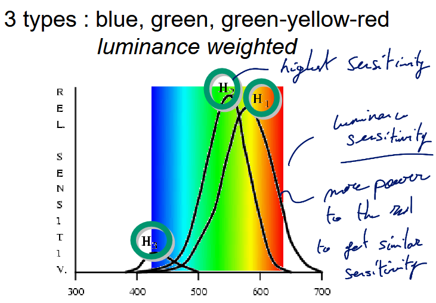{width=50%}

So the human has 3 sensitivity curves and not just one from the equation aforementioned. We have 3 responses for the full spectrum. So if 2 sources are observed with the same response for the 3 cones, they will be perceived as the same color. This is called **metamerism**. 

### Commission Internationale de l'Éclairage (CIE)

They standartized the color space with 3 primaries:

1. Red: 700 nm
2. Green: 546.1 nm
3. Blue: 435.8 nm

With this, we can match $m_j$ a source $C(\lambda)$ with a combination of the 3 primaries $P_j(\lambda)$ such that:

$$
C(\lambda) = \sum_{j=1}^3 m_j P_j(\lambda)
$$

We can derive the following:

$$
    R_i(C) = \int \sum_{j=1}^3 m_j P_j(\lambda) H_i(\lambda) d\lambda = \sum_{j=1}^3  m_j \underbrace{\int  P_j(\lambda) H_i(\lambda)}_{l_{i,j}\text{ Sensitivity of a primary can be determined offline}} d\lambda
$$

This makes a really simple system of 3 linear equations for the human eye. If we use different primaries $L'$, we can find a new set of coefficients $m'$ such that:

$$
\sum_{j=1}^3 m_j l_{i,j} = Ri\qquad LM = R \qquad L'M' = R \quad m' = L'^{-1}Lm
$$

#### Tristimulus value

As white is the combination of all the colors, we can use the white point as a reference for the color. We can then define the tristimulus value as:

$$
T_j = \frac{m_j}{w_j} \qquad T_1 = T_1= T_3 = 1 \quad \text{for white}
$$

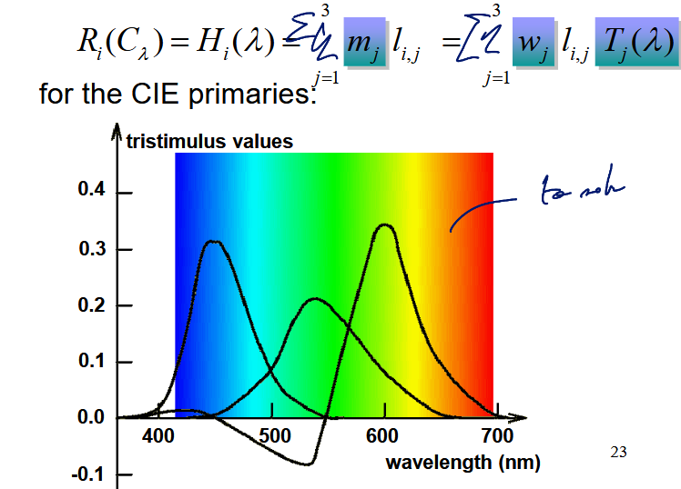{width=50%}

We notice negative colors which cannot be produced by a combination of the primaries. This is a problem for the display of colors. Moreover, for some colors, a triple of primaries cannot represent it! However the tristimulus values still contain brightness information, we can normalize to only get chromatic information:

$$
t_j = \frac{T_j}{\sum_{j=1}^3 T_j} \qquad t_1 + t_2 + t_3 = 1
$$

So now, 2 chromaticity coordinates are enough to represent the color (saturation and hue). This forms the XYZ coordinates of the CIE, with X being a mix of red/green cones, the Y the luminance and Z blue light primarly. The mapping matrix is

$$
\begin{pmatrix}
    X\\
    Y\\
    Z
\end{pmatrix} = \begin{pmatrix}
    0.490 & 0.310 & 0.200\\
    0.177 & 0.813 & 0.011\\
    0.000 & 0.010 & 0.990
\end{pmatrix}\begin{pmatrix}
    R\\
    G\\
    B
\end{pmatrix}
$$

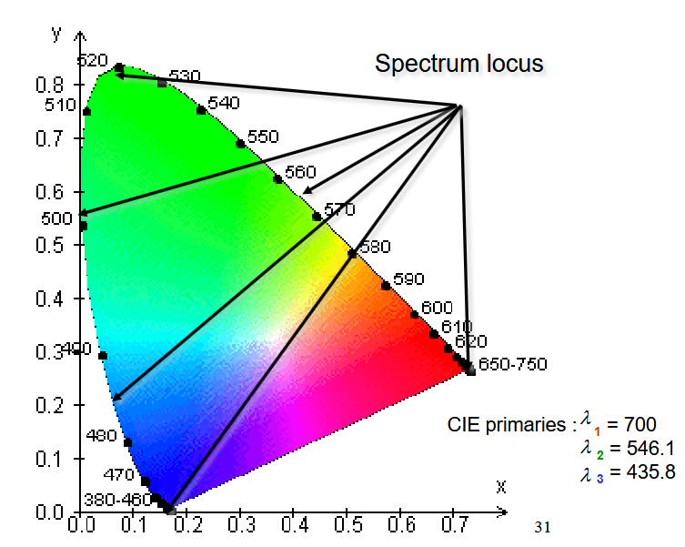{width=50%}

Inside this triangle, the mix of two colors in some quantities lie on the straight line between those two colors.

Screen standard tries to span as much as this CIE triangle to have the highest fidelity possible. Such color coordinates need 3 primaries on the CIE triangle + the central white point --> 4 points. Also the projection is skewed on the triangle, much more information lie in the bottom blue corner and red corner than in the top green one.

The CIE u-v is a solution which represents area more faithfully.

$$
u = \frac{4x}{-2x+12y+3} \qquad v = \frac{6y}{-2x+12y+3}
$$

### Constancy

Many optical illusions exists where our brain is tricked and interprets colors when there are none or the context can influences our perception. We often interpret the ambient light to infer the result of the dot product on our human cones. This is called the **color constancy**. The brain is trying to infer the color of the object by taking into account the ambient light. This is why we can see a white paper as white even if it is under a red light.

## Texture

Many textures exist such as oriented vs isotropic, stochastic vs regular, coarse vs fine, ...

### Fourier features

We analyze the texture based on the power spectrum of the Fourier transform. A peak in the power spectrum indicates a strong periodicity in the image. The orientation of the peak indicates the orientation of the texture. The width of the peak indicates the coarseness of the texture. The more spread out the peak is, the more stochastic the texture is.

One problem with this method is the fact that is captures the global periodicity of the image but not the local one. Moreover, it is not very good at capturing the orientation of the texture. Finally, it is not very good at capturing the coarseness of the texture.

$$
\int \int |F(u,v)|^2 du dv
$$

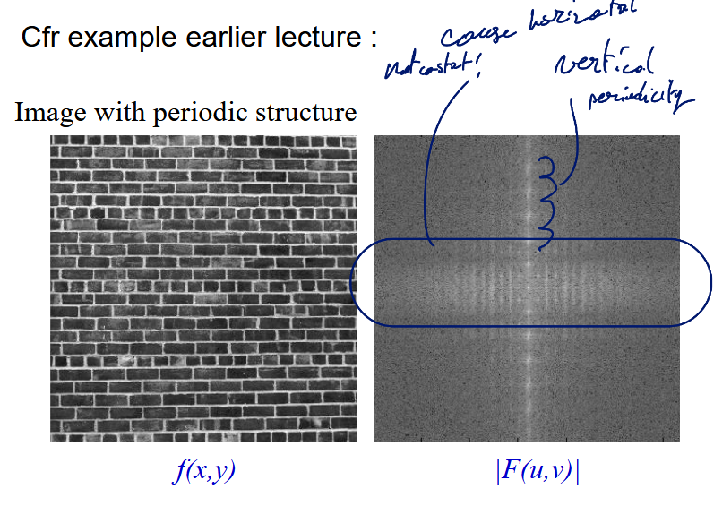{width=50%}

### Cooccurrence matrices

It is inspired by the histogram idea, but this time we will take a chosen offset between two points and count how many i,j pair exists in a double entry matrix. This will give us a measure of the texture based on the co-occurrence of pixel values. We can then derive some statistics from this matrix such as contrast, homogeneity, energy, ...

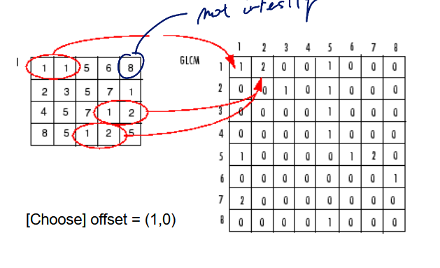{width=50%}

| Feature          | Expression                                           |
| ---------------- | ---------------------------------------------------- |
| Contrast         | $\sum_{i,j} (i-j)^2 C(i,j)$                          |
| Homogeneity      | $\sum_{i,j} \frac{1}{1+          \| i-j \| } C(i,j)$ |
| Energy           | $\sum_{i,j} C(i,j)^2$                                |
| Entropy          | $-\sum_{i,j} C(i,j) \log C(i,j)$                     |
| Max. Probability | $\max_{i,j} C(i,j)$                                  |
:Summary table of the features derived from the cooccurrence matrix

### Filter banks

#### Laws

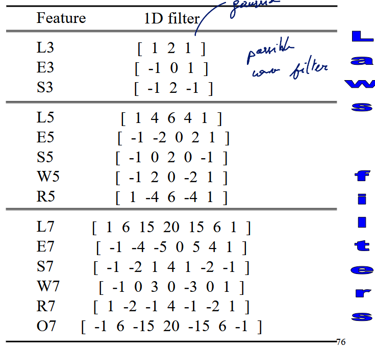{width=50%}

We can start from 1D laws filter to form more advanced decomposed 2D filters. L=Level, E=Edge, S=Spot, W=Wave, R=Ripple. The idea is to have a set of filters that can capture different types of textures. For example, the L5E5 filter will capture edges, while the E5L5 filter will capture spots. We can then apply these filters to the image and analyze the response to get a measure of the texture. It is simle but really effective. Detection or classification nby assigning features / statistical metrics to the outputs.

#### Gabor

It is a gaussian envelope modulated by a sinusoidal plane wave. It is a band-pass filter that can capture both the frequency and orientation of the texture. We can tweak the sensitivity and directionality of the filter. The Gabor filter is defined as:

$$
g(x,y) = \exp\left( -\frac{x^2 + \gamma^2 y^2}{4\Delta_{x,y}^2} \right) \cos\left( 2\pi u^\ast x + \phi \right) \longleftrightarrow G(u,v) = \frac{1}{4\pi\Delta_{u,v}^2}\exp\left( -\frac{(u-u^\ast)^2 +  v^2}{4\Delta_{u,v}^2} \right) + \exp\left( -\frac{(u+u^\ast)^2 +  v^2}{4\Delta_{u,v}^2} \right)
$$

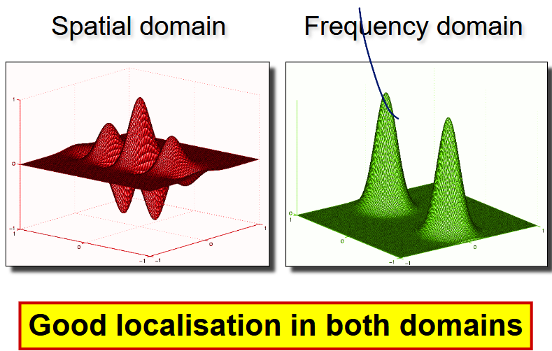{width=50%}

#### Eigenfilters

1. Create a mask to be shifted over a training image
2. Within the mask, collect intensity statistics
3. PCA --> eigenvectors --> eigenfilters
4. Determine energies of eigenfilters of eigenfilter outputs

We often need large but sparse filters for good efficacy. Can be great for damage inspection or QA in industry.

We often need to use multiple eigenfilters to capture different aspects of the texture. A great technique to compile multiple eingefilters together and quickly locate error or irregularities in the texture is the **Manhalanobis distance of the energies**:

\begin{align}
    D_M(x,y) = \sqrt{(r(x,y)-\mu)^\top \Sigma^{-1}(r(x,y) - \mu)}\\
    \mu = \frac{1}{N} \sum_{i=1}^N r(x_i,y_i)\qquad \Sigma = diag(\lambda_1, \lambda_2, ..., \lambda_K)
\end{align}

Mahalanobis distance DM measures how unusual this combination of responses is compared to normal texture. A response along a very stable direction (small eigenvalue) counts more. A response along a highly variable direction (large eigenvalue) is less
surprising.

# Motion Extraction

Many animals are dependent on motion detection to outperform camouflage. Only with a few dots in motion can infer many informations.

## Definition 

### Optical flow

> Optical flow
>
> Apparent motion of brightness patterns in the image. Ideally it is the the projection of the 3D motion vectors of the image

> Motion Field
>
> 3D motion of the scene as seen through the camera. It is the projection of the 3D motion vectors of the scene onto the image plane.

We can use 2D vectors to depict the translation of the pixels forming the optical flow. Motion field != optical flow (e.g., the barbershop pole turning around horizontally but it looks like it's sliding vertically, same for a perfect sphere with an uniform texture, it will look stable even if it starts spinning)

The goal with optical flow is to measure for each pixel between two frames where each went. It is a non-trivial task and requires a few assumptions to be achievable:

1. Same brightness
2. Minimal motion

#### Mathematics

With $I(x,y,t)$ the intensity of the pixel at position (x,y) at time t, we can measure the difference with:

$$
I(x,y,t) = I(x+\delta x, y+\delta y, t+\delta t)\qquad \frac{dI}{dt} = \underbrace{\frac{\partial I}{\partial x}}_{I_x} \underbrace{\frac{dx}{dt}}_{u} + \underbrace{\frac{\partial I}{\partial y}}_{I_y} \underbrace{\frac{dy}{dt}}_{vD} + \underbrace{\frac{\partial I}{\partial t}}_{I_t} = 0
$$

This equation states that if one were to track the image projections of a scene point through the video, it would not change its intensity. This tends to be true over short lapses of time.

Note that $dI/dt$ represents the change of intensity when following a physical point through the images; but $\partial I/\partial t$ is the change of intensity at a fixed location in the image. The difference between these two is the motion of the point in the image.

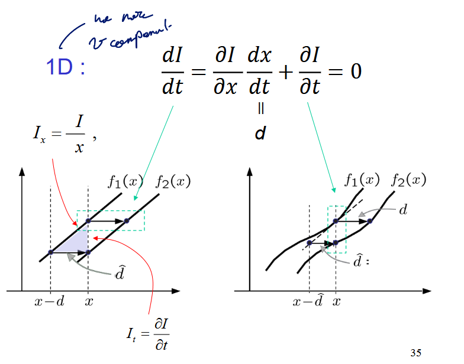{width=50%}

The issue with this equation is that $I_x$,$I_y$, and $I_t$ can be measured. However, $u$ and $v$ are unknwon, 1 equation 2 unknowns = **Aperture Problem**.

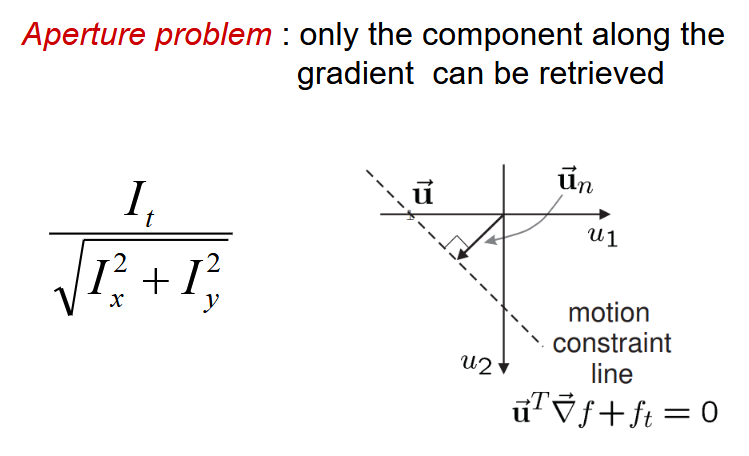{width=50%}

We only zoom in one tiny part of the frame and thus we miss the overall motion by only looking at such details. The problem can be solved with:

1. Higher derivative of intensity --> expensive + noisy
2. For planar intensity profile, problem cannot be solved (higher order derivative are zero)

## Horn & Schunk

Additional smoothness constraint is added to the equation to solve the aperture problem. The idea is to minimize the following energy function:

$$
e_S = \int \int ((u_x^2 + u_y^2 + v_x^2 + v_y^2) dx dy) \qquad e_C = \int \int (I_x u + I_y v + I_t)^2 dx dy \qquad \text{minimize } e = e_S + \lambda e_C
$$

We need to find a function that extremize the functionals (functions that takes vector in and scalar out)

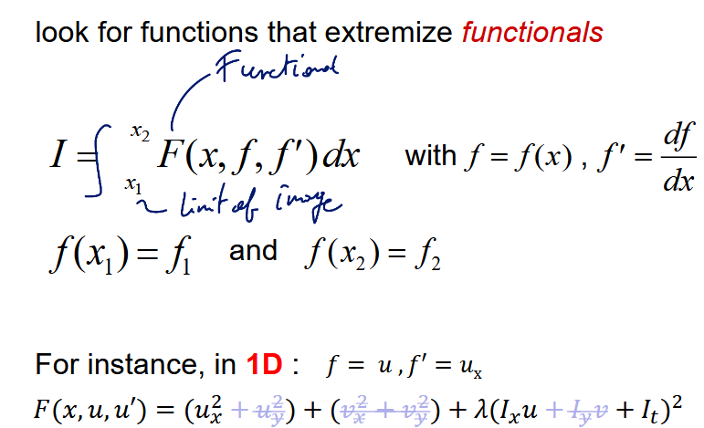{width=50%}

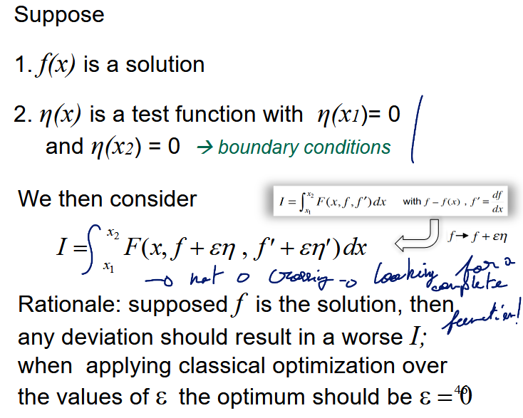{width=50%}

This allows to reformulate an optimization over a function into an optimization over a scalar. We can use $dI/d\varepsilon|_{\varepsilon=0} =0$. We can use Euler-Lagrange equation to find the function that extremize the functional. 

**TODO: PAGES 49 - 62** --> Take time to understand

1. We use regularization, need sometimes to pose extra constraints
2. Errors at object boundaries, smoothness constraint no longer valid

## Lucas & Kanade

It uses the same optical flow equation but used an area based regression. We assume that the flow is constant in a small neighborhood of the pixel under consideration (local optimization). We can then solve for the flow vector using least squares. The idea is to minimize the following energy function:

\begin{align}
    A &= \begin{bmatrix}
        I_x(q_1) & I_y(q_1)\\
        I_x(q_2) & I_y(q_2)\\
        \vdots & \vdots\\
        I_x(q_n) & I_y(q_n)
    \end{bmatrix} & v&= \begin{bmatrix}
        V_x\\ V_y
    \end{bmatrix} & b&=\begin{bmatrix}
        -I_t(q_1)\\
        -I_t(q_2)\\
        \vdots\\
        -I_t(q_n)
    \end{bmatrix}
\end{align}

$$
A^\top A v = A^\top b \qquad v = (A^\top A)^{-1} A^\top b
$$

$$
\begin{bmatrix}
    V_x\\
    V_y
\end{bmatrix} = \begin{bmatrix}
    \sum_{i=1}^n I_x(q_i)^2 & \sum_{i=1}^n I_x(q_i) I_y(q_i)\\
    \sum_{i=1}^n I_x(q_i) I_y(q_i) & \sum_{i=1}^n I_y(q_i)^2
\end{bmatrix}^{-1} \begin{bmatrix}
    -\sum_{i=1}^n I_x(q_i) I_t(q_i)\\
    -\sum_{i=1}^n I_y(q_i) I_t(q_i)
\end{bmatrix}
$$

It cannot always reliably calculate the flow, apperture problem, it requires a lot of texture in all direction to be reliable. So, to detect interesting points, we often use the Harris-detector to find interesting spots and apply area based flow around each key point. This is called the **feature tracking**. However, it does not respect Taylor expansion.

Another technique is to use a form of coarse to fine to estimate the flow even better with various size.

## Active contours

The idea is to track a contour from one key frame to another one. It is like an elastic band we adjust frame by frame. It is a good and robust approach for noise especially whan we know what object we are tracking (e.g., lips).

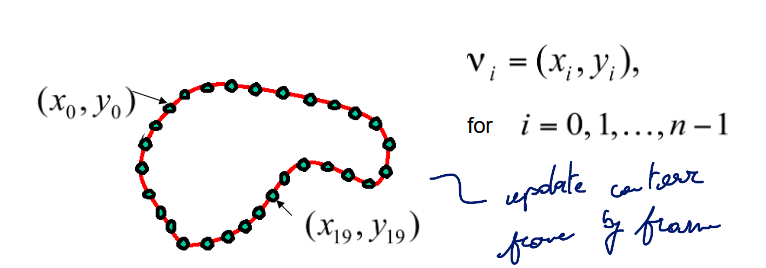{width=50%}

We use some discrete representation of the contour which is a list of 2D points (vertices). We define an energy function that we want to minimize. The energy function is a combination of an internal energy that depends on the shape of the contour (known shape, ...) and an external energy that depends on the image  (edges present in the image, attracts the contour to the edges of the image). The internal energy is given by:

$$
E_{total} = E_{internal} + E_{external} 
$$

#### External 

Energy for a point of a curve and the whole curve:

$$
E_{external}(v) = -(|G_x(v)|^2 + |G_y(v)|^2) \qquad E_{external} = -\sum_{i=0}^{n-1} (|G_x(x_i,y_i)|^2 + |G_y(x_i,y_i)|^2)
$$

#### Internal

We use the elasticity and the bending energy to define the internal energy. The elasticity energy is given by:

$$
E_{internal}(v(s)) = \underbrace{\alpha \left| \frac{dv}{ds} \right|^2}_{\text{elasticity}} + \underbrace{\beta \left| \frac{d^2 v}{ds^2} \right|^2}_{\text{bending}}
$$

For our discrete representation, we can use finite differences to approximate the derivatives:

$$
\frac{dv}{ds} \approx v_{i+1} - v_i \qquad \frac{d^2 v}{ds^2} \approx (v_{i+1} - v_i) - (v_i - v_{i-1}) = v_{i+1} - 2v_i + v_{i-1}
$$

Internal energy for the whole curve

$$
E_{internal} = \sum_{i=0}^{n-1} \left( \alpha |v_{i+1} - v_i|^2 + \beta |v_{i+1} - 2v_i + v_{i-1}|^2 \right)
$$

For the elastic energy, we often a term $d$ to avoid that the energy collapse on itself and so we take the initial distance $d$.

We can also use a term to penalize the length of the curve to avoid that it grows indefinitely. This is called the balloon energy.

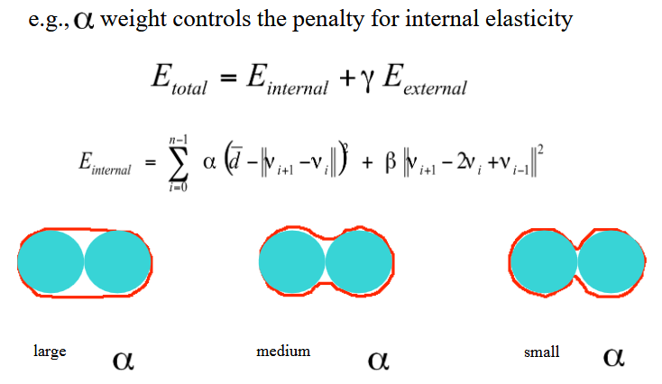{width=50%}

### Energy minimization

#### Greedy

For each point we simply look where we can move them to minimize the energy. Usually small window (5x5) around the point. It is simple but can get stuck in local minima and requires decent initialization.

#### Dynamic programming

Use a form of the viterbi algorithm to propagate down the energy and find the optimal path. It is more robust to local minima but can be computationally expensive.

#### Gradient Vector flow (GVF)

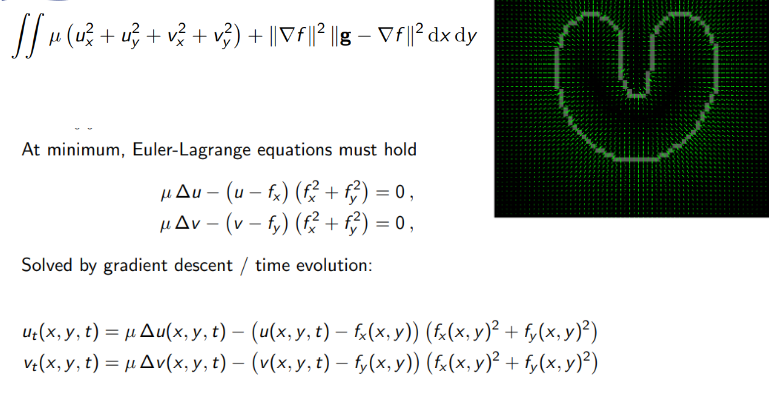{width=50%}

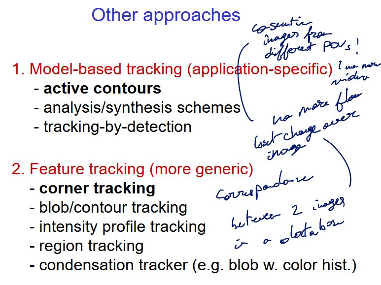{width=50%}

# Local features & Feature matching

The goal is to recognize landmarks accross pictures, or faces, ... It is based on previous knowledge heavily inspired from Sobel, Harris  Laplacians, Lucas Kanade (for feature tracking), ... All of this wil help us build SIFT.

We want to find local features but it is not trivial as scales will be problematic in this task. But achieving it will enable 3D reconstruction, recognition of objects, image matching, image retrieval, ... For this we rely on 3 main components:

1. Detection: of the important landmark and interest points
2. Description: of the local features around the interest points (feature vector)
3. Matching: of the features between different images

We want our detector to be:

- repeatable: be consistent
- distinctive: highlight good interest points. Moreover it should precisely match each interest point
- invariant: no matter the scale or the rotation, we should be able to find the same interest points (geomtric or photometric changes). Keep deriving the same feature points trhoughout the images (otherwise impossible to match them)
- compact / efficient: realtime applications, embedded systems, ... with limited compute power, use binary feature descriptors
- find local interest points: the smaller, the less likely it will be affected by occlusion, deformation, ... we can approximate local surfaces using local planes

Everything will be a tradeoff between these different properties. For example, we can have a very distinctive feature that is not very repeatable, or a very repeatable feature that is not very distinctive. We need to find the right balance between these properties for our specific application.

## Detection

### Rotation invariant detectors

#### Harris corner points

We can use the harris detector to detect interesting feature points such as corners. When selecting the point, the window encapsulating it should make it recognizable and if we slide around we should witness a large change in intensity. M is symmetric since we have change in both direction (corner) and we have

$$
M = \Sigma \begin{bmatrix}
    I_x^2 & I_xI_y\\
    I_xI_y & I_y^2
\end{bmatrix} = \begin{bmatrix}
    \lambda_1 & 0\\
    0 & \lambda_2
\end{bmatrix} \qquad Mx_i = \lambda_i x_i \qquad R(x,y) = det(M) - \alpha tr(M)^2 = \lambda_1 \lambda_2 - \alpha(\lambda_1 + \lambda_2)^2
$$

We get the R scores for each image window, find points where surrounding window gave high R, finally take the points of local maxima of R.

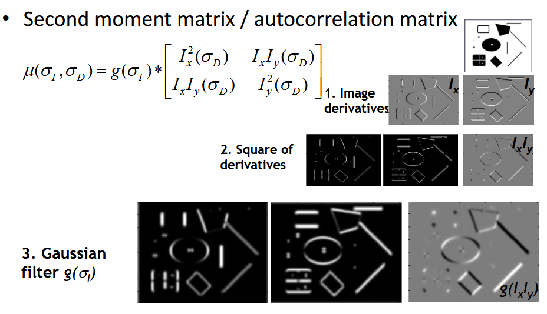{width=50%}

We develop a "cornerness" function where both eigenvalues are large (high det).

$$
har = \det[\mu(\sigma_I,\sigma_D)] - \alpha \cdot \text{trace}[\mu(\sigma_I,\sigma_D)] = g(I^2_x) g(I^2_y) - g(I_x I_y)^2 - \alpha (g(I^2_x) + g(I^2_y))^2
$$

It is rotation invariant $M =X\Sigma X^{-1}$ with $X$ the rotation matrix. However, it is not scale invariant as the size of the window will change with the scale. Moreover, it is not very good at detecting corners in low contrast images.

#### Laplacian of Gaussians

Laplacian of Gaussians (LoG) is a second order derivative operator that is used to detect edges and corners in images. It is defined as the convolution of the image with a Gaussian kernel followed by the Laplacian operator. The idea is to find the zero-crossings of the LoG response, which correspond to edges and corners in the image. It is rotation invariant but not scale invariant as the size of the Gaussian kernel will change with the scale.

Important to match the size of the kernel to have an optimum detection.

### Scale invariant detectors

#### Multi-scale approach

We can use the Harris or LoG where we will try multiple size of kernel. We can then look for local maxima in the scale space. This is called the **scale-space representation**. The idea is to create a pyramid of images with different scales and look for local maxima in this pyramid. This is a simple but effective way to achieve scale invariance.

It is important to use a scale-normalized derivatives to achieve scale invariance. This is done by multiplying the derivatives by a factor of $\sigma^n$ where $n$ is the order of the derivative and $\sigma$ is the scale. This way, the response of the detector will be the same regardless of the scale.

#### Local extrema in scale space

We find the two highest response and then try to match them together. We can then look for local maxima in the scale space to find the interest points. This is called the **scale-space extrema**. The idea is to find the points that are local maxima in both space and scale. This is a more robust way to find interest points as it takes into account the scale of the features.

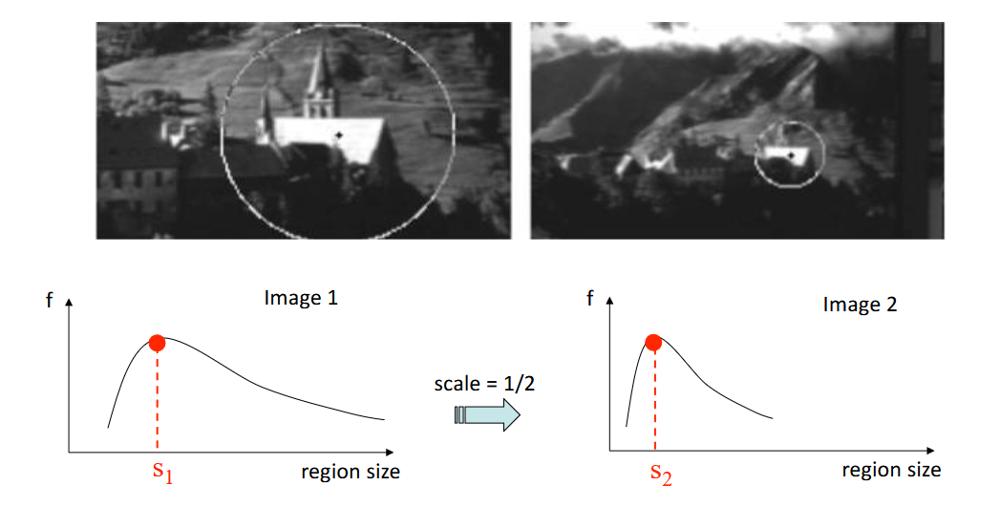{width=50%}

### Affine invariant detectors

The idea is to take advantage of regular human-made plane structure to inverse the affine transformation through projective transformation: **homography**. We can then apply the Harris or LoG detector on the rectified image to find the interest points. This is called the **affine-invariant detectors**. The idea is to find the points that are invariant to affine transformations. This is a more robust way to find interest points as it takes into account the affine transformations that can occur in the image. For local features, this behavior is less important.

#### MSER

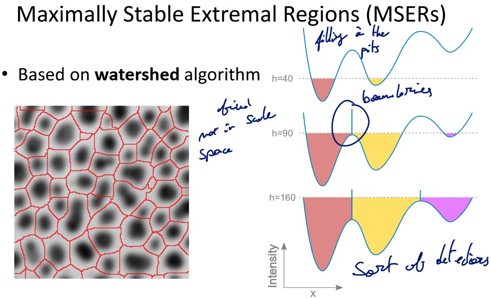{width=50%}

We "flood" the area until the change in area is too large. We can then look for local maxima in the scale space to find the interest points. This is called the **maximally stable extremal regions (MSER)**. The idea is to find the points that are local maxima in both space and scale.

Another improvement, we can use ellipsoid instead of weird grainy boundaries, this makes matching easier.

## Description

### Scale Invariant Feature Transform (SIFT)

Handle changes in viewpoint up to about 60 degree out of plane rotation. Can also handle changes in illumination, partial occlusion, ... We want to find a descriptor that is invariant to these changes. We can use the local image patch around the interest point to create a descriptor. The idea is to create a histogram of oriented gradients (HOG) around the interest point. This is called the **SIFT descriptor**. It has two steps: rotation normalization and then descriptor computation.

#### 1. Rotation normalization

- take window around detected interest point ($3\sigma$)
- Compute edge orientation (gradient angle - 90) for each pixel
- Histogram of edge orientation with 36 bins (10 degree each)
    - Weight by grad magnitude, bilinear interpolation, distance to center, ...
      - bilinear interpolation: to find an unkonw point in a 2D space located inside a square. We take the 4 points of the square and we weight them by the area covered between the point and the unknown. The closer the point is, the more weight it has. This allows us to have a smooth transition between the bins of the histogram.
- Find the dominant rotation and rotate the patch to make it horizontal pointing to the right.

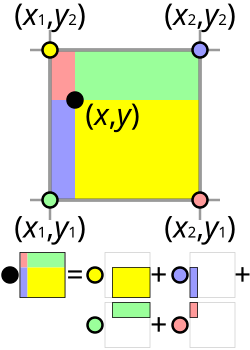{width=50%}

#### 2. Descriptor computation

- Divide the square patch into 4x4 sub-regions
- For each sub-region, compute a histogram of edge orientation with 8 bins (45 degree each)
    - 16*8 = 128 dimensions for the descriptor
- Normalize the descriptor to have unit length to achieve invariance to changes in illumination.

It is a robust descriptor because of the use of histograms, bilinear weighting, smoothing with gaussian kernel. However it is not invairant to affine transformations, it is not very good at handling changes in scale, and it is not very good at handling changes in viewpoint. It is good for small geometric transformations and robust for photometric changes.

We often combine the SIFT descriptor with other method or even CNN.

## Matching

As the name implies, the goal is to determine correspondences between features in different images. We can use the Euclidean distance between the descriptors to find the closest match. Another approach is the **Sum of Squared Differences (SSD)**.

However, this can lead to many false matches. To avoid this, we can use a ratio test where we compare the distance of the closest match to the distance of the second closest match. If the ratio is below a certain threshold, we consider it a good match. This is called the **Lowe's ratio test**.

In general we take one feature in an image and use a defined distance function to test all the features in the second and find the minimum distance.

# 3D Acquisition

## Shape from texture
## Shape from contour
## Shape from silhouette
## Shape from defocus
## Shape from shading

\newpage
\part{Modern Image Analysis}
