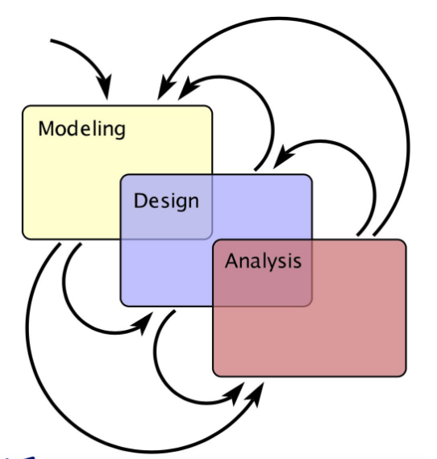
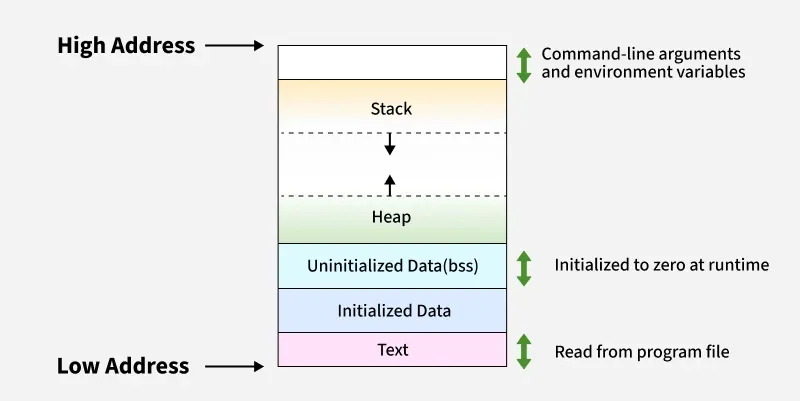
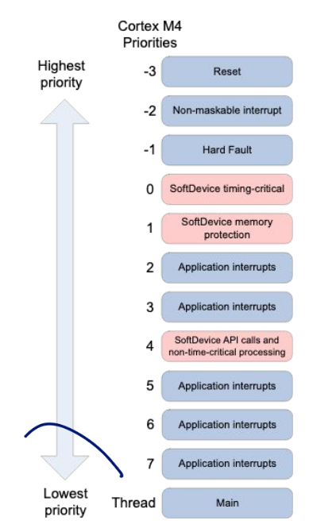
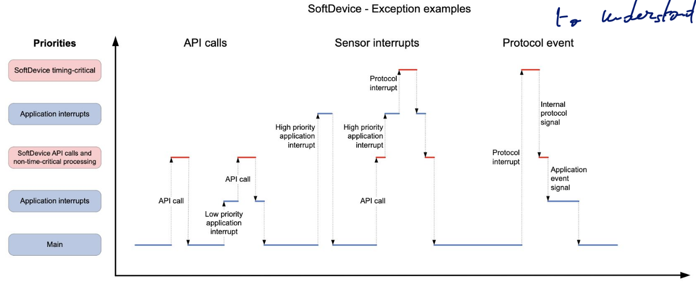
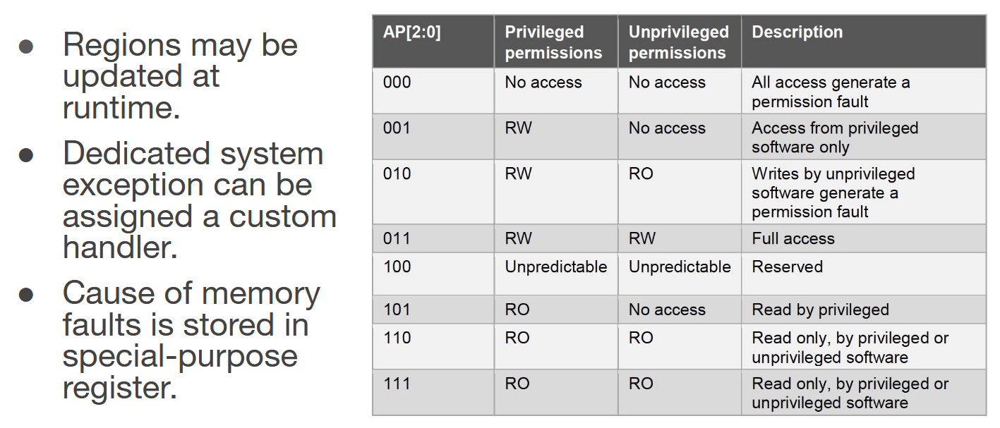

\newpage

# Introduction 

> **Definition:**
>
> A system wherein being correct depends upon giving the correct answer within a strict deadline

From this, we can differentiate 2 types of deadlines:

- Hard: If we miss the deadline = complete failure
- Soft: If we miss the deadline = degrades performance aka expensive task to fix the error

Interfacing with real life is harder than a deterministic clocked circuits. Here, we are facing stochastic event and can be synchronous or asynchronous.

## Design procedure

{ width=35% }

We iterate over the design; we try to have those 3 boxes to overlap as much as possible to model and understand the environment we are in. It's an iterative process

- **Modeling / What** are you measuring and controlling?
- **Design / How** will your system achieve your cyber-physical goals?
- **Analysis / Why** does your implementation exhibit this level of correctness, speed, power consumption, etc

## Developing for embedded: Challenges

The main bottleneck is energy:

- Bringing it: cables can be more expensive and less flexible than wireless IC
- Battery doesn't shrink as IC

We also need to make sure our IoT devices can be manageable and avoid spending all the costs and labor on battery management and replacement. Batteries are also toxic and corrosive.

The energy management problem:

- Energy consumption: low power sub-routine
- Energy Storage: aklaline or lipo battery ?
- Energy Production: plug socket ?

# Multitasking

## Memory Models

Quick recap of memory models in C

{ width=70% }

### Stack

This is a LIFO datastructure where we push data on it:

- `push`
- `pop`
- `peek`

This is primarly used for procedure call. When we do a call in a function we put in the return address, return content, arguments, and instantiate the local variable. After the function finishes, we free the stack by popping the allocated space and finally check the return address to resume the execution flow.

When we call a function, we set the Program Counter (PC) to the address of the procedure code.

### Heap

The heap is like a pile of memory, we can allocate everything how we want. We store there the global variables and can allocate with `malloc` area on the heap. The heap is controlled to see which part of the memory is allocated by which application. To ensure security and avoid applications to do unauthorized read.

```c
int a = 2; // on Heap
void foo (int b, int* c) {
    ...
    // value on stack
}

int main (void){ 
    int d; // stack
    int* e; // stack - this is a pointer !
    d = ...;                    // Assign some value to d
    e = malloc (sizeInBytes);   // Allocate memory for e. on heap
    *e = ...;                   // Assign sorne value to e.
    foo (d, e);                 // d is copy while e is passed by reference             
    ...
}
```

#### Stack overflow

It happens when a developer expects a return value to a pointer to still be valid after the call. If you try to read this return pointer, you may read corrupted data as the stack was popped and reused by another function call possibly. But those errors can be sneaky and not pop up immediately, always be careful with return value. Best practices is to pass a return pointer managed by the caller where the callee is going to write to it since it is allocated on the heap.

## Interrupts

When interacting with the outside world we need interrupt to interrupt the processing and process incoming data from outside (for example a keyboard, timer).

### Programmable Interrupt Timers - PIT

Ticks down values of a counter and then raises an interrupt. We set the interrupt time by writing to a register. We base it on the clock source. It can repeat without SW in the loop providing more deterministic time.

### As a form of multitasking

To create a realtime software, we need interrupt that can pause the program and run whatever routine is needed to treat this real-world incoming input. This is done through: **Interrupt Service Routine (ISR)** or **interrupt handler**.

The main possible triggers are:

- **HW interrupts**: physical connection going low, high, falling or rising
- **SW interrupts**: write to a Memory-mapped register
- **Exceptions**: internal HW that detects a fault and jump to a well-known memory location.

The most important and crucial thing with interrupt is **hierarchy**! We also have to enable it.

If enable, the MCU scans the **Interrupt Vector (IV)** for a matching **handler/ISR**. You need to have this matching ISR or an exception will be thrown.

There is the possibility that we get an interrupt while being in an ISR. We can have them and the second one will interrupt the first ISR. Watch out for stack overflow !

#### Serving an interrupt

Once we get an interrupt, we will disable all interrupts below and at the same priority level. Give importance to the current one. We indicate the PC and status register on the stack and jump to the **ISR**.

#### Handling the interrupt

First, save current context by avoiding over-write on currently used register. (So basically save on the stack previous values). Then, execute ISR logic.

Finally, restore previous state (registers) and resume execution.

#### SysTick Example

> Info
> 
> Use keyword `volatile` to avoid that the compiler optimize your code and force it to re-read the value each time. (`gcc -o0`)

```c
volatile uint timerCount = 0;
void countDown(void){
    if (timerCount ! = 0){
        timerCount--;
    }
}

SysTickPeriodSet(SysCtlClockGet() / 1000); // Set period relative to main clock
SysTickIntRegister(&countDown); // Register ISR that was defined as interrupt hanlder
SysTickEnable(); // Enable the SysTick timer
SysTickIntEnable(); // Enable the SysTick interrupt
```

Having interrupts result that atomicity is hard to guarantee since now everything can interrupt the flow of your program.

### Case study: nRF52840

{ width=30%}

Higher priorities preempt the other interrupts. There are 7 level of interrupts where SoftDevice timing-critical is a "closed source wireless stack that is strongly separated from the application code."

{width=70%}

It is important to be able to draw such diagram when creating interrupts. If you can't represent the interrupt flow as depicted, it may be too hard to understand or maintain.

### Good Practices in Interrupt Handling

- Prioritize interrupts properly: you cannot do everything! To avoid blocking operations for too long which could result in missed deadlines.
- Keep them short: a main loop for real work, communicate with flags. KISS strategy 
- Keep it simple: use state machines.
- Global variables: make sure to declare volatile.
- Using data buffers: be heedful of overflows
- Calling functions in an ISR: discouraged, be cautious. Make the stack more complicated.
- Time critical tasks: understand latency, aim for fixed time interrupts.
- Decide a background/main process: this will simplify your thinking

## Multitasking

We can either do it in pure software or using some hardware mutex. 

It is important to understand the fundamental difference between SW and HW. Most SW are declarative as the sequence of code determines the sequence of execution.

This is far from HW where we use FSM and process data concurrently.

### Threads

We can have some interleaved execution for threading meaning that execution isn't truly parallel like basic threads make it seem like (context switching).

Moreover, they share the same memory and can access each others' variables (not necessarily any memory protection). Interrupts are kinda like threads since the expected flow of execution can be interleaved with ISR.

#### In an OS

Threads are managed by the OS. For example in Linux with the POSIX Pthreads API. The thread start routine can be provided with an argument and can return a value.

- `create`: instantiate and run
- `cancel`: messy stop
- `pause`
- `resume`
- `join`: wait for thread to complete. If we create and don't join, the program will terminate. We have to wait for the threads to complete with this method.

```c
# include <pthread.h>
# include <stdio.h>
void* printN (void* arg) {
    int i;
    for(i = 0; i < 10; i++) {
        print f ("My ID: %d\n", *(int*) arg) ;
    }
    return NULL;
}
int main (void){
    pthread_t threadID1, threadID2;
    void* exitStatus;
    int x1 = 1, x2 = 2;
    pthread_create (&threadID1, NULL, printN, &x1);
    pthread_create (&threadID2, NULL, printN, &x2);
    printf("Started threads.\n");
    pthread_join(threadlDI, &exitStatus);
    pthread_join(threadlD2, &exitStatus);
    return 0;
}
```

### Role of the scheduler

The most important with threads is the OS scheduler that decides which one to send next. We can use many variant of a scheduler to meet certain goals or improve its performances.

#### Cooperative multi-tasking

It's like the 'care bare' version of scheduling. You don't interrupt, you just wait for the thread to yield itself or do an OS call procedure (blocking call).

The scheduler records the stack pointer of the current thread, then modifies it to point to the new thread stack. It pops off the address of the stack and resume execution.

Bad for starvation of other threads in one doesn't yield. We need to proactively yield!

#### Proactive yielding

We pair the thread with a jiffy or periodic timer ISR. Basically it is a counter we decrement until it reaches 0 and we interrupt the thread to run another one.

- Smaller jiffy = more interleaving execution but this means we waste time in context switching.
- Larger jiffy = possibly longer blocking statement

### Mutual Exclusion - MUTEX

To avoid race conditions we must ensure that writing to a data structure won't be attempted concurrently. We have 1 global variable lock `pthread_mutex_t lock = PTHREAD_MUTEX_INITIALIZER;`. Then we can call `pthread_mutex_lock(&lock);` to lock and block if already in use.

The worse scenario is deadlock where 2 threads could yield each one lock and they both need e

### Semaphore

Here it is a counter that indicates how many thread can for example execute at the same time. It is a shared variable. This shared variable (semaphore)'s value restrict the access to other variables.

### Memory Protection Unit

Usually, it is never a good thing to let thread access the full memory space (usually we use virtualization for this). For this we need HW support and so we need a MPU or MMU.

Specify various memory regions with different access rules typically. We check if the process has the required access role. Can be used for RAM or Flash.

#### Case study: ARM Cortex MPU

8 memory regions with each 8 sub-regions. We can re-used the MPU to create control access for memory mapped IO peripherals.

{width=70%}

### Inter Process Communication (IPC)

- **File-based**: create data to a file and read from it
- **Message passing**: most popular: one process creates a data block, deposits it in shared memory then notifies other processes
- **Network based**: use loopback (network) to send packet-based communication
  - Can extend it for actually remote communication

## Examples